---
keywords:
title: Deploy the Secure Data Connector Client
description: Learn how to deploy the Secure Data Connector client in your on-premise or private cloud environment.
---
# Deploy the Secure Data Connector Client

Once a secure data connector has been created in Environment Operations Center, the client must be deployed on your local system before you can establish a connection. This guide outlines the system requirements and steps to deploy a data connector client on a Windows, Linux, or Docker system.

> [!note]
> You must create a secure data connector endpoint in Env Ops Center before deploying on the client side. For details on how to create a secure data connector in Env Ops Center, see the [add a data connector](add-data-connector.md) guide.

## System requirements

The following system specifications are required to deploy the secure data connector client. Please ensure your system meets these requirements before proceeding to the deployment steps below.

System requirements:

- ASP.NET core runtime must be installed on the machine or SDK (version 6 and above). The runtime is available on the [Microsoft .NET](https://dotnet.microsoft.com/en-us/download/dotnet/6.0) page.
- CPU: x-64 processor
- Processor: 1 GHz
- RAM 512 MB
- Minimum disc space (64-bit): 4.5 GB

## Getting started

Before deploying the secure data connector client, you must retrieve the registration token associated with the data connector in Env Ops Center. For Windows or Linux systems, you must also download the respective binary. 

To locate these dependencies in Env Ops Center, select the connector name to open the connector details. Alternatively, you can also select **View Details** from the **Options** (**...**) dropdown menu to open the connector details.

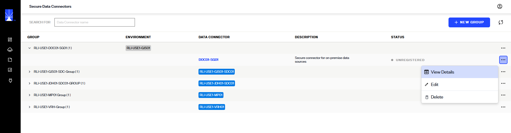

In the *Data Connector Info* section the connector status will display as "Unregistered" and there will be no available connections. 

Next to the status in the *Data Connector Info* section select **Register**.


For Windows or Linux systems, select the applicable card to download the binary.

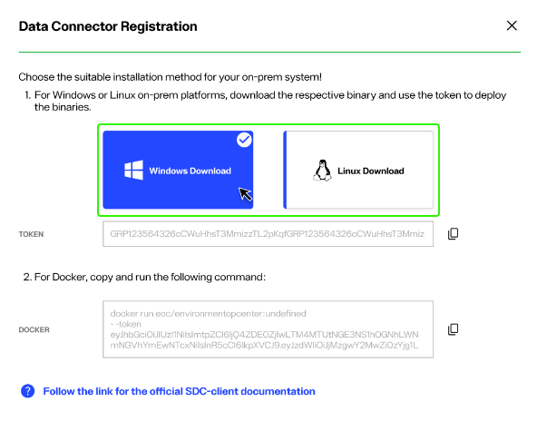

A confirmation message will display once the binary has successfully downloaded.

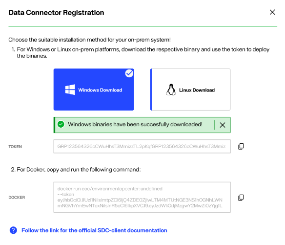

Select the copy icon to copy the registration token located just below the Windows and Linux cards. You will use this while deploying the secure data connector client. The steps to deploy a secure data connector on a Windows or Linux system are outlined in the following sections.

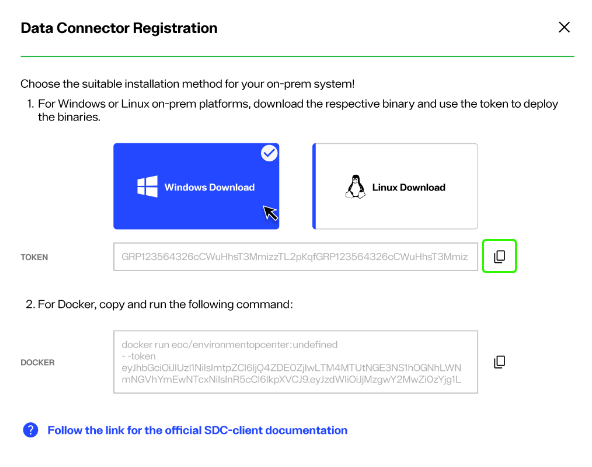

For a Docker container, copy the docker command located in the *Docker* section of the *Data Connector Registration* dialog. You will use this while deploying the secure data connector client on the Docker container. The steps to deploy a secure data connector on a Docker container are outlined in the following sections.

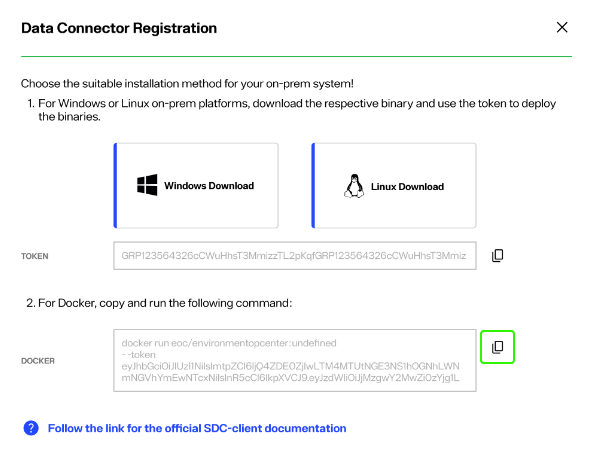

## Deploy on Windows

To deploy the secure data connector client on a Windows system, first unzip the *sdc-windows-.zip* file into a directory on the client system. Next, locate the following files:

- *appsettings.Production.json*
- *RadiantLogic.OnPremisesAgentClient.Agent.exe*

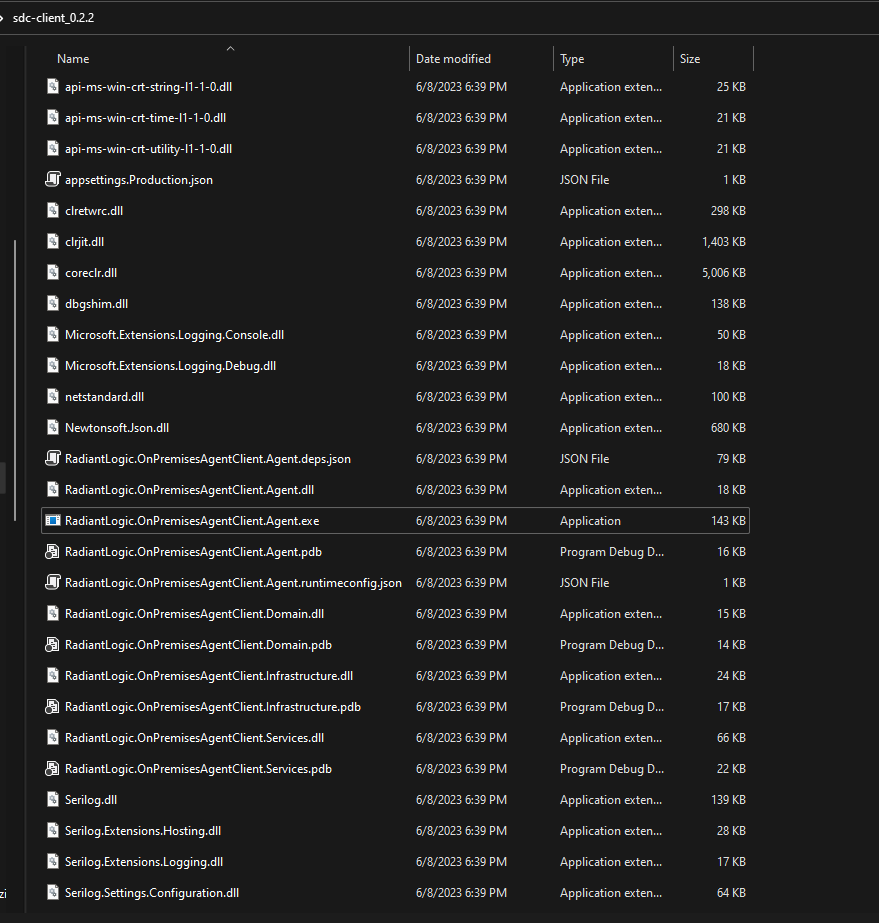

Open the *appsettings.Production.json* file and locate the `"AgentToken"` field. Enter the token copied from the *Data Connector Registration* dialog in Env Ops Center into the `"AgentToken"` field.

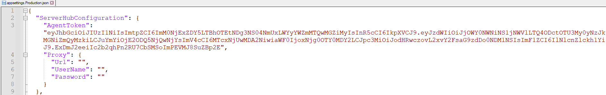

If the client to be run on a network where proxy is setup, see the *Proxy Configuration for Windows* section in [run the secure data connector client under proxy network setup](deploy-sdc-client-in-proxy.md) guide. Once you have the proxy settings updated following instructions in [proxy configuration](deploy-sdc-client-in-proxy.md) guide, continue to the next steps.

Launch the *RadiantLogic.OnPremisesAgentClient.Agent.exe* file. A notification will display in the command line that confirms a connection has been established between the agent and server.


Once the client is running, you can can setup a connection with the on-premise backend. For details on setting up a connection, see the [server backend](../../sys-admin-guide/server-backend.md) guide.

### Deploy as a service on Windows

#### Step 1: Launch Command window as Administrator (Run as administrator)

#### Step 2: Create the service using following commands
    sc create <ServiceName> binPath= "<PathToExecutable> --service”


#### Step 3: Configure the service to start automatically (Optional)
    sc config <ServiceName> start= auto

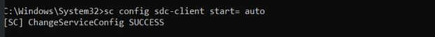

#### Step 4: Start the service 
    sc start <ServiceName>

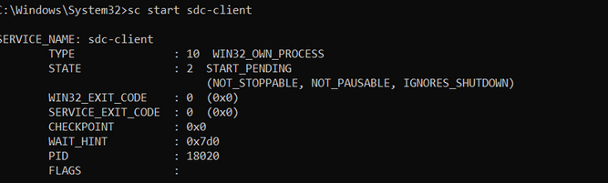

Following all the above steps, your sdc-client should be registered to run as a Windows service and started automatically.


## Deploy on Linux

To deploy the secure data connector client on a Linux system, first unzip the *sdc-linux-.zip* file into a directory on the client system. Next, locate the following files:

- *appsettings.Production.json*
- *RadiantLogic.OnPremisesAgentClient.Agent.exe*

Open the *appsettings.Production.json* file using an editor and locate the `"AgentToken"` field. Enter the token copied from the *Data Connector Registration* dialog in Env Ops Center into the `"AgentToken"` field.

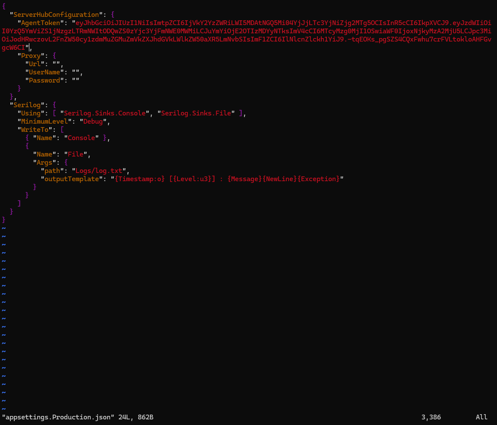

If the client to be run on a network where proxy is setup, see the *Proxy Configuration for Linux* section in [run the secure data connector client under proxy network setup](deploy-sdc-client-in-proxy.md) guide.  Once you have the proxy settings updated following instructions in [proxy configuration](deploy-sdc-client-in-proxy.md) guide, continue to the next steps.

Open the command line and navigate to the directory that contains the unzipped *sdc-linux.zip* files. From the directory, run the following command to give execute permissions for inlets-pro and RadiantLogic.OnPremisesAgentClient.Agent:
    
    chmod +x ./RadiantLogic.OnPremisesAgentClient.Agent
    chmod +x ./inlets-pro

Then launch the secure data connector client using this command:

    ./RadiantLogic.OnPremisesAgentClient.Agent

A notification will display in the command line that confirms a connection has been established between the agent and server.

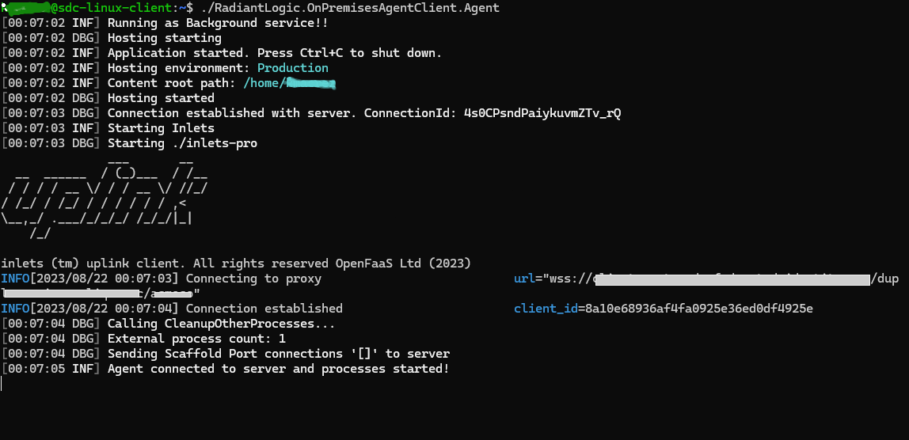

Once the client is running, you can can setup a connection with the on-premise backend. For details on setting up a connection, see the [server backend](../../sys-admin-guide/server-backend.md) guide.

### Deploy as a daemon on Linux

#### Step 1: CD to binary location and give execute permissions for inlets-pro and RadiantLogic.OnPremisesAgentClient.Agent

    chmod +x ./RadiantLogic.OnPremisesAgentClient.Agent
    chmod +x ./inlets-pro

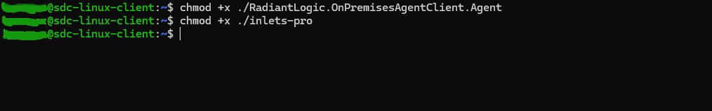
#### Step 2: Check the Init System:
Determine which init system your Linux distribution uses. Common init systems include systemd, SysV init, and Upstart. You can often identify the init system by checking the version of Linux or the documentation for your specific distribution. Steps 3.1 and 3.2 covers the cases of systemd and SysV Init.

#### Step 3.1: If your system use 'systemd'. Follow below steps:

**Create a Systemd Service File:**

Create a .service file in the /etc/systemd/system/ directory. This file will define the configuration for our application daemon. Replace **‘your-app-name’** with an appropriate name for SDC Client:

    sudo nano /etc/systemd/system/your-app-name.service

**Edit the Service File:**

In the nano editor, add the following content to the service file, adjusting the paths and parameters to match your environment:

```
[Unit]
Description=Give your description here for running SDC Client as Daemon
Wants=network-online.target
After=network-online.target

[Service]
WorkingDirectory=/path/to/binary/sdc-client
ExecStart=/path/to/binary/sdc-client/RadiantLogic.OnPremisesAgentClient.Agent
Restart=always
RestartSec=10
SyslogIdentifier=your-app-name
User=your-username
Environment=ASPNETCORE_ENVIRONMENT=Production

[Install]
WantedBy=multi-user.target
```

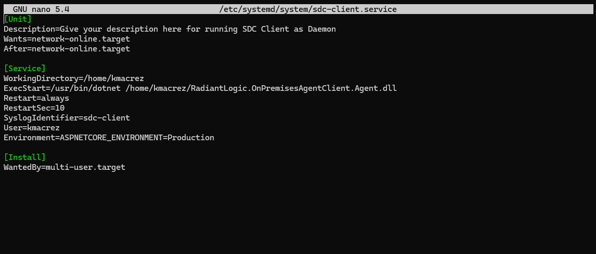

- WorkingDirectory: Set this to the directory where your downloaded binaries is located.

- ExecStart: Specify the path to executable and the path to application's DLL.

- User: Replace your-username with the appropriate username that should run the application.

**Reload Systemd and Start the Service:**

After creating and editing the service file, reload the systemd configuration and start the application: 

    sudo systemctl daemon-reload

    sudo systemctl start your-app-name

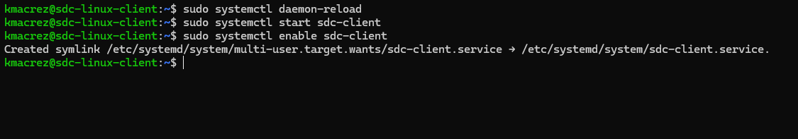

**Enable Autostart on Boot:**

To make sure your application starts automatically when the system boots, enable the service:

    sudo systemctl enable your-app-name

To validate the sdc client is successfully started as a service, you can check the client logs in the /Logs folder and opening the log file:

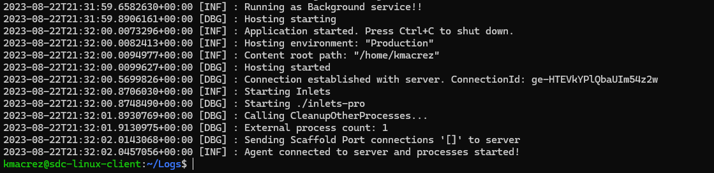

**Manage the Service:**

You can use standard systemd commands to manage your application daemon:
- Start: ```sudo systemctl start your-app-name```

- Stop: ```sudo systemctl stop your-app-name```

- Restart: ```sudo systemctl restart your-app-name```

- Check status: ```sudo systemctl status your-app-name```

- Disable autostart: ```sudo systemctl disable your-app-name```

**Note:** Remember to replace placeholders like ***your-app-name***, ***/path/to/binary/sdc-client***, and ***your-username*** with actual values.

#### Step 3.2: If your system use 'SysV init'. Follow below steps:

**Create a new init script file, replacing **your-app-name** and adjusting paths:**

    sudo nano /etc/init.d/your-app-name

**Add the following content to the file:**

```
#!/bin/bash
### BEGIN INIT INFO
# Provides:          your-app-name
# Required-Start:    $local_fs $network
# Required-Stop:     $local_fs $network
# Default-Start:     2 3 4 5
# Default-Stop:      0 1 6
# Short-Description: Give your description here for running SDC Client as Daemon
# Description:       Give your detailed description here for running SDC Client as Daemon
### END INIT INFO

case "$1" in
  start)
    cd /path/to/binary/sdc-client
    sudo -u your-username RadiantLogic.OnPremisesAgentClient.Agent &
    ;;
  stop)
    pkill -f "RadiantLogic.OnPremisesAgentClient.Agent"
    ;;
  restart)
    $0 stop
    $0 start
    ;;
  *)
    echo "Usage: $0 {start|stop|restart}"
    exit 1
    ;;
esac

exit 0
```

**Save the file and make it executable:**

    sudo chmod +x /etc/init.d/your-app-name

**Start and Manage the Service:**

Use the following commands to start, stop, and restart your application:

Start: sudo /etc/init.d/your-app-name start
Stop: sudo /etc/init.d/your-app-name stop
Restart: sudo /etc/init.d/your-app-name restart

**Enable Autostart on Boot:**

If your init system supports it, you might be able to enable the script to start automatically on boot:

    sudo update-rc.d your-app-name defaults

**Note:** Remember to replace placeholders like ***your-app-name***, ***/path/to/binary/sdc-client***, and ***your-username*** with actual values.

## Deploy on Docker

To deploy the secure data connector client on Docker, Docker must first be installed on the system. If you have not yet installed Docker, please visit the [Docker](https://docs.docker.com/get-docker) site and follow the instructions to download and install.

Open the command line and run the copied command from Env Ops Center to start the client:

    docker run -e "ServerHubConfiguration_AgentToken=[access_token]" radiantone/sdc-client

It is highly recommended to have logs from sdc-client to go into a mounted drive, to have that setup replace the above command with the one below:

    docker run -v /path/on/host:/app/logs -e "ServerHubConfiguration_AgentToken=[access_token]" radiantone/sdc-client

Replace `/path/on/host` with an actual path on your host machine where you want to store the logs.

If the client to be run on a network where proxy is setup, see the *Proxy Configuration for Docker* section in [run the secure data connector client under proxy network setup](deploy-sdc-client-in-proxy.md) guide.

The `radiantone/sdc-client` is the latest image of the secure data connector client container located in the Radiant Logic Docker Hub repository.

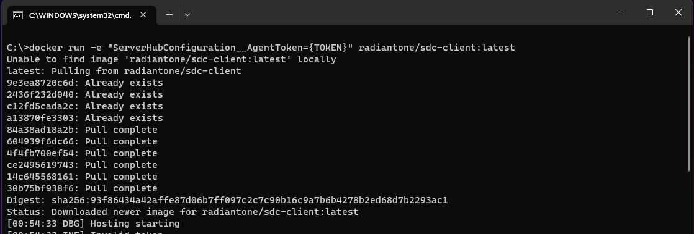

Once the client is running, you can can setup a connection with the on-premise backend. For details on setting up a connection, see the [server backend](../../sys-admin-guide/server-backend.md) guide.

## Next steps

After reading this guide, you should now have an understanding of the steps required to deploy a secure data connector client on a Windows, Linux, or Docker system. To learn how to establish a connection with the on-premise backend, see the control panel [server backend](../../sys-admin-guide/server-backend.md) guide. For details on updating and monitoring the secure data connector client, see the [manage the secure data connector client](manage-sdc-client.md) guide.
