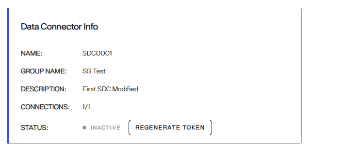
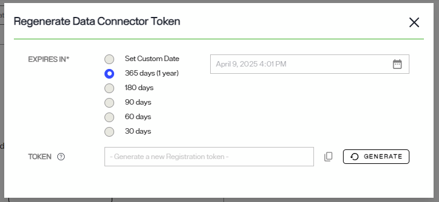
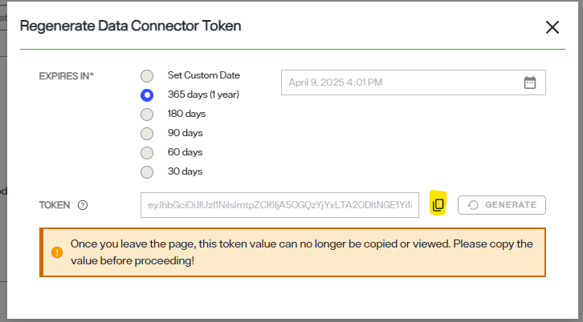

---
keywords:
title: Manage the Secure Data Connector Client
description: Learn how to manage a Secure Data Connector client, including updating, troubleshooting, and reviewing client logs.
---
# Manage the Secure Data Connector Client

This guide outlines the steps to manage a secure data connector client, including updating, troubleshooting, and reviewing client logs.

## Update the secure data connector client

Client updates can be applied by stopping the client or as a rolling update. The following sections outline how to apply updates to Windows, Linux, or Docker systems, as well as how to apply rolling updates to avoid an interruption in service.

### Update on Windows or Linux

The client must be stopped before applying an update. To stop the client, select **Ctrl + C** in the terminal window running the client.

To install the update, unzip the new client version in the same directory that contains the current client. Overwrite everything except for *appsettings.Production.json*, as this is the configuration file for the client.

If the update is being installed on a Windows system, launch the *RaidantLogic.OnPremisesAgentClient.Agent.exe* file.

If the update is being installed on a Linux system, run the following command:

`dotnet run RadiantLogic.OnPremisesAgentClient.Agent.dll`

### Update on Docker

To update a secure data connector client on Docker, stop the Docker image and then start it again with the latest tag. The client will start running again with the latest available version.

### Rolling update

Installing a rolling update allows the client to continue running with no downtime during the update. To install a rolling update, create a new data connector in Environment Operations Center (see the [add a data connector](add-data-connector.md) guide) within the same group as the client you would like to update. 

Copy the new token from the *Data Connector Registration* dialog in the data connector details section.

Follow the steps outlined in the [deploy a secure data connector client](deploy-sdc-client.md) guide for your system type to deploy the client as a fresh installation.

Once the new client deployment is complete, delete the old client.

## Troubleshooting

The following sections outline common errors that can occur while deploying or running a secure data connector client, along with possible solutions to resolve the error.

### Duplicated token

The unique token associated with a new data connector in Env Ops Center can only be used to deploy one secure data connector client. If a data connector token is used to run more than one client, you will receive a duplicate agent connection error in the client terminal.

To resolve the error, return to Env Ops Center an create a new secure data connector and use the unique token to deploy the client.

For details on creating a new data connector, see the [add a data connector](add-data-connector.md) guide. For details on deploying a secure data connector client, see the [deploy a secure data connector client](deploy-sdc-client.md) guide.

### Test connection error

The following control panel error may indicate that the secure data connector client has stopped running: "Connection failed: An error has occurred, please contact your administrator".

If you receive the above connection failure error, return to the secure data connector client and verify that it is running.

### Test connection failure on Docker client

A test connection may fail for the localhost hostname for a secure data connector client deployed on a Docker container. The following error may indicate that a test connection failure has occurred: "Connection failed: Protocol or communication error".

![image description] (insert error image)

To resolve the connection failure, enter the special DNS name `host.docker.internal` in the **Host Name** field. This will resolve the internal IP address used by the host, allowing the Docker container running the client to access the host server backend.

![image description] (insert control panel image)

### Inoperative test connection

If the test connection is not working but you are unsure of the error, first review the secure data connector status in Env Ops Center.

First, save the backend data source, then login to Env Ops Center and navigate to details section of one of the *Secure Data Connectors* belonging to the group used for connection. If the Data source status is "Disconnected", the connection has not been correctly setup. Review the associated server name/IP and Server Port of this data source to make sure the data connector can connect to this server.

If the data source connector status is "Connected", then the inlets tunnel is working and data connector is able to connect to this data source.

## Review client logs

The following sections outline where to locate the data connector client logs on a Windows, Linux, or Docker system.

### Review logs on Windows or Linux

If the secure data connector client is running on a Windows or Linux system, navigate to the unzipped directory. The client logs are located in the "/Logs" file in the directory.

### Review logs on a Docker container

If the secure data connector client is running on a Docker container, open a terminal and connect to the docker container using the following command:

`docker exec -it <container_name> bash`

Navigate to the logs folder:

`cd Logs`

List the log files:

`ls`

From here, you can open the logs files to access further details on the client activity.

## Regenerating SDC Registration Tokens

A secure data connector's token has lifetime of up to one year. This section describes how to regenerate a secure data connector's token and update the application configuration.

### Regenerating the Token

To regenerate the token:

1. Select **Secure Data Connectors** from the left navigation bar. 

1. Navigate to your Secure Data Connector's Data Connector Info page.

    

1. Click **Regenerate Token**. 

1. Select an expiration for the token.

    

1. Click **Generate**.

1. Copy the generated token.

    

### Updating the Application Configuration

On Windows:

    1. Stop the client if it is already running as a standalone application or as a windows service. 

    1. Open appsettings.Production.json using an editor. 
    
    1. In the **AgentToken** field, enter the token value copied in [Regenerating the Token](#regenerating-the-token). 

On Linux:

    1. Stop the client if it is already running as a standalone application or as a daemon.

    1. Open appsettings.Production.json using an editor. 
    
    1. In the **AgentToken** field, enter the token value copied in [Regenerating the Token](#regenerating-the-token).

On Docker:

    1. Stop and remove the container if it is already running.

    1. Start the container with the token copied in [Regenerating the Token](#regenerating-the-token) as a value to the environment variable ServerHubConfiguration_AgentToken. 

    docker run -v /path/on/host:/app/logs -e "ServerHubConfiguration_AgentToken=[regenerated_token]" radiantone/sdc-client

### Performing a Rolling update

To minimize the risk of interruptions to the connections, it is recommended that you perform a rolling update.

**Case 1:**

If two or more SDC client instances are running on this environment under the same group, serving the same set of data sources connections, follow the instructions in [Regenerating the Token](#regenerating-the-token) and [Updating the Application Configuration](#updating-the-client-configuration) on the client where the token is expired or nearing expiration.

**Case 2:**

If there is only one SDC client instance is running, it is recommended that you create a new SDC client. This ensures no disruptions to existing connections. Refer to [Deploy the Secure Data Connector Client](deploy-sdc-client.md) for more information.

>[!note] Remove the old instance which is about to expire.

## Next steps

You should now have an understanding of how to update, troubleshoot, and monitor the secure data connector client. For details on deploying the secure data connector client, see the [deploy a secure data connector client](deploy-sdc-client.md) guide. For details on managing data connectors in Env Ops Center, see the [manage data connectors](manage-data-connectors.md) guide.
