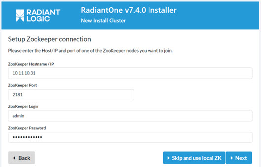

# Chapter 3: Installing RadiantOne

Once all Zookeeper nodes have been configured and started, install RadiantOne. Details about the RadiantOne installation process can be found in the RadiantOne Installation Guide.

If you use a load balancer, enter the hostname of the load balancer in the ZooKeeper Hostname/IP field. If you do not use a load balancer, enter the hostname and port number of one of the machines in the Zookeeper ensemble in the ZooKeeper Hostname/IP field. In this example, a load balancer is not used, so the Hostname value is r1-server, and the port number would be 2181.

Figure 3.1: The ZK Connection String Value in the RadiantOne Installer

## Configuring SSL between FID and ZooKeeper

Configuring SSL between FID and ZooKeeper can be configured after RadiantOne is installed. The steps are described in the RadiantOne Hardening Guide.

