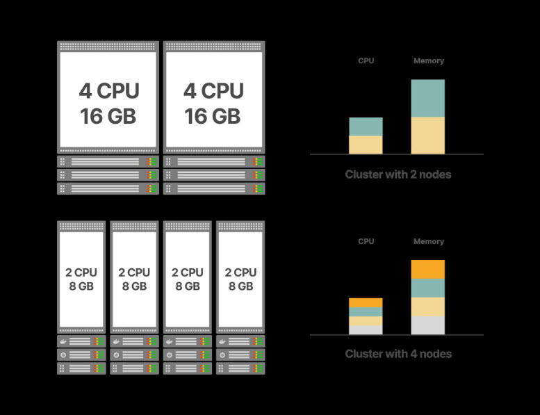
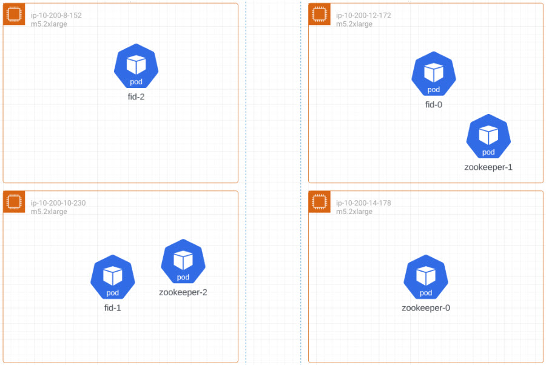

# Kubernetes
You can use Kubernetes to orchestrate the configuration and deployment of RadiantOne. Radiant Logic provides DevOps images for deployments on cloud platforms such as Amazon Web Services (AWS) using Amazon Elastic Kubernetes Service (EKS) and Microsoft Azure Kubernetes Service (AKS).

## Prerequisites
Before deploying RadiantOne, you should already be familiar with Kubernetes Pods, Services and StatefulSets. See the [Kubernetes Documentation](https://kubernetes.io/docs/concepts/) for details. You should also be familiar with Kubernetes kubectl commands. See the [Kubernetes Cheat Sheet](https://kubernetes.io/docs/reference/kubectl/cheatsheet/) for details.

In addition, you should:

1. Have a supported Kubernetes cluster running in the cloud. A commonly deployed Kubernetes cluster is [Amazon Elastic Kubernetes Service](https://docs.aws.amazon.com/eks/latest/APIReference/API_CreateCluster.html). 
For a highly available architecture, the underlying Kubernetes cluster should support at least two pods running RadiantOne nodes and three pods running ZooKeeper. 

 >[!note] Kubernetes v1.1+ is required. The pods running RadiantOne nodes need at least 2 CPUs and 4 GiB memory. The pods running ZK need at least 2 CPUs and 2 GiB memory.

2. Install and configure the Kubernetes kubectl command-line tool on the machine where you will manage the Kubernetes cluster from.  This utility controls the Kubernetes Cluster. An example is [AWS CLI](https://docs.aws.amazon.com/cli/latest/userguide/install-windows.html).

3. Have a RadiantOne configuration exported from a Linux Dev/QA environment. After installing RadiantOne in the Kubernetes cluster, you can import the configuration and make any needed configuration updates from the RadiantOne Main Control Panel or from command line using the vdsconfig utility.

## Sizing a Kubernetes Cluster

Sizing a Kubernetes cluster depends on several factors, including:

- Workload requirements: The amount of CPU, memory, and storage resources required by your applications and services.

- Node capacity: The maximum capacity of each node in terms of CPU, memory, and storage.

- Scale: The number of nodes needed to support the desired level of workload requirements and accommodate future growth.

- High availability: The level of redundancy and fault tolerance required in the cluster.

To size a Kubernetes cluster, you should start by determining the resource requirements of your workloads and then choose a node size that can accommodate those requirements. You should also consider the desired level of high availability and scale when choosing the number of nodes in your cluster.

Once you have a rough estimate of the number of nodes needed, you can use tools like kubectl top and kubectl describe to monitor resource usage and adjust the cluster size as needed.

>[!note] It is a good idea to over-provision resources slightly to account for unexpected spikes in demand.

### Kubernetes Cluster Capacity

When determining the capacity of your cluster, there are many ways to approach sizing the nodes. For example, if you calculated a cluster sizing of **8 CPU and 32GB RAM**, you could break down the node sizing
into these options:

- 2 nodes: 4 CPU / 16 GB RAM

- 4 nodes: 2 CPU / 8 GB RAM

- 8 nodes: 1 CPU / 2 GB RAM



Figure 1: Kubernetes Cluster Capacity

To understand which sizing option to select, consider the associated pros and cons.

**Option 1: fewer, larger nodes**

*Pros*

If you have applications that are CPU or RAM intensive, having larger nodes can ensure your application has
sufficient resources.

*Cons*

High availability is difficult to achieve with a minimal set of nodes. If your application has 50 pods across two nodes (25 pods per node) and a node goes down, you lose 50% of your service.

Scaling: When autoscaling the cluster, the increment size becomes larger which could result in provisioning more hardware than needed.

**Option 2: more, smaller nodes**

*Pros*

High availability is easier to maintain. If you have 50 instances with two pods per node (25 nodes) and one node goes down, you only reduce your service capacity by 4%.

*Cons*

More system overhead to manage all of the nodes.

Possible under-utilization as the nodes might be too small to add additional services.

### Guidance for Production Deployments

For production deployments where high availability is paramount, creating a cluster with more nodes running fewer pods per node is preferable to ensure the health of your deployed service.

For some applications, you can decide to size one pod per node.

To determine the physical instance type needed, multiply the desired resources for each service by the number of pods per node, plus additional capacity for system overhead. Follow product guidelines to determine system requirements.

**Example service using 3 pods per node**

Each pod is typically deployed with 2 CPU and 4GB RAM which when multiplied by 3 yields:
Minimum node requirement: 6 CPU 12 GB RAM

Add 10% for system overhead

For these requirements in Amazon Web Services (AWS), a c5.2xlarge type (8 CPU / 16 GB RAM) might be the instance type selected.

To determine the base number of nodes required, divide the number of pods by 3 to determine your minimum cluster size. Further, you must ensure that you add definitions for cluster horizontal auto-scaling so the cluster scales in or out as needed.

**Sizing For RadiantOne**

For production deployment running RadiantOne as a 3 Node cluster, it is recommended to run one pod per node. This can be achieve in couple of ways.

Using nodeSelector is the simplest recommended form of node selection constraint. You can add the nodeSelector field to your Pod specification and specify the node labels you want the target node to have.

Kubernetes only schedules the Pod onto nodes that have each of the labels you specify.

Using antiAffinity it is recommended that no more than one pod that matches the condition is placed in the same worker node. Affinity and anti-affinity expands the types of constraints you can define.

*affinity:*
<br> *podAntiAffinity:*
<br> *requiredDuringSchedulingIgnoredDuringExecution:*
<br> *- labelSelector:*
<br> *matchExpressions:*
<br> *- key: app*
<br> *operator: In*
<br> *values:*
<br> *- fid*
<br> *topologyKey: kubernetes.io/hostname*

Using an external 3 node Zookeeper ensemble is recommended.

The deployments can be based on tiers.

*Tier 1:*

3 VMs/Physical of 8 CPU/16GB for FID
3 VMs/Physical of 2 CPU/4GB for Zookeeper

The total size of your cluster is 30 CPU/60 GB RAM

or

4 VMs/Physical of 8 CPU/16GB for FID

The total size of your cluster is 32 CPU/64 GB RAM

*Tier 2:*

3 VMs/Physical of 16 CPU/32GB for FID
3 VMs/Physical of 2 CPU/4GB for Zookeeper

The total size of your cluster is 60 CPU/120 GB RAM

or

4 VMs/Physical of 16 CPU/32GB for FID

The total size of your cluster is 64 CPU/128 GB RAM

Pod allocation in a 4 node cluster



Figure 2: Pod Allocation in a 4-node Cluster

**Pod Resources**

*CPU resource units*

Limits and requests for CPU resources are measured in cpu units. In Kubernetes, 1 CPU unit is equivalent to 1 physical CPU core, or 1 virtual core, depending on whether the node is a physical host or a virtual machine running inside a physical machine.

CPU resource is always specified as an absolute amount of resource, never as a relative amount. For example, a 500m CPU represents the roughly same amount of computing power whether that container runs on a single-core, dual-core, or 48-core machine.

*Memory resource units*

Limits and requests for memory are measured in bytes. You can express memory as a plain integer or as a fixed-point number using one of these quantity suffixes: E, P, T, G, M, k. You can also use the power-of-two equivalents: Ei, Pi, Ti, Gi, Mi, Ki. For example, the following represent roughly the same value:

128974848, 129e6, 129M, 128974848000m, 123Mi

The following resource allocation can be sent on an FID pod.

*resources:*
<br>*limits:*
<br>*cpu: '4'*
<br>*memory: 16Gi*
<br>*requests:*
<br>*cpu: '2'*
<br>*memory: 8Gi*

**Storage**

In Kubernetes, storage is managed through the use of StorageClasses, PersistentVolumes (PVs), and PersistentVolumeClaims (PVCs).

A StorageClass is used to define the type of storage that will be used in the cluster. It defines the provisioner, which is responsible for creating the actual storage resources, as well as any parameters that need to be passed to the provisioner to create the storage. StorageClasses are used by PVCs to request a specific type
of storage.

A PersistentVolume is a storage resource that is created by the provisioner specified in the StorageClass. It can be a physical disk, network storage, or any other type of storage. PVs are created ahead of time and then made available to PVCs as needed.

A PersistentVolumeClaim is a request for storage by a user or application. It specifies the storage requirements, such as the size and access mode, and the StorageClass to use. When a PVC is created, Kubernetes will provision a PV that meets the requirements specified in the PVC.

When a pod needs to use storage, it requests a PVC that is bound to a PV. The pod can then use the storage provided by the PV through the PVC. When the pod is deleted, the PVC is released and the PV becomes available for reuse.

RadiantOne deployment uses dynamic volume provisioning. Each pod is assigned a unique PVC via dynamic provisioning. Typically, 250gb to 500gb is recommended per PVC. Different storage classes have different performance characteristics, such as latency, throughput, and IOPS. You should choose a storage class that provides the required level of performance for your application.

<br>*volumeClaimTemplates:*
<br>*- metadata:*
<br>*name: r1-pvc*
<br>*annotations:*
<br>*labels:*
<br>*app: fid*
<br>*spec:*
<br>*accessModes:*
<br>*- "ReadWriteOnce"*
<br>*resources:*
<br>*requests:*
<br>*storage: "100Gi"*
<br>*storageClassName: "default"*

**Networking**

Networking in Kubernetes is handled by the Kubernetes network model, which is designed to be flexible and extensible. The Kubernetes network model defines the way pods communicate with each other and with external resources.

In Kubernetes, each pod gets its own IP address, and all containers within the pod share that IP address. This allows multiple containers within the same pod to communicate with each other through localhost, just like they would on a single host.

Kubernetes uses a flat network model, where all pods are connected to the same network, regardless of which node they are running on. This allows pods to communicate with each other across nodes, as long as there is a network path between them.

An ingress controller can be used to expose the LDAPS and HTTPS service to the outside. The LDAPS and HTTPS services are created as ClusterIP by default.

*apiVersion: v1*
<br>*kind: Service*
<br>*metadata:*
<br>*name: fid-app*
<br>*labels:*
<br>*app: fid*
<br>*spec:*
<br>*ports:*
<br>*- port: 2389*
<br>*name: ldap*
<br>*- port: 2636*
<br>*name: ldaps*
<br>*- port: 8089*
<br>*name: http*
<br>*- port: 8090*
<br>*name: https*
<br>*selector:*
<br>*app: fid*
<br>*app.kubernetes.io/name: fid*
<br>*type: ClusterIP*


## Deployment
Deploy RadiantOne on Kubernetes using HELM.
Helm must be installed to use the charts. Please refer to [Helm's documentation](https://helm.sh/docs/) to get started.

### TL;DR

```
helm repo add radiantone https://radiantlogic-devops.github.io/helm
helm install my-fid-release radiantone/fid --set fid.license=<license> \
--set dependencies.zookeeper.enabled=true --set image.tag=7.4 --set fid.mountSecrets=false
```

### Add Helm Repo
Add the repo by running the following command:

```
helm repo add radiantone https://radiantlogic-devops.github.io/helm
```

To update a repository that has been added and retrieve the latest versions, run the following command:

```
helm repo update
```

To see the charts in the radiantone repository, run the following command:

```
helm search repo radiantone
```

### Charts
Prerequisites
- Kubernetes 1.18+
- Helm 3


**Install RadiantOne FID version 7.4 (latest) using helm --set values**

To install the helm chart, run the following command:

```
helm upgrade --install --namespace=<name space> <release name> radiantone/fid \
--set dependencies.zookeeper.enabled=true
--set zk.clusterName=my-demo-cluster \
--set fid.license="<license key>" \
--set fid.rootPassword="test1234" \
--set fid.mountSecrets=false \
--set image.tag=7.4.7
```

>[!note] Curly brackets in the license must be escaped --set fid.license="{rlib}xxx"
Image tag 7.4 contains the latest patch release (7.4.7)


**Install RadiantOne FID version 7.4 (latest) using helm values file.**

Create a file with these contents and save it as fid_values.yaml

```
image:
  tag: "7.4.7"
fid:
  rootPassword: "test1234"
  license: "<license key>"
  mountSecrets: false
zk:
  cluserName: "my-demo-cluster"
dependencies:
  zookeeper:
    enabled: true
```

Run the following command:

```
helm upgrade --install --namespace=<name space> <release name> radiantone/fid --values fid_values.yaml
```

**Install RadiantOne FID version 7.4 (latest) using Argo CD**

This example application demonstrates how an OTS (off-the-shelf) helm chart can be retrieved and pinned to a specific helm sem version from an upstream helm repository, and customized using a custom values.yaml in the private git repository.

In this example, the radiantone/fid application is pulled from the stable helm repo, and pinned to v1.0.0:

```
dependencies:
- name: fid
  version: 1.0.0
  repository: https://radiantlogic-devops.github.io/helm
```

A custom values.yaml is used to customize the parameters of the radiantone/fid helm chart:

```
fid:
  fullnameOverride: fid
  image:
    tag: "7.3.28"
  replicaCount: 2
  service:
    type: NodePort
  fid:
    rootPassword: "<random password>"
    license: "<license key>"
  dependencies:
    zookeeper:
      enabled: true
  resources:
    limits:
      cpu: 2
      memory: 2Gi
    requests:
      cpu: 1
      memory: 1Gi
  persistence:
    enabled: true
    storageClass: gp3
    size: 50Gi

  zookeeper:
    fullnameOverride: zookeeper
    persistence:
      enabled: true
      storageClass: gp3
      size: 10Gi
```


**List FID Releases**

```
helm list --namespace=<name space>
```

**Test FID Release**

```
helm test <release name> --namespace=<name space>
```

**Upgrade FID Release**

>[!note] Upgrade can only be performed to a higher version. Upgrade from 7.3.x to 7.4.x is not supported.

*Using --set values - set image.tag value:*

```
helm upgrade --install --namespace=<name space> <release name> radiantone/fid --set image.tag=7.4.8 --reuse-values
```

*Using --set values -set image.tab value:*

```
helm upgrade --install --namespace=<name space> <release name> radiantone/fid --set image.tag=7.4.8 --reuse-values
```

*Using values file - update the values file with the newer version tag*

```
image:
  tag: "7.4.8"
fid:
  rootPassword: "test1234"
  license: "<license key>"
  mountSecrets: false
zk:
  cluserName: "my-demo-cluster"
dependencies:
  zookeeper:
    enabled: true
```

```
helm upgrade --install --namespace=<name space> <release name> radiantone/fid --values fid_values.yaml --reuse-values
```


**Delete FID**

Use the following command:

```
helm uninstall --namespace=<name space> <release name>
```

>[!note] This does not delete the persistent volumes.

**Remove Helm Repo**

```
helm repo remove radiantone
```
