# Kubernetes
You can use Kubernetes to orchestrate the configuration and deployment of RadiantOne. Radiant Logic provides DevOps images for deployments on cloud platforms such as Amazon Web Services (AWS) using Amazon Elastic Kubernetes Service (EKS) and Microsoft Azure Kubernetes Service (AKS).

## Deployment

### Prerequisites
Before deploying RadiantOne, you should already be familiar with Kubernetes Pods, Services and StatefulSets. See the [Kubernetes Documentation](https://kubernetes.io/docs/concepts/) for details. You should also be familiar with Kubernetes kubectl commands. See the [Kubernetes Cheat Sheet](https://kubernetes.io/docs/reference/kubectl/cheatsheet/) for details.

In addition, you should:

1. Have a supported Kubernetes cluster running in the cloud. A commonly deployed Kubernetes cluster is [Amazon Elastic Kubernetes Service](https://docs.aws.amazon.com/eks/latest/APIReference/API_CreateCluster.html). 
For a highly available architecture, the underlying Kubernetes cluster should support at least two pods running RadiantOne nodes and three pods running ZooKeeper. 

 >[!note] Kubernetes v1.1+ is required. The pods running RadiantOne nodes need at least 2 CPUs and 4 GiB memory. The pods running ZK need at least 2 CPUs and 2 GiB memory.

2. Install and configure the Kubernetes kubectl command-line tool on the machine where you will manage the Kubernetes cluster from.  This utility controls the Kubernetes Cluster. An example is [AWS CLI](https://docs.aws.amazon.com/cli/latest/userguide/install-windows.html).

3. Have a RadiantOne configuration exported from a Linux Dev/QA environment. After installing RadiantOne in the Kubernetes cluster, you can import the configuration and make any needed configuration updates from the RadiantOne Main Control Panel or from command line using the vdsconfig utility.

### Manifest Files
Download the StatefulSet manifests: configmap.yaml, fid-aws.yaml and zk-aws.yaml, on the machine where you will manage the Kubernetes cluster from. Contact Radiant Logic at support@radiantlogic.com for access to these files.

### Sizing a Kubernetes Cluster

Sizing a Kubernetes cluster depends on several factors, including:

- Workload requirements: The amount of CPU, memory, and storage resources required by your applications and services.

- Node capacity: The maximum capacity of each node in terms of CPU, memory, and storage.

- Scale: The number of nodes needed to support the desired level of workload requirements and accommodate future growth.

- High availability: The level of redundancy and fault tolerance required in the cluster.

To size a Kubernetes cluster, you should start by determining the resource requirements of your workloads and then choose a node size that can accommodate those requirements. You should also consider the desired level of high availability and scale when choosing the number of nodes in your cluster.

Once you have a rough estimate of the number of nodes needed, you can use tools like kubectl top and kubectl describe to monitor resource usage and adjust the cluster size as needed.

>[!note] It is a good idea to over-provision resources slightly to account for unexpected spikes in demand.

#### Kubernetes Cluster Capacity

When determining the capacity of your cluster, there are many ways to approach sizing the nodes. For example, if you calculated a cluster sizing of **8 CPU and 32GB RAM**, you could break down the node sizing
into these options:

- 2 nodes: 4 CPU / 16 GB RAM

- 4 nodes: 2 CPU / 8 GB RAM

- 8 nodes: 1 CPU / 2 GB RAM


Figure 1: Kubernetes Cluster Capacity

To understand which sizing option to select, consider the associated pros and cons.

##### Option 1: fewer, larger nodes

**Pros**

If you have applications that are CPU or RAM intensive, having larger nodes can ensure your application has
sufficient resources.

**Cons**

High availability is difficult to achieve with a minimal set of nodes. If your application has 50 pods across two nodes (25 pods per node) and a node goes down, you lose 50% of your service.

Scaling: When autoscaling the cluster, the increment size becomes larger which could result in provisioning more hardware than needed.

##### Option 2: more, smaller nodes

**Pros**

High availability is easier to maintain. If you have 50 instances with two pods per node (25 nodes) and one node goes down, you only reduce your service capacity by 4%.

**Cons**

More system overhead to manage all of the nodes.

Possible under-utilization as the nodes might be too small to add additional services.

#### Guidance

For production deployments where high availability is paramount, creating a cluster with more nodes running fewer pods per node is preferable to ensure the health of your deployed service.

For some applications, you can decide to size one pod per node.

To determine the physical instance type needed, multiply the desired resources for each service by the number of pods per node, plus additional capacity for system overhead. Follow product guidelines to determine system requirements.

**Example service using 3 pods per node**

Each pod is typically deployed with 2 CPU and 4GB RAM which when multiplied by 3 yields:
Minimum node requirement: 6 CPU 12 GB RAM

Add 10% for system overhead

For these requirements in Amazon Web Services (AWS), a c5.2xlarge type (8 CPU / 16 GB RAM) might be the instance type selected.

To determine the base number of nodes required, divide the number of pods by 3 to determine your minimum cluster size. Further, you must ensure that you add definitions for cluster horizontal auto-scaling so the cluster scales in or out as needed.

#### Sizing For RadiantOne

For production deployment running RadiantOne as a 3 Node cluster, it is recommended to run one pod per node. This can be achieve in couple of ways.

Using nodeSelector is the simplest recommended form of node selection constraint. You can add the nodeSelector field to your Pod specification and specify the node labels you want the target node to have.

Kubernetes only schedules the Pod onto nodes that have each of the labels you specify.

Using antiAffinity it is recommended that no more than one pod that matches the condition is placed in the same worker node. Affinity and anti-affinity expands the types of constraints you can define.

*affinity:*
<br> *podAntiAffinity:*
<br> *requiredDuringSchedulingIgnoredDuringExecution:*
<br> *- labelSelector:*
<br> *matchExpressions:*
<br> *- key: app*
<br> *operator: In*
<br> *values:*
<br> *- fid*
<br> *topologyKey: kubernetes.io/hostname*

Using an external 3 node Zookeeper ensemble is recommended.

The deployments can be based on tiers.

##### Tier 1:

3 VMs/Physical of 8 CPU/16GB for FID
3 VMs/Physical of 2 CPU/4GB for Zookeeper

The total size of your cluster is 30 CPU/60 GB RAM

or

4 VMs/Physical of 8 CPU/16GB for FID

The total size of your cluster is 32 CPU/64 GB RAM

##### Tier 2:

3 VMs/Physical of 16 CPU/32GB for FID
3 VMs/Physical of 2 CPU/4GB for Zookeeper

The total size of your cluster is 60 CPU/120 GB RAM

or

4 VMs/Physical of 16 CPU/32GB for FID

The total size of your cluster is 64 CPU/128 GB RAM

Pod allocation in a 4 node cluster


Figure 2: Pod Allocation in a 4-node Cluster

##### Pod Resources

**CPU resource units**

Limits and requests for CPU resources are measured in cpu units. In Kubernetes, 1 CPU unit is equivalent to 1 physical CPU core, or 1 virtual core, depending on whether the node is a physical host or a virtual machine running inside a physical machine.

CPU resource is always specified as an absolute amount of resource, never as a relative amount. For example, a 500m CPU represents the roughly same amount of computing power whether that container runs on a single-core, dual-core, or 48-core machine.

**Memory resource units**

Limits and requests for memory are measured in bytes. You can express memory as a plain integer or as a fixed-point number using one of these quantity suffixes: E, P, T, G, M, k. You can also use the power-of-two equivalents: Ei, Pi, Ti, Gi, Mi, Ki. For example, the following represent roughly the same value:

128974848, 129e6, 129M, 128974848000m, 123Mi

The following resource allocation can be sent on an FID pod.

*resources:*
<br>*limits:*
<br>*cpu: '4'*
<br>*memory: 16Gi*
<br>*requests:*
<br>*cpu: '2'*
<br>*memory: 8Gi*

##### Storage

In Kubernetes, storage is managed through the use of StorageClasses, PersistentVolumes (PVs), and PersistentVolumeClaims (PVCs).

A StorageClass is used to define the type of storage that will be used in the cluster. It defines the provisioner, which is responsible for creating the actual storage resources, as well as any parameters that need to be passed to the provisioner to create the storage. StorageClasses are used by PVCs to request a specific type
of storage.

A PersistentVolume is a storage resource that is created by the provisioner specified in the StorageClass. It can be a physical disk, network storage, or any other type of storage. PVs are created ahead of time and then made available to PVCs as needed.

A PersistentVolumeClaim is a request for storage by a user or application. It specifies the storage requirements, such as the size and access mode, and the StorageClass to use. When a PVC is created, Kubernetes will provision a PV that meets the requirements specified in the PVC.

When a pod needs to use storage, it requests a PVC that is bound to a PV. The pod can then use the storage provided by the PV through the PVC. When the pod is deleted, the PVC is released and the PV becomes available for reuse.

RadiantOne deployment uses dynamic volume provisioning. Each pod is assigned a unique PVC via dynamic provisioning. Typically, 250gb to 500gb is recommended per PVC. Different storage classes have different performance characteristics, such as latency, throughput, and IOPS. You should choose a storage class that provides the required level of performance for your application.

<br>*volumeClaimTemplates:*
<br>*- metadata:*
<br>*name: r1-pvc*
<br>*annotations:*
<br>*labels:*
<br>*app: fid*
<br>*spec:*
<br>*accessModes:*
<br>*- "ReadWriteOnce"*
<br>*resources:*
<br>*requests:*
<br>*storage: "100Gi"*
<br>*storageClassName: "default"*

##### Networking

Networking in Kubernetes is handled by the Kubernetes network model, which is designed to be flexible and extensible. The Kubernetes network model defines the way pods communicate with each other and with external resources.

In Kubernetes, each pod gets its own IP address, and all containers within the pod share that IP address. This allows multiple containers within the same pod to communicate with each other through localhost, just like they would on a single host.

Kubernetes uses a flat network model, where all pods are connected to the same network, regardless of which node they are running on. This allows pods to communicate with each other across nodes, as long as there is a network path between them.

An ingress controller can be used to expose the LDAPS and HTTPS service to the outside. The LDAPS and HTTPS services are created as ClusterIP by default.

*apiVersion: v1*
<br>*kind: Service*
<br>*metadata:*
<br>*name: fid-app*
<br>*labels:*
<br>*app: fid*
<br>*spec:*
<br>*ports:*
<br>*- port: 2389*
<br>*name: ldap*
<br>*- port: 2636*
<br>*name: ldaps*
<br>*- port: 8089*
<br>*name: http*
<br>*- port: 8090*
<br>*name: https*
<br>*selector:*
<br>*app: fid*
<br>*app.kubernetes.io/name: fid*
<br>*type: ClusterIP*

#### Zookeeper
The StatefulSet manifest, zk-aws.yaml, creates a ZooKeeper cluster that consists of three Pods by default. Although the Kubernetes web console can be used to create new stateful sets, the steps below leverage the kubectl command line tool. Perform the following steps on the machine where you have downloaded the kubectl command line utilty and saved the yaml files.

##### Installation
1. Update zk-aws.yaml file if necessary. 
You can modify the ZooKeeper ports, number of nodes (ZOOKEEPER_FLEET_SIZE) in the ensemble (3 is the default, but you can make it 5 if needed), name of the Kubernetes service linked to the ZooKeeper nodes (make sure this matches what is defined in the configmap.yaml).

>[!note]
> Do not use “TABS” for spacing in the .yaml file.  Use the space bar to indent as needed.

2. Open a command prompt and navigate to the location where you have installed the kubectl command line tool. 

3. Create the ZooKeeper StatefulSet from the zk.yaml. Indicate the path to the ZooKeeper yaml file. In the example shown below, it is located in the same location at the kubectl tool.
```
kubectl --namespace=prod apply -f zk-aws.yaml
```

>[!note]
> if no namespace is used in the Kubernetes cluster, you can omit the --namespace property.


##### Validating the ZooKeeper Service
Before installing RadiantOne nodes, make sure the ZooKeeper service is running. There should be one leader node and two follower nodes (if you kept the default fleet size of 3). The steps in this section describe how to do this from the Kubernetes cluster web dashboard.

1. From the Kubernetes web dashboard, navigate to Workloads -> Stateful Sets.
2. Click the Stateful Set corresponding to your ZooKeeper deployment.
3. In the Pods section, click zk-0 (in this example the name used in the ZooKeeper yaml is “zk”).

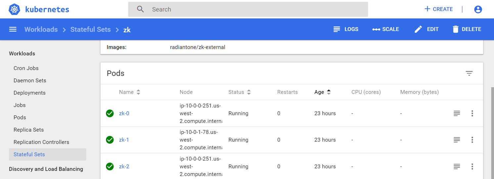

4. Click ->EXEC, this opens a new browser window.
5. In the SHELL window, run this command: 
```
export JAVA_HOME=/opt/radiantone/rli-zookeeper-external/jdk/jre/;/opt/radiantone/rli-zookeeper-external/zookeeper/bin/zkServer.sh status
```
>[!note]
> Use Shift+Insert to Paste.

The returned value should indicate “Mode: follower” or “Mode: Leader”. The ZooKeeper in the following example is a follower node.

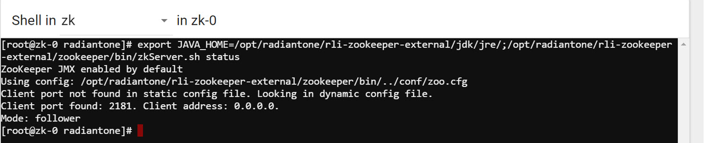

6. Close the Browser tab and go back to the Kubernetes Dashboard.
7. Repeat steps 3-6 for the other ZooKeeper nodes: zk-1 and zk-2. Following this example, one should be a follower node and one should be a leader node. The results are shown below.
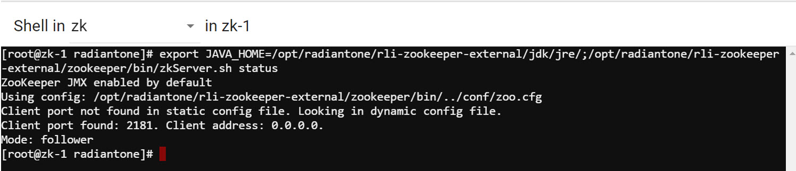
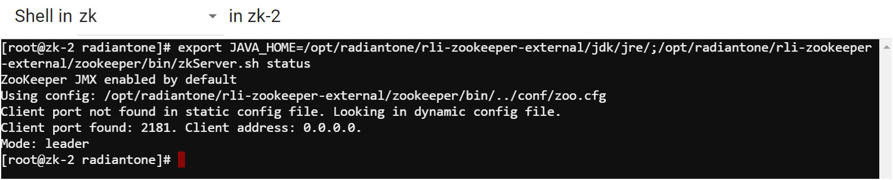


##### Checking the ZooKeeper Service via HTTP
In the example commands used in this section, the ZooKeeper service is named “myzk” and the shell is launched for the pod named myzk-2.
Run the following to see the commands available:
```
curl http://myzk:8080/commands
```

A couple of examples are shown below.
<br>
When “ruok” returns “error” : null, this means the ZooKeeper node is running fine. 
<br>
When “is_read_only” returns “read_only” : false, this means the ZooKeeper node is not in a read-only state. If a ZooKeeper node is in a read-only state, something is wrong and the RadiantOne nodes will not allow any write operations during this time. Most likely ZooKeeper has lost the quorum and can’t communicate with more than half of the other ZooKeeper nodes.

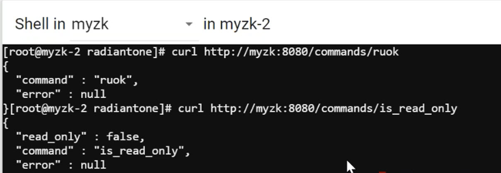

#### RadiantOne Nodes
The StatefulSet manifests (configmap.yaml and fid.yaml) create a RadiantOne node. After the node is deployed, you can scale up the number of nodes as needed. Although the Kubernetes web console can be used to create new stateful sets, the steps below leverage the kubectl command line tool. Perform the following steps on the machine where you have downloaded the kubectl command line utilty and saved the yaml files.

##### Installation
1. Update the [configmap.yaml](configmapyaml.md) file.
2. Update the [fid-aws.yaml](fidyaml.md) file.
3. Open a command prompt and navigate to the location where you installed the kubectl command line utilty.
4. To create the RadiantOne FID StatefulSet, you can reference the folder that contains both the configmap.yaml and fid-aws.yaml files. Assuming both of these files are located in a folder located at C:\Kubernetes\FID, the following command can be used.
```
kubectl --namespace=prod apply -f C:\Kubernetes\FID
```
<mark>Note – if no namespace is used in your Kubernetes cluster, you can omit the --namespace property.</mark>
 
## RadiantOne Configuration
The configuration can be managed from the RadiantOne Main Control Panel, kubectl command line utility, or from the Kubernetes web dashboard by launching a shell directly on the RadiantOne node/pod you want to administer.

### RadiantOne Main Control Panel
After the RadiantOne nodes are deployed, you can view the services from the Kubernetes web dashboard and click on the link to launch the Main Control Panel.

1. From the Kubernetes web dashboard, navigate to Discovery and Load Balancing -> Services.

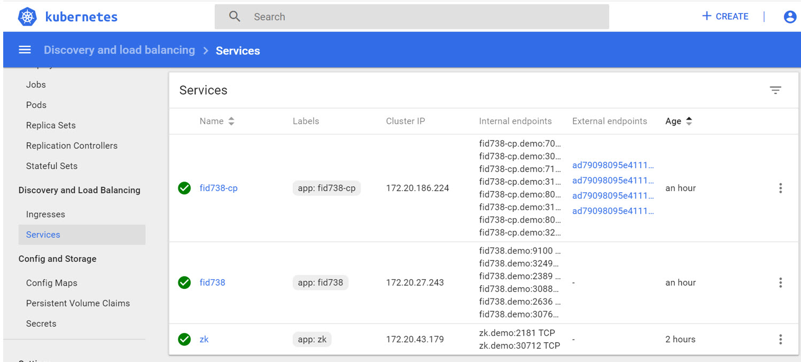

The external endpoints, which point to the AWS Elastic Load Balancer (ELB) that is in front of the RadiantOne services, are shown for the RadiantOne Control Panel service 
(<node_name>-cp). There are four external endpoints configured. Two point to the Control Panel (one is for the non-ssl port and the other is for the ssl port). Two point to the RadiantOne FID web services (SCIM, DSML/SPML, ADAP) ports which are required by the RadiantOne Main Control Panel -> Directory Browser tab. 

2. Hover over the endpoint to see the server and port. Click the link to launch the RadiantOne Main Control Panel (the one with either port 7070 for HTTP access or 7171 for HTTPS access)
 
3. Login with the RadiantOne administrator. The credentials were defined in the configmap.yaml file.
4. Manage the RadiantOne configuration as needed. For an understanding of activities that can be performed from the Main Control Panel, see the RadiantOne System Administration Guide.

### Kubernetes Command Line Utility
The Kubernetes command line utility can be used to run commands available in RadiantOne. Below are a few examples of how to run some common commands. For details on all available commands, see the RadiantOne Command Line Configuration Guide.

* Example 1 - Backing up an HDAP store mounted at o=local on the myfid-0 pod in the demo namespace:
```
kubectl exec -it -n demo myfid-0 -- vdsconfig.sh backup-hdapstore -namingcontext o=local
```
* Example 2 - Restore an HDAP store mounted at o=local on the myfid-0 pod in the demo namespace:
```
kubectl exec -it -n demo myfid-0 -- vdsconfig.sh restore-hdapstore -namingcontext o=local 
```
* Example 3 – Export entries from an HDAP store mounted at o=local on the myfid-0 pod in the demo namespace. 
```
kubectl exec -it -n demo myfid-0 -- vdsconfig.sh export-ldif -basedn o=local -ldif local.ldif -scope sub
```
The local.ldif file is created at /opt/radiantone/vds/vds_server/ldif/export/ by default.

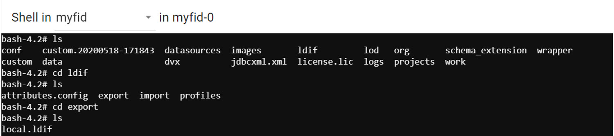

### Kubernetes Web Dashboard
To access the shell from the Kubernetes web dashboard:

1. Go to Workloads -> Pods.

2. Select the RadiantOne pod you want to manage (e.g. myfid-0) and click ->EXEC. The shell window opens.

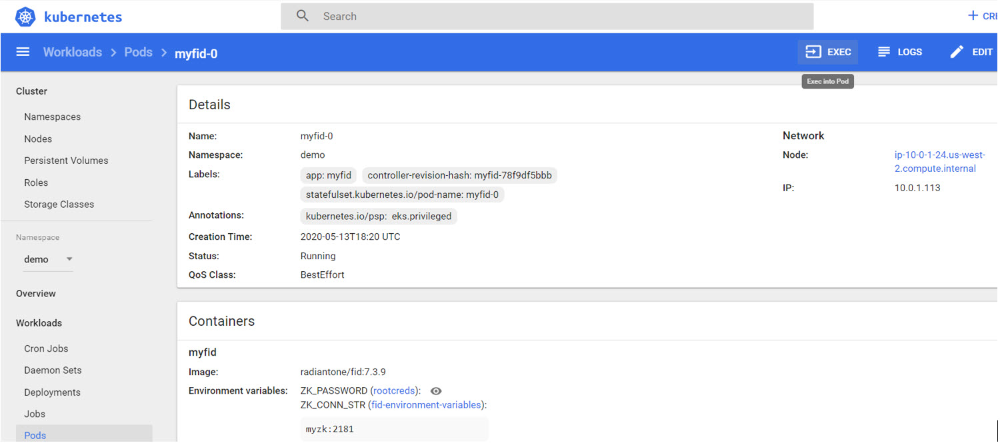

3. Go to the /vds folder to access the file system of RadiantOne. The example below depicts how to navigate to the log files below /vds/vds_server/logs.

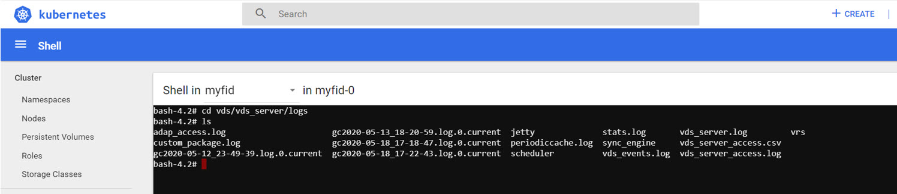


### Enabling FIPS-Mode
If your RadiantOne deployment must support FIPS 140-2 certified crypto operations for data-in-transit and data-at-rest, perform the following before enabling FIPS-mode.
Modify the file <RLI_HOME>/jdk/jre/lib/security/java.security and replace this line:
```
securerandom.source=file:/dev/random
```
With this line:
```
securerandom.source=file:/dev/urandom
```
### Migrating Configuration
RadiantOne configuration can be migrated from one environment (e.g. dev/qa) to another (e.g. production). This section describes the migration steps.

1. Download the RadiantOne Migration Utility onto the machine where the RadiantOne configuration is to be exported. Run the following command to export the configuration.
```
./opt/MigrationUtility/radiantone-migration-tool-2.0.5/migrate.sh export ./opt/temp/export.zip
```
2. Copy the file to the target machine where the kubectl utility is installed. 
3. Scale down the RadiantOne cluster to one node. From the Kubernetes web dashboard, go to Workloads -> Stateful Sets.
4. Select the RadiantOne FID stateful set.

>[!note]
> Make sure you are in the correct Namespace!

5. Click SCALE.
6. Enter 1 for the (total) number of nodes the RadiantOne cluster should have. In the example shown below, there are currently 3 nodes in the RadiantOne cluster and 1 node is desired.

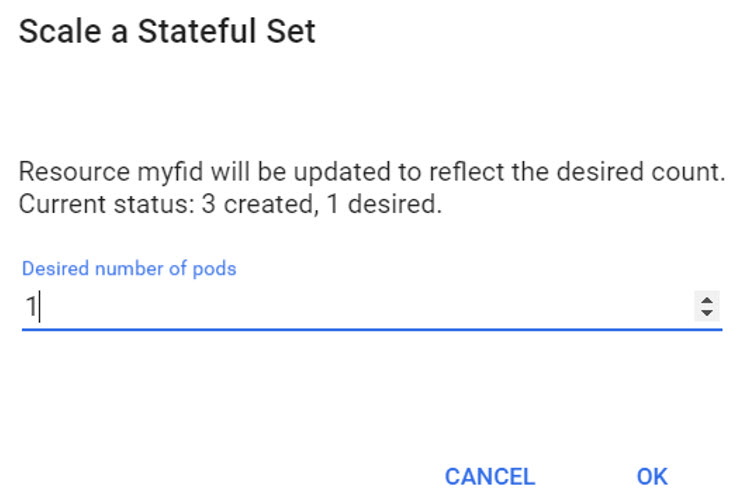
 
7. Click OK. Kubernetes scales down to one node.

>[!note]
> You must scale down instead of just stopping the RadiantOne services on the nodes. Stopping the services would result in Kubernetes trying to restart them.  By default, when Kubernetes scales down the nodes, they still remain a part of the cluster. If you run cluster.sh list, you still see the nodes, but the RadiantOne services will not be running. This way, Kubernetes does not try to restart the RadiantOne services automatically.

8. From the machine where the kubectl utility is installed, copy the file that was exported from the dev/qa environment to the RadiantOne leader node (the example below has a RadiantOne node identified as fid-0 in the demo namespace).
```
kubectl cp export.zip fid-0:/opt/radiantone -n demo
```
9. (Optional) If you want to customize additional configuration changes to be executed after the initial configuration is imported, create a script named [configure_fid.sh](postmigrationscript.md) that contains the needed commands (e.g. update host information in data sources to point to production instances). This script is executed by the migration process after the initial configuration is imported (in step #10 below).

10. From the machine where the kubectl utility is installed, run the import command on the target pod.
```
kubectl exec -it fid-0 -n demo -- ./migrate.sh import export.zip
```
The migrate script stops the RadiantOne services on the target pod, and then restarts them after import. 

11. Scale up the RadiantOne nodes from the Kubernetes web dashboard -> Workloads -> Stateful Sets.

## Administration

### Scaling Out - Adding RadiantOne Nodes
Scaling out means adding RadiantOne nodes to the cluster. You cannot scale out ZooKeeper nodes. The number of pods to be created is explicitly defined when the cluster is created (ZOOKEEPER_FLEET_SIZE). However, you can scale out RadiantOne nodes. 
To add nodes to the existing RadiantOne FID cluster:

1. From the Kubernetes web dashboard, go to Workloads -> Stateful Sets.
2. Select the RadiantOne FID stateful set.

>[!note]
> make sure you are in the correct Namespace!

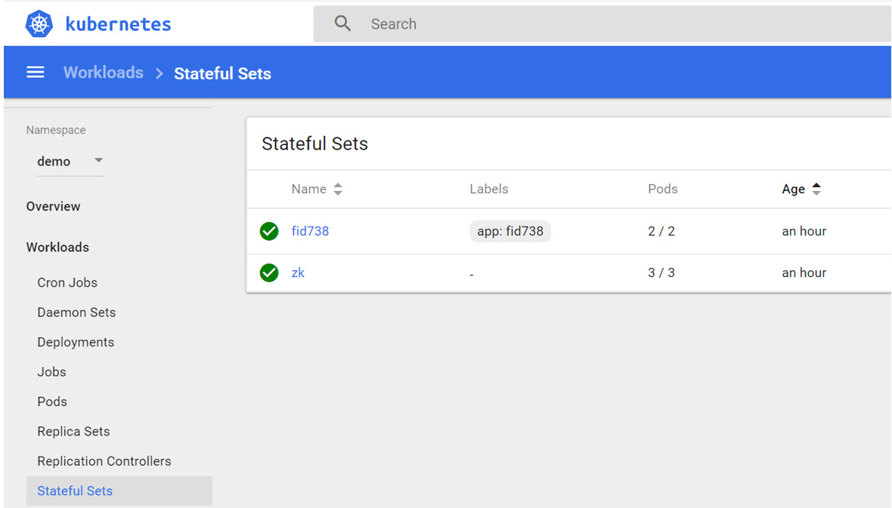

3. Click  SCALE.
4. Enter the number (total) of nodes the RadiantOne cluster should have. In the example shown below, there are currently 2 nodes in the RadiantOne cluster and another node is going to be added.
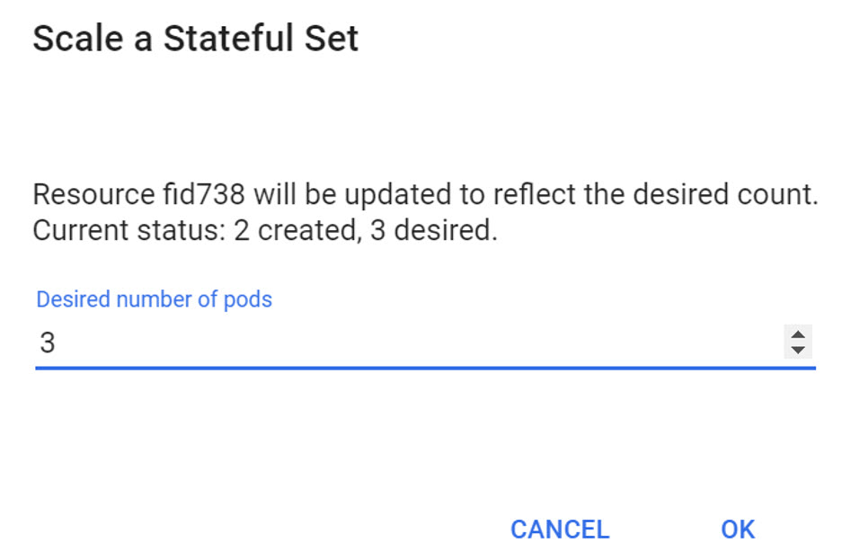

5. Click OK. Kubernetes adds the needed number of nodes. Once they are created, you can see the pods in Workloads -> Pods.

### Clients Connecting to RadiantOne FID Nodes

#### Using LDAP
The default RadiantOne configuration assumes that clients accessing RadiantOne FID are managed by the same Kubernetes cluster and will use an internal service to query RadiantOne FID as opposed to an externally facing ELB. This is dictated by the ```type: NodePort``` keyword in the .yaml file that describes the RadiantOne FID LDAP ports. 

>[!note] 
> If you changed the .yaml file prior to deploying, and set ```type: LoadBalancer```, then clients would access RadiantOne FID via LDAP through an Elastic Load Balancer (ELB).

From the Kubernetes web console, navigate to Discovery and Load Balancing -> Services. You can see the service name and port (LDAP port 2389 by default) in the section matching the label you defined for the RadiantOne deployment. An example is shown below.

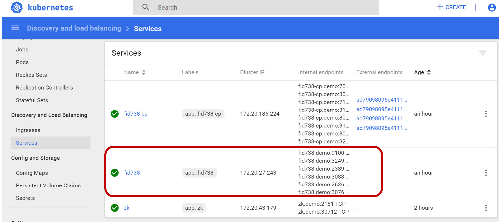

#### Using Web Services (SCIM, DSML/SPML, REST)
From the Kubernetes web dashboard, navigate to Discovery and Load Balancing -> Services.
 
The external endpoints, which point to the AWS Elastic Load Balancer (ELB) that is in front of the RadiantOne services, are shown. There are four external endpoints configured. Two point to the Control Panel (one is for the non-ssl port and the other is for the ssl port). Two point to the RadiantOne web services (SCIM, DSML/SPML, REST/ADAP) ports. Hover over the endpoint to see the server and port. Give this information to clients to connect to RadiantOne on the web services ports. 

>[!note]
> You can map the ELB endpoint to a friendly DNS name by creating a Hosted Zone in AWS.

### Applying RadiantOne Patches
Patching a version of RadiantOne is classified as an update. Patch versions are identified by the 3rd number in the whole version. For example, v7.3.10 indicates it is the 10th patch release for v7.3. 
You can apply a patch, and update to a newer patch release (e.g. apply a patch on v7.3.10 to update to v7.3.11). 

Patches are not for upgrading to a new version (e.g. moving from v7.3 to v7.4), or moving from a newer patch release to an older patch release (e.g. moving from v7.3.10 to v7.3.8).

The following requirements must be met in order to update/patch the RadiantOne version on the RadiantOne nodes:

* The ZooKeeper ensemble must be reachable and not in a read-only state.
* There must be at least two nodes in the RadiantOne cluster. The process performs a rolling update where each RadiantOne node is updated at a time. While one RadiantOne node is being updated, the other node must be available to serve client requests. 
* Although a rolling update does not require the complete RadiantOne service to be offline (at least one node should always be available), throughput will be reduced as nodes are being updated. Therefore, it is recommended that you patch during maintenance windows/non-peak hours.
When a container is started, it pulls the image specified in the yaml file and Kubernetes checks the version that is installed. If the current version is less than the version outlined in the yaml file, it knows that the image needs to be updated.  In this case, the update.sh file is run and one RadiantOne node is updated at a time. 

The steps to apply a patch are outlined below.

1. From the Kubernetes web dashboard -> Workloads -> Stateful Sets, click the 3 dots next to the one representing the RadiantOne node. 

2. Click View/edit YAML.


3. Update the image version in the fid-aws.yaml file to indicate a newer patch version of RadiantOne. The location to update is shown in the image below, and indicates an example of v7.3.9.

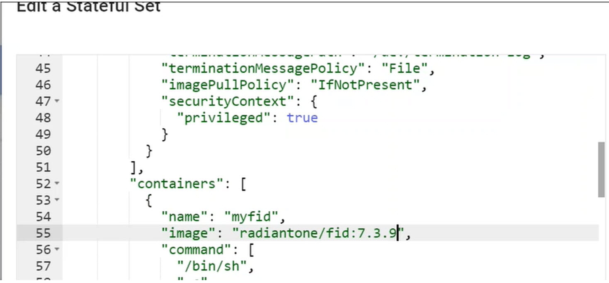
 
Once the image is modified, the rolling update starts. This can take quite a bit of time to perform. Stateful sets are updated in order from the highest number to the lowest number. For three RadiantOne nodes, the fid-2 node is updated first, followed by the fid-1 node and finally the fid-0 node. The pod gets stopped and the latest image (indicated in the yaml file) is compared to the current version of RadiantOne on the node. If the current version is less than the version specified in the yaml, then the RadiantOne update process is executed on the node. This process is logged in the RadiantOne logs on the node. You can acces the logs from the Kubernetes web dashboard -> Workloads -> Pods -> <RadiantOne pod> by clicking LOGS.


An example of the log is shown below.
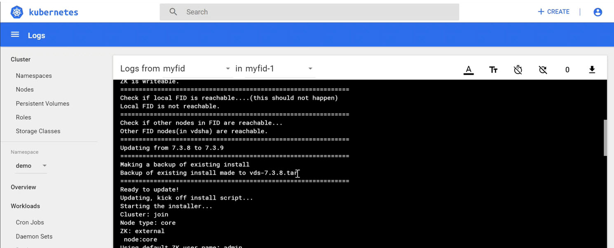
 
>[!note]
> A backup of the existing install is made to vds-<version>.tar prior to updating.

### Deleting Deployments
To remove a deployment, delete the stateful sets, services, config maps, persistent volumes, and persistent volume claims.

#### Delete Stateful Sets

1. From the Kubernetes Control Panel -> Overview -> Stateful Sets section, click the 3 dots next to the RadiantOne FID stateful set (in the example shown below, this is the one named fid738) and choose Delete. Click Delete again to confirm the deletion.
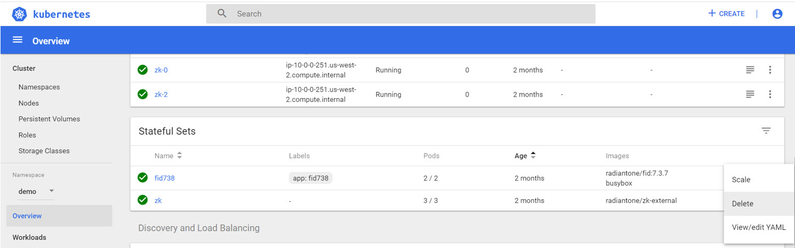
 
2. From the Kubernetes Control Panel -> Overview -> Stateful Sets section, click the 3 dots next to the ZooKeeper stateful set (in the example shown above, this is the one named zk) and choose Delete. Click Delete again to confirm the deletion.

3. From the Kubernetes Control Panel -> Overview -> Services section, click the 3 dots next to the RadiantOne Control Panel service (in the example shown below, this is the one named fid738-cp) and choose Delete. Click Delete again to confirm the deletion.

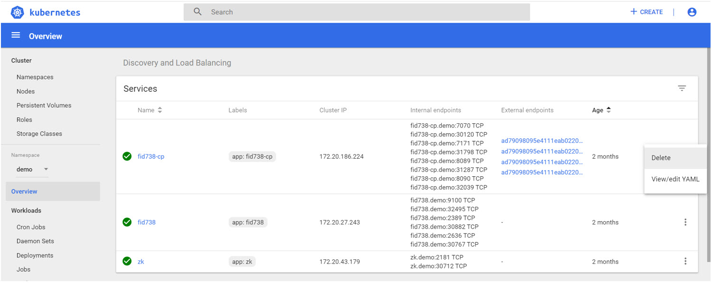

#### Delete Services  

1. From the Kubernetes Control Panel -> Overview -> Services section, click the 3 dots next to the RadiantOne FID service (in the example shown above, this is the one named fid738) and choose Delete. Click Delete again to confirm the deletion.

2. From the Kubernetes Control Panel -> Overview -> Services section, click the 3 dots next to the ZooKeeper service (in the example shown above, this is the one named zk) and choose Delete. Click Delete again to confirm the deletion.

#### Delete Config Maps

From the Kubernetes Control Panel -> Config and Storage -> Config Maps section, click the 3 dots next to the RadiantOne environment variables and choose Delete. Click Delete again to confirm the deletion.

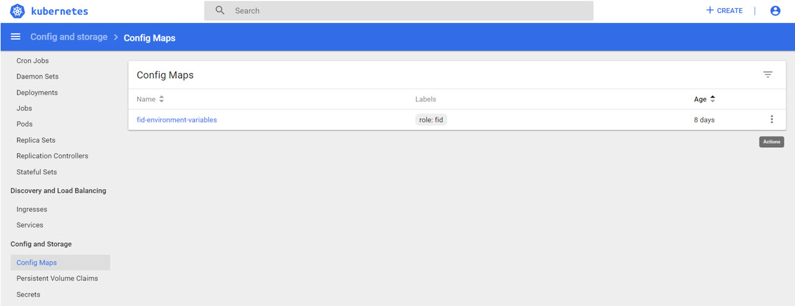

#### Delete Persistent Volume Claims 

1. In the Config and Storage -> Persistent Volume Claims section, click the 3 dots next to the RadiantOne persistent volume claim and choose Delete. Click Delete again to confirm the deletion.

2. Repeat the previous step to delete the persistent volume claims for all RadiantOne nodes and all ZooKeeper nodes.

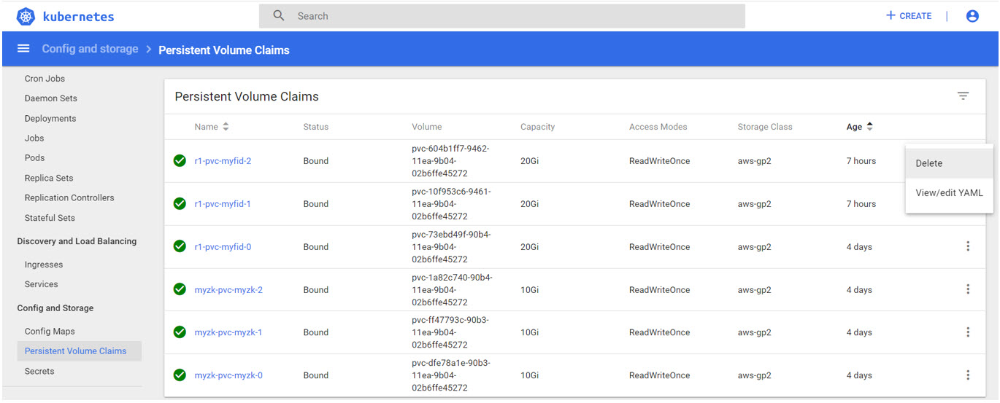

#### Delete Persistent Volumes 

1. In the Cluster -> Persistent Volumes section, identify all of the nodes associated with the persistent volume. The value in the claim column is prefixed with the name of the namespace (e.g. demo/). Click the 3 dots next to the RadiantOne node associated with the persistent volume (it should have Status=Released) and choose Delete. Click Delete again to confirm the deletion.

2. Repeat step 1 for all persistent volumes associated with RadiantOne and ZooKeeper nodes.
 
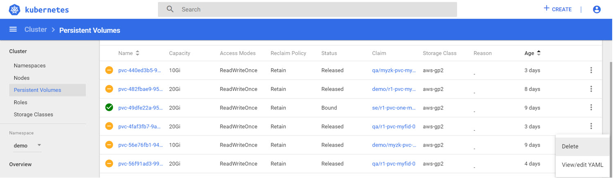
