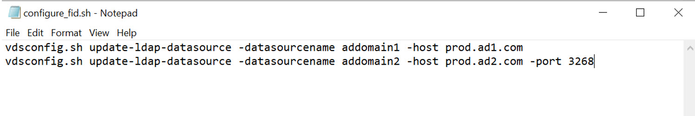

# Post Migration Script
Additional configuration commands can be listed in a script file named configure_fid.sh. The script should contain one command per line in the file and be located in a folder named scripts (e.g. /opt/radiantone/scripts) on the RadiantOne target pod. Any command available in the vdsconfig utility can be included in the configure_fid.sh script. 
For information on the vdsconfig commands, see the RadiantOne Command Line Configuration guide.

The migrate script checks for the configure_fid.sh script and executes it after the the initial configuration is imported. 

# Create Script
1. On the machine where the kubectl utility is installed, create a text file named configure_fid.sh.

2. In an editor, edit configure_fid.sh and add the commands that should be executed after the configuration is imported into the RadiantOne production pod. There should be one command per line in the script file. Some common commands are ones that update data sources to point to production instances. An example of a script containing commands to update two data sources (named addomain1, and addomain2) to point to production instances is shown below.




# Copy Script
1. On the RadiantOne leader pod (where the configuration is going to be imported), create a folder named scripts in /opt/radiantone. 
2. On the machine where the kubectl utility is installed, and the configure_fid.sh script is located, copy the configure_fid.sh script file to the target RadiantOne pod (the example below has a RadiantOne node identified as fid-0 in the demo namespace). 
```
kubectl cp configure_fid.sh fid-0:/opt/radiantone/scripts -n demo
```
3. On the machine where the kubectl utility is installed, run the migrate.sh script to import the configuration into the RadiantOne production pod. This script imports the configuration and then runs the configure_fid.sh script to execute the additional configuration commands. The example below has a RadiantOne node identified as fid-0 in the demo namespace.
```
kubectl exec -it fid-0 -n demo -- ./migrate.sh import export.zip
```
