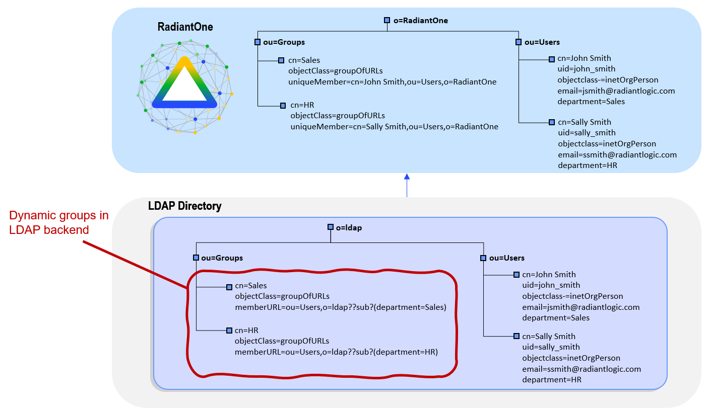
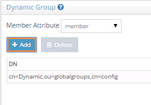

# LDAP dynamic groups in Global Identity Builder

If a source used in the Global Identity Builder contains identities that are associated with LDAP dynamic groups, and you plan on using the Global Identity Viewer to search for identities and groups, use RadiantOne to create a virtual view of the source that automatically evaluates the dynamic groups, and then add this view as an identity source into the project. This section provides guidance on how to achieve this.

In the diagram below, the LDAP directory contains a dynamic group named `HR`. In the virtual view, the dynamic group members are evaluated the cached as a standard group.

1. Configure a virtual view to the directory backend that contains the dynamic groups. This can be a simple proxy view. Use Suffix Branch Inclusion or Exclusion to return the desired branches. If you need help with creating a proxy view or defining suffix branch inclusion/exclusions, see the RadiantOne Namespace Configuration Guide.
1. From the **Main Control Panel** > **Settings Tab** > **Interception** section > **Special Attributes Handling** sub-section, locate the **Dynamic Groups** section on the right side.
1. Choose either `member` or `uniquemember` from the **Member Attribute** drop-down list. This will determine the attribute name that will contain the members of the dynamic groups.
1. Select the **Add** button.
1. Select **Choose** to browse to the container where all dynamic groups are located. If only a few groups are dynamic, you can select and add them individually. An example of adding a single group named Dynamic is shown in the figure below.
    
1. Check the option to **Enable Caching**.
1. Select **OK**.
1. Select **Save** in the top right.
1. Configure DN Remapping for the **memberURL** attribute. From the **Directory Namespace** tab, select the node where the proxy is mounted below the **Root Naming Contexts** section.
1.  On the **Attributes** tab on the right side, select **ADD**.
1.  Enter `memberURL` for the **Name** and **Virtual Name** properties.
1.  Check the **DN Remapping** option.
1.  Select **OK**.
    
1.  Select **Save** in the upper right.
1.  Configure the virtual view for persistent cache. From the **Main Control Panel** > **Directory Namespace** tab, select the **Cache** node.
1.  Select **Browse** to navigate to the naming context you want to cache.
1.  Select **Create Persistent Cache**.
1.  On the **Refresh Settings** tab, select the type of cache refresh strategy you want to use and select **Save**. For details on the different refresh options and how to initialize the cache, see the RadiantOne Deployment and Tuning Guide.
1.  After the persistent cache is configured, select the cached branch below **Cache** and on the **Refresh Settings** tab, select **Initialize**.
1.  If you selected a Real-time refresh strategy, configure the connectors accordingly and start them. For details, see the Connector Properties Guide and the Deployment and Tuning Guide. If you selected a periodic cache refresh approach, configure the refresh interval. For details, see the Deployment and Tuning Guide.
1.  From the **RadiantOne Main Control Panel** > **Wizards** tab, select the **Global Identity Builder**.
1.  Add **RadiantOne** as an [identity source](../create-projects/identity-sources.md). Remember to provide a meaningful data source name so you can identify the actual underlying data source. The [Base DN](../create-projects/identity-sources.md#base-dn) should point to the persistent cached view of the actual backend data source. An example is shown below.
