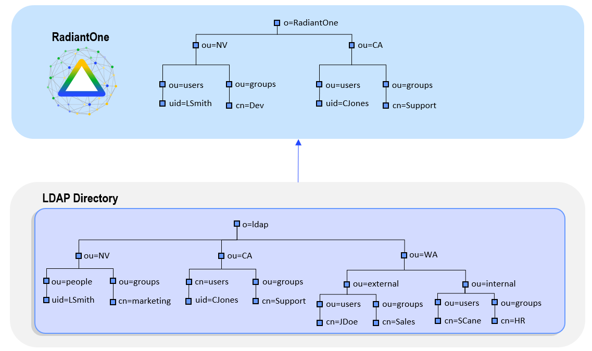
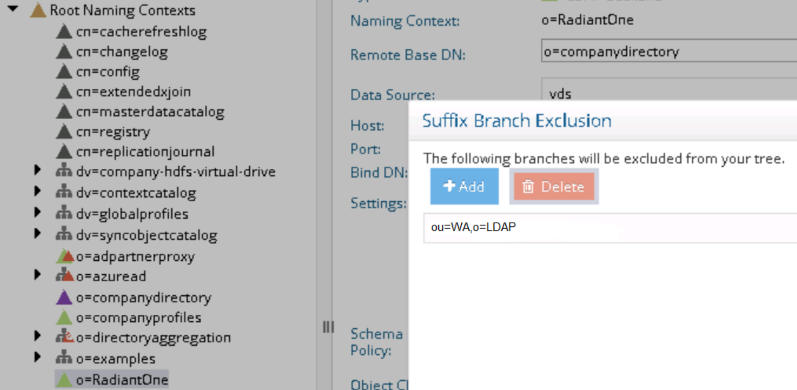

# Users and groups distributed in multiple containers in Global Identity Builder

The Global Identity Builder allows for one location for identities and one location for groups per source. In the purple-colored portion of the example below you can see identities or groups spread across multiple containers. In this example you cannot use a shared root (for example `o=LDAP`) because it includes identities that you do not want in the global reference list (for example, identities in the `ou=WA` container). To address this you can create a virtual view in RadiantOne that eliminates the unwanted entries, and then add this view as an identity source into the project. This section provides guidance on how to achieve this.

>[!note]
>This is also the recommended configuration if identities are all in a single container and the groups are spread throughout multiple containers.

Configure a virtual view to the LDAP backend. This can be a simple proxy view. Use **Suffix Branch Inclusion** or **Exclusion** to return the desired branches. If you need help with creating a proxy view or defining suffix branch inclusion/exclusions, see the RadiantOne Namespace Configuration Guide.

Once the proxy view is defined, configure a persistent cache.

1. From the **Main Control Panel** > **Directory Namespace** tab, select the **Cache** node.
2. Select **Browse** to navigate to the naming context you want to cache.
3. Select **Create Persistent Cache**.
4. On the **Refresh Settings** tab, select the type of cache refresh strategy you want to use and select **Save**. For details on the different refresh options and how to initialize the cache, see the RadiantOne Deployment and Tuning Guide.
5. After the persistent cache is configured, select the cached branch below **Cache** and on the **Refresh Settings** tab, select **Initialize**.
6. If you selected a Real-time refresh strategy, configure the connectors accordingly and start them. For details, see the Connector Properties Guide and the Deployment and Tuning Guide. If you selected a periodic cache refresh approach, configure the refresh interval. For details, see the Deployment and Tuning Guide.
7. From the **RadiantOne Main Control Panel** > **Wizards** tab, select the **Global Identity Builder**.
8. Add **RadiantOne** as an [identity source](../create-projects/identity-sources.md). Remember to provide a meaningful data source name so you can identify the actual underlying data source. The [Base DN](../create-projects/identity-sources.md#base-dn) should point to the persistent cached view of the actual backend data source. An example is shown below.
    

To learn more about Global Identity Builder, please read the chapter that describes how to [extend the global profile view](../global-profile-view.md).
