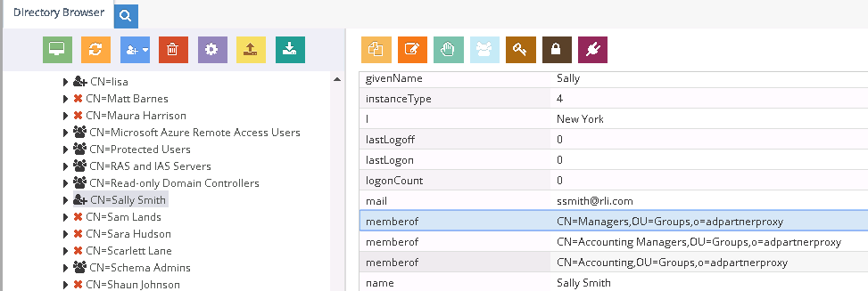
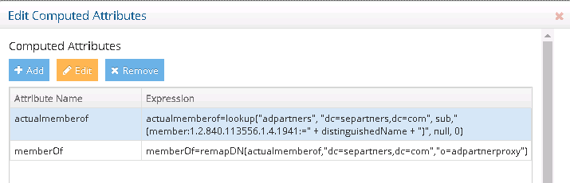
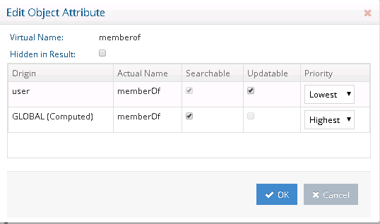
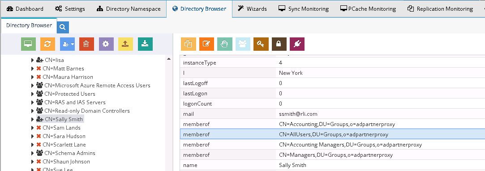
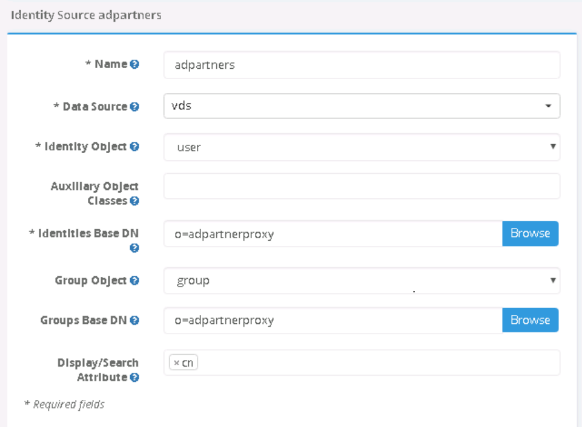

# Nested groups in Global Identity Builder

If a source used in the Global Identity Builder project contains identities that are associated with nested groups, and you plan on using the Global Identity Viewer to search for identities and groups, use RadiantOne to create a virtual view of the source that un-nests the groups and then add this view as an identity source into the project. This section provides guidance on how to achieve this.

Configure a virtual view to the directory backend that contains the nested groups. This can be a simple proxy view. Use **Suffix Branch Inclusion** or **Exclusion** to return the desired branches. If you need help with creating a proxy view or defining suffix branch inclusion/exclusions, see the RadiantOne Namespace Configuration Guide.

User `Sally Smith`, shown below, is a member of the following groups (as indicated by her `memberOf` attribute): `Managers`, `Accounting Managers`, `Accounting`.

The `Accounting` group is a member of the `All Users` group, but this does not show up in Sally's `memberOf` attribute by default because it is a nested group.

To un-nest the groups:

1. In the proxy view definition, select the **Objects** tab.
2. Select **Add** in the **Primary Objects** section and add the object class associated with user entries (for example `user`).
3. Select **Save**.
4. Select **Edit** next to **Define Computed Attributes**.
5. Select **Add**.
6. Enter `actualmemberOf` for the computed attribute name.
7. Enter an expression to compute the groups (including nested) using the syntax below.
`actualmemberOf = lookup("{AD_DATA_SOURCE}", "{AD_BASE_DN}", sub," (member:1.2.840.113556.1.4.1941:=" + distinguishedName + ")", null, 0)`
1. Select **OK**.
2. Select **Save**.
On the **Objects** tab, the `actualmemberOf` attribute is noted as computed.
    
1.   Since the `actualmemberOf` calculation will be used internally, it can be hidden from the final result. Choose `actualmemberof` and select **Edit Attribute**.
2.   Check the **Hidden in Result** option and select **OK**.
    
3.  A new computed attribute is defined to return the remapped group DNs so they properly match the virtual namespace. Select **Edit** next to **Define Computed Attributes**.
4.  Select **Add**.
5.  Enter `memberOf` for the computed attribute name. This computed attribute leverages the previously defined one to remap the group DNs in the `actualmemberOf` attribute to match the naming in RadiantOne namespace. In this example, a simple suffix replacement is sufficient, so the `remapDN` function can be used:
    

After entering the parameters, the following expression is generated based on a source suffix of `"dc=separtners,dc=com"` and a virtual suffix of `"o=adpartnerproxy"`:

`remapDN(actualmemberof,"dc=separtners,dc=com","o=adpartnerproxy")`

An example of the two computed attributes is shown below.

Since RadiantOne is computing the `memberOf` attribute, the actual one returned from the backend Active Directory can be assigned a lower priority.

15. Choose **memberOf** and select **Edit Attribute**.
    

16. To avoid returning the same groups multiple times, with both their virtual DN and real DN, assign a `Highest` priority to the computed value and a `Lowest` priority to the primary value. This ensures only the computed value is returned.
    

17. Select **OK**.

18. Select **Save**.
The virtual view now returns an un-nested list of groups for the user's `memberOf` attribute.
    
19. From the **Main Control Panel** > **Directory Namespace** tab, select the **Cache** node.

20. Select **Browse** to navigate to the naming context you want to cache.

21. Select **Create Persistent Cache**.

22. On the **Refresh Settings** tab, select the type of cache refresh strategy you want to use and select **Save**. For details on the different refresh options and how to initialize the cache, see the RadiantOne Deployment and Tuning Guide.

23. After the persistent cache is configured, select the cached branch below **Cache** and on the **Refresh Settings** tab, select **Initialize**.

24. If you selected a Real-time refresh strategy, configure the connectors accordingly and start them. For details, see the Connector Properties Guide and the Deployment and Tuning Guide. If you selected a periodic cache refresh approach, configure the refresh interval. For details, see the Deployment and Tuning Guide.

25. From the **RadiantOne Main Control Panel** > **Wizards tab**, select the **Global Identity Builder**.

26. Add **RadiantOne** as an [identity source](../create-projects/identity-sources.md). Remember to provide a meaningful data source name so you can identify the actual underlying data source. The [Base DN](../create-projects/identity-sources.md#base-dn) should point to the persistent cached view of the actual backend data source. An example is shown below.
    
