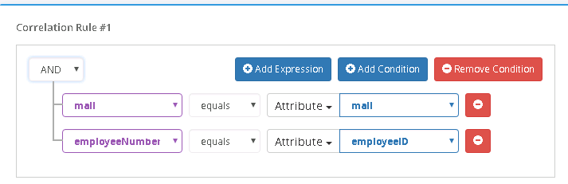
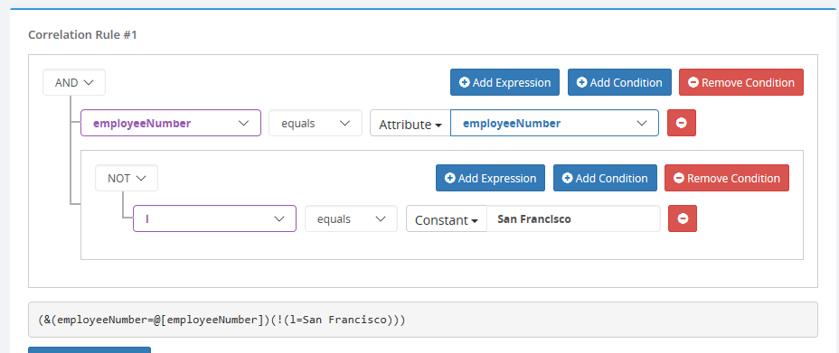
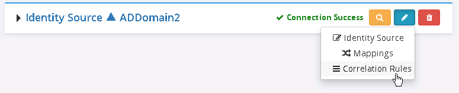

# Global Identity Builder identity sources

After you have defined the properties for a Global Identity Builder project, select **Add Identity Source** to add an identity source to the project. For each identity source, you must define the following properties. An example is shown in the following screen:

- **Data source**: The data source configured in RadiantOne. This property is required.
- **Name**: A unique name to identify the data source in the project. Use alphanumeric and underscore characters only. This property is required.
- **Upload Mode**: This option controls how entries are processed when an upload for this identity source is launched. By default, sequential processing is used and guarantees that the correlation algorithm is applied properly. Parallel processing can be used but should only be enabled after ensuring that there is no dependency on the order in which entries are processed. Usually, if you have possible correlation within the same identity source (1 or more entries in the same source might correlate with each other), then you must use sequential processing.
- **Identity Object**: For LDAP data sources, this is the object class associated with the identities. For RDBMS, this is the database table/view name containing the identities. This property is required.

>[!warning]
>Custom data sources are supported. However, you must first virtualize the identities in RadiantOne and store them in persistent cache. Then, use the persistent cache as the LDAP identity source for the Global Identity Builder project. The chapter [integrate and configure a Global Identity Builder custom data source](../integrate-configure-data-source.md) provides an example of using a custom data source in a Global Identity Builder project.

- **Additional Object Classes**: For LDAP data sources, this is the additional object class associated with the identities (beyond just the primary object class indicated as the Identity Object). This property is optional. If the identities are not associated with additional object classes, leave this property blank.
- **Base DN**: The location in the data source that contains the identities. This is only applicable to and required for LDAP data sources.
- **Display/Search Attribute**: The attribute listed here conditions the searches performed against the identity source from the browser embedded in the Global Identity Builder application. This property is required.

>[!warning]
>The attribute selected as a search attribute should contain a populated, unique, single value that is user friendly. This search attribute is also used for displaying identities in the [Identity Source Browser](../concepts.md#identity-source-browser).

- **DN Attributes**: This is a comma-separated list of identity attributes that contain DN values. This is only applicable for LDAP data sources. The values of the attributes listed here are automatically re-mapped in the identity source views so that the DNs match the virtual namespace.  Some examples are `isMemberOf`, `manager`, and `directReports`. This property is used to auto-generate computed attributes in the virtual views from the source. The virtual views are used by the [Global Identity Viewer](../concepts.md#global-identity-viewer) application.
    - The Global Identity Builder does not correlate or link overlapping groups. The group properties described below are only used to automate the configuration of virtual views from the source and are used to facilitate group searches in the [Global Identity Viewer](../concepts.md#global-identity-viewer).
- **Group Object**: The object class associated with group entries in the source. This is only applicable for LDAP data sources. This property is optional.
- **Base DN**: The location in the data source that contains the groups. This is only applicable for LDAP data sources. This can only be configured for one container. If your groups are located in multiple containers, create a virtual view in RadiantOne that flattens the list of groups and configure the view for persistent cache. Then, use the cache location in RadiantOne as the identity source in the project. Be sure to give this identity source a meaningful name in the Global Identity Builder so you know what the underlying source is instead of using something generic like "RadiantOne." Examples of how to address flattening groups and other group challenges see [address group membership challenges](../address-group-challenges/ldap-dynamic-groups.md). This property is optional.
- **DN Attributes**: This is a comma-separated list of attributes in group entries that contain DN values. This is only applicable for LDAP data sources. The values of the attributes listed here are automatically re-mapped in the identity source views so that the DNs match the virtual namespace.  Some examples are `member`, `uniqueMember` and `managedBy`. This property is used to auto-generate computed attributes in the virtual views from the source. The virtual views are used by the [Global Identity Viewer](../concepts.md#global-identity-viewer) application. This property is optional.

## Attribute mappings

After saving the initial identity source configuration, the attribute mapping page displays.

Any attributes needed in [correlation rules](#correlation-rules), or that you want to comprise the user's final profile, must be mapped to a global profile attribute. Source attributes can be mapped to target global profile attributes using any of the following methods:

>[!warning]
>When mapping source attributes to global profile attributes, the data types defined in the source and target schemas are important. If the source attribute data type is incompatible with the global profile attribute data type, the entry cannot be stored properly in the RadiantOne persistent cache due to problems with indexing. If you have a scenario of type mismatch (this is seen in the upload log associated with the identity source), you can define a Custom Attribute in your global profile project and map the identity source attribute to the custom attribute. Custom attributes are defined as type Directory String and offer flexibility to store a variety of values.

- 1-1 mapping – this method allows you to map a single source attribute to a single target global profile attribute. Select an identity source attribute, a target global profile attribute and select **Map**.
- Auto Mapping – this is a quick method to automatically map source attributes to target global profile attributes with the same name. Select **Auto** to apply an automatic mapping.
- Function – this method allows you to apply a function to compute a value for the target global profile attribute. Choose a target global profile attribute and select **Computed**. You can choose an attribute from the **Insert Attribute** drop-down list and select **Insert** to add it to the expression. You can choose a function from the **Insert Function** drop-down list and select **Insert** to add it to the expression. Modify the expression to meet your needs and select **Validate**. Select **OK** to save and go back to the **Attribute Mapping** screen. The example shown below extracts the leftmost characters (based on the @) in the source entry's mail attribute to populate the global profile `description` attribute.
    
- Constant – this method allows you to map a target global profile attribute to a constant value. Choose a target global profile attribute and select **Computed**. Enter your value in the **Insert Constant** textbox and select **Insert**. If are you finished, select **Validate**. Otherwise you can add a source attribute, or use a function in your computation. Select **OK** to save and go back to the **Attribute Mapping** screen.
    

After all mappings have been defined, you can test the mappings for a given source identity on the right side. Enter a user to search for and the source attributes and corresponding global profile attributes are displayed. The example shown below is for a source identity of `djacobs`.

When you are finished configuring and testing attribute mappings, select **Save Mappings**. The next step is defining [correlation rules](#correlation-rules).

To return to the attribute mappings, on the project page, select  next to the identity source and choose Mappings.

## Correlation rules

After saving the attribute mappings, the Correlation Rules configuration is displayed.

Correlation rules dictate the basis for linking source identities to global profile identities and are comprised of one or more conditions. Each condition is a set of one or more expressions. As you enter expressions/conditions, the display on the right provides a preview of what identities will be "linked" based on the correlation rules defined. If the global profile list is empty (which it is until you upload for the first time), there is nothing to compare against, and so the information displayed on the right is irrelevant.

When adding identity sources to the project, if there are potential overlapping users, you should define correlation rules. When correlation rules result in a source identity matching exactly one global profile identity, the identities are automatically linked and assigned the same [VUID](../concepts.md#vuid) unique identifier. When a source identity matches more than one global profile identity, it is categorized as [unresolved](../concepts.md#unresolved-identity) and not added to the global profile. Use the option **Create a new identity when there is no match** to indicate whether or not a new identity should be added into the global profile when a source identity does not match a global profile identity.

>[!note]
>For the first data source you plan to upload, you should check the option **Create a new identity when there is no match** because the global profile list starts empty and there is nothing to compare against. You should also define the applicable correlation rules, even for the first source. This would cover scenarios where a user profile is linked to multiple source accounts, is deleted from the "first" underlying source and then later added back to the source and ensures they are re-linked in the global profile accordingly (if there were no correlation rules, the user would simply get added as a new identity in the global profile).
>If you need to correlate overlapping users from the same source, and this source is the one you are uploading first, be sure to disable the [**Skip Correlation on First Source Upload**](project-properties.md#skip-correlation-on-first-source-upload) option.

Expression – an expression is a criteria based on a global profile attribute matching an identity source attribute in some manner. This can be **equals**, **contains**, **starts with**, **ends with**, **present**, **greater than**, **greater than or equal to**, **less than**, or **less than or equal to**. Each correlation rule can have one or more expressions and they are grouped by a global operator of **AND**, **OR**, or **NOT**. An example is shown below where the rule has one condition containing two expressions that must both evaluate to **true** (since they are grouped as an **AND** operation) in order for a source identity to match a global profile identity. In this case, if the `mail` attribute in a global profile identity matches the `mail` attribute in a source identity **AND** the `employeeNumber` of the global profile identity matches the `employeeID` of the source identity, then these two identities are considered the same physical person and linked in the global profile.

Condition – a set of one or more expressions that comprise a rule. Conditions can be nested.

### Configuring correlation rules

1. Select **Add Correlation Rule**.
1. Choose a global profile attribute from the drop-down list (noted in purple).

>[!note]
>Binary attributes (i.e. `jpegPhoto`) and non-indexed attributes (i.e. `Description`) are intentionally omitted from the Global Profile Attribute drop-down list.

1. Choose an operator to condition the expression.
1. Choose an identity source attribute from the drop-down list (noted in blue) to complete the expression.
1. To add more criteria in the condition, select **Add Expression**.

>[!note]
>To remove an expression, select .

1. To add a new condition, select **Add Condition**.

You can change the main operator for the condition/nested condition from the top drop-down list. The options are **AND**, **OR**, **NOT**.

>[!note]
>To remove a condition, select **Remove Condition**.

The example correlation rule shown below indicates that a source identity is linked to a global profile identity when the source `employeeNumber` equals the global profile `employeeNumber` as long as the `l` attribute in the global profile identity does not have a value of `San Francisco`.

>[!note]
>At the bottom of the correlation rule, you get a glimpse of the LDAP filter (generated based on the conditions) that will be applied against the global profile to determine if the condition results in a match.

1. To add a rule, select **Add Correlation Rule**. Rules are processed in the order in which they appear.
1. Select **Save Rules**.
1. (Optional) [Define attribute priority](define-attribute-priority.md) if you have global profile attributes whose value can come from multiple identity sources.
1. [Upload](upload.md) the identity source into the global profile. Otherwise, [add new identity sources](#identity-sources) to the project.

To return to the correlation rules, on the project page, select  next to the identity source and choose **Correlation Rules**.

