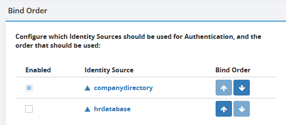

[Chapter 1: Introduction [3](#chapter-1-introduction)](#chapter-1-introduction)

[Accessing the Global Identity Builder Tool [5](#accessing-the-global-identity-builder-tool)](#accessing-the-global-identity-builder-tool)

[Chapter 2: Concepts [6](#chapter-2-concepts)](#chapter-2-concepts)

[Project [6](#project)](#project)

[Identity Correlation [6](#identity-correlation)](#identity-correlation)

[Identity Source [6](#identity-source)](#identity-source)

[Identity Source Browser [6](#identity-source-browser)](#identity-source-browser)

[Global Profile [7](#global-profile)](#global-profile)

[Global Profile Browser [7](#global-profile-browser)](#global-profile-browser)

[Unresolved Identity [8](#unresolved-identity)](#unresolved-identity)

[Persistent Cache [8](#persistent-cache)](#persistent-cache)

[Correlation Rule [8](#correlation-rule)](#correlation-rule)

[Attribute Mapping [8](#attribute-mapping)](#attribute-mapping)

[Bind Order [9](#bind-order)](#bind-order)

[Attribute Priority [9](#_Toc97028583)](#_Toc97028583)

[VUID [10](#vuid)](#vuid)

[Global Identity Viewer [11](#global-identity-viewer)](#global-identity-viewer)

[Chapter 3: Creating Projects [13](#chapter-3-creating-projects)](#chapter-3-creating-projects)

[Project Properties [13](#project-properties)](#project-properties)

[Project Name [14](#project-name)](#project-name)

[Naming Context [14](#naming-context)](#naming-context)

[Global Profile Object Class [14](#global-profile-object-class)](#global-profile-object-class)

[Additional Object Classes [14](#additional-object-classes)](#additional-object-classes)

[Login Attributes [15](#login-attributes)](#login-attributes)

[Display/Search Attribute [15](#displaysearch-attribute)](#displaysearch-attribute)

[Custom Attributes [15](#custom-attributes)](#custom-attributes)

[Runtime Optimizations [16](#runtime-optimizations)](#runtime-optimizations)

[Identity Sources [16](#identity-sources)](#identity-sources)

[Attribute Mappings [18](#attribute-mappings)](#attribute-mappings)

[Correlation Rules [21](#_Toc97028598)](#_Toc97028598)

[Define Attribute Priority [25](#define-attribute-priority)](#define-attribute-priority)

[Upload [26](#upload)](#upload)

[Bulk Upload [28](#bulk-upload)](#bulk-upload)

[Single Uploads [29](#single-uploads)](#single-uploads)

[Upload Behavior [29](#upload-behavior)](#upload-behavior)

[Upload Logs [31](#upload-logs)](#upload-logs)

[Define Bind Order [31](#define-bind-order)](#define-bind-order)

[Test Authentication [32](#test-authentication)](#test-authentication)

[Chapter 4: Manual Identity Administration [33](#chapter-4-manual-identity-administration)](#chapter-4-manual-identity-administration)

[Removing Identities from the Global Profile [33](#removing-identities-from-the-global-profile)](#removing-identities-from-the-global-profile)

[Identity Unlinking [33](#identity-unlinking)](#identity-unlinking)

[Viewing Unresolved Identities [34](#viewing-unresolved-identities)](#viewing-unresolved-identities)

[Adding Unresolved Identities into the Global Profile [35](#adding-unresolved-identities-into-the-global-profile)](#adding-unresolved-identities-into-the-global-profile)

[Login Conflict Analysis [36](#login-conflict-analysis)](#login-conflict-analysis)

[Launch Login Analysis [38](#launch-login-analysis)](#launch-login-analysis)

[Chapter 5: Persistent Cache with Real-Time Refresh [39](#chapter-5-persistent-cache-with-real-time-refresh)](#chapter-5-persistent-cache-with-real-time-refresh)

[Configuring Real-time Persistent Cache Refresh [39](#configuring-real-time-persistent-cache-refresh)](#configuring-real-time-persistent-cache-refresh)

[Re-configuring Project Properties [40](#re-configuring-project-properties)](#re-configuring-project-properties)

[Real-time Persistent Cache Refresh Impact on Global Profile Identities [40](#real-time-persistent-cache-refresh-impact-on-global-profile-identities)](#real-time-persistent-cache-refresh-impact-on-global-profile-identities)

[Identity Source Logs [42](#identity-source-logs)](#identity-source-logs)

[Chapter 6: Linking Existing Groups to Global Profile Identities [43](#chapter-6-linking-existing-groups-to-global-profile-identities)](#chapter-6-linking-existing-groups-to-global-profile-identities)

[Creating a Root Naming Context for Global Profile Identities and Groups [44](#creating-a-root-naming-context-for-global-profile-identities-and-groups)](#creating-a-root-naming-context-for-global-profile-identities-and-groups)

[Defining Computed Group Membership [49](#defining-computed-group-membership)](#defining-computed-group-membership)

[Testing the Result [51](#testing-the-result)](#testing-the-result)

[Appendix A: Integrating a Custom Data Source [53](#appendix-a-integrating-a-custom-data-source)](#appendix-a-integrating-a-custom-data-source)

[Overview [53](#overview)](#overview)

[Configuration [53](#configuration)](#configuration)

[Custom Data Source [53](#custom-data-source)](#custom-data-source)

[Create Virtual View [54](#create-virtual-view)](#create-virtual-view)

[Configure Persistent Cache [58](#configure-persistent-cache)](#configure-persistent-cache)

[Add RadiantOne Cache as an Identity Source in the Project [58](#add-radiantone-cache-as-an-identity-source-in-the-project)](#add-radiantone-cache-as-an-identity-source-in-the-project)

[Appendix B: Addressing Group Membership Challenges [60](#appendix-b-addressing-group-membership-challenges)](#appendix-b-addressing-group-membership-challenges)

[LDAP Dynamic Groups [60](#ldap-dynamic-groups)](#ldap-dynamic-groups)

[Nested Groups [63](#nested-groups)](#nested-groups)

[Users and Groups Distributed in Multiple Containers [69](#users-and-groups-distributed-in-multiple-containers)](#users-and-groups-distributed-in-multiple-containers)

[Appendix C: Extending the Global Profile View [72](#appendix-c-extending-the-global-profile-view)](#appendix-c-extending-the-global-profile-view)

# Chapter 1: Introduction

If you don't have a single source of users, an application would have to look in all the different data stores across the enterprise to find a particular user. Even if a user is listed in only one store (unless that exact store is already known), an application still needs to locate them, resulting in multiple queries issued (at least one to each source the user could potentially be located in). However, if you have a master index (an "identity hub"), the application only needs to query this list to locate a user, which results in queries to only the backend stores where the user is located. The more sources involved, the more valuable this global index is. It is this global list that is created and maintained by RadiantOne.

In cases where the data stores contain user overlap, the RadiantOne service performs aggregation and correlation, creating a common key to identify users across disparate systems. However, the union operation is still important for data sources that may or may not have identity intersection. If they do not have identity overlap there is no need for correlation, but the function of union is still crucial for building your identity service.

The diagrams below provide a summary/review of data sources containing duplicate/intersecting identities.

In the first scenario, the data sources have no overlap of identities. In this scenario the benefits of union would still be important for identity management since a single unique index/list is still required for applications to identify a user for authentication. However, the design effort is a bit easier as no correlation logic is required. An aggregation of sources A, B, and C is sufficient, so the primary design consideration in this case is what hierarchy applications are expecting and to build this namespace accordingly.

Data Sources with No Overlapping Identities

In cases where there starts to be user overlap (as seen in Sources A and B in the diagram below), the configuration starts to require correlation. In this scenario, an aggregation of users from sources A, B and C is required in addition to correlation for the overlapping users in sources A and B. The design considerations now involve correlation logic in addition to where you want the unique list of users to appear in the virtual namespace.

Data Sources with No Overlapping Identities

In scenarios where the number of data sources increases, the amount of overlapping identities varies (as depicted in the diagram below), and the logic required to correlate identities becomes complex with the possible need of cascading rules to determine correlation, the RadiantOne Identity Data Analysis tool analyzes the quality of data in the backends, helping you determine which attributes would be the best candidates for correlation rules. The data analysis tool generates a report for each of your data sources. These reports give you a glimpse of your existing data and provide insight on the quality of your data and what is available for you to use for correlation logic.

Complex Identity Integration Scenario

It is recommended that you use the Data Analysis tool on your data prior to using the Global Identity Builder tool.

>[!important]
>If you have identities in cloud directories/applications or other data sources being accessed through a custom API, you must use RadiantOne to virtualize and persistent cache them prior to using the Global Identity Builder tool. For details on this process, please see [Appendix A](#appendix-a-integrating-a-custom-data-source).

Once you have a list of your identity sources and ideas about how to correlate overlapping identities, you are ready to use the Global Identity Builder tool to create your global profile view/reference list.

>[!important]
>The virtual view created by the Global Identity Builder is read-only since it is an aggregation/computation of identities and attributes from a variety of heterogeneous data sources. The [Global Identity Viewer](#global-identity-viewer) tool can be used to search/browse the global profile view and offers edit-ability of attributes on the tabs representing the backend data source(s).

The purpose of this guide is to describe how to use the Global Identity Builder tool accessible from the Wizards tab in the RadiantOne Main Control Panel.

## Accessing the Global Identity Builder Tool

The Global Identity Builder tool is accessible from the Wizards tab in the RadiantOne Main Control Panel.

Any user that is a member of the RadiantOne Directory Administrator role, or the Namespace Admin role can access the tool. For details on the RadiantOne delegated admin roles, see the RadiantOne System Administration Guide.

To access the Global Identity Builder tool, navigate in a web browser to the Main Control Panel associated with the RadiantOne leader node.

http://<hostname>:7070/main/login

Examples include the following.

http://vdservername:7070/main/login

http://10.11.12.10:7070/main/login

The RadiantOne Main Control Panel Login Page

Enter your credentials and select Login. Go to the Wizards tab and select Global Identity Builder.

# Chapter 2: Concepts

This chapter introduces concepts applicable to the Global Identity Builder.

## Project

A project builds a unique reference list of identities from disparate data sources. This reference list is known as the global profile view. Clients of the RadiantOne service can leverage the global profile view to identify and authenticate users and retrieve profile attributes to enforce authorization and personalization.

## Identity Correlation

Identity Correlation is the process of linking overlapping users based on correlation rules. Once linked, the entries are joined into a global profile and a union is created by RadiantOne.

>[!important]
>Once identities are linked in the global profile, they remain linked forever unless the identity is deleted from a data source or an administrator [manually unlinks](#identity-unlinking) them.

## Identity Source

An identity source is a data source such as Active Directory, Oracle database, Oracle Directory Server, etc. that can contribute identities to the global profile view. Any data source configured in RadiantOne can be an identity source used in the tool. When correlation rules result in a source identity matching exactly one global profile identity, the identities are automatically linked.  If a source identity doesn't match any identities in the global profile, or matches more than one global profile identity, the default behavior is to categorize it as [unresolved](#unresolved-identity) and not add it to the global profile.

>[!important]
>Custom data sources are supported. However, you must first virtualize the identities in RadiantOne and store them in persistent cache. Then, use the persistent cache as the LDAP data source for the project. For details on this process, please see [Appendix A](#appendix-a-integrating-a-custom-data-source).

## Identity Source Browser

The Identity Source Browser is accessible after an identity source is configured and is an interface where you can search for users directly in the source. Select  to launch the identity browser for a given source.

Identity Source Browser

## Global Profile

The global profile is a general term to define the final view of correlated identity sources. The global profile view is comprised of a unique list (a union) of identities along with attributes sourced from identity sources or computed in the attribute mappings configured in the Global Identity Builder project.

>[!important]
>The RDN for the global profile entries is a unique identifier that is auto-generated. If you are virtualizing existing groups from backend data sources in FID, you should define a computed attribute for the member/uniquemember attribute in the groups virtual view that uses the remapDN function to lookup in the global profile view to get the list of member DNs. This configuration is described in [Chapter 6](#chapter-6-linking-existing-groups-to-global-profile-identities).

## Global Profile Browser

The Global Profile Browser is accessible after identity sources have been uploaded into the global profile. From here you can search for identities in the global profile, see all sources the user is located in, and their complete profile. You can also manually unlink overlapping entries from here.

From the main project configuration, select **Identities Browser**.

Accessing Identities Browser in a Global Identity Builder Project

## Unresolved Identity

An unresolved identity is one that either did not match a global profile identity, or matched more than one identity in the global profile based on the correlation rules defined for the identity source.

Unresolved identities do not automatically appear in the global profile view (unless you've configured otherwise in your correlation rules). An administrator can [manually link](#chapter-4-manual-identity-administration) these identities to a global profile identity, or choose to have the identity become a new, unique identity in the global profile.

## Persistent Cache

After uploading identity sources into the global profile, a persistent cache is automatically defined for the view. Persistent cache is a local copy of global profile stored in a RadiantOne HDAP store. Although the Global Identity Builder process automatically defines a persistent cache, a real-time cache refresh mechanism must be manually configured. The persistent cache refresh is the process that keeps the identity sources synchronized to the global profile store. Changes are synchronized one-way, from the identity sources to the global profile. Once the real-time persistent cache refresh process is running, no changes can be made to the project. If changes are needed, you must stop cache refresh. For details on configuring a real-time persistent cache refresh process, see [Chapter 5](#chapter-5-persistent-cache-with-real-time-refresh).

>[!important]
>Real-time cache refresh is the only option available for the global profile view.

## Correlation Rule

Correlation rules are defined for each identity source and indicate how a source identity can be automatically linked to a global profile identity. When correlation rules result in a source identity matching exactly one global profile identity, the identities are automatically linked and share the same [VUID](#vuid) unique identifier.  If a source identity doesn't match any identities in the global profile, or matches more than one global profile identity, the default behavior is to categorize it as [unresolved](#unresolved-identity) and not add it to the global profile.

## Attribute Mapping

Attribute mapping is the process of mapping identity source attributes to global profile attributes. During the upload/sync processes, the source identities are inserted/updated into the global profile store and the attribute mapping dictates how the global profile attribute values are populated. This mapping can be a direct mapping where the exact source value is mapped to a single global profile attribute value, or it can be a computed value based on one or more source attributes that get mapped to a single global profile attribute. The mapping can also indicate a constant value to be used for the global profile attribute.

## Bind Order

The RadiantOne service can send the client bind request (credentials checking) to many identity sources (any that contributed to the global profile identity). After the project is configured, you can define the bind order to indicate the order of identity sources RadiantOne should attempt binds against. For example, if a global profile identity is linked to identities from two different sources, RadiantOne attempts the bind against the source configured first in the bind order. If the bind fails, it tries against the next identity source in the bind order. If the bind fails against all identity sources, the client receives a bind failure error from the RadiantOne service.

## Attribute Priority

Attribute priority/precedence can be defined when a global profile attribute is populated from multiple identity sources. The default priority level set for all attributes is *normal*. This means, when a global profile attribute is populated from multiple identity sources, all unique values are returned in the global profile entry. For example, assume the following use case where two identity sources contain an overlapping user account and both identity sources are configured to publish the title attribute into the global profile. By default, the global profile title attribute contains the value from both identity sources. If the value of the title attribute was the same in both sources, the global profile title would just have one value. In the example depicted below, each identity source has a different value for title, so the global profile title attribute is multi-valued and has both values.

Global Profile Title Attribute Populated from Two Identity Sources

You can assign different priority levels for identity sources. In which case the highest priority, non-empty identity source attribute values will be used for the global profile attribute.

Priority Levels:

- Lowest

- Low

- Normal

- High

- Highest

## VUID

The VUID attribute is the unique identifier for the identity in the global profile. All unique identities are assigned a VUID value when the entry is added into the global profile and keep this value permanently. All linked/correlated users are assigned the same VUID because they represent the same physical person. The VUID is unique not only in the enterprise, but also across the world. VUID values are not re-used. If an identity is removed from the global profile, and there are no other user accounts linked to the identity, the VUID is deleted and not re-used.

An example of a global profile entry and the correlation process can be found [here](#correlationExample).

>[!important]
>Once identities are linked in the global profile, they remain linked forever unless the identity is deleted from a data source or an administrator [manually unlinks](#identity-unlinking) them.

## Global Identity Viewer

RadiantOne includes an easy-to-use, web-based application named the Global Identity Viewer that facilitates searching for identities and/or groups across all data sources that have been integrated in the Global Identity Builder project. When a query returns an identity, a list of tabs display for the selected user based on how many identity sources the user has an account in. If the identity is found in the global profile list, the attributes corresponding to this account display on the Global Profile tab. The names of the other tabs indicate the identity source's "friendly name" as configured in the Global Identity Builder project. When a tab is selected, the identity attributes and group membership associated with the user's account in that particular identity source are displayed. In the diagram below, a user identified as Brian Carmen has an account in the RadiantOne global profile store, and accounts in identity sources named adpartnerdomain, ldap, and azuread. The example shows the adpartnerdomain tab selected and Brian's attributes from that particular data source returned.

High Level Diagram for Global Identity Builder and Global Identity Viewer

In order to automate the configuration of the Global Identity Viewer, some properties must be defined in your Global Identity Builder project. These aspects are outlined below.

>[!note]
>If you will not use the Global Identity Viewer, you do not need to define these properties in your Global Identity Builder project.

For each Identity Source:

- Groups object (class) and location (Base DN) – allows for searches on groups from within the Global Identity Viewer.

>[!important]
>If your identity sources contain LDAP dynamic groups or nested groups, you should consider using RadiantOne to automatically compute the membership (e.g. evaluate dynamic groups, and un-nest groups) prior to starting your Global Identity Builder project. Otherwise, when you view the group information from the Global Identity Viewer, they will contain the exact value(s) from the source(s) (e.g. Sales group has the following members ldap:///ou=users,o=directory??one?(department=Sales) instead of the actual members of the Sales group). For details on this process, please see [Appendix B.](#appendix-b-addressing-group-membership-challenges)

- Identity Attributes containing a DN value (Identity DN Attributes) that should be automatically translated into the virtual namespace (e.g. isMemberOf, manager)

- Group Attributes containing a DN value (Group DN Attributes) that should be automatically translated into the virtual namespace (e.g. uniqueMember, managedBy)

For details on the Global Identity Viewer, please see the RadiantOne Global Identity Viewer Guide.

# Chapter 3: Creating Projects

Each Global Identity Builder project builds a unique reference list of identities from disparate data sources. Overlapping identities are linked based on correlation rules and the entries are joined into a global profile. If there are no overlapping users, the global profile is a complete, aggregated list of unique identities. Clients of the RadiantOne service can leverage the global profile view to identify and authenticate users and retrieve profile attributes to enforce authorization and personalization.

>[!important]
>It is highly recommended that you use the RadiantOne Identity Data Analysis tool prior to configuring your project. The Identity Data Analysis tool provides valuable insights into the quality of your identity data and identifies potential correlation attributes. For more information on data analysis, see the RadiantOne Data Analysis Guide.

When you first launch the Global Identity Builder tool, there are no projects defined, so you are presented with a welcome page.

1. Select **Get Started!**.

>[!note]
>If you have already created projects, they are accessible on this page. To create a new project, select **New Project**.

1. Define the [project properties](#project-properties) and select **Save Changes**.

2. Add [Identity Sources](#identity-sources) to your project and select **Save Changes**.

3. Select [**Upload/Sync**](#upload) to upload identities into the global profile.

4. [Manually link](#chapter-4-manual-identity-administration) any unresolved identities.

5. Fix any [login conflicts](#login-conflict-analysis) that were found.

6. Configure [real-time persistent cache refresh](#chapter-5-persistent-cache-with-real-time-refresh) to keep your identity sources synchronized with the global profile.

## Project Properties

Each project is associated with a set of properties. The properties are described in this section and an example is shown in the following screen.

Sample Project Properties

### Project Name

Unique name for the project. This value must be a least 4 characters (alphanumeric and underscore only) and not contain spaces. The project contains all configurations related to correlating a set of identity sources and creating a global profile view. This property is required.

### Naming Context

The root naming context in RadiantOne where the final global profile view is mounted. This property is required.

>[!note]
>The virtual view generated by the Global Identity Builder tool is not editable from the Main Control Panel > Directory Namespace tab. Changes must be made using the Global Identity Builder tool. If you need to add interception scripts, computed attributes, or external joins, virtualize/extend the naming context containing the global profile view and define these configurations on the new view. Details on this process are in [Appendix C](#appendix-c-extending-the-global-profile-view).

### Global Profile Object Class

The structural object class(es) associated with the identities in the global profile view. The RadiantOne schema associated with the object class(es) configured for this property dictates the possible attributes to select for the Login Attributes and Search Attributes properties. The drop-down list is populated from the RadiantOne LDAP schema. This property is required.

A preview of all attributes associated with the selected object class is displayed on the right. Any attribute you want to make available to clients of the RadiantOne service must be available in the global profile object class, [additional object class(es)](#additional-object-classes), or manually added as [custom attributes](#custom-attributes).

### Additional Object Classes

The additional object class(es) associated with the identities in the global profile view. This allows you to expand the list of available attributes in the global profile beyond the primary object class configured as the Global Profile Object Class. A combination of attributes from the global profile object class and additional object class(es) are available for defining attribute mappings from the identity sources. The additional object class drop-down list is populated from the RadiantOne LDAP schema and you can select more than one object class.

This property is optional. If you do not want the global profile identities to be associated with additional object classes, leave this property blank.

A preview of all attributes associated with the selected object class is displayed on the right.

### Login Attributes

A login attribute is one that an application uses to uniquely identify a user to authenticate. Therefore, the attributes configured as login attributes should be populated and unique across all identities in the global profile view. The list of login attributes shown is conditioned by the Global Profile Identity Object Class(es) and Additional Object Class(es). This property is required. When viewing global profile identities, if a login attribute does not have a value and/or the value is duplicated across multiple global profile identities, you receive a message indicating the identity has a [login conflict](#login-conflict-analysis).

>[!important]
>Login attributes and [login analysis](#login-conflict-analysis) are purely informative and do not impact the functionality of the Global Identity Builder. This information can be valuable to a directory administrator because it ensures the reference list contains all data required for consuming applications to service end users. For example, if Application A identifies users by a lookup on "uid", all entries in the reference list must have a "uid" value.

### Display/Search Attribute

The attribute listed here conditions the searches performed against the global profile view from the Identities Browser embedded in the Global Identity Builder. This property is required.

>[!important]
>The attribute selected as a search attribute should contain a populated, unique, single value that is user friendly and mapped in the [attribute mappings](#attribute-mappings) from the identity sources. In other words, it should have a unique value for entries in the global profile. This search attribute is also used for displaying identities in the [Global Profile Browser](#global-profile-browser).

### Custom Attributes

To add an attribute to the global profile view that does not exist as part of the RadiantOne LDAP schema definition for the global profile object class or additional object class(es), select **Add Custom Attribute**. Underscores and spaces are not allowed in attribute names. All custom attributes are displayed in the Attribute Preview list on the right. To remove a custom attribute, select  next to the attribute in the Attributes Preview list. Custom attributes are defined as type Directory String, which offers flexibility to store a variety of values. The data type is not configurable.

>[!important]
>Custom attributes are not officially declared as part of the RadiantOne LDAP schema and therefore not tied to a specific object class. If a clients queries the RadiantOne LDAP schema, custom attribute definitions are not returned. If clients need a custom attribute, they must know the exact name and request it explicitly (custom attributes are also returned when all attributes are requested).

### Runtime Optimizations

There are two optimizations that can be used to improve upload performance. These options can be modified if persistent cache refresh is not enabled for the global profile view. Disable persistent cache refresh if you need to make changes to these properties. These options are described below.

Skip Correlation on First Source Upload

If enabled, which is the default, the correlation rules are skipped during the first source upload into the Global Profile. This offers better upload performance for the first source processed. If your first source contains overlapping identities (same physical user has multiple entries in the source) that must be correlated, uncheck this option. When this option is not enabled, correlation rules are evaluated for the first uploaded source. Same user accounts can be correlated based on the rules defined for the source.

Automatic Login Attribute Analysis

If enabled, which is the default, login attribute analysis (to determine uniqueness across all global profile entries) is performed on every operation against the global profiles. This option can slow upload performance so it can be disabled. When this option is not enabled, login attribute analysis is only performed when manually invoked from the Edit > Login Analysis menu in the project.

## Identity Sources 

Select **Add Identity Source** to add an identity source to a project. For each identity source, you must define the following properties. An example is shown in the following screen.

Sample Identity Source

**Data source** - The data source configured in RadiantOne. This property is required.

**Name** - A unique name to identify the data source in the project. Use alphanumeric and underscore characters only. This property is required.

**Upload Mode** – this option controls how entries are processed when an upload for this identity source is launched. By default, sequential processing is used and guarantees that the correlation algorithm is applied properly. Parallel processing can be used but should only be enabled after ensuring that there is no dependency on the order in which entries are processed.

Usually, if you have possible correlation within the same identity source (1 or more entries in the same source might correlate with each other), then you must use sequential processing.

**Identity Object** - For LDAP data sources, this is the object class associated with the identities. For RDBMS, this is the database table/view name containing the identities. This property is required.

>[!important]
>Custom data sources are supported. However, you must first virtualize the identities in RadiantOne and store them in persistent cache. Then, use the persistent cache as the LDAP identity source for the Global Identity Builder project. Appendix A provides an example of using a custom data source in a Global Identity Builder project.

**Additional Object Classes  
**For LDAP data sources, this is the additional object class associated with the identities (beyond just the primary object class indicated as the Identity Object). This property is optional. If the identities are not associated with additional object classes, leave this property blank.

**Base DN** - The location in the data source that contains the identities. This is only applicable to and required for LDAP data sources.

**Display/Search Attribute** - The attribute listed here conditions the searches performed against the identity source from the browser embedded in the Global Identity Builder application. This property is required.

>[!important]
>The attribute selected as a search attribute should contain a populated, unique, single value that is user friendly. This search attribute is also used for displaying identities in the [Identity Source Browser](#identity-source-browser).

**DN Attributes –** This is a comma-separated list of identity attributes that contain DN values. This is only applicable for LDAP data sources. The values of the attributes listed here are automatically re-mapped in the identity source views so that the DNs match the virtual namespace.  Some examples are isMemberOf, manager, and directReports. This property is used to auto-generate computed attributes in the virtual views from the source. The virtual views are used by the [Global Identity Viewer](#global-identity-viewer) application.

The Global Identity Builder does not correlate or link overlapping groups. The group properties described below are only used to automate the configuration of virtual views from the source and are used to facilitate group searches in the [Global Identity Viewer](#global-identity-viewer).

**Group Object –** The object class associated with group entries in the source. This is only applicable for LDAP data sources. This property is optional.

**Base DN -** The location in the data source that contains the groups. This is only applicable for LDAP data sources. This can only be configured for one container. If your groups are located in multiple containers, create a virtual view in RadiantOne that flattens the list of groups and configure the view for persistent cache. Then, use the cache location in RadiantOne as the identity source in the project. Be sure to give this identity source a meaningful name in the Global Identity Builder so you know what the underlying source is instead of using something generic like "RadiantOne". Examples of how to address flattening groups and other group challenges see [Appendix B](#appendix-b-addressing-group-membership-challenges). This property is optional.

**DN Attributes -** This is a comma-separated list of attributes in group entries that contain DN values. This is only applicable for LDAP data sources. The values of the attributes listed here are automatically re-mapped in the identity source views so that the DNs match the virtual namespace.  Some examples are member, uniqueMember and managedBy. This property is used to auto-generate computed attributes in the virtual views from the source. The virtual views are used by the [Global Identity Viewer](#global-identity-viewer) application. This property is optional.

### Attribute Mappings

After saving the initial identity source configuration, the attribute mapping page displays.

Any attribute(s) needed in [correlation rules](#_Correlation_Rules), or that you want to comprise the user's final profile, must be mapped to a global profile attribute. Source attributes can be mapped to target global profile attributes using any of the following methods.

>[!important]
>When mapping source attributes to global profile attributes, the data types defined in the source and target schemas are important. If the source attribute data type is incompatible with the global profile attribute data type, the entry cannot be stored properly in the RadiantOne persistent cache due to problems with indexing. If you have a scenario of type mismatch (this is seen in the upload log associated with the identity source), you can define a Custom Attribute in your global profile project and map the identity source attribute to the custom attribute. Custom attributes are defined as type Directory String and offer flexibility to store a variety of values.

- 1-1 mapping – this method allows you to map a single source attribute to a single target global profile attribute. Select an identity source attribute, a target global profile attribute and select **Map**.

- Auto Mapping – this is a quick method to automatically map source attributes to target global profile attributes with the same name. Select **Auto** to apply an automatic mapping.

- Function – this method allows you to apply a function to compute a value for the target global profile attribute. Choose a target global profile attribute and select **Computed**. You can choose an attribute from the **Insert Attribute** drop-down list and select **Insert** to add it to the expression. You can select a function from the **Insert Function** drop-down list and select **Insert** to add it to the expression. Modify the expression to meet your needs and select **Validate**. Select **OK** to save and go back to the **Attribute Mapping** screen. The example shown below extracts the leftmost characters (based on the @) in the source entry's mail attribute to populate the global profile Description attribute.

Example Computed Attribute

- Constant – this method allows you to map a target global profile attribute to a constant value. Choose a target global profile attribute and select **Computed**. Enter your value in the **Insert Constant** textbox and select **Insert**. If are you finished, select **Validate**. Otherwise you can add a source attribute, or use a function in your computation. Select **OK** to save and go back to the **Attribute Mapping** screen.

Example of Using a Constant

After all mappings have been defined, you can test the mappings for a given source identity on the right side. Enter a user to search for and the source attributes and corresponding global profile attributes are displayed. The example shown below is for a source identity of *djacobs*.

Testing Attribute Mappings

When you are finished configuring and testing attribute mappings, select **Save Mappings**. The next step is defining [correlation rules](#_Correlation_Rules).

To return to the attribute mappings, on the project page, select  next to the identity source and choose Mappings.

Edit Attribute Mappings

### Correlation Rules

After saving the attribute mappings, the Correlation Rules configuration is displayed.

Correlation rules dictate the basis for linking source identities to global profile identities and are comprised of one or more conditions. Each condition is a set of one or more expressions. As you enter expressions/conditions, the display on the right provides a preview of what identities will be "linked" based on the correlation rules defined. If the global profile list is empty (which it is until you upload for the first time), there is nothing to compare against, and so the information displayed on the right is irrelevant.

When adding identity sources to the project, if there are potential overlapping users, you should define correlation rules. When correlation rules result in a source identity matching exactly one global profile identity, the identities are automatically linked and assigned the same [VUID](#vuid) unique identifier. When a source identity matches more than one global profile identity, it is categorized as [unresolved](#unresolved-identity) and not added to the global profile. Use the option "Create a new identity when there is no match" to indicate whether or not a new identity should be added into the global profile when a source identity doesn't match a global profile identity.

>[!note]
>For the first data source you plan to upload, you should check the option "Create a new identity when there is no match" because the global profile list starts empty and there is nothing to compare against. You should also define the applicable correlation rules, even for the first source. This would cover scenarios where a user profile is linked to multiple source accounts, is deleted from the "first" underlying source and then later added back to the source and ensures they are re-linked in the global profile accordingly (if there were no correlation rules, the user would simply get added as a new identity in the global profile).

If you need to correlate overlapping users from the same source, and this source is the one you are uploading first, be sure to disable the "[Skip Correlation on First Source Upload](#_Skip_Correlation_on)" option.

Expression – an expression is a criteria based on a global profile attribute matching an identity source attribute in some manner. This can be equals, contains, starts with, ends with, present, greater than, greater than or equal to, less than, or less than or equal to. Each correlation rule can have one or more expressions and they are grouped by a global operator of AND, OR, or NOT. An example is shown below where the rule has one condition containing two expressions that must both evaluate to true (since they are grouped as an AND operation) in order for a source identity to match a global profile identity. In this case, if the mail attribute in a global profile identity matches the mail attribute in a source identity AND, the employeeNumber of the global profile identity matches the employeeID of the source identity, then these two identities are considered the same physical person and linked in the global profile.

Example Correlation Rule

Condition – a set of one or more expressions that comprise a rule. Conditions can be nested.

Configuring Correlation Rules

1. Select **Add Correlation Rule**.

2. Choose a global profile attribute from the drop-down list (noted in purple).

>[!note]
>Binary attributes (i.e. jpegPhoto) and non-indexed attributes (i.e. Description) are intentionally omitted from the Global Profile Attribute drop-down list.

3. Choose an operator to condition the expression.

4. Choose an identity source attribute from the drop-down list (noted in blue) to complete the expression.

5. To add more criteria in the condition, select **Add Expression**.

>[!note]
>To remove an expression, select .

1. To add a new condition, select **Add Condition**.

You can change the main operator for the condition/nested condition from the top drop-down list. The options are **AND**, **OR**, **NOT**.

>[!note]
>To remove a condition, select **Remove Condition**.

The example correlation rule shown below indicates that a source identity is linked to a global profile identity when the source employeeNumber equals the global profile employeeNumber as long as the "l" attribute in the global profile identity doesn't have a value of San Francisco.

>[!note]
>At the bottom of the correlation rule, you get a glimpse of the LDAP filter (generated based on the conditions) that will be applied against the global profile to determine if the condition results in a match.

Example Correlation Rule

1. To add a rule, select **Add Correlation Rule**. Rules are processed in the order in which they appear.

2. Select **Save Rules**.

3. (Optional) [Define Attribute Priority](#define-attribute-priority) if you have global profile attributes whose value can come from multiple identity sources.

4.  [Upload](#upload) the identity source into the global profile. Otherwise, [add new identity sources](#identity-sources) to the project.

To return to the correlation rules, on the project page, select  next to the identity source and choose Correlation Rules.

Editing Correlation Rules

## Define Attribute Priority

For an example of the need for attribute priority, see [Attribute Priority](#_VUID) in the Concepts section.

If multiple identity sources publish values to the same global profile attribute (defined in the attribute mapping), you can define attribute priority/precedence.

From the main project page, select **Edit** > **Attribute Priority**.

Attribute Priority Option

Each attribute that is mapped from multiple sources is displayed in the table. Choose the attribute and the priority setting as shown on the right.

Defining Attribute Priority

In the Priority drop-down list, choose a priority level for the identity source. If all sources have the same priority, and the attribute values in each source are unique, the global profile attribute will be multi-valued, containing all source values. Otherwise, the attribute is only populated from the identity source configured with the highest priority. If the attribute doesn't have a value in the identity source configured with the highest priority, the global profile attribute is populated from the identity source configured for the next highest priority.

>[!important]
>If you change attribute priority after you've uploaded into the global profile, you must re-upload the data sources.

## Upload

Don't run uploads when the [real-time persistent cache refresh](#chapter-5-persistent-cache-with-real-time-refresh) process is running.

As the number of sources and/or the complexity of correlation rules increases, the importance of the upload order also increases. The first uploaded source should represent the most authoritative list of identities because it establishes the baseline reference by which identities uploaded from subsequent data sources are compared against. Be mindful of the different combinations of identity linking that can occur based on the conditions in your correlation rules and upload order because it can result in identities not getting linked properly, creating duplicate identities in the global profile view or ending up as [unresolved](#unresolved-identity).

Consider the example shown below.

Sample – Identity Correlation

Assume the upload order is 1) LDAP Directory, 2) Active Directory, 3) HR Database. The LDAP directory populates the title and login attributes into the global profile. The rules to correlate Active Directory entries involves the login attribute and this data source contributes mail and employeeID into the global profile as depicted below.

Sample - LDAP and Active Directory Correlation Rules

The last identity source to upload is the HR database and the rules to correlate HR entries involves the login attribute or the employeeID attribute as depicted below.

Sample - Database Identity Source Rules

Now consider if the upload order was different and the HR Database was uploaded before Active Directory. Since one of my correlation rules indicates when login (in the Global Profile) matches LOGIN (in the HR database), this is the same physical person, the John Smith user from the HR database would not be automatically linked to the John Smith user in the global profile. In this case, the attribute to dictate the proper link (employeeNumber in global profile = EID in HR database) would only be populated after the identities from Active Directory were uploaded into the global profile. So John Smith from the HR database would either go into [unresolved](#unresolved-identity), or if you selected the option to "Create a new identity when there is no match" when you configured the correlation rules for the HR database, another identity for John Smith would be created in the global profile. Either of these scenarios would require human intervention to fix, to either manually link the accounts or remove the duplicate account from the global profile.

>[!note]
>If you need to correlate overlapping users from the same source, and this source is the one you are uploading first, be sure to disable the "[Skip Correlation on First Source Upload](#_Skip_Correlation_on)" option.

To upload identities into the global profile, from the project page, select **Upload/Sync**.

Uploading Identities into the Global Profile

There are two sections visible on the upload step. One section is for bulk loads, loading all identity sources in a particular order. One section is for single uploads, uploading from a select identity source.

### Bulk Upload

Bulk upload is for processing identities from all sources in the indicated order. Use the  to change the order and then select **Upload All**.

During the upload, correlation rules are evaluated and source identities are either linked to matching global profile identities, created as new identities in the global profile, or marked as [unresolved](#unresolved-identity) and not added into the global profile. During an upload, the upload and reset buttons are temporarily disabled.

>[!important]
>Upload order is very important. Consider your correlation rules and identity source data to determine the best upload order. If you modify the upload order during a bulk upload, the modification is implemented in the next upload. For more details, see the [previous section](#upload).

To download the log file for the bulk upload task, click the button. Your internet browser settings determine the download location. The file name syntax is as follows.

task.Upload_IdentitySource_<projectname>.ALL_SOURCES.log.

To remove all entries from the global profile, select **Reset All**. This allows you to change the correlation rules, attribute mappings, upload order, etc. and re-upload identities into the global profile.

### Single Uploads

Single uploads are for processing identities from a single source. Select **Upload** next to the identity source you want to process and upload into the global profile. During the upload, correlation rules are evaluated and source identities are either linked to matching global profile identities, created as new identities in the global profile, or marked as [unresolved](#unresolved-identity) and not added into the global profile. During an upload, the upload and reset buttons are temporarily disabled.

>[!important]
>Upload order is very important. Consider your correlation rules and identity source data to determine the best upload order. For more details, see the [previous section](#upload).

To download the log file for the single upload task, click the  button. Your internet browser settings determine the download location. The file name syntax is as follows.

task.Upload_IdentitySource_<projectname>.<identitysourcename>.log.

To remove identities associated with a specific source from the global profile, select **Reset**. This allows you to change the correlation rules, attribute mappings, upload order, etc. and re-upload identities into the global profile.

### Upload Behavior

After you have uploaded the identities into the global profile, if you run the single upload again for a given source, the behavior outlined below occurs.

| Source Event | Result |
|---|---|
| An entry that is currently correlated/linked in the global profile entry has been updated. | The upload will update applicable attributes in the global profile. Correlation rules are not re-evaluated, so the entry will not be unlinked or re-linked (to a new global profile entry). |
| An entry that is currently marked as unresolved has been updated. | If the update results in a correlation, the entry is linked in the global profile and removed from unresolved. |
| An entry that is currently correlated/linked in the global profile has been deleted. | If the entry is linked to other entries in the global profile, the attributes coming from the source the entry was deleted from are removed from the global profile. If there are no other linked entries in the global profile for the user, the entry is deleted from the global profile. |
| An entry that is currently marked as unresolved has been deleted. | The entry is removed from unresolved. |
| A new entry has been added. | Correlation rules are evaluated and the entry is either linked to a matching global profile identity, created as a new identity in the global profile, or marked as [unresolved](#unresolved-identity) and not added into the global profile. |
| An entry is moved to a new container that is not below the naming context configured for the identity source, making it out of the scope of the Global Identity Builder project. For example, assume the user uid=sam,ou=people,dc=domainA is moved to uid=sam,ou=globalpeople,dc=domainA and the identity source definition for the correlation project was configured for ou=people,dc=domain. | If the entry is linked to other entries in the global profile, the attributes coming from the entry identified by the old DN are removed from the global profile. If the entry is in the global profile and not linked to any other entries, it is removed from the global profile and added to unresolved (represented only by the old DN). If the entry is not in the global profile, it is ignored, since the suffix of the new entry doesn't match what is defined for the identity source in the correlation project. |
| An entry is moved to a new container that is below the naming context configured for the identity source. For example, assume the user uid=joan,ou=internaluser,dc=domainB was moved to uid=joan,ou=externaluser,dc=domainB and the identity source definition for the correlation project was configured for dc=domainB. | If the entry is in the global profile, the vddn attribute representing the identity is removed and all attributes associated with the identity are removed. The entry is processed as a new identity and correlation rules are evaluated and the entry is either linked to a matching global profile identity, created as a new identity in the global profile, or marked as [unresolved](#_Unresolved_Identity_1) and not added into the global profile. If the entry is not in the global profile, correlation rules are evaluated and the entry is either linked to an existing global profile identity, added as a new identity, or added to unresolved. |

### Upload Logs

Uploads are performed as tasks. Each identity source is associated with its own task log. The task logs are located here: <RLI_HOME>\vds_server\logs\scheduler\

Log file name syntax: task.ID_Correl_Upload_<project_name>.<identity_source_name>.log

If there are errors during uploads, check the task log.

You can also download the log in the Global Identity Builder by clicking  next to the process in the upload screen.

Global Identity Builder > Upload

## Define Bind Order

After [uploading](#upload) into the global profile, you can define a bind order. For an example of the need for bind order, see [Bind Order](#bind-order) in the Concepts section.

From the main project page, select **Edit** > **Authentication**.

All identity sources configured in the project are displayed in a table. Check the Enabled option for identity sources that can be used for authentication and use the up/down arrows to indicate the order.

Defining Bind Order

### Test Authentication

On the right side of the bind order section, you can test authentication for an identity in the global profile. Search for a user in the global profile and enter the password in the Bind Password property. Click Test Authentication. If the credentials-checking fails, you get a "Global Profile Authentication Failed" message like shown below.

Testing Authentication

Otherwise, for successful authentications you would see: 

The credentials checking is delegated to the underlying identity source view(s) and the order is dictated by the Bind Order configured. The underlying source might be a persistent cache, an LDAP backend or a database backend. Keep this in mind to be able to troubleshoot authentication failures. For example, if the underlying identity source is a database, you must have an attribute mapped to userPassword in the virtual view (that is auto-generated by the Global Idenitty Builder. dv=ids_Database_globalprofile,dv=sourcecatalog,ou=globalprofile,dv=globalprofile is an example) and potentially an interception script that can handle the authentication by calling a stored procedure, or maybe hashing the password value received in the bind request to compare it to the value of the attribute mapped to userPassword. If the underlying identity source is an LDAP directory, the credentials checking is delegated to the backend. If the underlying identity source is a persistent cache, the credentials checking might be handled directly by the cache (if the passwords are in the cache), or delegated to the backend.

# Chapter 4: Manual Identity Administration

With every project, there is usually an element of manual intervention required. This is because the quality of the data in identity sources makes it difficult to come up with enough combinations of correlation rules to match 100% of the overlapping identities. The manual tasks that an administrator can perform are described in this chapter.

## Removing Identities from the Global Profile

During the design and configuration of the global profile view (when [real-time persistent cache refresh](#chapter-5-persistent-cache-with-real-time-refresh) is not running), you may need to remove the entire contents of the global profile or just identities from a specific source. From the configured project, select **Upload/Sync**. In the Bulk Upload section, select **Reset All** to delete all identities from the global profile view. To only remove identities uploaded from a specific data source, select **Reset** next to the identity source in the Single Upload section.

>[!important]
>The reset options should only be used during the initial design and configuration of the global profile. Once deployed and [real-time persistent cache refresh](#chapter-5-persistent-cache-with-real-time-refresh) is running, the reset options generally aren't needed. When you reset a data source, the identities are removed from the global profile. If the identity is the last reference in the global profile (there are no other users linked to it) it is deleted and the unique identifier (VUID) assigned to the identity is removed. In this case, identities that are uploaded again from the same data source are assigned a new value for VUID. If other downstream applications rely on this unique identifier, they are impacted when an identity source is reset because the identifier for the identity changes.

### Identity Unlinking

>[!important]
>Once identities are linked in the global profile, they remain linked forever unless the identity is deleted from a data source or an administrator [manually unlinks](#identity-unlinking) them.

To manually unlink an identity in the global profile, use the global profile identities browser to locate the identity.

On the main project page, select **Identities Browser**.

Global Profile Identity Browser

Search for and choose the identity to unlink.

A list of data sources the user is from is displayed. Select **Unlink** for the identity you want to remove. The unlinked identity goes into the list of [unresolved](#unresolved-identity).

Unlinking Global Profile Identities

If the user is not linked to any other identities in the global profile, selecting **Unlink** removes them from the global profile and adds them to the list of [unresolved](#unresolved-identity).

## Viewing Unresolved Identities

An unresolved identity is one that either did not match a global profile identity, or matched more than one identity in the global profile based on the correlation rules defined for the identity source.

You can view unresolved identities per identity source. From the main project page, select  next to the identity source.

Identity Source Browser

From the drop-down list, select **Unresolved** to just view the identities that were flagged as unresolved in this source.

Viewing Unresolved Identities

For each unresolved identity, you can view the source attributes, their current status in the global profile (Correlation Status tab), and if there are any correlation rules that would match them to a global profile identity (Rules Matches tab). You can also search the global profile to find an identity to link the user to (Link Manually tab).

Example Unresolved Identity

## Adding Unresolved Identities into the Global Profile

Any [unresolved](#unresolved-identity) identity can be manually added to the global profile as a new entry, or linked to an existing global profile entry from the source identity browser. You can view unresolved identities per identity source. From the main project page, select  next to the identity source.

>[!important]
>Once identities are linked in the global profile, they remain linked forever unless the identity is deleted from a data source or an administrator [manually unlinks](#identity-unlinking) them.

Identity Source Browser

From the drop-down list, select **Unresolved** to just view the identities that were flagged as unresolved in this source. Choose an unresolved identity and you can manually add the identity into the global profile by selecting **Add to Global Profile** on the **Correlation Status** tab.

Manually Adding and Unresolved Identity into the Global Profile List

If you want to manually link the identity to an existing global profile identity, select the **Link Manually** tab and enter search criteria to locate the global profile user. The results from the global profile are returned and you can link the source identity to this profile by selecting **Link**.

Manually Linking a Source Identity to a Global Profile Identity

If the unresolved user matches multiple global profile users based on correlation rules, the Rules Matches tab displays which global profile users are a potential match. You can link the source identity to a profile by selecting **Link**.

Manually Linking a Source Identity to a Global Profile Identity

## Login Conflict Analysis

A login attribute is one that an application uses to uniquely identify a user that needs to be authenticated. Therefore, the attributes configured as login attributes for the project should be populated and unique across all identities in the global profile view. If a login attribute does not have a value and/or the value is duplicated across multiple global profile identities, those identities are flagged as Login Conflict.

To view all identities with a login conflict, go to the Main Project configuration and select **Edit** > **Login Analysis**. If you disabled the "Automatic Logic Attribute Analysis" in the project properties, you must run the Login Analysis from here.

Login Analysis

In the example below, a user (Levi Lee) in the global profile, has a login conflict (mail has been designated as the login attribute) with another global profile entry (Larry Lee).

Example of a Global Profile User with Login Conflict – Duplicate Value

As another example, a user (Harrison Barnes) in the global profile, has a login conflict (mail has been designated as the login attribute) because he has no value for his email address.

Example of a Global Profile User with Login Conflict – Empty Value

Possible ways to resolve a conflicted identity are:

1. Verify that the Global Profile entry has been correlated properly. If it hasn't, fix your correlation rules, [reset](#removing-identities-from-the-global-profile) and re-upload the identity sources. If correlation logic is insufficient, you can always [manually link](#chapter-4-manual-identity-administration) identities.

>[!important]
>This approach should only be done when [real-time persistent cache refresh](#chapter-5-persistent-cache-with-real-time-refresh) is not running. When you reset a data source, the identities are removed from the global profile. If the identity is the last reference in the global profile (there are no other users linked to it) it is deleted and the unique identifier (VUID) assigned to the identity is removed. In this case, identities that are uploaded again from the same data source are assigned a new global identifier.

2. Change the attribute mappings that populates the login attribute from one (or more) of the identity sources. Then re-upload the identity sources.  

>[!note]
>This approach should only be done if when [real-time persistent cache refresh](#chapter-5-persistent-cache-with-real-time-refresh) is not running.

3. Change the data in the identity source so the login attribute pushed to the global profile has a unique value.

>[!note]
>If the [real-time persistent cache refresh](#chapter-5-persistent-cache-with-real-time-refresh) is running, the connectors should detect and propagate the change to the global profile. If real-time persistent cache refresh is not running, re-upload this source to the global profile.

### Launch Login Analysis

The attribute(s) designated as the Login Attribute(s) in the project configuration is analyzed during uploads. When the [real-time persistent cache refresh](#chapter-5-persistent-cache-with-real-time-refresh) process is running, the login analysis is performed for every insert, update and delete operation that is applied to the global profile.

Login Attribute Configuration

During the design phase of your project (while [real-time persistent cache refresh](#chapter-5-persistent-cache-with-real-time-refresh) is not running), if you have already uploaded identities into the global profile and decide to change the login attribute (to some other attribute already existing in the global profile), you can re-launch the login analysis without having to re-upload the data. To manually launch the login analysis, go to the Main Project configuration and select **Configure** > **Login Analysis**.

>[!important]
>If the new login attribute does not exist in the global profile, you must re-upload the data. In this case, the login analysis is launched automatically so there is no need to manually trigger it.

# Chapter 5: Persistent Cache with Real-Time Refresh

The definition of Persistent Cache can be found in [Chapter 2](#persistent-cache).

Once the project is complete, the global profile is kept up-to-date with changes that happen in the identity sources using real-time persistent cache refresh.

## Configuring Real-time Persistent Cache Refresh

To configure a real-time persistent cache refresh:

1. Go to the Directory Namespace Tab of the Main Control Panel associated with the current FID leader node.

2. Below the Cache node, choose the naming context associated with your Global Identity Builder project.

3. On the Refresh Settings tab, select the **Real-time refresh** option.

>[!note]
>Periodic persistent cache refresh is not available for the global profile cache.

4. Configure any needed database connectors. Active Directory and LDAP connectors are automatically configured. You can change the LDAP connector type from Changelog (the default) to Persistent Search if needed. For details on available change detection mechanisms and properties, see the RadiantOne Deployment and Tuning Guide.

5. Select **Save**. All source connectors are started automatically. Runtime connector properties can be configured from the Main Control Panel > PCache Monitoring tab.

>[!note]
>This persistent cache is specialized for storing the global profile resulting from identity aggregation and correlation. As such, certain cache properties and functions are unavailable and greyed out on the Properties tab. These are: Encrypted Attributes, Access Changes from Replicas, Updatable Attributes from Replicas, and Delete.

## Re-configuring Project Properties

[Project properties](#project-properties) sometimes require changes after creating a project. For example, you may acquire a new source of identity that requires modifying the schema definition. However, with real-time persistent cache refreshes running, configuration changes cannot be made. This section describes how to make these changes.

To re-configure an existing project's properties:

1. From the Main Control Panel > PCache Monitoring tab, choose the process related to your Global Identity Builder project.

2. When the topology loads, select **Tools** > **Stop p-cache refresh**.

Stopping Persistent Cache Refresh

3. On the Wizards tab, select the **Global Identity Builder**.

4. On the **Identity Correlation Projects** page, select the **Configure** button next to the project you want to update.

5. From the Edit drop-down menu, select Global Profile.

6. Make changes to the project property fields as required.

7. Select **Save**.

8. On the PCache Monitoring tab, start the persistent cache refresh related to your Global Identity Builder project.

## Real-time Persistent Cache Refresh Impact on Global Profile Identities

The following table describes the expected outcome for global profile identities based on events detected on the source.

| Source Event Detected by Connector | Result |
|---|---|
| An entry that is currently correlated/linked in the global profile entry has been updated. | Applicable attributes are updated in the global profile. Correlation rules are not re-evaluated, so the entry will not be unlinked or re-linked (to a new global profile entry). |
| An entry that is currently marked as unresolved has been updated. | If the update results in a correlation, the entry is linked in the global profile and removed from [unresolved](#viewing-unresolved-identities). |
| An entry that is currently correlated/linked in the global profile has been deleted. | If the entry is linked to other entries in the global profile, the attributes coming from the source the entry was deleted from are removed from the global profile. If there are no other linked entries in the global profile for the user, the entry is deleted from the global profile. |
| An entry that is currently marked as unresolved has been deleted. | The entry is removed from [unresolved](#viewing-unresolved-identities). |
| A new entry has been added. | Correlation rules are evaluated and the entry is either linked to a matching global profile identity, created as a new identity in the global profile, or marked as [unresolved](#viewing-unresolved-identities) and not added into the global profile. |
| An entry is moved to a new container that is not below the naming context configured for the identity source, making it out of the scope of the Global Identity Builder project. For example, assume the user uid=sam,ou=people,dc=domainA is moved to uid=sam,ou=globalpeople,dc=domainA and the identity source definition for the correlation project was configured for ou=people,dc=domainA. | If the entry is linked to other entries in the global profile, the attributes coming from the entry identified by the old DN are removed from the global profile. If the entry is in the global profile and not linked to any other entries, it is removed from the global profile and added to [unresolved](#viewing-unresolved-identities) (represented only by the old DN). If the entry is not in the global profile, it is ignored, since the suffix of the new entry doesn't match what is defined for the identity source in the correlation project. |
| An entry is moved to a new container that is below the naming context configured for the identity source. For example, assume the user uid=joan,ou=internaluser,dc=domainB was moved to uid=joan,ou=externaluser,dc=domainB and the identity source definition for the correlation project was configured for dc=domainB. | If the entry is in the global profile, the vddn attribute is updated and the entry is refreshed by fetching the latest values from the identity source. If the entry is not in the global profile, correlation rules are evaluated and the entry is either linked to an existing global profile identity, added as a new identity, or added to [unresolved](#viewing-unresolved-identities). |
| An entry is moved from a container that was not in scope to a new container that is below the naming context configured for the identity source. For example, assume the user uid=joan,ou=internaluser,dc=domainA was moved to uid=joan,ou=externaluser,dc=domainB and the identity source definition for the correlation project was configured for dc=domainB. | Correlation rules are evaluated and the entry is either linked to an existing global profile identity, added as a new identity, or added to [unresolved](#viewing-unresolved-identities). |

### Identity Source Logs

A log is generated for each identity source and updated after uploads or when a source event triggers the real-time persistent cache refresh. Logs are located at: <RLI_HOME>/vds_server/logs/correlation/<name of correlation project>/<identitysource>.csv

The Status column indicates the action that was performed on each identity. The status values are: new, new(manual), moved, correlated, correlated(manual), already correlated, ignored, or error. Below is a description of each.

- New - Indicates a new identity that is pushed into the global profile.

- New(manual) – Indicates that the entry was manually added as a new identity in the global profile list by an administrator using the Global Identity Builder.

- Moved – This status is not seen during uploads. It is only applicable for events related to real-time persistent cache refresh of the global profile list. For LDAP identity sources, if a capture connector detects a move or modRDN operation on an entry, the persistent cache refresh connector scans the global profile list and updates the VDDN attribute for the relevant identity, to match the moved entry's new DN/location. The entry DN in the log is the old DN (before the move/modRDN).

- Correlated – Indicates the entry was able to match an identity in the global profile list.

- Correlated(manual) - Indicates that the entry was manually correlated to an existing identity in the global profile list by an administrator using the Global Identity Builder.

- Already correlated - Indicates that the entry was already in the global profile list, and it was simply refreshed.

- Ignored – Indicates the entry was neither correlated to an existing identity in the global profile list nor created as a new identity in the global profile list. This means that the correlation rules were applied on the identity source entry and:

    - The engine couldn't find an exact match in the global profile list to correlate with (zero matches found or multiple matches found causing ambiguity).

    - The "create new identity" option in the correlation rules wasn't selected, so the engine didn't create a new identity in the global profile list.

    - The identity source entry is sent to the "unresolved" store/list and requires manual intervention to decide what to do with it.

- Error – Indicates there was an error that occurred when correlating an identity. An example of a common error is one indicating that there was a disconnection to the identity data source.

The entryDn column is the full DN of the identity source entry that was processed.

The vuid column contains the unique identifier for the entry inside the global profile.

The filter column indicates the last filter that was evaluated by the correlation engine. If an entry has status "correlated", this filter is the exact filter that allowed a successful correlation. If it is "N/A '' then the entry was already correlated, ignored or an error occurred.

The ruleNumber column indicates the correlation rule number that was used to correlate the entry. If it is "N/A" the entry was already correlated, ignored, or error occurred.

The time column indicates the exact date/time when the entry was processed.

For details on logs related to the real-time persistent cache refresh components (e.g. connectors, sync engine, agent) please see the RadiantOne Logging and Troubleshooting Guide.

# Chapter 6: Linking Existing Groups to Global Profile Identities

Many client applications that leverage LDAP directories for authentication and a policy information point, rely on group memberships for enforcing authorization and personalization.

This chapter describes how to virtualize existing static groups from backend directories and define the remapping needed so the group member DNs are remapped to the identities in the global profile. Creating a global profile of identities is described in chapters 2-5 of this guide.

## Creating a Root Naming Context for Global Profile Identities and Groups

The following steps assume you have used the Global Identity Builder tool to create a global profile of identities and that o=globaldirectoryview is the RadiantOne root naming context where the final global identity view/cache is mounted. This example involves two Active Directory data sources containing identities that contribute to the global profile and contain groups. There are many different namespace designs that can be used. The following steps describe a basic example of creating a virtual view consisting of a container for all groups and one for the global profile list of identities.

1. In the Main Control Panel > Directory Namespace tab, select  to create a new root naming context where both a view of the global profile list and existing groups from the backend directories will be mounted. This example uses a naming context of *o=rli*.

New Naming Context

2. Select the **Virtual Tree** type and select **Next**.

3. Select the option to **Create a new view (.dvx)** and select **OK**.

Create a New View Option

4. Select OK to exit the confirmation.

5. With the new naming context selected, select **New Level**.

6. Enter "Groups" for the OU property value and select OK.

New Level for Groups

7. Select OK again to exit the confirmation window.

8. With the new naming context selected, select **New Level**.

9. Enter "Users" for the OU property value and select **OK**.

New Level for Users

10. Select **OK** again to exit the confirmation window.

11. With the ou=Groups container selected, select **New Level**.

12. Enter a name representing one of the backend directories for the ou property and select **OK**. This example uses "ADDomain1."

New Level for Backend Directory

13. Select **OK** again to exit the confirmation window.

14. With the ou=Groups container selected, select **New Level**.

15. Enter a name representing one of the backend directories for the ou property and select **OK**. This example uses "ADDomain2."

16. Select **OK** again to exit the confirmation window.

17. With the ou=ADDomain1 container selected, select **Backend Mapping**.

18. Choose the LDAP Backend type and select **Next**.

19. Select the data source associated with the backend directory from the drop-down list.

20. Select **Browse** to choose the container/location in the backend directory where group entries are located. If groups are spread in numerous containers, select the parent node that includes all containers.

Configure LDAP Backend Example

21. Select **OK**.

22. Select **OK** again to exit the confirmation window.

23. Repeat steps 17-22 for the other container representing the second LDAP directory.

24. With the ou=Users level selected, select **Backend Mapping**.

25. Choose LDAP Backend type and select **Next**.

26. Select the **vds** data source from the drop-down list.

27. Select **Browse** to navigate to the root naming context associated with the global profile view created from the Global Identity Builder tool.

Configure LDAP Backend Example

28. Select **OK**.

29. Select **OK** again to exit the confirmation window.

At this point, the virtual namespace should resemble the following screen.

Sample Virtual Namespace

## Defining Computed Group Membership

The virtual view of group entries needs a computed attribute defined for the membership attribute. Steps to define a computed attribute are described in this section.

1. With the ou=ADDomain1 level selected, select the **Objects** tab.

2. In the Primary Object section, select **Add**.

3. Select the object class associated with the group entries in the backend directory (e.g. group) and select **OK**.

4. Select the group object class in the **Primary Object** table and select **Edit** next to **Define Computed Attributes** (at the bottom).

5. Click **Add**.

6. Enter the computed attribute name. Since the existing groups maintain members in the member attribute, this should be the computed attribute name.

7. For the expression to compute the member attribute, select **Function**.

8. Select the **remapDN(attr2remap,dataSourceID,externalBaseDN,scope,externalIdAttr)** function and select **OK**.

9. Select the member attribute as the attr2remap attribute. This the existing group entry attribute that contains the information needed to lookup the member in the global profile view.

10. Select **vds** as the data source ID.

11. Check the External Base DN option and enter the container where the global profile view was mounted below the ou=Users described in this chapter (e.g. ou=Users,o=rli).

12. The externalIdAttr attribute must be the one in the global profile that contains that matching value of the RDN in the existing group member DNs. In this example, it is the cn attribute.

Function Parameters

13. Select **Ok**.

14. Select **Validate**.

15. Select **OK** and **OK** again to exit the computed attributes window.

Computed Attributes

1.  Select **Save**.

2.  Select **Yes** to apply the changes to the server.

3.  On the Objects tab, in the Virtual Attribute Name table, click on the member attribute. It is noted that the attribute is populated from both the primary backend and a computed attribute: . To avoid returning the existing actual member DNs and return only the computed value, click on .

4.  In the Priority drop-down list for the GLOBAL (Computed) origin, select Highest (or High – as long as the value has more priority than the one assigned to the group origin).

Attribute Priority

20. Click OK.

21. Click .

22. Click Yes to apply the changes to the server.

23. Repeat steps 1-22 for the container representing the groups in the second backend directory.

## Testing the Result

From the Main Control Panel > Directory Browser, you can get a runtime view of the result.

In the following example, a global profile identity, Don Jacobs, is selected. Note that his DN in the virtual namespace is: vuid=2dce80b7-055f-48b4-90c1-474a555d53a4,ou=Users,o=rli.

Sample Results

Before RadiantOne is configured to compute the member attribute for groups, you can see in the following screen that Don Jacobs is a member of the Accounting group in the "ADDomain1" backend.

Sample Group Membership

After RadiantOne is configured to compute the group members, you can see that Don Jacob's DN associated with his global profile identity is returned as an Accounting group member. This is essential for client applications that will identify and authenticate Don Jacobs with a DN of vuid=2dce80b7-055f-48b4-90c1-474a555d53a4,ou=Users,o=rli to be able to find the corresponding groups that he is a member of for enforcing authorization and personalization.

Remapped Group Membership Example

# Appendix A: Integrating a Custom Data Source 

## Overview

The custom data source example described in this section is Azure AD. RadiantOne includes a default custom data source to virtualize Azure AD. Edit this data source to point to your Azure AD. You must have an application registered in your Azure AD and have the APPLICATION ID and PASSWORD KEY before proceeding with the following steps.

>[!note]
>If you have not already registered an application in Azure AD, you must do so prior to configuring RadiantOne. If you need help registering an application, see the RadiantOne Namespace Configuration Guide or the Microsoft Azure AD documentation.

## Configuration

### Custom Data Source

The Azure application APPLICATION ID and PASSWORD KEY are required to configure the Azure AD data source.

24. On the Main Control Panel > Settings tab > Server Backend section, go to Custom Data Sources.

25. On the right, click mgraph and click .

26. Enter a data source name and click Clone. Click OK to exit the confirmation. In this example, the data source is named azureadglobalrlitenant.

Appendix A. : Azure AD Custom Data Source

27. Select the new data source (e.g. azureadglobalrlitenant) and click Edit.

Appendix A. : Editing Custom Data Source

28. Select the username property and click Edit.

29. Enter the value of the Azure AD Application ID and click OK.

30. Select the password property and click Edit.

31. Enter the password key associated with your Azure AD application and click OK.

32. Select the oauthurl property and click Edit. Enter the URL for your Azure AD tenant (e.g. https://login.microsoftonline.com/<YourTenantName>/oauth2/v2.0/token) and click OK.

33. Select the active property and click Edit.

34. Set the value to *true* and click OK.

35. Click .

### Create Virtual View

RadiantOne includes a default virtual view for Azure AD. Edit this virtual view to point to your [Azure AD custom data source](#custom-data-source) configured in the previous section.

1. Launch RadiantOne Context Builder and select the  perspective.

2. Choose File > Open > View.

3. Select the mgraph view and click OK.

Appendix A. : Default mgraph Virtual View

4. Choose File > Save As and enter a file name. E.g. azureadglobalrlitenant

5. Click OK.

6. On the Tree View tab, right-click on the view name and choose Edit Connection String.

7. Click .

8. Select the custom data source created in the previous section and click OK.

Appendix A. : Editing Data Source Associated with Virtual View

9. Click OK to exit the connection string dialog.

10. Since contacts and devices aren't needed for this use case, on the Tree View tab, right-click on  and choose Delete. Click Yes, to confirm.

11. On the Tree View tab, right-click on  and choose Delete. Click Yes, to confirm.

12. The default group object class need remapped to a common name because the group settings allowed by the Global Identity Builder are currently, group, groupOfNames and groupOfUniqueNames. On the Tree View tab, expand category=groups and select group.

Appendix A. : Tree View Tab

13. Select the Properties tab and locate the Object Class.

14. Click  next to Object Class.

15. From the drop-down list, select group and click OK.

Appendix A. : Group Object Class Mapping

16. Click  to save the view.

17. In the RadiantOne Main Control Panel, go to the Directory Namespace tab.

18. Click .

19. Enter a naming context (e.g. o=azuread) and select the Virtual Tree type.

20. Click Next.

21. Select the  option and click .

22. Select the virtual view created in Context Builder (saved in step 24 above) and click OK.

23. Click OK and then OK again to exit the confirmation.

24. Select the Main Control Panel > Directory Browser tab and click  to re-load the tree.

25. Navigate to the root naming context created in step 27. Expand the tree and verify your Azure AD user and groups are returned.

### Configure Persistent Cache

Prior to using FID as an identity source in your Global Identity, configure and initialize a persistent cache for your virtual view(s).

1. Select the Main Control Panel > Directory Namespace tab.

2. Select.

3. Click  to navigate to the naming context you want to cache.

4. Click .

5. On the Refresh Settings tab, select the type of cache refresh strategy you want to use. For details on the different refresh options and how to initialize the cache, see the RadiantOne Deployment and Tuning Guide.

6. After the persistent cache is configured, select the cached branch below  and on the Refresh Settings tab, click .

7. If you selected a Real-time refresh strategy, configure the connectors accordingly and start them. For details, see the Connector Properties Guide and the Deployment and Tuning Guide. If you selected a periodic cache refresh approach, configure the refresh interval. For details, see the Deployment and Tuning Guide.

### Add RadiantOne Cache as an Identity Source in the Project

1. Click  to add an identity source to a project.

2. Enter the required [properties](#identity-sources).

Appendix A. : Identity Source Example

3. Click .

4. Configure [attribute mappings](#attribute-mappings).

5. Click .

6. Configure [correlation rules](#_Correlation_Rules).

7. Click .

8. [Upload](#single-uploads) Azure AD entries into the global profile.

# Appendix B: Addressing Group Membership Challenges

## LDAP Dynamic Groups

If a source used in the Global Identity Builder contains identities that are associated with LDAP dynamic groups, and you plan on using the Global Identity Viewer to search for identities and groups, use RadiantOne to create a virtual view of the source that automatically evaluates the dynamic groups, and then add this view as an identity source into the project. This section provides guidance on how to achieve this.

In the diagram below, the LDAP directory contains a dynamic group named HR. In the virtual view, the dynamic group members are evaluated the cached as a standard group.

Appendix B. : Dynamic Group Example

1. Configure a virtual view to the directory backend that contains the dynamic groups. This can be a simple proxy view. Use Suffix Branch Inclusion or Exclusion to return the desired branches. If you need help with creating a proxy view or defining suffix branch inclusion/exclusions, see the RadiantOne Namespace Configuration Guide.

2. From the Main Control Panel > Settings Tab > Interception section > Special Attributes Handling sub-section, locate the Dynamic Groups section on the right side.

3. Select either member or uniquemember from the Member Attribute drop-down list. This will determine the attribute name that will contain the members of the dynamic groups.

4. Click the Add button.

5. Click Choose to browse to the container where all dynamic groups are located. If only a few groups are dynamic, you can select and add them individually. An example of adding a single group named Dynamic is shown in the figure below.

Appendix B. : Dynamic Group Configuration

6. Check the option to Enable Caching.

7. Click OK.

8. Click Save in the top right.

9. Configure DN Remapping for the memberURL attribute. From the Directory Namespace tab, select the node where the proxy is mounted below the Root Naming Contexts section.

10. On the Attributes tab on the right side, click ADD.

11. Enter memberURL for the Name and Virtual Name properties.

12. Check the DN Remapping option.

13. Click OK.

Appendix B. : Defining memberURL Attribute for DN Remapping

14. Click Save in the upper right.

15. Configure the virtual view for persistent cache. From the Main Control Panel > Directory Namespace tab, select the Cache node.

16. Click  to navigate to the naming context you want to cache.

17. Click .

18. On the Refresh Settings tab, select the type of cache refresh strategy you want to use and click . For details on the different refresh options and how to initialize the cache, see the RadiantOne Deployment and Tuning Guide.

19. After the persistent cache is configured, select the cached branch below  and on the Refresh Settings tab, click .

20. If you selected a Real-time refresh strategy, configure the connectors accordingly and start them. For details, see the Connector Properties Guide and the Deployment and Tuning Guide. If you selected a periodic cache refresh approach, configure the refresh interval. For details, see the Deployment and Tuning Guide.

21. From the RadiantOne Main Control Panel > Wizards tab, select the Global Identity Builder.

22. Add RadiantOne as an [Identity Source](#identity-sources). Remember to provide a meaningful data source name so you can identify the actual underlying data source. The [Base DN](#identitiesBaseDN) should point to the persistent cached view of the actual backend data source. An example is shown below.

## Nested Groups

If a source used in the Global Identity Builder project contains identities that are associated with nested groups, and you plan on using the Global Identity Viewer to search for identities and groups, use RadiantOne to create a virtual view of the source that un-nests the groups and then add this view as an identity source into the project. This section provides guidance on how to achieve this.

Configure a virtual view to the directory backend that contains the nested groups. This can be a simple proxy view. Use Suffix Branch Inclusion or Exclusion to return the desired branches. If you need help with creating a proxy view or defining suffix branch inclusion/exclusions, see the RadiantOne Namespace Configuration Guide.

Appendix B. : Sample Proxy View to Active Directory Backend

User Sally Smith, shown below, is a member of the following groups (as indicated by her memberOf attribute): Managers, Accounting Managers, Accounting.

Appendix B. : Sample Active Directory User

The Accounting group is a member of the All Users group, but this doesn't show up in Sally's memberOf attribute by default because it is a nested group.

To un-nest the groups:

1. In the proxy view definition, click the Objects tab.

2. Click  in the Primary Objects section and add the object class associated with user entries (e.g. user).

3. Click .

4. Click  next to Define Computed Attributes.

5. Click .

6. Enter actualmemberOf for the computed attribute name.

7. Enter an expression to compute the groups (including nested) using the syntax below.

actualmemberOf = lookup("<ad datasource>", "<ad basedn>", sub," (member:1.2.840.113556.1.4.1941:=" + distinguishedName + ")", null, 0)

8. Click OK.

9. Click .

On the Objects tab, the actualmemberOf attribute is noted as computed.

Appendix B. : Attributes Associated with Virtual Entries

10. Since the actualmemberOf calculation will be used internally, it can be hidden from the final result. Select actualmemberof and click .

11. Check the "Hidden in Result" option and click OK.

Appendix B. : Hiding an Attribute in Virtual Entries

12. A new computed attribute is defined to return the remapped group DNs so they properly match the virtual namespace. Click  next to Define Computed Attributes.

13. Click .

14. Enter memberOf for the computed attribute name. This computed attribute leverages the previously defined one to remap the group DNs in the actualmemberOf attribute to match the naming in RadiantOne namespace. In this example, a simple suffix replacement is sufficient, so the remapDN function can be used:

Appendix B. : Function Parameters

After entering the parameters, the following expression is generated based on a source suffix of "dc=separtners,dc=com" and a virtual suffix of "o=adpartnerproxy":

remapDN(actualmemberof,"dc=separtners,dc=com","o=adpartnerproxy")

An example of the two computed attributes is shown below.

Appendix B. : computed Attributes

Since RadiantOne is computing the memberOf attribute, the actual one returned from the backend Active Directory can be assigned a lower priority.

15. Select the memberOf and click .

Appendix B. : List of Attributes Associated with Virtual Entries

16. To avoid returning the same groups multiple times, with both their virtual DN and real DN, assign a "highest" priority to the computed value and a "lowest" priority to the primary value. This ensures only the computed value is returned.

Appendix B. : Attribute Properties

17. Click OK.

18. Click .

The virtual view now returns an un-nested list of groups for the user's memberOf attribute.

Appendix B. : Sample Virtual View Returning Un-nested Groups in the User Entry

19. From the Main Control Panel > Directory Namespace tab, select the Cache node.

20. Click  to navigate to the naming context you want to cache.

21. Click .

22. On the Refresh Settings tab, select the type of cache refresh strategy you want to use and click . For details on the different refresh options and how to initialize the cache, see the RadiantOne Deployment and Tuning Guide.

23. After the persistent cache is configured, select the cached branch below  and on the Refresh Settings tab, click . Remember to provide a meaningful data source name so you can identify the actual underlying data source. The [Base DN](#identitiesBaseDN) should point to the persistent cached view of the actual backend data source. An example is shown below.

Appendix B. : Sample Identity Source Pointing to RadiantOne

## Users and Groups Distributed in Multiple Containers

The Global Identity Builder allows for one location for identities and one location for groups per source. If identities or groups are spread across multiple containers, like shown in the green-colored portion of the example below, and you can't use a shared root (e.g. o=LDAP) because it includes identities that you don't want in the global reference list (e.g. identities in the ou=WA container), create a virtual view in RadiantOne that eliminates the unwanted entries and then add this view as an identity source into the project. This section provides guidance on how to achieve this.

>[!note]
>This is also the recommended configuration if identities are all in a single container and the groups are spread throughout multiple containers.

Appendix B. : Example (simplified to depict 1 user and 1 group per container) of Source Identities and Groups Distributed Across Multiple Containers

Configure a virtual view to the LDAP backend. This can be a simple proxy view. Use Suffix Branch Inclusion or Exclusion to return the desired branches. If you need help with creating a proxy view or defining suffix branch inclusion/exclusions, see the RadiantOne Namespace Configuration Guide.

Appendix B. : Sample Proxy View to LDAP Backend

Once the proxy view is defined, configure a persistent cache.

1. From the Main Control Panel > Directory Namespace tab, select the Cache node.

2. Click  to navigate to the naming context you want to cache.

3. Click .

4. On the Refresh Settings tab, select the type of cache refresh strategy you want to use and click . For details on the different refresh options and how to initialize the cache, see the RadiantOne Deployment and Tuning Guide.

5. After the persistent cache is configured, select the cached branch below  and on the Refresh Settings tab, click .

6. If you selected a Real-time refresh strategy, configure the connectors accordingly and start them. For details, see the Connector Properties Guide and the Deployment and Tuning Guide. If you selected a periodic cache refresh approach, configure the refresh interval. For details, see the Deployment and Tuning Guide.

7. From the RadiantOne Main Control Panel > Wizards tab, select the Global Identity Builder.

8. Add RadiantOne as an [Identity Source](#identity-sources). Remember to provide a meaningful data source name so you can identify the actual underlying data source. The [Base DN](#identitiesBaseDN) should point to the persistent cached view of the actual backend data source. An example is shown below.

Appendix B. : Sample Identity Source Pointing to RadiantOne

# Appendix C: Extending the Global Profile View

The virtual view generated by the Global Identity Builder tool is not editable from the Main Control Panel > Directory Namespace tab. Changes must be made using the Global Identity Builder tool. If you need to add interception scripts, computed attributes, or external joins, virtualize/extend the naming context containing the global profile view and define these configurations on the new view. The steps required to extend the global profile view to support the Global Identity Viewer application are outlined in this Appendix. This ensures any attributes that are joined and returned from secondary data sources are available in the Global Identity Viewer. If you will not use the Global Identity Viewer application, then you do not need to follow the steps outlined in this Appendix. You can create a new root naming context with an LDAP proxy backend that points to the cached global profile view. Define needed interception scripts, computed attributes or joins on the proxy view. Refer to the RadiantOne Namespace Configuration Guide for steps on creating root naming contexts for LDAP proxy views.

1. From the Main Control Panel > Directory Namespace tab, select the naming context associated with your global profile view below the Root Naming Context section.

2. Click the Extend Global Profile button on the Properties tab. In the example shown below, the root naming context associated with the global profile view is o=directoryaggregation.

Appendix C. : Extend Global Profile

3. Enter the name of the root naming context where the proxy view is mounted and click Create.

Appendix C. : New Naming Context

4. Select the new root naming context to configure needed extensions. Interception scripts are enabled on the Proxy Advanced tab. Joins and computed attributes are configured on the Objects tab.

5. To configure a persistent cache for the new root naming context, click .

6. Click Browse and navigate to the new naming context.

7. Click OK.

8. Click .

9. Click Ok to exit the confirmation.

10. Click the Refresh Settings tab.

11. Select the real-time refresh option and click Save. Since this cache is built on top of another cached view, the built-in HDAP trigger mechanism is automatically configured and ensures this cache is refreshed when the underlying cached view is refreshed.

12. Click Initialize.

13. Click OK to exit the initialization window.

14. On the Properties tab, enable the Full-text Search option and click Save.

Appendix C. : Full-text Search Option

15. Click OK to exit the confirmation/warning.

16. Click Re-build index.

17. Click Yes to confirm.

18. Click OK to exit the confirmation of the rebuild index task.
