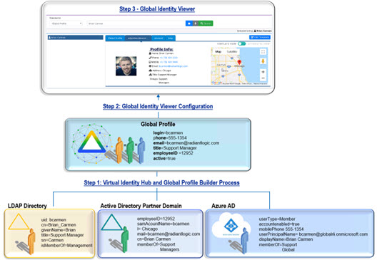
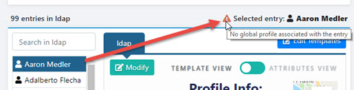

# Introduction

Many large enterprises have multiple Active Directory forests and LDAP directories. As the number of directories continues to grow, and expands to cloud directories (e.g. Azure AD, Okta), getting a global view of identities and groups can be a huge challenge. In addition to the number of disparate directories, often containing overlapping user accounts that must be properly linked, directory vendors have variations in the how groups are managed. Some LDAP directory servers support dynamic groups. For dynamic groups, the membership is determined by search criteria using an LDAP URL as opposed to being maintained explicitly in a list. For example, suppose that you want a Sales group to contain every employee that has a title of Sales Manager. To do this, you create a dynamic group named Sales associated with the groupOfURLs objectclass. Then, instead of statically assigning member DNs as unique members (in the member or uniqueMember attribute), you define a memberURL attribute that contains the LDAP URL and criteria (search base, scope and filter) to be used for determining members of the group. Dynamic groups offer flexibility and less administration. However, it also becomes difficult to quickly get a list of members without issuing an additional query based on the memberURL criteria for each group. In Active Directory, group nesting, where a group can be a member of another group, is a way to simplify the aintenance of groups. This also offers flexibility and less administration but can be more cumbersome to quickly assess who is a member of which group(s).

RadiantOne aggregates and links overlapping identities and addresses the complex challenges of determining group membership. It can evaluate LDAP dynamic groups and flatten nested groups to provide an accurate list of group members. RadiantOne also includes a web-based application named the Global Identity Viewer that administrators can use to search across disparate data sources for all identities and groups. This tool is for searching/auditing identities and groups. This guide describes the Global Identity Viewer application. A high-level diagram of the configuration process is depicted below.

>[!warning] 
>For assistance on using RadiantOne to integrate identities from disparate data sources, see the RadiantOne Global Identity Builder guide.

Figure  1 : High Level Process

The Global Identity Viewer facilitates searching for identities and/or groups across all data sources that have been integrated in the Global Identity Builder project. When a query returns an identity, a list of tabs display for the selected user based on how many identity sources the user has an account in. If the identity was found in the global profile list, the attributes corresponding to this account display on the Global Profile tab. This tab can contain attribute(s) that have been joined across all accounts that have been linked to a single identity.

>[!note] 
>If a user does not have an identity in the global profile, a appears next to their displayname above the Profile Info pane.

The names of the other tabs indicate the identity source “friendly name” as configured in the Global Identity Builder project. When a tab is selected, the identity attributes and groups membership associated with the user’s account in that particular identity source are displayed. In the diagram shown in Figure 1.1 above, a user identified as Brian Carmen has an account in the RadiantOne global profile store, and accounts in identity sources named adpartnerdomain, ldap, and azuread. The example shows the adpartnerdomain tab selected and Brian’s attributes from that particular data source returned. The display on each tab is based on a default [template](03-global-identity-viewer.md#auto-generate-templates) and can be customized. For more details on using the Global Identity Viewer, see [Chapter 3](03-global-identity-viewer.md).

This guide is broken into three sections.

- [Chapter 1](01-introduction.md) introduces the use case for creating a global reference list of users and
groups and the value of the Global Identity Viewer application.
- [Chapter 2](02-configuration.md) describes the configuration.
- [Chapter 3](03-global-identity-viewer.md) describes the Global Identity Viewer web-based interface that can be used to search for groups and users.
