# Chapter 3: Global Identity Viewer

After the configuration outlined in Chapter 2 is completed, the Global Identity Viewer can be used. Any user that is a member of RadiantOne Directory Administrator, Global ID Viewer Design, Global ID Viewer Write or Read Only roles can log into the Global Identity Viewer Console and access the Global Identity Viewer. For details on the RadiantOne delegated admin roles, see the RadiantOne System Administration Guide.

<!--

## Logging in with Two-factor Authentication

The Global Identity Viewer, as a client to the RadiantOne service, supports two-factor authentication for logging in. This is supported through the Custom Authentication Provider framework and supports RSA SecurID and Yubikey token codes by default. High-level configuration steps to support two-factor authentication are outlined below. For details on Custom Authentication Providers, see the RadiantOne Custom Authentication Providers Guide.

>[!warning] 
>Two-factor authentication is not required for the RadiantOne super user account (e.g. cn=directory manager).

1. Create a custom data source that defines the connection the web service for token code validation.
2. Configure a Custom Authentication Provider (Settings > Interception > Custom Authentication Provider) that indicates the base DN where accounts that will be logging into the Global Identity Viewer are located (e.g. cn=config), reference to the custom data source created in step 1, and other necessary parsing criteria.

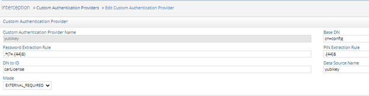

Figure 3.1: Custom Authentication Provider Example

-->

3. Ensure the users of the Global Identity View have an attribute that contains their unique token ID. In the example shown above, the token ID is set in the carLicense attribute.
4. Restart the RadiantOne service and Jetty that hosts the Global Identity Viewer application. If a cluster is deployed, restart them on all nodes.


Figure 3.2 : Token ID Defined for an Administrator Example

To access the Global Identity Viewer, navigate in a web browser as follows.

`<ENDPOINT FOR ACCESSING GLOBAL IDENTITY VIEWER>`

Enter your credentials and click Login.

If you have more than one Global Identity Builder project, a drop-down list appears for you to
select the one to use. Otherwise, you are shown the main search page.

## Browsing Identities

By default, the first 100 entries from the global profile are returned. Click on one entry and the profile of the identity is displayed on the Global Profile tab. Additional tabs are displayed to represent each underlying data source the identity is found in. The names of the additional tabs correspond to the names of the identity sources defined in the Global Identity Builder project.

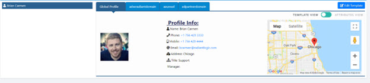

Figure 3.3 : Example Global Profile Identity

Select a tab to view the identity’s attributes and group membership contained in that particular source. In the example below, the user Brian Carmen’s account in the Active Directory Partner Domain (identified as identity source adpartnerdomain) is displayed. Specific attributes are displayed based on the template associated with the data source. This particular template returns the names of the groups Brian is a member of as the Roles attribute (e.g. Support and Managers).

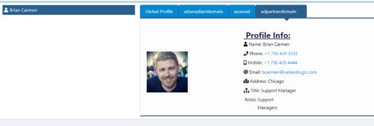

Figure 3.4 : Example of Viewing an Account in a Specific Identity Source

## Templates

The default templates display entries/attributes from data sources based on the mappings
described in the table below.

| Object Class | Displayed Attribute | Mapped Attribute(s) | 
|------------|------------|--------| 
User | Name | cn
| | Photo | jpegphoto
| | Phone | homephone
| | Email | mail
| | Mobile | mobile
| | Manager | manager
| | Title | title
| | City | l
Group | Name | cn
| | Manager | managedBy
| | Description | Description
| | Members | Member

If the data in a virtual view does not match the object classes listed in the table above, a general
template is used to display the attributes in a basic table format using the exact source attribute
name(s) and value(s). An example is shown below.

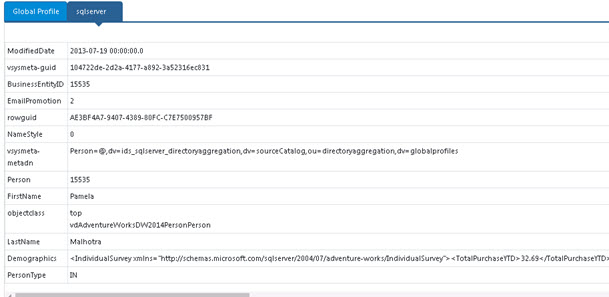

Figure 3. 6 : Default Generic Template

If a template has been [customized](#editing-templates) in the Global Identity Viewer, it is saved and used for
displaying results for subsequent queries.

### Template Access Requirements

The Editor View page currently contains two template types. To access these templates, users require the following:

- Sufficient access permissions (see the [Define Access Permissions](02-configuration.md#define-access-permissions) section for more information).
- Belong to the Global ID Viewer Design group (cn=Global ID Viewer Design,ou=globalgroups,cn=config) or any group in the RadiantOne namespace that has vdPrivilege= globalidviewer-designer)

These templates, available in a dropdown menu on the Editor View page, are described below.

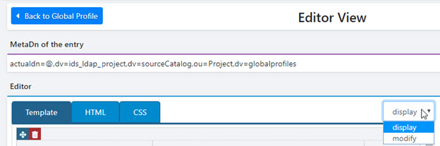

Figure 3. 7 : The Editor View Page’s Template Drop - down Menu

### Display Templates

Display templates are available for the global profile tab as well as the data source tabs. These templates control the appearance and arrangement of the content in the Profile Info section of the Global Identity Viewer. Display templates are generated automatically based on the object class in the view definition. If there is an existing display template for the object class, the Global Identity Viewer renders that template. If there is no template, the Global Identity Viewer generates a default display template based on the object class of the entry.

For information on how to edit a display template, see the [Editing Display Templates](#editing-display-templates) section.

### Modify Templates

Like display templates, modify templates allow you to control the appearance and arrangement of the content in the Profile Info section of the Global Identity Viewer. However, modify templates also allow users to update profile attribute values in the Global Identity Viewer. These changes are propagated to the backend data source. Modify Templates are available on data source tabs only; attribute values cannot be edited from the Global Profile tab. In order to update attribute values, the logged in user must belong to the Global ID Viewer Write group, or any group in FID that has vdPrivilege=globalidviewer-write and have write permissions assigned in [RadiantOne ACL’s on the identity source virtual view](02-configuration.md#define-access-permissions).

>[!note] 
>If a source attribute is mapped to the global profile, and the persistent cache refresh is running, a modification to a source attribute in the Global Identity Viewer, should also be reflected on the Global Profile tab for the entry.

To make attribute values editable, a modify template must first be defined for the data source. A user that belongs to the Global ID Viewer Design group (or any group in the RadiantOne namespace that has vdPrivilege=globalidviewer-designer) must define a Modify Template for the identity source. Once a template is defined, attribute values can be modified only in Template View (attribute values are read-only in Attributes View).

>[!note] 
>Some attributes are read-only, even if a modify template is defined. These read-only attributes include binary attributes (e.g. photo and userpassword) and attributes that are the result of a computation or lookup (e.g. group members, manager, and owner).

For more information on how to edit a modify template, see the [Editing Modify Templates](#editing-modify-templates)
section.

### Editing Templates

The templates used for displaying entries can be edited. If a [default template](#templates) is provided, and changes are made, a copy of the default template is saved and associated with the underlying virtual view and the default template remains untouched.

While viewing the results of a selected entry, click Edit Templates. This displays the template currently in use. A template can be comprised of different elements such as components, columns and separators. To use an element, drag it from the toolbox on the right to the template area on the left. The components are outlined in the table below.

| Component | Description |  
|------------|------------| 
 | Label <br> 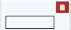 <br> Labels allow you to indicate a human-friendly display name and corresponding source attribute mapping.
 | Image <br> 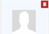 <br> Images allow you to indicate a picture/photo should be shown in the template.
 | Map <br> 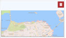 <br>  Maps allow you to display the location of an entry on a map. The Google maps API is used.

#### Editing Display Templates

To edit a display template:

1. Select a global profile project from the drop-down menu and click Confirm.

>[!note] 
>If you have only one global profile project, skip this step.

2. Select a Global Profile entry from the table on the left.

3. Click the Edit Templates button. The Editor View is displayed.

>[!note] 
>See the Templates section for information on requirements for template access.

4. From the drop-down menu, select display.
5. Make changes to the template as required.
6. If you modify label options, click Save Options.

>[!note] 
>If you do not make label option changes, skip this step.

7. Click Save.
8. Click Back to Global Profile. Changes to the Profile Info section are displayed.

#### Editing Modify Templates

To edit a modify template and allow attribute values to be updated in the Global Identity Viewer:

1. Select a global profile project from the drop-down menu and click Confirm.

>[!note] 
>If you have only one global profile project, skip this step.

2. Select a data source tab.

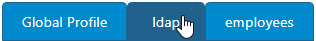

Figure 3.8 : Selecting a Data Source Tab

3. Click the Edit Templates button. The Editor View is displayed.

>[!note] 
>See the [Templates](#templates) section for information on requirements for template access.

1. From the drop-down menu, select modify.
2. Click the attribute that you want to make editable.
3. In the Label Options section on the right, check the Editable check box.
4. Click Save Options.

>[!note] 
>If you do not make label option changes, skip this step.

8. Click Save.
9. Click Back to Global Profile.
10. Verify that the data source tab selected in step 2 above is selected.
11. Select an entry.
12. Verify that Template View is selected.
13. Click the Modify button in the upper-left corner of the Profile Info pane. The attribute value     fields in the Profile Info section become editable.

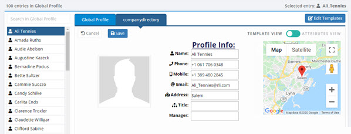

Figure 3. 9 : Editing Profile Attributes

14. Make your changes and click Save.

#### Labels

Adding Labels

To add a label, drag the **Label** component into the template area on the left.

Editing Labels

To edit a label:

1. Click the label to be edited.
2. In the Text (optional) field, define a friendy display name to show on the template in the text     field.
3. Select the source attribute from the drop-down list. The value of the source attribute displays     next to the wording specified in the text field.
4. If the source attribute contains multiple values, check the Multi Values checkbox.
5. If the source attribute (e.g. uniqueMember, member , manager, owner...etc.) contains a virtual DN that can be used in a lookup operation against RadiantOne FID to return a friendly shortname (RDN) value instead of the full DN, check the Lookup values checkbox.
6. (Optional) Enter or select the following properties related to the text value configured in step 2 above.
    <br> Font Size
    <br> Font Color
    <br> Font Style (bold, italic, underlined)
    <br> Font Position (left, middle, right)

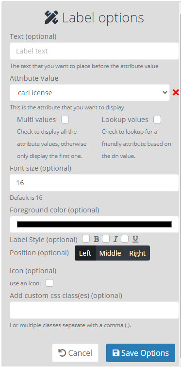

Figure 3. 10 : Label Settings

>[!note] 
>The Editable checkbox is available only for Modify Templates. For more information on Modify Templates, see the Modify Templates section.

7. (Optional) Under Icon, check the “use an icon” box to display an icon next to the attribute label on the template.
8. Click the box below the “use an icon” checkbox.
9. Click an icon or, to search for an icon, enter text in the Choose an Icon field.

>[!note] 
>To select another icon, click the box below the “use an icon” box and delete the descriptive text above the selected icon.

10. In the Add custom CSS class(es) (optional) field, specify the custom class(es) you want applied to the label in a comma-separated list.
    
    >[!note] 
    >If you specify custom CSS classes here, you must also define the style for that class on the CSS tab.
11. Click Save Options.
12. Click Save.

Removing Labels

To remove a label, click the Delete button next to the label component on the template and then click Yes to confirm the deletion. Or, to hide the label in the template view while keeping the component in place within the template, click on the label component and click the red X to the right of the Attribute Value field.

#### Images

##### Adding Images

To add an image, select the Image component into the template area on the left.

##### Editing Images

To edit the image settings:

1. Click the image component in the template area.
2. Select the source attribute that contains the image from the drop-down list.
3. (Optional) Select the position of the image (left, middle, right).

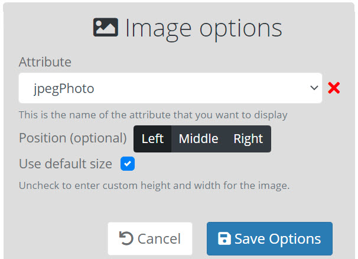

Figure 3.11 : Image Settings

4. (Optional) To specify custom dimensions for the image, uncheck the Use Default Size box
    and enter the image dimensions (in pixels) in the Height and Width fields. If “Use Default
    Size” is checked, the Global Identity Viewer resizes the image automatically. If “Use Default
    Size” is unchecked, larger images may be truncated. In either case, browser window size
    and screen resolution factor into how images display.

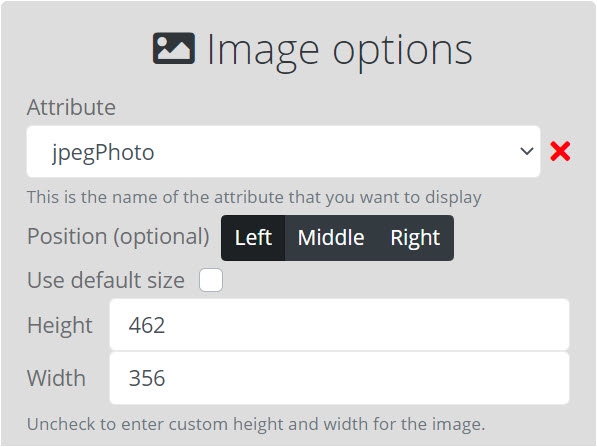

Figure 3. 12 : Specifying Custom Image Dimensions

5. Click Save Options.
6. Click Save.

##### Removing Images

To remove an image, click the **Delete** next to the image component on the template and then click Yes to confirm the deletion. Or, to hide the image in the template view while keeping the component in place within the template, click on the image component click the red X to the right of the Attribute Value field.

#### Maps

Adding Maps

To add a map, select the Map component and drag it into the template area on the left.

Editing Maps

>[!note] 
>The Google API is used for displaying locations on maps. To use the Google application key associated with your own Google account, log into the RadiantOne Main Control Panel with an admin account and go to the Directory Browser tab. Navigate to `<Name of your Global Identity Builder project suffix>`,ou=webapps,ou=globalsettings,cn=config. Modify the googleApiKey attribute and enter the Application Key associated with your Google account.

To edit the map settings:

1. Click the map icon in the template area.
2. Select the source attribute that contains the location that can be pinpointed on the map (e.g. l).

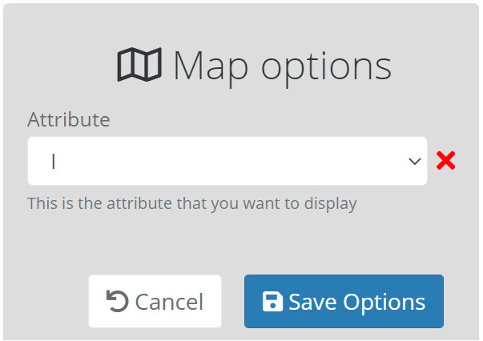

Figure 3.13 : Map Settings

3. Click Save Options.
4. Click Save.

##### Removing Maps

To remove a table, click **Delete** next to the map component on the template and then click Yes to confirm the deletion. Or, to hide the map in the template view while keeping its component in place within the template, click on the map component and click the red X to the right of the Attribute Value field.

#### Columns

Columns allow you to create different sections to display content. The options are 1, 2 or 3 columns. The example template shown below has 3 columns. The first column contains an image. The second column contains a list of labels for displaying attributes. The third column contains a map.

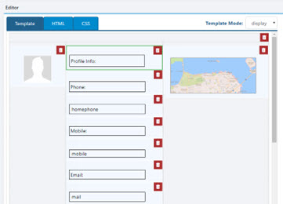

Figure 3.14: Example Template with 3 Columns

#### Separators

Separators allow you to distinguish between different sections in the template. You can use a separation of one line or two lines.

### Clearing Templates

To remove all components and settings from a template, click Clear.

### Deleting Templates

To delete a template, click **Delete** . This option deletes both the display template and modify template for the selected source and object class. For more information on templates, see the [Templates](#templates) section.

If an entry isn’t associated with a custom template, a default template is used.

### Auto Generate Templates

To create a default template that contains every attribute found in the source schema, click the Auto Generate button. This button is displayed only when the existing template has been cleared.

## Searching Identities and Groups

Searches performed in the Global Identity Viewer are performed against the data source
selected in the drop-down list. All searches can be saved, modified, or deleted.

>[!note] 
>The logged in user must be associated with a role that has either the globalidviewer-write or globalidviewer-designer privilege in order to save, modify or delete search queries.

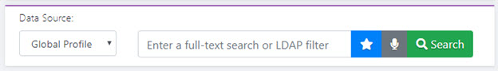

Figure 3. 15 : Search Option

The search results page displays the results from the query in a list on the left side. The result
can be either identities and/or groups that match the search criteria. When searching against
the global profile data source, only identities are returned in the search result. Groups are not
stored in the global profile list. To search for groups, select a data source from the drop-down
list that contains the group entries. An example of searching for groups is shown below. The
Description contains information about what the members of the group are authorized to do.
The Managed By contains the identity of the person responsible for the group. The Members
contains a list of names of users that belong to the group. This information is displayed based
on the default template associated with the group object class.

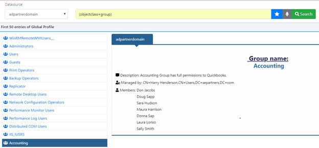

Figure 3. 16 : Search Results

To limit the number of profiles returned in your search:

1. Click the **Gear** button.
2. Enter a value in the Size Limit field.
3. Click **Save**.
4. Click Search.

### Basic Queries

A basic query allows either an LDAP filter (using the correct LDAP filter syntax) or full-text
search.

To define a new basic query:

1. Click the **Star** button. The window displays a list of saved queries and allows for creating new queries and editing existing queries.
2. Click the New button next to “basic queries”.

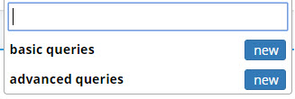

Figure 3. 17 : Saved Queries

3. Enter a name for the query.

>[!note] 
>It is recommended that query name indicate the parameters of the search (e.g. users located in Dallas in the AD Partner Domain).

4. Enter a query filter. This can be either an LDAP filter, or enter any value to invoke a full-text search.

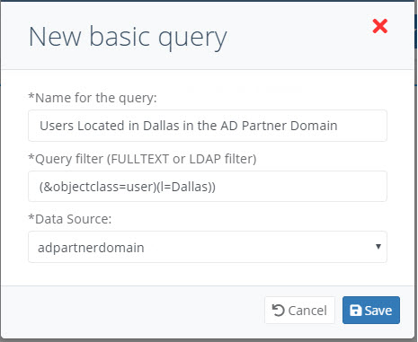

Figure 3. 18 : Basic Query Editor

5. Click Save.

#### Full-text

Full-text search parameters are entered in the field on the main Global Identity Viewer page. A
query leveraging the RadiantOne Full-text functionality can be entered in different ways. If a
single word is entered (e.g. novato) there is a search across all entries/attributes and entries
that have an attribute that contains the word are returned.

In the following example, the request contains the following full-text value: novato

The selected entry contains the value Novato in the Address attribute.

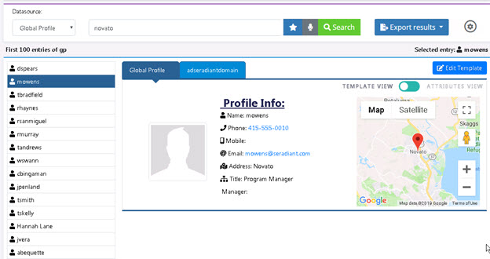

Figure 3. 19 : Example Search Results of a Full-text Search

If two words are entered (e.g. Seattle Accounting) a search across all entries finds those that have attributes containing the words (at least one attribute that contains the word Seattle and one that contains the word Accounting). If you want to search for an entry that has a single attribute that contains both words, you must enter the value surrounded by double quotes (e.g. “Seattle Accounting”). This search would return entries that contain a single attribute that has the exact value of Seattle Accounting.

>[!warning] 
>Searches span across all user attributes from the underlying data source. This can be confusing because the template to display the results might not contain all attributes used in the search.

In the following image, the following full-text is performed.

```
Seattle accounting
```

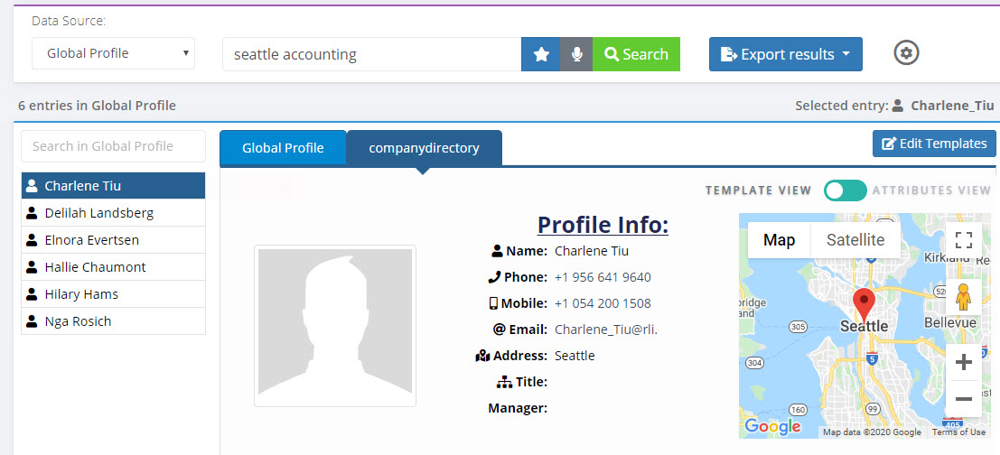

Figure 3.20: Example Search Results of a Full-text Search

The entries returned, like Charlene Tiu shown above, have attributes that contain “seattle” and attributes that have “accounting”. However, because the display template does not show the ou attribute (which contained a value of accounting in this example), it is impossible to know what underlying attribute matched the search.

#### LDAP Filter

LDAP Filter searches allow the user to type the search request (using LDAP filter syntax) in the search field, and the application executes the LDAP search against the selected data source. LDAP filter search request is entered in the “Enter a full-text search or LDAP filter” field on the search page. Saved LDAP filter searches are located under basic queries in the saved queries drop-down menu accessible by clicking the **Star** button. For instructions on defining an LDAP filter-based search, see [Defining a Basic Query](#advanced-queries).

In the following example, the Global Identity Viewer search option receives a request containing an LDAP filter as follows:

```
(&(objectclass=inetorgperson)(employeetype=intern))
```

All entries where objectclass=inetorgperson and employeetype=intern are returned.

>[!warning] 
>Searches span across all user attributes from the underlying directory. This can be confusing because the template to display the results might not contain all attributes used in the search.

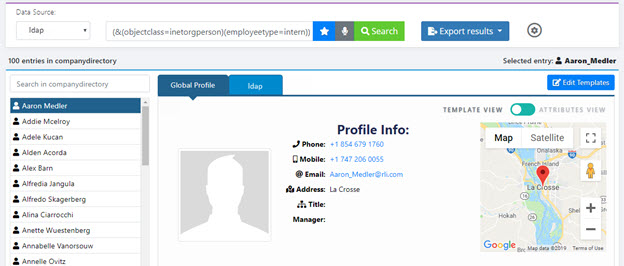

Figure 3.21: Example Search Results

### Advanced Queries

This option allows the user to build an LDAP query with parameters or static values. Saved queries are located under advanced queries in the favorites menu which can be accessed by clicking the **Star** button.

To define an advanced query:

1. Click.
2. Click the New button next to “advanced queries”.

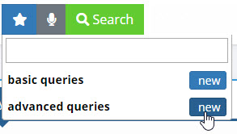

Figure 3.22: Configuring Advanced Queries

3. The Advanced Query Builder displays.

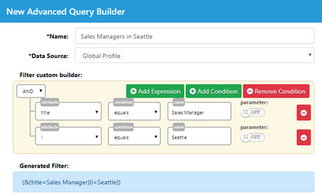

Figure 3.23: Advanced Query Builder

4. Enter a name for the query.

>[!note] 
>It is recommended that query name indicate the parameters of the search (e.g. Groups located in Dallas).

5. Select the data source the query is applicable to. This can be the global profile list, or any identity source configured in the Global Identity Builder project.
6. Select an attribute from the attribute drop-down menu.
7. Select a condition.
8. Select a parameter mode. The **Parameter Off** option does not allow modification of the search parameter value. To allow modifications to this query click **Parameter Off**. The search parameter toggles to **Parameter On**. This option allows user input, making it useful, for example, when you want to perform a series of searches, each with a slight modification.
9. (conditional) If parameter is off, enter a value for the attribute to condition the search.
10. (conditional) If parameter is on, enter a display name for the attribute that will be requested.
11. (optional) You can add or remove expressions and conditions. Each condition is a set of one or more expressions. To remove an expression, click the  button next to the expression.

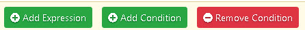

Figure 3. 24 : Adding Expressions and Conditions

12. The LDAP filter generated from the conditions is displayed at the bottom of the window. As you add expressions/conditions, a preview of the query results is shown on the right.

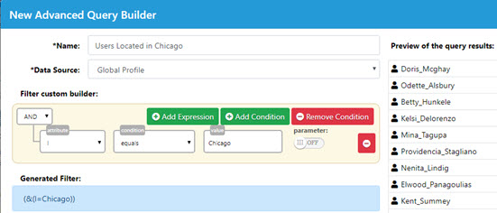

Figure 3. 25 : Advanced Query Builder

13. Click Save.

### Editing a Saved Query

To edit a saved query:

>[!note] 
>Saved queries are associated with a data source. Only queries associated with the selected data source are shown when you click.

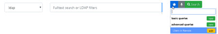

Figure 3. 26 : Saved Queries

1. Click the **Star** button.
2. Click the Edit button next to the query you want to edit.

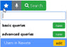

Figure 3. 27 : Editing a Saved Query

3. Edit the filter.
4. Click the Save button. To delete a query, click Edit, click Delete, and then click Yes to confirm the deletion.

### Voice to Text Queries

To speak a query, click the **Microphone** button on the search page. Voice commands must begin with by speaking the word “find”. When you begin a voice command with “find”, the search parameter field populates with what is spoken after the word “find”.

>[!note] 
>Verify that your microphone is enabled for use in your internet browser.

>**Activating the voice-to-text function in the Global Identity Viewer requires accessing the Identity Management Console over HTTPS.**

For example, the following spoken-word search performed.

```
“find 728”
```

The search returns entries that contain the value 728 as shown in the following image (e.g.
phone attribute).

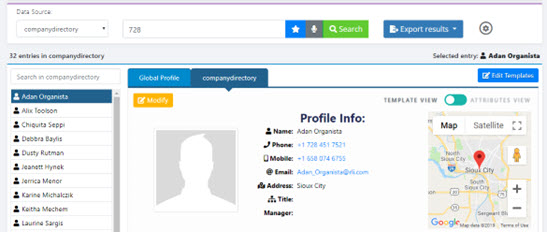

Figure 3. 28 : Example Result of Voice Search Query

To stop voice command detection in the Global Identity Viewer, say, “stop”.

### Saving Query Results

Global Identity Viewer search results can be exported in two ways. These options are described in this section.

#### Export Results

Global Identity Viewer search results can be exported to a PDF, CSV, or JSON file using the Export Results option.

To generate a report containing Global Identity Viewer search results:

1. (optional) Click the Export Settings button (). The Export Settings window displays.
2. (optional) To limit the number of entries in the search results and the exported report, enter a value in the Size Limit field. A change to the size limit requires clicking Search, in order to take effect.
3. (optional) To specify which attributes you want returned in your search, type an attribute name. Press enter after each attribute name. When the attribute name is surrounded by gray shading, this indicates that the attribute has been selected as an attribute to be returned in the report. In the following example, the attributes ou, employeetype, and have been selected to be returned in search results. When you’re finished entering return attributes, click Save.

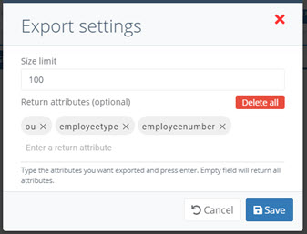

Figure 3.29: Search Settings

4. From the Export Results drop-down menu, select a file format. File type options include CSV, PDF, and JSON. The exported file is saved to the Downloads folder.
5. Navigate in the file system to the Downloads folder.


6. Open the exported file.

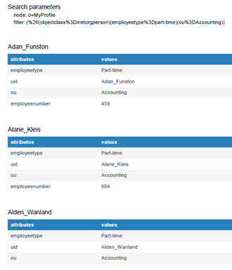

Figure 3.30: Example of Exported Entries

<!--

#### Command Line Utility

Global Identity Viewer search results can be exported to a JSON formatted file using the global_id_viewer.bat (.sh on UNIX platforms) command line utility located at <RLI_HOME>/bin/advanced.

#### Usage

`global_id_viewer.bat [-g <project name>] [-q <query name>] [-p <parameter>] [-f <file name>]`

## Command Arguments

- g `<project name>`

    [required] The name of the global identity project.

- q `<query name>`

    [required] The name of the query to be executed.

- p `<parameter>`

    The parameter name and value. The parameter name and its value are separated in this argument by a colon. If multiple parameters are used, separate them with a space.

```
<parametername>:<parametervalue>

<parametername>:<parametervalue><space><parametername>:<parametervalue>
```

If your advanced query has a “parameter display name” defined, use this for the <parametername> instead of the attribute name.

```
“Enter City”:”San Francisco” “Enter Title”:Sales
```

>[!note] 
>This argument is for advanced queries where the Parameter option is enabled. Refer to the Advanced Queries section for more information.

- f `<file name>`

    [required] The output file name. The format of the output data is JSON.

>[!note] 
>In addition to the file name, the file’s location can also be specified. If the location is not specified, the output file is saved in <RLI_HOME>\bin\advanced.

## Example

In the following example, a search is made for users located in Laredo and the results are saved
into test.json.

```
global_id_viewer.bat -g myprofile -q Usersbylocation -p l:laredo -f c:/radiantone/test.json
```

>[!note] 
>If your query name contains spaces, surround the -q value with double-quotes. If your query has more than one parameterized attribute/expression, separate each param with a `<space>` in the -p property. If any parameter value contains `<spaces>`, surround the value with double-quotes. An example is shown below.

```
global_id_viewer.bat -g globalprofile -q "Managers per location" - p title:”sales manager" l:London -f c:/radiantone/salesInLondon.json
```
--> 

## Configure Reports

Global Identity Viewer query results can be scheduled to be periodically exported to a PDF, CSV, and JSON file using the Configure Reports option. This option requires at least one query to be set up prior to use. Reports can be generated on a periodic basis, and can be auto-distributed via email.

>[!note] 
>Reports generated using the Configure Reports option are not affected by Export Settings.

To configure a report:

1. From the Global Profile View page, click the Configure Reports button. The Reports window displays.

>[!note] 
>If you have already created reports, they are displayed here.**

2. Click the New Report button. Step 1 of the Report Wizard displays.
3. Enter a unique name for the report. The report file names are derived from this name. For example, a report named Users in Dayton would generate a report named users_in_dayton.pdf/csv/json.
   
    >[!note] 
    >It is recommended that the report name indicate the report parameters (query, return attributes, frequency, etc.).
4. (optional) Describe the report. This description is displayed in the generated report.

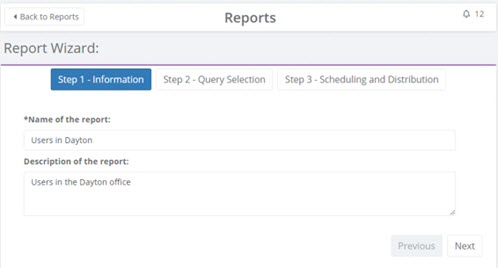

Figure 3.31: Step 1 of Report Wizard

5. Click Next. Step 2 – Query Selection is displayed.
6. Select a saved query from the list of saved queries drop-down menu.

>[!note] 
>If you need to create a query for a report, see [Basic Queries](#basic-queries) and [Advanced Queries](#advanced-queries).

7. To specify which attributes you want in your report, select an attribute from the Available Attributes table on the left and click the **Right Arrow** button. Attributes displayed in the Report Attributes table on the right are included in the report. You can select multiple attributes at once. To add all attributes to the report, click the **Double right-arrow** button. In the following example, the attributes cn, employeeNumber, l, mail, o, and ou are included in the report.

>[!note] 
>To remove an attribute from the report, select an attribute from the table on the right and click the Left arrow button. To remove all attributes from the report, click the Double left-arrow button.

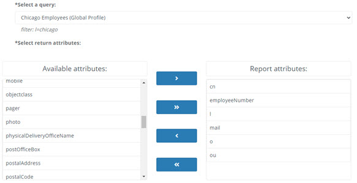

Figure 3.32: Step 2 - Query Selection and Returned Attributes

8. Click Next.
9. Select a frequency for the report. This indicates how often you want to generate the report.
10. Select one or more report formats.
11. Enter one or more email addresses for the generated report to be emailed to. The field offers autocompletion of email addresses contained in the global profile view.
    
    >[!note] 
    >Emailing reports to addresses specified here requires configuring RadiantOne FID Email Alerts (Main Control Panel > Settings > Monitoring > Email Alerts Settings). Refer to the RadiantOne System Administration Guide for more information.
12. (optional) To immediately generate a view of the configured report(s), click the Preview Report button.
13. Click the Finish button.

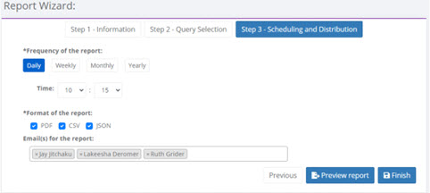

Figure 3.33: Step 3 – Scheduling and Distribution

14. You are returned to the Reports page.

>[!note] 
>Shortly after creation, reports are  scheduled.

## The Reports Page

Reports that have been configured are displayed here. This page displays report creation dates, report status (scheduled, not scheduled, or finished), and which administrator created them. This page allows you to edit or delete existing reports, search for existing reports, create a new report, schedule a report, and stop a scheduled report.

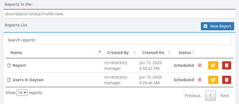

Figure 3.34: The Reports Page

Editing Existing Reports

To edit an existing report:

1. From the Reports page, click the  button. Step 1 of the Reports Wizard displays.
2. Make changes to the report as needed. Because all required parameters are already configured, you can advance or backtrack to any step in the Report Wizard by clicking the “Step...” buttons.
3. When you have finished configuring the report, click Finish.

**Report Scheduling**

The Status column displays one of the following values: Scheduled, Not scheduled, and Finished. Reports can be scheduled or stopped from the Reports page. To stop a scheduled report, click the  button in the Status column. To start a report that is not scheduled, click the  button.

To schedule a report that has finished, click the  button. Advance to Step 3 – Scheduling and Distribution. Specify a report frequency and click **Finish**.

**Deleting Reports**

To delete an existing report, click the report’s  button. Click Yes to confirm the deletion.

Searching for a Report

To search for a saved report, type any part of the report name in the Search Reports field. Reports matching your search parameters are displayed below the Search Reports field.

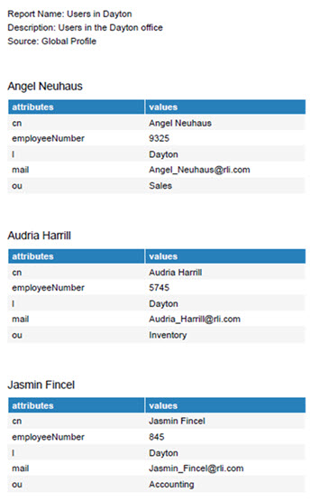

Figure 3.35: Example Report
