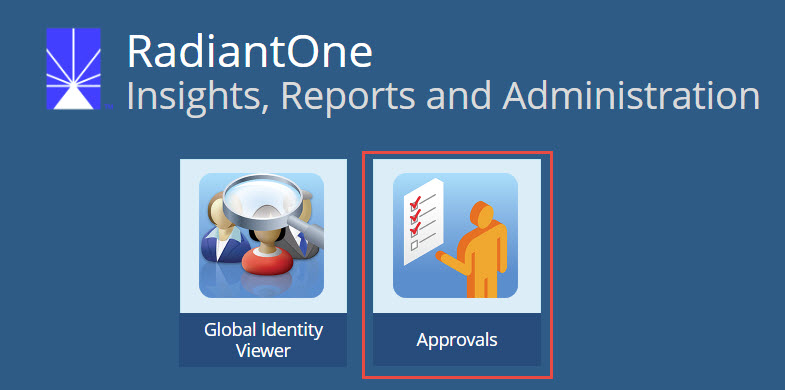

# Approvals

For synchronization pipelines that use rules-based transformation, you can configure source events to require an extra manual approval step prior to the change being sent to target systems. The “Require Approval” option is used for this purpose and dictates that certain events must be approved by a specified set of users before they are applied to target systems. When a change associated with a rule that requires approval is detected in a source, the instance is published into the approvals queue and awaits action. All users that are required to act on the event, must be assigned to the *Approvers* role and use the Approvals application to act on the event before it expires. If the change is approved, it is processed, removed from the queue and published to the target(s). If it is rejected, the change is aborted and the message is deleted from the queue. A high-level diagram of the process is shown below.

>[!note] 
>The approval queue is automatically created as needed.

## Approvers

Any user located in the RadiantOne virtual namespace that is a member of the *Approvers* group can be an approver. In the following example, the ICS Admin user is made an approver.  
To manage the Approvers group: 
1.	In the Main Control Panel, go to the **Directory Browser** tab.  
1.	Expand cn=config,ou=globalgroups. 
1.	Select cn=approvers. 
1.	Click the **Manage Group** button. The Manage Group window displays. 
1.	Click the **Add Member(s)** button.  
1.	Click the **Expand Tree** button. The RadiantOne namespace displays on the right. 
1.	In the namespace, navigate to the location of the user that you want to approve events. In this example, the location cn=config,ou=globalusers is selected.  
1.	Click the **Find Now** button.  
1.	Select the entry you want to approve events and click the **Move selected entry down** button. In this example, uid=icsadmin,ou=globalusers,cn=config is selected.  
1.	Click the **Confirm** button. The member is displayed in the cn=approvers group.  
1.	Click **Confirm** again to commit the change. 

>[!warning]
>If you want the approver to receive an email alert when they have pending approvals, the user account must have a valid email address (mail attribute).

## Email Notifications

To enable email alerts for approvers, SMTP must be configured. 
1. Navigate to the RadiantOne Main Control Panel > Settings tab > Monitoring > Email Alerts Settings.
2. Enter your SMTP settings (host, port, user, password, from email and to email) in the Email Alerts (SMTP Settings) section.
3. Click **Save**.
4. If you would like to test your settings, click **Send Test Email**. 

>[!note]
>For security and audit purposes, it is not advised to connect to your mail server anonymously (leaving user and password >properties blank in the Email Alert Settings). 

## Insights, Reports and Administration Portal

The RadiantOne Insights, Reports and Administration portal is designed for power users and administrators that are in charge of identity management tasks such as approving synchronization events (e.g. creation of new accounts in target systems) or auditing group memberships.

To access the portal, navigate in a web browser as follows (replacing *radiantoneserver* with your actual server name) and enter your login credentials.   
http://radiantoneserver:7070/portal/login 
>[!note] 
>You can access the portal on any RadiantOne cluster node. User to DN mapping must be properly configured so that the approver can login with their user ID and not require their full DN.

The applications currently available in this portal are *Approvals* and *Global Identity Viewer*. A brief description of each application is provided below. 

### Performing Approvals 
When a change associated with a rule that requires approval is detected in a source, the instance is published into the approvals queue and awaits action. Approvers use the Approvals application to accept or reject events.

Approvers log into the Insights, Reports and Administration Portal and click the Approvals icon.

The pending events assigned to the approver are displayed.

The user must approve or reject the event. This can be done using the  to reject an event or the  to accept an event.  
Check boxes in the column on the far left can also be used. If you check the box in the column header, options include “Select Current Page”, “Select Everything”, “Unselect Current Page”, and “Unselect Everything”. Then select an option from the Select Bulk Action drop-down menu (*Approve All* or *Reject All*).

>[!note] 
>To fetch additional pending modifications, click the **Refresh** button.

After acting on all events, click **Submit Changes** and then **Yes** to confirm the updates. 

Approved events are processed by the sync engine and applied to the target.

#### Approval Audit Log
The actions taken by approvers is logged. Logging is enabled by default and the log file is: `<RLI_HOME>/logs/approvals_audit.log`

### Global Identity Viewer 
RadiantOne includes an easy-to-use, web-based application named the Global Identity Viewer that facilitates searching for identities and/or groups across all data sources that have been integrated in a Global Identity Builder project. When a query returns an identity, a list of tabs display for the selected user based on how many identity sources the user has an account in. If the identity is found in the global profile list, the attributes corresponding to this account display on the Global Profile tab. The names of the other tabs indicate the identity source’s “friendly name” as configured in the Global Identity Builder project. When a tab is selected, the identity attributes and group membership associated with the user’s account in that particular identity source are displayed. In the diagram below, a user identified as Brian Carmen has an account in the RadiantOne global profile store, and accounts in identity sources named adpartnerdomain, ldap, and azuread. The example shows the adpartnerdomain tab selected and Brian’s attributes from that particular data source returned. 
For more details on the Global Identity Viewer, see the [RadiantOne Global Identity Viewer Guide](/global-identity-viewer-guide/01-introduction).

