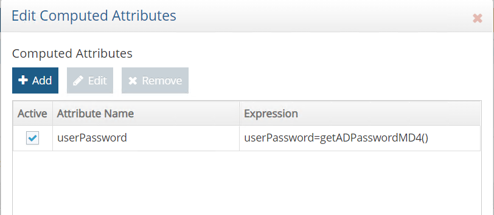

# Password synchronization

Synchronizing passwords can be challenging because of the many different encryption schemes used by data sources. If the data source and target support the same password encryption scheme, a simple attribute mapping from the source user password attribute to the target user password attribute should suffice. However, if the data source uses an encryption scheme that is not understood by the target data source, the only way to synchronize passwords would be to capture the password in clear text (or a reversible format) before the data source encrypts it. RadiantOne offers a password filter component that captures a password in clear text when it is created or reset, and publishes the password to other data sources that need this information. The password filter component is available for Active Directory only. If this is of interest, please contact <support@radiantlogic.com> for the password filter installer.

If the source of passwords is Active Directory, and the target is either Active Directory, Azure Active Directory or RadiantOne Universal Directory (or persistent cache), RadiantOne offers an alternative to the password filter. This method does not require a password filter to be installed in every Active Directory domain, and user passwords can be retrieved at any time as opposed to only during set/reset operations. This approach relies on a low-level replication mechanism which allows RadiantOne to retrieve the hashed value of the existing password from the source Active Directory. This hashed value can then be transformed into the format acceptable for targets including Active Directory, Azure Active Directory, and RadiantOne Universal Directory. To capture the hashed password from Active Directory, the virtual view of Active Directory needs a computed attribute named `userPassword` that is based on the function named `getADPasswordMD4()` if you want to sync the passwords to an Active Directory or RadiantOne Universal Directory target.

If you want to sync the passwords to Azure Active Directory or RadiantOne Universal Directory, use the function named `getADpassword()` in the virtual view from the source Active Directory. This function gets the password from Active Directory and hashes it to the PBKDF2AD format.

