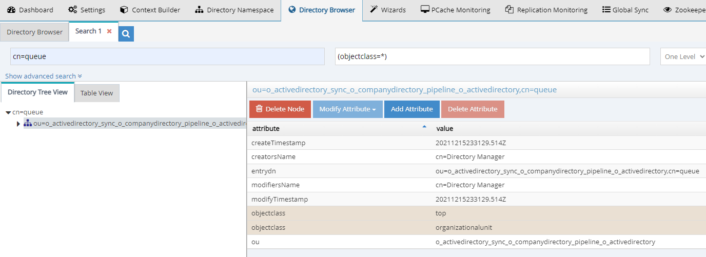
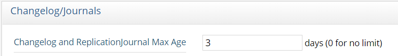

# Queues

RadiantOne Global Sync relies on queues for guaranteed delivery of messages. Queues are a special kind of store managed in the RadiantOne Universal Directory below the cn=queue and cn=dlqueue root naming contexts. Every synchronization pipeline has its own queue below the cn=queue and cn=dlqueue naming contexts identified by the pipelineID. Messages are added into the queues by the capture connectors and retrieved from the queues by the sync engine. Cn=queue and cn=dlqueue are hidden root naming contexts, so if you want to view them, you must search for them. The Main Control Panel -> Directory Browser tab can be used. An example is shown below.

Querying the Hidden cn=queue Naming Context

## Message Time-to-live

Messages remain in the queue until they are either picked up by the sync engine, or the message time-to-live has been reached (default of 3 days). Message time-to-live is configured in the "Changelog and Replicationjournal Max Age" property from the Main Control Panel -> Settings -> Logs -> Changelog.

Message Time-to-live Enforced by the Global Sync Queues
