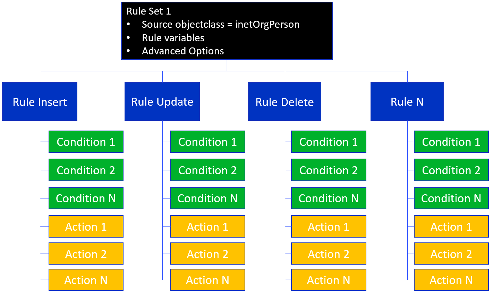
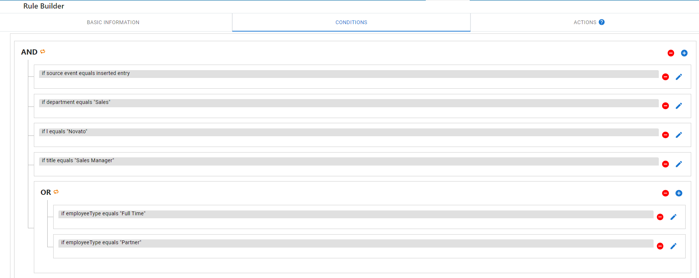
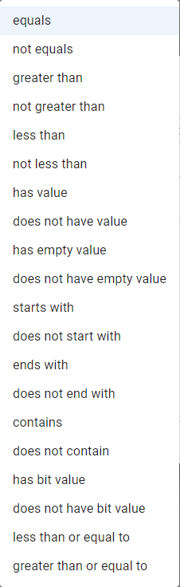
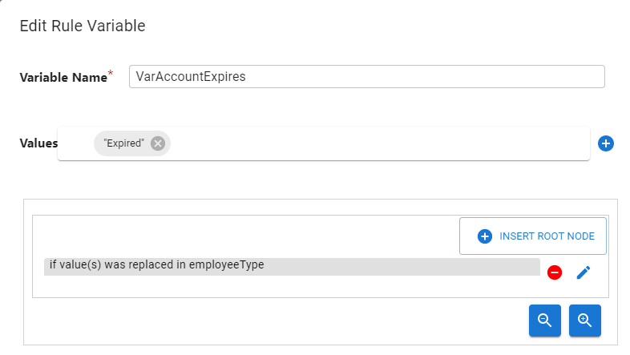
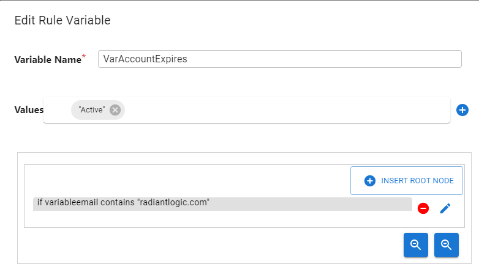

# Sync Engine and transformation

The Sync Engine processes the transformations and sends the changed entries to the destination.

A transformation describes how changes on source entries should be translated into entries for a destination. The transformation component can consist of rules, or attribute mappings and/or scripting to accommodate more complex logic. When both attribute mappings and a script are used, the attribute mappings are applied first. When rules are used, the attribute mappings and scripts options are not used. The table below provides some general guidance on choosing which option to use when configuring transformation.

|  | Attribute Mappings  (Low code/no code experience, minimum flexibility) | Script  (Max flexibility, but must know how to code in Java) | Rules  (Low code/no code experience, medium flexibility) |
|---|---|---|---|
| Source and target attribute (names) are the same and mappings are simple | :heavy_check_mark: |  |  |
| Lookups or other complex logic (conditions or actions) is required and you are comfortable with using java to code the entire logic |  | :heavy_check_mark: |  |
| Complex conditions or actions are required and you do not want to code in java |  |  | :heavy_check_mark: |

## Attribute mappings

Attribute mappings indicate how data should be transformed before propagating the event to the destination. This could involve a simple 1-to-1 mapping of a value, setting a constant value, or computing a new value. Each sync pipeline can be associated with one or more attribute mappings. Typically, each type of object (e.g. group, user) you are synchronizing has an Attribute Mapping associated with it.

Mappings are saved in JSON-formatted files located at: `{RLI_HOME}\vds_server\conf\sync\mappings\{TOPOLOGY_NAME}\{PIPELINE_NAME}\mappings.json`

See [Attribute mappings](../configuration/transformation/attribute-mappings.md) for configuration steps.

## Script

When attribute mappings are insufficient to achieve your business logic, you can use Java scripting (or [Rules](#rules-based-transformation)). This is helpful when lookups or other complex logic is required and the capabilities of the attribute mappings and rules options are insufficient. The Main Control Panel > Global Sync tab provides an interface for configuring the script (with some support for basic syntax checking). If you prefer a [full Java development environment](../configuration/script.md#use-a-java-ide-to-customize-scripts), you can install something like Eclipse and import the RadiantOne Custom Project.

See [Script](../configuration/script.md) for configuration steps.

## Rules-based Transformation

The Rules-based Transformation option offers a default event-based template that allows for configuring conditions and actions for determining synchronization logic. This offers more customized synchronization logic than simple attribute mappings without having to write code. If Rules are used, you do not define separate attribute mappings or scripts.

Rules are packaged as a set and are associated with a single source entry object type/class. You will create a rule set for every source object class that you want to detect changes on. A rule categorizes a set of conditions in a source system and the set of actions that must be taken in a target system if the conditions are met. For each rule, conditions and actions are defined. Many rules can be defined for a transformation and the default behavior is to evaluate all rules in the order in which they are defined.

See [Rules](../configuration/rules/overview.md) for configuration steps.

### Conditions

Rules consist of one or more conditions. A condition is an expression that involves a variable, an operator, and a value. Conditions are evaluated to determine if activity in the source should be propagated as action(s) to a target. If multiple conditions are defined, they are evaluated in order from top down. The main operator to apply to the entire set of conditions can be either an `AND` or an `OR`. Although you can have many nested conditions leveraging both `AND` or `OR` operations below the main operator. For example, the conditions shown in the screen below indicate a main `AND` operator even though the list of expressions involves nested `OR` conditions.

The example conditions shown above would be evaluated as follows.

If a new entry is inserted into the source system, and if the department for the new entry equals `"Sales"`, and if the `l` attribute value equals `"Novato"` and the title attribute for the new entry equals `"Sales Manager"` and if at least one of the expressions located below the `OR` branch evaluates to `true` (if employeeType for the new entry equals `"Full Time"` or `"Partner"`), then the actions defined for the rule are executed. If any conditions located in the `AND` branch evaluate to `false`, or if all conditions in the `OR` branch evaluate to `false`, then the actions are not executed.

When defining a condition, the expression can be evaluated based on many different operators. The possible operators are shown below.

### Variables

A variable can be defined to store a temporary value and used in a rule condition to apply a computation or more advanced logic. If you need to manipulate a source attribute, or calculate a value to use as part of your rule conditions, a variable should be defined. These variables are local to a single Rule Set of a given topology. A variable can be set to a constant value, be populated from another variable (local or source attribute), or be computed based on a function.

You can also configure one or more conditions that dictate the context in which the variable is populated with the configured value. If no conditions are defined, the local variable value is populated based on the configuration in the "Values" setting: constant value, the source attribute value, or the function. If conditions are required to determine how the variable is populated, they can be based on a Source Attribute, Source Event, Attribute Event, or Rule Variable. A brief description and example of each

- Source Attribute – a condition can be based on the value of a source attribute. Select a source attribute name (a list of attributes defined in the source schema is displayed for you to select from), enter a value of the attribute to condition the comparison, an operator (e.g. `equals`, `doesn't equal`, `is greater than`, etc.) and a comparison type (e.g. case-sensitive, ignore case, numeric, regular expression, or binary). The example Rule Variable below indicates that the variable named `VarAccountExpires` is set from the source attribute named `accountExpires` when the source attribute `employeeType` starts with a value of `"Temp"`.

- Source Event – a source event is defined as an update to an entry, inserting a new entry, deleting an entry or moving an entry (`modRDN` operation in an LDAP directory). The condition can be defined as either `equals` or `not equals`. An example condition would be `Source Event` `equals` `New Entry`. The example Rule Variable below indicates that the variable named `VarAccountExpires` is set with a constant value of `"Expired"` when the entry in the source is deleted.

- Source Attribute Event - a condition can be based on the type of event on a source attribute. To define a condition based on a source attribute event, you must select the type of event you are interested in ("Value(s) was added", "Value(s) was NOT added", "Value was deleted", "Value was NOT deleted", "Value(s) was replaced", "Value(s) was NOT replaced"), and a source attribute name (a list of attributes defined in the source schema is displayed for you to select from). The example Rule Variable below indicates that the variable named `VarAccountExpires` is set with a constant value of `"Expired"` when the value of the source `employeeType` attribute is replaced.

- Rule Variable – a condition can be based on a value of another rule variable. Select a variable (a list of defined local variables is available for you to select from), enter a value of the local variable to condition the comparison, an operator (e.g. `equals`, `doesn't equal`, `is greater than`, etc.) and a comparison type (e.g. case-sensitive, ignore case, numeric, regular expression, or binary). The example Rule Variable below indicates that the variable named `VarAccountExpires` is set to a value of `"Active"` when the local variable named `variableemail` contains `"radiantlogic.com"`.

### Actions

Rules consist of one or more actions. Actions are performed because of conditions being met. If conditions are met, all actions configured for the rule are executed. The possible actions that can apply to a rule are:

- Abort – decide not to propagate the changes to the target system.
- Apply Target Attribute Mappings – attribute mappings dictate how input value(s) must be transformed in preparation to apply to a target system. Some input value(s) may require little to no transformation while others may require advanced computations and logic. Existing attribute mappings can be re-used, or new attribute mappings can be defined.
- Custom Function – Allows you to create a custom function or call an existing function. This offers flexibility to add your own code to accommodate situations where the default actions are insufficient.
