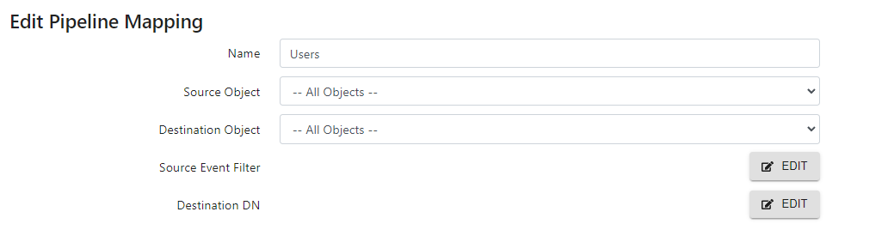

# Synchronization object

Any objects listed in a catalog of a data source, can act as a synchronization object. The connector tracks all events on the object (for publishing to destination objects). The connector can also modify the states of the objects (attributes, identities) for updates, inserts, and deletes.

## Generic (all objects) synchronization object

LDAP synchronization objects are generally based on a specific class type (e.g. `user`, `inetOrgPerson`, `group`, `groupOfUniqueNames`, etc.). If you have the need to synchronize many object types, or require more of an LDAP replication, you can leverage a generic "All Objects" instead of trying to work individually on specific object classes. To use a generic "All Objects", edit the pipeline Transformation component and go to Mappings. In the Source Object drop-down list, select `-- All Objects --` as shown below. The destination object may or may not be `-- All Objects --` as well.

