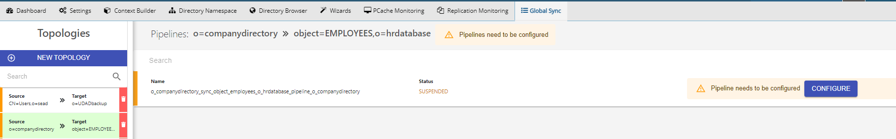
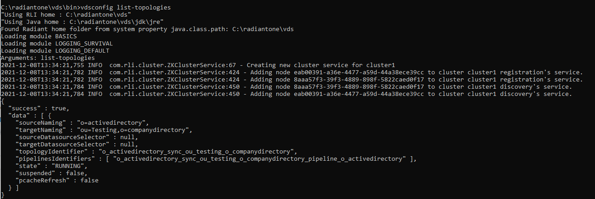
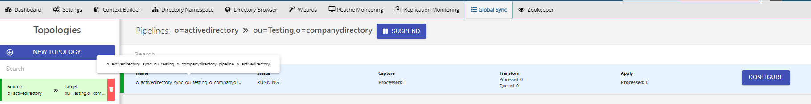

# Topology

The naming and graphical representation of a set of objects participating in a synchronization process is known as a topology. The synchronization flow(s) in a topology are grouped and depicted as pipelines. A topology can consist of one or more synchronization pipelines. Pipelines are auto-generated when the topology is created. You cannot manually create your own pipelines.

An example of a topology with a single auto-generated pipeline is shown below:

An example of a topology with multiple auto-generated pipelines is shown below:

## Pipeline ID

The pipeline ID is required for a variety of scenarios. A few examples are shown below.

| Example | Description |
|---|---|
| `{RLI_HOME}/bin>vdsconfig dl-replay-sync-pipeline -pipelineid {PIPELINE_ID}` | Replaying messages from a dead letter queue |
| `{RLI_HOME}/bin>vdsconfig init-sync-pipeline -pipelineid {PIPELINE_ID}` | Running an upload from command line |
| `{RLI_HOME}/logs/sync_agents/{PIPELINE_ID}/connector.log` | Locating connector logs associated with the pipeline |

You can find the pipeline ID using the vdsconfig command line utility with the `list-topologies` command. The `"pipelinesIdentifiers"` property returns the pipeline ID. An example is shown below.

You can find the pipeline ID from the Main Control Panel > Global Sync tab.

Select the topology and hover over the name property of the pipeline. An example is shown below.

