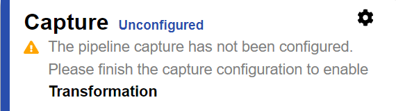

# Capture connector configuration

The capture connector configuration dictates the process for detecting changes on the source objects. The type of data source determines which capture methods are available.

This section focuses on configuring the connector type. For details on the behavior of and properties for database connectors (Timestamp, Counter, Changelog), LDAP connectors (changelog or persistent search), and Active Directory connectors (usnChanged or DirSync), please see the RadiantOne Connector Properties Guide.

Once you have determined the connector type you want to use, select the Capture section in the pipeline to display the configuration options.

>[!note]
>Connectors associated with the RadiantOne Universal Directory (HDAP) stores or persistent caches are automatically configured when the stores are used as sources in a pipeline.

You can however implement filters for the connector by following the guidelines shown below.

## HDAP Trigger Event Filtering

When using HDAP trigger-based capture connectors, you can define LDAP search filters to restrict which change events are captured and published to the synchronization queue. Events that do not match the configured filter criteria are ignored at the trigger level, reducing pipeline overhead and preventing unnecessary downstream processing.

Trigger event filtering can be configured at multiple hierarchical levels for **Global Sync Pipelines** and **Persistent Cache Real-Time Refresh**, as well as toggled deployment-wide via a global setting.

### Important Considerations 

* **LDAP Filter Syntax:** Filters must follow standard RFC 4515 LDAP filter syntax (e.g., `(title=active)`, `(&(ou=People)(status=1))`, `(l=NY*)`).
* **Hierarchical AND-Merging:** When filters are defined at both a parent level (Topology or Whole-Cache) and a child level (Pipeline or Per-Trigger), the rules are combined using a logical **AND** condition:
  $$\text{Effective Filter} = \text{Parent Filter} \ \mathbf{AND} \ \text{Child Filter}$$
* **Empty Filter:** If a filter field is left blank, all change events are captured for that level.

### Configuring Trigger Event Filtering for Global Sync Pipelines

You can configure filtering at both the topology level (applying to all HDAP trigger pipelines in the topology) and at the individual pipeline level.

#### 1. Topology-Level Trigger Filter

Use this when you need to apply the filter across all HDAP trigger-based pipelines within the selected synchronization topology.

1. In the **Main Control Panel**, navigate to the **Global Sync** (or **Sync Pipelines**) tab.
2. Select the desired topology from the left pane.
3. Click the **Trigger Filter** button in the topology header.
4. In the **Topology Trigger Event Filter** dialog:
   * Enter a valid LDAP filter string (e.g., `(department=Sales)`).
5. Click **Apply** (or **Save**).

#### 2. Pipeline-Level Event Filter

Use this when filtering for a specific pipeline. The pipeline filter is combined with any existing topology-level filter, so entries must match both filters.

1. Navigate to **Global Sync** > select your topology > select the specific **Pipeline**.
2. Click the **Capture** tab.
3. Locate the **Event Filtering** section.
   * **Inherited from topology:** Displays the read-only filter configured at the topology level (if any).
   * **Pipeline filter:** Enter an LDAP filter specific to this pipeline (e.g., `(l=NY*)`).
4. Click **Save**.

### Configuring Trigger Event Filtering for Persistent Cache

For persistent cache proxy views configured with real-time refresh, filters can be defined for the entire cache and/or per individual HDAP trigger connector.

#### 1. Whole-Cache Trigger Filter
This applies to all real-time change events captured for the persistent cache naming context.

1. In the **Main Control Panel**, navigate to **Directory Configuration**.
2. Select the naming context hosting the persistent cache proxy view.
3. Go to the **Refresh Settings** tab.
4. Locate the **Trigger Event Filter (whole cache)** field.
5. Enter the desired LDAP filter string (e.g., `(title=active)`).
6. Click **Save**.

#### 2. Per-Trigger Connector Filter

This applies to a specific HDAP trigger connector row within the persistent cache refresh configuration.

1. Under the **Refresh Settings** tab, locate the table of configured real-time connectors.
2. In the row corresponding to your HDAP trigger connector, click **Trigger Filter**.
3. In the dialog, enter the specific filter in the **Event Filter** / **Pipeline filter** field.
4. Click **OK** and then **Save**.

#### Global Trigger Event Filtering Switch

RadiantOne provides a deployment-wide switch to temporarily disable or enable trigger event filtering without deleting configured filter rules.

1. In the **Main Control Panel**, go to **Settings** > **Synchronization** > **Trigger Event Filtering**.
2. To enable or disable enforcement:
   * **Check** the box to enable filter enforcement (enabled by default).
   * **Uncheck** the box to bypass all trigger event filtering deployment-wide.
3. Click **Save**.

When global trigger event filtering is disabled, all configured filters remain stored in the configuration but are **not enforced** (all trigger events are captured and published). 
The following informational note is displayed in the Control Panel on the Persistent Cache **Refresh Settings** tab and the Pipeline **Capture** tab:  
_Trigger event filtering is disabled deployment-wide, so the triggers capture every event. Filters here are saved but not enforced until it is re-enabled under Settings > Synchronization._
