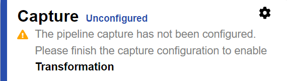
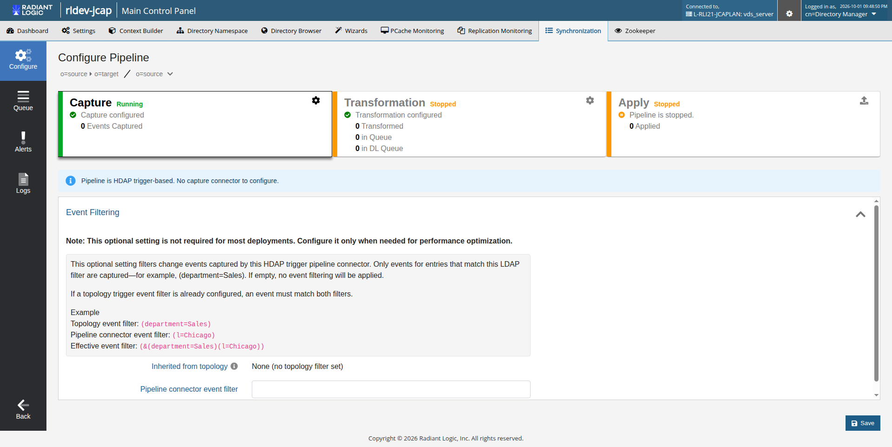
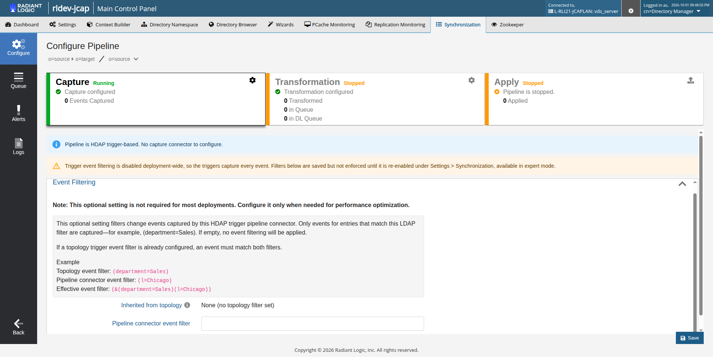

# Capture connector configuration

The capture connector configuration dictates the process for detecting changes on the source objects. The type of data source determines which capture methods are available.

This section focuses on configuring the connector type. For details on the behavior of and properties for database connectors (Timestamp, Counter, Changelog), LDAP connectors (changelog or persistent search), and Active Directory connectors (usnChanged or DirSync), please see the RadiantOne Connector Properties Guide.

Once you have determined the connector type you want to use, select the Capture section in the pipeline to display the configuration options.

>[!note]
>Connectors associated with the RadiantOne Universal Directory (HDAP) stores or persistent caches are automatically configured when the stores are used as sources in a pipeline.

You can however implement filters for the connector by following the guidelines shown below.

## HDAP Trigger Event Filtering

When using HDAP trigger-based capture connectors, you can define LDAP search filters to restrict which change events are captured and published to the synchronization queue. Events that do not match the configured filter criteria are ignored at the trigger level, reducing pipeline overhead and preventing unnecessary downstream processing.

Trigger event filtering can be configured at multiple hierarchical levels for **Global Sync Pipelines** and **Persistent Cache Real-Time Refresh**, as well as toggled deployment-wide via a global setting.

### Important Considerations 

* **LDAP Filter Syntax:** Filters must follow standard RFC 4515 LDAP filter syntax (e.g., `(title=active)`, `(&(ou=People)(status=1))`, `(l=NY*)`).
* **Hierarchical AND-Merging:** When filters are defined at both a parent level (Topology or Whole-Cache) and a child level (Pipeline or Per-Trigger), the rules are combined using a logical **AND** condition:
  $$\text{Effective Filter} = \text{Parent Filter} \ \mathbf{AND} \ \text{Child Filter}$$
* **Empty Filter:** If a filter field is left blank, all change events are captured for that level.

### Configuring Trigger Event Filtering for Global Sync Pipelines

You can configure filtering at both the topology level (applying to all HDAP trigger pipelines in the topology) and at the individual pipeline level.

#### 1. Topology-Level Trigger Filter

A topology-level filter applies to all HDAP trigger-based pipelines within the selected topology. It is configured from the **Trigger Filter** button in the topology header. For steps, see [Topology-Level Trigger Filter](../synchronization-topologies#topology-level-trigger-filter).

#### 2. Pipeline-Level Event Filter

For pipelines using an HDAP trigger-based capture connector, the **Event Filtering** section on the Capture tab lets you inspect the inherited topology setting and define a pipeline-specific filter.

>[!note]
>This optional setting is not required for most deployments. Configure it only when needed for performance optimization.

To configure a pipeline event filter:

1. In the Main Control Panel > Synchronization tab, select the topology and select **Configure** next to the pipeline.
1. Select the **Capture** section.
1. In the **Event Filtering** section, review the inherited topology filter and enter a value for **Pipeline connector event filter** if needed.
1. Select **Save**.

##### Event Filtering Fields

| Field | Description |
|---|---|
| Inherited from topology | Displays the active LDAP filter configured on the parent topology using the topology header **Trigger Filter** button.    • If a topology filter exists, the exact filter expression is shown.   • If no topology filter is configured, the field displays `None (no topology filter set)`.   • Hovering over the information icon (ⓘ) displays a tooltip explaining inheritance from the topology header. |
| Pipeline connector event filter | An optional LDAP filter specific to this pipeline. Enter an LDAP search filter to further narrow the change events processed by this pipeline.    Example: `(l=NY*)` |

##### Combined Filter Evaluation

When both a topology-level filter and a pipeline-level filter are defined:

- The connector combines both criteria using a logical AND operation.
- An event is processed only if it satisfies both the topology filter and the pipeline filter.

For example:

| Filter | Value |
|---|---|
| Topology event filter | `(department=Sales)` |
| Pipeline connector event filter | `(l=Chicago)` |
| Effective event filter | `(&(department=Sales)(l=Chicago))` |

##### Disabled Global State

If an administrator has disabled Trigger Event Filtering under Settings > Synchronization, a warning banner appears above the Event Filtering section:

_Trigger event filtering is disabled deployment-wide, so the triggers capture every event. Filters below are saved but not enforced until it is re-enabled under Settings > Synchronization, available in expert mode._

### Configuring Trigger Event Filtering for Persistent Cache

For persistent cache proxy views configured with real-time refresh, filters can be defined for the entire cache and for individual HDAP trigger connectors. For steps, see [Configuring Trigger Event Filtering for Persistent Cache](/deployment-and-tuning-guide/02-tuning-tips-for-caching-in-radiantone#configuring-trigger-event-filtering-for-persistent-cache) in the RadiantOne Deployment and Tuning Guide.

#### Global Trigger Event Filtering Switch

RadiantOne provides a deployment-wide switch, the **Enable trigger event filtering** check box available in Expert Mode under Main Control Panel > **Settings** > **Synchronization** > **Trigger Event Filtering**, to temporarily disable or enable trigger event filtering without deleting configured filter rules. When it is disabled, all configured filters remain stored but are not enforced, and all trigger events are captured and published. For details, see [Synchronization Settings](/sys-admin-guide/synchronization-settings) in the RadiantOne System Administration Guide.
