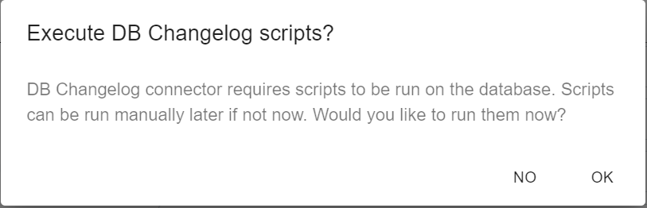
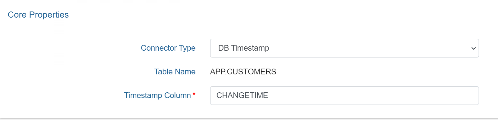
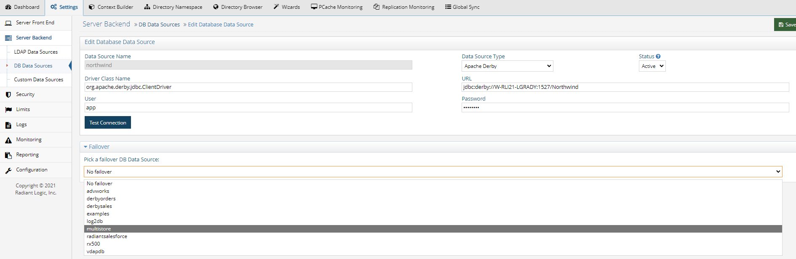

# Database Connectors

For database backends (JDBC-accessible), the change detection options are:

- [Changelog](#db-changelog) – This connector type relies on a database table that contains all changes that have occurred on the base tables (that the RadiantOne virtual view is built from). This typically involves having triggers on the base tables that write into the log/changelog table. However, an external process may be used instead of triggers. The connector picks up changes from the changelog table. If you need assistance with configuring triggers on the base tables and defining the changelog table, see [Script to Generate Triggers](#create-scripts-to-generate-triggers-and-changelog-table).

- [Timestamp](#db-timestamp) – This connector type has been validated against Oracle, SQL Server, MySQL, MariaDB, PostgreSQL, and Apache Derby. The database table must have a primary key defined for it and an indexed column that contains a timestamp/date value. This value must be maintained and modified accordingly for each record that is update1. 
    
  For Oracle databases, the timestamp column type must be one of the following: `TIMESTAMP`, `DATE`, `TIMESTAMP WITH TIME ZONE`, `TIMESTAMP WITH LOCAL TIME ZONE1. 
    
  For SQL Server database, the timestamp column type must be one of the following: `SMALLDATETIME`, `DATETIME`, `DATETIME2`
    
  For MYSQL or MariaDB databases, the timestamp column type must be one of the following: `TIMESTAMP`, `DATETIME`  
    
  For PostgreSQL databases, the timestamp column type must be one of the following: `TIMESTAMP`, `timestamp without time zone` (equivalent to timestamp), `TIMESTAMPTZ`, `timestamp with time zone` (equivalent to timestamptz)
    
  For Derby databases, the timestamp column type must be: `TIMESTAMP`  
    
  The DB Timestamp connector leverages the timestamp column to determine which records have changed since the last polling interval. This connector type does not detect delete operations. If you have a need to detect and propagate delete operations from the database, you should choose a different connector type like DB Changelog or DB Counter.

- [Counter](#db-counter) - This connector type is supported for any database table that has an indexed column that contains a sequence-based value that is automatically maintained and modified for each record that is added/updated. This column must be one of the following types: `BIGINT`, `DECIMAL`, `INTEGER`, or `NUMERIC`. If `DECIMAL` or `NUMERIC` are used, they should be declared without numbers after dot: `DECIMAL(6,0)` not as `DECIMAL(6,2)`. The DB Counter connector leverages this column to determine which records have changed since the last polling interval. This connector type can detect delete operations as long as the table has a dedicated "Change Type" column that indicates one of the following values: insert, update, delete. If the value is empty or something other than insert, update, or delete, an update operation is assumed.

## DB Changelog

RadiantOne can generate the SQL scripts which create the configuration needed to support the DB Changelog Connector. The scripts can be generated in the Main Control Panel or from command line. Both options store the scripts under `{RLI_HOME}/work/sql`. The following scripts are generated.

- create_user.sql - Creates the log table user and the log table schema.

- create_capture.sql - Creates the log table and the triggers on the base table.

- drop_capture.sql - Drops the triggers and the log tabl1. 
  Note: for some databases the file is empty.

- drop_user.sql - Drops the log table user and schem1. 
  Note: for some databases the file is empty.

### Connector Configuration

This section describes generating and executing the scripts in the Main Control Panel > Global Sync tab. The following steps assume the database backend has a changelog table that contains changed records that need to be propagated to destinations. The changelog table must have two key columns named `RLICHANGETYPE` and `RLICHANGEID`. `RLICHANGETYPE` must indicate insert, update or delete, dictating what type of change was made to the record. `RLICHANGEID` must be a sequence-based, auto-incremented `INTEGER` that contains a unique value for each record. The DB Changelog connector uses `RLICHANGEID` to maintain a cursor to keep track of processed changes.

If you need assistance with configuring triggers on the base tables and defining the changelog table, see [Script to Generate Triggers and Changelog Table](#create-scripts-to-generate-triggers-and-changelog-table).

To configure DB Changelog connector:

>[!note]
>These instructions assume you want to apply the SQL scripts immediately.

1. From the Main Control Panel > Global Sync Tab, select the topology.
1. On the right, select the sync pipeline to configure.
1. Select a Capture component and the configuration displays.
1. Select **DB Changelog** from the **Connector Type** drop-down list.
1. Indicate the user name and password for the connector's dedicated credentials for connecting to the log table. If you do not have the user name and password, contact your DBA for the credentials.
1. Enter the log table name using the proper syntax for your database (e.g. `{USER}.{TABLE}_LOG`). If you used [RadiantOne to generate the SQL scripts](#create-scripts-to-generate-triggers-and-changelog-table) for configuring the changelog components in the database, you can view the scripts to see the exact table name. Otherwise, contact your DBA for the log table name.

>[!important]
>Change the value for this property only if you are creating the log table manually and the capture connector does not calculate the log table name correctly. Be sure to use the [correct syntax](#log-table-name-syntax) if you change the value.

7. Select **Save**.
8. A message is displayed that asks if you want to apply the scripts to configure the log table immediately or not.

9. To apply now, select **OK**. Otherwise, select **NO**.

>[!note]
>Selecting **OK** creates and executes the SQL scripts on the database server. If you choose to apply later, the scripts are created at the following location: `{RLI_HOME}/work/sql/` but not executed. They must be run on the database manually. Any DBA can configure the connector by selecting the **NO** option and running the scripts manually on the database server. For most databases, this is also sufficient to apply the configuration directly selecting the **OK** option. However, for Oracle databases, you must connect as either the SYS user or a non SYS user that has the SYSDBA role assigned to them. If you choose to use a non SYS user, you must use the syntax userid as sysdba for the user name in the connection. An example would be scott as sysdba.

10. After the capture connector is configured, configure the transformation in the pipeline.

### Log Table Name Syntax

Proper syntax for the Log Table Name must include both the schema name and the table name separated with a period. Values for this property may contain quote marks as required by the database. In most cases, the double quote mark (") is used, but some databases use a single quote (') or back quote (`). The following examples explain the property's syntax and usage.

**Example 1:**

For Postgres, if the schema is `rli_con`, and log table name is `test_log`, the property should be one of the following.

>[!note]
>By default, Postgres uses lower-case table names.

`rli_con.test_log`

Or with optional quoting:

`"rli_con"."test_log"`

Example 2:

For SQL Server, if the schema is `RLI_CON`, and log table name is `TEST_LOG`, the property should be one of the following.

>[!note]
>By default, many DBs, including SQL Server, use upper-case table names.

`RLI_CON.TEST_LOG`

Or with optional quoting:

`"RLI_CON"."TEST_LOG"`

>[!note]
>If this name is the same as the log name in the database, leave the property empty.

Example 3:

If schema and/or table name contain mixed-case characters, they must be quoted. For example, if the schema is `Rli_Con`, and log table name is `Test_Log`, the property should be as follows.

`"Rli_con"."Test_log"`

### Create Scripts to Generate Triggers and Changelog Table

If the database backend doesn't have a changelog table, you can use RadiantOne to create one. RadiantOne can generate SQL scripts that a DBA can run on the database backend. These scripts create the needed configuration to support the DB Changelog connector. Use `{RLI_HOME}/bin/advanced/create_db_triggers.bat` to generate the scripts. The command uses seven arguments (which are described below) and generates four SQL scripts needed to configure the database to support the DB Changelog connector.

These scripts can be provided to the database backend DBA to review, modify and execute on the database server. Scripts generated using this command cannot be executed in the Main Control Panel.

Example:  
`create_db_triggers.bat -d sql123 -n sql_server_data_source -t DBO.EMPLOYEES -u rli_con -p rli_con -l EMPLOYEES_LOG`

Based on this example, the command generates scripts at the following location: `{RLI_HOME}/work/sql/sql123/`

The RadiantOne data source name is sql_server_data_source (it must exist prior to running the command).

The base table name is `EMPLOYEES` in the DBO schema.

The log table user to be created is: rli_con with a password of: rli_con

The log table name is `EMPLOYEES_LOG`.

The table below outlines the available arguments.

 Argument | Description 
---|---
 `-d` | The name of the folder where the scripts are saved (e.g. sql1). The name should not contain any special or path characters (e.g. /,\\). The folder will be created under the `{RLI_HOME}/work/sql/` directory. If the location already contains scripts, they are overwritten without warning. 
 `-n` | The RadiantOne data source name. The data source contains information (JDBC connection string, user, and password) that is used to connect to the database and read the base table schema. The credentials defined in the data source must have permission to read the base table schema. Note - the data source must exist prior to using the command. 
 `-t` | "The base table name. The name of the table is used to create the create_capture.sql and the drop_capture.sql scripts. The base table name should be in the form: `{SCHEMA}.{TABLE_NAME}`, for example `DBO.CUSTOMERS`. `{SCHEMA}` and `{TABLE_NAME}` should not contain special characters (e.g. [ ]`"".), should not be quoted, and should be in the proper upper/lower case (depends on the database type/vendor)." 
 `-u` | The log table user. The create_user.sql script includes commands to create a log table user/owner and the log table schema (which will have the same name as the log table user). The log table user is created with the password assigned by the `-p` option. 
 `-l` | Specify the log table name instead of using default computation based on full base table nam1. 
 `-s` | Specify the log table schema nam1. 

## DB Timestamp

The following steps assume your backend database table has a primary key defined and contains a timestamp column. The timestamp column name is required for configuring the connector. The timestamp column database types supported are described in the [Database Connectors](#database-connectors) section.

>[!important]
>This connector type does not detect delete operations. If you have a need to detect delete operations from the database, you should choose a different connector type.

1. From the Main Control Panel > Global Sync Tab, select the topology on the left.
1. On the right, select the sync pipeline to configure.
1. Select a Capture component and the configuration displays.
1. Select **DB Timestamp** from the **Connector Type** drop-down list.
1. Indicate the column name in the database table that contains the timestamp. An example is shown below.

1. Select **Save**.
1. You can configure connector properties in the Advanced Properties section.
1. After the capture connector is configured, configure the transformation.

>[!important]
>If you need to make changes to the timestamp column name, you must manually restart the connector and reset the cursor. The pipeline can be stopped on the Global Sync tab when the topology is selected on the left. Then select **Configure** next to the pipeline. In the configuration screen, select the Capture section. Change the timestamp column name and select **Save**. In the bottom left of the Capture configuration screen, select **Reset Cursor**. Go back to the Global Sync topologies page and select **Start** to start the pipeline components.

## DB Counter

The following steps assume your database backend table contains an indexed column that contains a sequence-based value that is automatically maintained and modified for each record that is added, updated or deleted. The DB Counter connector uses this column to maintain a cursor to keep track of processed changes. The counter column database types supported are described in the [Database Connectors](#database-connectors) section.

1. From the Main Control Panel > Global Sync Tab, select the topology on the left.
1. On the right, select the sync pipeline to configure.
1. Select the Capture component and the configuration displays.
1. Select **DB Counter** from the **Connector Type** drop-down list.
1. Enter a value in the Change Type Column field. This value should be the database table column that contains the information about the type of change (insert, update or delete). If the column doesn't have a value, an update operation is assumed.
1. Enter the column name in the database table that contains the counter. An example is shown below.
1. Select **Save**
1. You can configure connector properties in the Advanced Properties section.
1. After the capture connector is configured, configure the transformation in the pipeline.

>[!important]
>If you need to make changes to the Counter Column name, you must manually restart the connector and reset the cursor. The pipeline can be stopped on the Global Sync tab when the topology is selected on the left. Then select **Configure** next to the pipeline. In the configuration screen, select the Capture section. Change the counter column name and select **Save**. In the bottom left of the Capture configuration screen, select **Reset Cursor**. Go back to the Global Sync topologies page and select **Start** to start the pipeline components.

## Database Connector Failover

This section describes the failover mechanism for the database connectors.

>[!important]
>The backend servers must be configured for multi-master replication. Please check the vendor documentation for assistance with configuring replication for your backends.

The database connectors leverage the failover server that has been configured for the data source. When you configure a data source for your backend database, select a failover database server from the drop-down list. The failover server must be configured as a RadiantOne data source. See the screen shot below for how to indicate a failover server for the Data Sources from the Main Control Panel.

 

If a connection cannot be made to the primary server, the connector tries to connect to the failover server configured in the data source. If a connection to both the primary and failover servers fails, the retry count goes up. The connector repeats this process until the value configured in "Max Retries on Connection Error" is reached. There is no automatic failback, meaning once the primary server is back online, the connector doesn't automatically go back to it.
