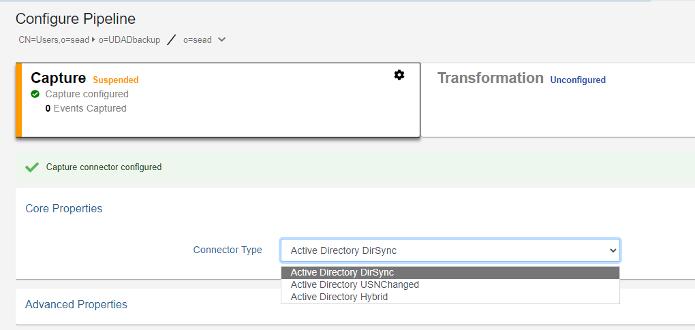
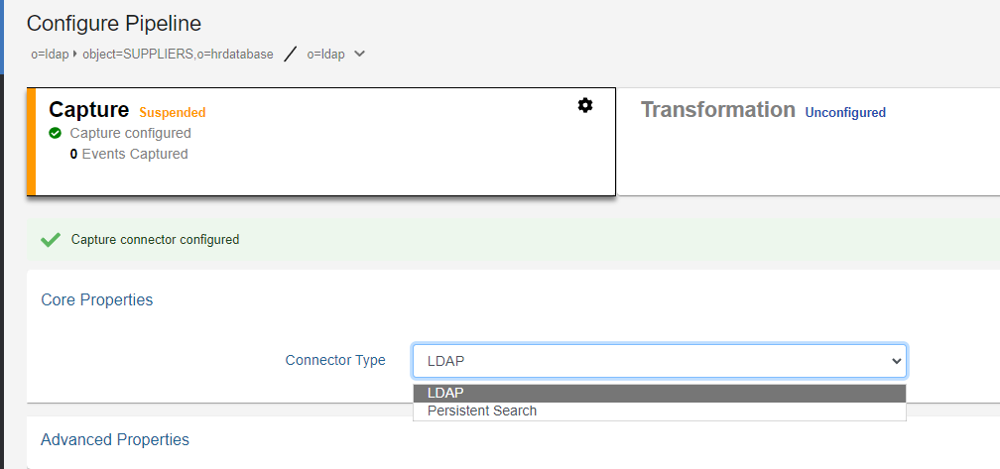
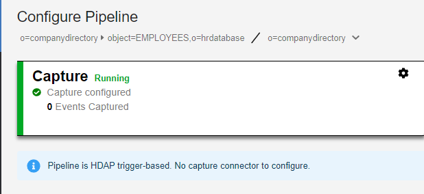

# Directory Connectors

For directory backends (LDAP-accessible including RadiantOne Universal Directory and Active Directory), the default connectors are configured and started automatically. Go to Main Control Panel > Global Sync tab to select the topology and configure the pipeline. Select the Capture component to modify the connector type and advanced properties.



## LDAP Directories

For LDAP backends that support both Changelog and Persistent Search, you can configure the connector from the Main Control Panel > Global Sync tab. Select the topology and configure the pipeline. Select the Capture component to modify the connector type and advanced properties.

Choose either the **LDAP** option (for Changelog) or **Persistent Search** and **Save**.



### Changelog

The connector leverages a changelog that has been enabled on the backend directory. The connector picks up changes from the cn=changelog naming context based on a polling interval. The changenumber attribute in the changelog entries is used to keep track of the processed changes. The changelog must be enabled in the backend directory. Please check with your directory vendor for instructions on how to enable the changelog.

### Persistent Search

Any LDAP directory that offers a persistent search mechanism can use the Persistent Search connector type. Novell eDirectory is an example of an LDAP source that supports persistent search. Others include Red Hat Directory, IBM TDS, CA Directory and RadiantOne Universal Directory. The connector issues a persistent search and gets notified by the directory server when information changes. If the connector is shut down (either deliberately or due to failure), the delete operations that occurred in the directory are lost. Once the connector is back online there is no way to detect the delete operations that occurred while it was down. The only exception to this is for IBM TDS directories. It stores deleted entries and the capture connector is able to read them, and based on timestamp, determine if the change occurred while the connector was offline.

## Active Directory

There are three change detection mechanisms: USNChanged, DirSync and Hybrid. If you are virtualizing and detecting changes from a Global Catalog, then you must use the USNChanged changed connector because the DirSync and Hybrid connectors cannot detect change events on sub-domains.

The flowchart below helps to decide which change detection mechanism to use.


### DirSync

This connector type retrieves changes that occur to entries by passing a cookie that identifies the directory state at the time of the previous DirSync search. The first time the DirSync capture connector is started, it stores a cookie in a cursor file. At the next polling interval, the connector performs a DirSync search to detect changes by sending the current cookie. To use the DirSync control, the Bind DN connecting to the directory must have the DS-Replication-Get-Changes extended right, which can be enabled with the "Replicating Directory Changes" permission, on the root of the partition being monitored. By default, this right is assigned to the Administrator and LocalSystem accounts on domain controllers.

>[!important]
>To detect delete events, the service account used by RadiantOne to connect to the backend Active Directory (configured in the connection string of the RadiantOne data source) must have permissions to search the tombstone objects. Usually, a member of the Administrators group is sufficient. However, some Active Directory servers may require a member of the Domain Admins group. Check with your Active Directory administrator to determine the appropriate credentials required.  
  
If you are virtualizing and detecting changes from a Global Catalog, then you must use the Active Directory USNChanged changed connector because the DirSync connector cannot detect change events on sub-domains.

### USNChanged 

This connector type keeps track of changes based on the `uSNChanged` attribute for the entry. Based on a configured polling interval, the connector connects with the user and password configured in the connection string/data source and checks the list of changes stored by Active Directory. The connector internally maintains the last processed change number (`uSNChanged` value) and this allows for the recovery of all changes that occur even if the connector is down (deliberately or due to failure).

If capturing the sequence of events is critical, use the DirSync connector instead of USNChanged because it processes events in the order in which they occur instead of prioritizing and processing inserts and updates before deletes.

### Hybrid

This connector type uses a combination of the uSNChanged and DirSync change detection mechanisms. The first time the connector starts, it gets a new cookie and the highest uSNchanged number. When the connector gets a new change (modify or delete), it makes an additional search using the DN of the entry and fetches the entry from AD. The fetched entry contains the `uSNChanged` attribute, so the connector updates the cursor values for both for the cookie and the last processed uSNchanged number.

>[!important]
>If you are virtualizing and detecting changes from a Global Catalog, then you must use the Active Directory USNChanged changed connector because the Hybrid connector cannot detect change events on sub-domains.

When the connector restarts, uSNChanged detection catches the entries that have been modified or deleted while the connector was stopped. The LDAP search uses the last processed uSNChanged number to catch up. After the connector processes all entries, it requests a new cookie from AD (not from the cursor) and switches to DirSync change detection.

## RadiantOne Universal Directory (HDAP stores) Connector

If you are using the RadiantOne Universal Directory (HDAP store), a persistent cache on a proxy view of a local HDAP store, or a nested persistent cache view (a cached view used in another cached view), the connector type is noted as HDAP trigger automatically and cannot be changed. This is a special trigger mechanism that publishes changes directly into the queue to invoke the synchronization as opposed to requiring a connector component to detect the change.



## Directory Connector Failover

This section describes the failover mechanism for the LDAP, Persistent Search and Active Directory connectors.

>[!important]
>The backend servers must be configured for multi-master replication. Please check the vendor documentation for assistance with configuring replication for your backends.

The directory connectors leverage the failover servers that have been configured for the data source. When you configure a data source for your backend directory, you need to indicate the list of failover servers in order of priority. When the connector fails over, it uses the failover servers in the order they are listed. See the screen shot below for how to indicate a failover server for the Data Sources from the Main Control Panel.

 

If a connection cannot be made to the primary server and the maximum number of retry attempts has been exhausted, the connector connects to the failover servers in the order they are listed. There is no automatic failback, meaning once the primary server is back online, the connector doesn't automatically go back to it.

This failover mechanism is supported for Active Directory, OpenDJ, Oracle Directory Server Enterprise Edition (Sun Directory v7), Oracle Unified Directory (OUD). In addition, any LDAP directory implementing cn=changelog and `replicationCSN` attribute or the persistent search control is also supported.

>[!important]
>When the Active Directory DirSync connector fails over to another DC replica, the current cursor (cookie) is used. The connector may receive all objects and attributes from the replica instead of just the delta from its last request. Therefore, you may notice the number of entries published by the connector is more than you were expecting. This behavior is dictated by the Active Directory server and is out of the control of the connector. Keep this in mind when you define the Max Retries and Retry Intervals for the connector properties. The smaller the numbers of retries, the higher the chance the connector will fail over and possibly receive all objects and attributes (a full sync) from the domain controller.

For the Active Directory USNChanged connector, the failover logic leverages the Active Directory replication vectors [replUpToDateVector], and the failover servers configured at the level of the RadiantOne data source associated with Active Directory, in order to determinate which server(s) the connector switches to in case of failure. Since the replication vector contains all domains, in addition to some possibly retired domains, the connector narrows down the list of possible failover candidates to only the ones listed as failover servers in the RadiantOne data source associated with the Active Directory backend. If there are no failover server defined for the data source, all domains in the replication vector are possible candidates for failover.

>[!important]
>When defining the RadiantOne data source associated with Active Directory, do not use Host Discovery. You must use the fully qualified machine names for the primary server and failover servers. Do not use IP addresses. Also, it is highly recommended that you list your desired failover servers at the level of the data source. Not only does this make the failover logic more efficient, but it also avoids delays in synchronization.

`[replUpToDateVector]` definition: The non-replicated attribute `replUpToDateVector` is an optional attribute on the naming context root of every naming context replica. If this vector is unavailable, the connector is suspended.

The `ReplUpToDateVector` type is a tuple with the following fields:

- `uuidDsa`: The invocation ID of the DC that assigned `usnHighPropUpdate`.

- `usnHighPropUpdate`: A USN at which an update was applied on the DC identified by uuidDsa.

- `timeLastSyncSuccess`: The time at which the last successful replication occurred from the DC identified by uuidDsa; for replication latency reporting only.

`[replUpToDateVector]` example:

```
01ca6e90-7d20-4f9c-ba7b-823a72fc459e @ USN 2210490 @ Time 2005-08-21 15:54:21

1d9bb4b6-054a-440c-aedf-7a3f28837e7f @ USN 26245013 @ Time 2007-02-27 10:17:33

24980c9d-39fa-44d7-a153-c0c5c27f0577 @ USN 4606302 @ Time 2006-08-20 23:33:09
```

At run-time, the connector retrieves the entire list of servers defined in the replication vector and reduces the number of possible failover candidates based on failover servers defined in the RadiantOne data source. The list of potential failover servers is stored at each polling interval. When the current server fails, the connector decides to switch to the closest candidate by selecting the server with the maximum timestamp from the up-to-dateness vector. The capture connector's cursor will be assigned the value from the up-to-dateness vector for the failover server. If the closest candidate fails as well, the connector tries with a second closest candidate and so on.

>[!important]
>Due to the lack of Active Directory replication for the `USNChanged` attribute, some changes could be missed or replayed on failover.

For the AD Hybrid connector, the failover process starts when the number of exceptions exceeds either the Maximum Retries on Error or Maximum Retries on Connection Error value. The failover servers are specified in the data source associated with Active Directory. The Active Directory up-to-date vector is used to determine the failover server and the value of the new cursor. If the up-to-date vector is unavailable from the current server, failover is not possible. If this happens, verify that AD replication is correctly configured. After the failover server is found, uSNChanged detection catches the entries that have been modified or deleted since the connector's failure. The LDAP search uses the last processed uSNChanged number to catch up.

>[!important]
>Due to the lack of Active Directory replication for the `USNChanged` attribute, some changes could be missed or replayed on failover.

After the connector processes all entries, it requests a new cookie from Active Directory and switches to DirSync change detection.
