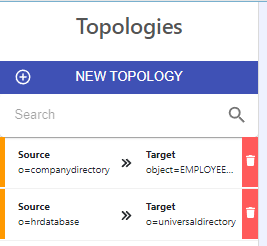

         
# Delete Topologies

Topologies can be deleted from the Main Control Panel > Global Sync Tab by selecting the **trash can icon** next to the topology.

A topology must be removed before associated data sources are removed.
