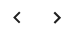

# Actions

Actions are processed when conditions are met. There are three types of actions that can be used: **Abort**, **Apply Target Attribute Mapping**, and **Custom Code/Function**. Select one of these options from the **Action Type** drop-down list, configure any required settings and select **Insert**.

## Abort Transformation

If the Abort Action is chosen, the transformation is aborted and no action is taken on the target.

## Configure Target Attribute Mappings

If **Target Attribute Mappings Action** is chosen, you can use an existing mapping file, or create a new set of mappings. When you select **Target Attribute Mappings Action**, the window where you configure the mappings shows at the bottom of the RULES section after you select **OK**.

Attribute mapping can be accomplished with any combination of the following: default mapping method, mapping to a variable (source attribute or local variable), using a custom condition, setting an alternate (default) value, or defining advanced mapping leveraging IF,THEN,ELSE conditions.

To map attributes:

1. Use the  on the bottom right of the attribute table to page through and find the attribute you want to map.
1. In the **Operation Type** drop-down list, select the operation to perform on the target attribute (e.g. **Replace Value(s)**, **Add Value(s)**, etc.).
1. Select  next to the input value and select how to populate the target attribute value. You can use a **Constant**, **Attribute** (source attribute or variable), or a **Function**. If you choose **Constant**, enter the value to set. If you choose **Attribute**, select the source attribute or variable from the drop-down list. If you choose **Function**, select the [function](../transformation/attribute-mappings.md#standard-functions-available) and follow the guidance to define the value.
1. (Optional) you can define an [Input Condition](#configure-input-conditions-for-target-attributes) by selecting . Select **Insert** after defining the input condition.

>[!note]
>If you use an input condition that uses an alternative value, select  in the Alternate Values section and choose how to populate the value (e.g. **Constant**, **Attribute** or **Function**).

5. Repeat steps 1-4 in this section to map all needed attributes.
6. Select **Insert** to close the Rule Builder.
7. Select **Save**.

## Configure Input Conditions for Target Attributes

The default is "None" meaning that no special checking of the input value(s) is performed prior to setting it for the target attribute. Depending on the type of target system you are synchronizing to, you may need to treat null or empty values differently. You may also want to set a default value if the input value(s) is null or empty. The options are described in the following table.

| Value(s) Checking Option | Description |
|---|---|
| None | Default mode. No special checking of the input value(s) is performed prior to setting it for the target attribute. |
| Set value(s) only if not null, else use alternate value(s) | If the input value(s) is null, set the target attribute to the Alternate Value (if defined). If no Alternate Value is defined, nothing is set. If the input value(s) is not null, set the target attribute to the value from the input value(s). |
| Set value(s) only if not empty, else use alternate value(s) | If the input value(s) is empty, set the target attribute to the Alternate Value (if defined). If no Alternate value is defined, nothing is set. If the input value(s) is not empty, set the target attribute to the value from the input value(s). |
| Delete attribute if value(s) are empty or null | If the input value(s) is empty or null, delete the attribute in the target. This sets a NULL value (for a database target) or an empty value (for a directory target). |
| Delete attribute if value(s) are empty. | If the input value(s) is empty, delete the attribute in the target. This option allows you to differentiate between empty and null. |
| Set value(s) if custom condition matches, else use alternate value(s) | If the input value(s) matches a custom condition, set the target attribute to the input value(s). If the input value(s) does not match the custom condition, set the target attribute to the Alternate Value(s). If no Alternate Value is defined, nothing is set. To define the custom conditions, select **START CONDITION** and select **Condition Node** if you only need one condition, or `AND` Condition or `OR` Condition if you need multiple conditions which can be nested. The condition types that can be used are described in the [Variable Configuration](variable-configuration.md).  |

## Configure Custom Code/Function

If the **Custom Function Action** is chosen, you can create a new function for your transformation script, or call an existing custom function. If you have existing custom functions, the names appear in the drop-down list for you to choose from. After you select **OK**, select **OK** again and then select **Save**. Then select  on the **Rule Set** page to edit the transformation script. Locate your custom function to edit the code in the web editor. You can use an [IDE like Eclipse](../script.md#use-a-java-ide-to-customize-scripts) instead of the web editor if you prefer.
