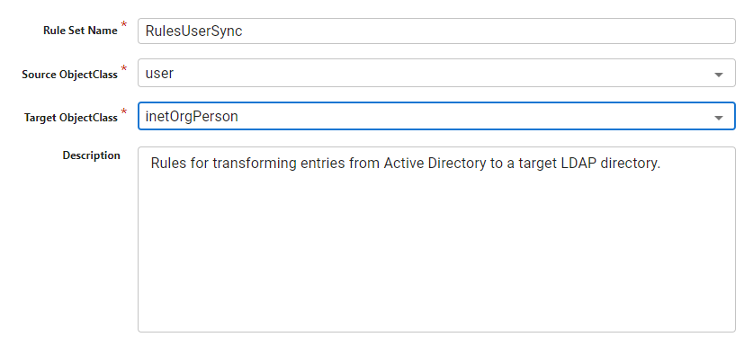

# Overview

Rules are packaged as a set and are associated with a single source entry object class. You will create a rule set for every source object class that you want to detect changes on.

Rules offer a default event-based template that allows for configuring conditions and actions for determining synchronization logic. This offers more customization for synchronization logic than simple attribute mappings without having to write code. If you choose to use Rules, a separate configuration for attribute mappings and scripts are not used.

To create a rule set:

1. On the Main Control Panel > Global Sync tab, select the topology on the left.
1. Select **Configure** next to the pipeline on the right.
1. Select the Transformation component and choose **Rules-based Transformation** from the **Transformation Type** drop-down list.
1. Select the button to create a new Rule Set.
1. In the Basic Information section, enter a unique name to identify the rule set (e.g RulesUserSync).
1. Select the object class associated with the entries in the source that you want to detect changes on from the **Source ObjectClass** drop-down list.
1. Select the object class associated with the entries in the target that you want changes applied to from the **Target ObjectClass** drop-down list.
1. (Optional) enter a description.
    
1. (Optional) if you need to define variables to use in conditions, select the [RULE VARIABLES](variable-configuration.md) section and configure them.
1. Select the [RULES](rule-configuration.md) section to configure the Rules for transformation.
1. (Optional) to configure advanced options like Target Object RDN and DN generation, rules processing order and others, select the [ADVANCED OPTIONS](identity-linkage.md) section.
1. Select **Save**.
