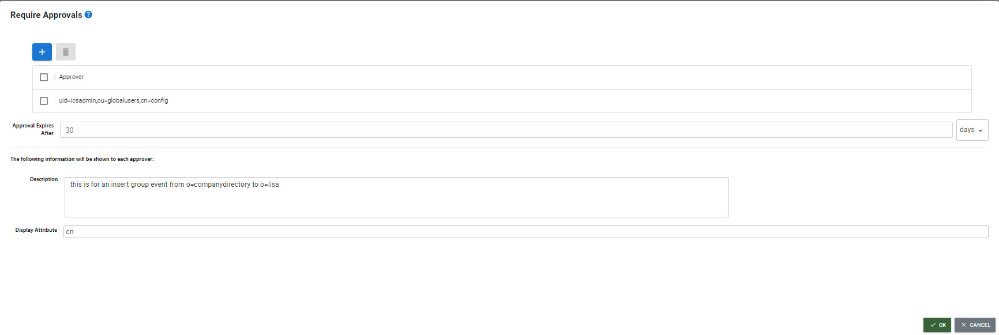

# Rule configuration

Rules are packaged as a set that is associated with a single source object class and single target object class. If you want to synchronize source objects that are associated with different object classes (e.g. User and Group), then you need to configure multiple rule sets, one for each object class.

Rules are configured in the RULES section of the selected RULE SET. A Rule is comprised of one or more conditions and one or more actions. When the conditions are met, the actions are executed.

To automatically configure rules for insert, update and delete events, select . One rule is configured for each event and each rule has one condition based on the corresponding event type. You can edit an auto configured rule by selecting it and selecting the **Edit** button.

## Creating Rules

1. Edit the Rule Set and select the **Rules** section.
1. Select 
1. Enter a Rule name.
1. (Optional) Enter a Description.
1. Configure the [identity linkage](identity-linkage.md) in the Identity Linkage property.
1. If source events associated with this rule should be manually approved before being syncrhonized to the target, check to enable *Require Approvals* and click .
1. If you have selected the option to manually define the target DN in [Advanced options](../advanced-options.md#target-dn-generation), select the variable that contains the target DN. If you have the target DN generation set to Automatic in Advanced Option, you do not see the Target DN Variable in the Basic Information section.
1. Select the **Event Type** that should invoke the rule from the **Target Event Type** drop-down list.
1. Select the [CONDITIONS](conditions.md) section to define the conditions.
1. Select the [ACTIONS](actions.md) section to define the actions.
1. Select **OK**.
1. Repeat steps 1-10 to create rules for other source event types.
1. Select **Save**.
1. Create another [rule set](overview.md) for every source object class you want to detect changes on.

## Configuring Approvers
The Require Approvals option is located on the **BASIC INFORMATION** tab.
1. Enable the Require Approvals checkbox.
2. Click .
3. Click .
4. Select one or more members of the Approvers group and click ADD. If you select more than one approver, all must approve the action before it expires.
5. Enter a length of time to indicate how long a message should be queued awaiting action (approval or rejection) before it is deleted from the queue. This can be in either minutes or days.
6. Enter a meaningful description and select a source attribute to display in the *Approvals* portal to help provide context for the approver about the synchronization event. 

.

