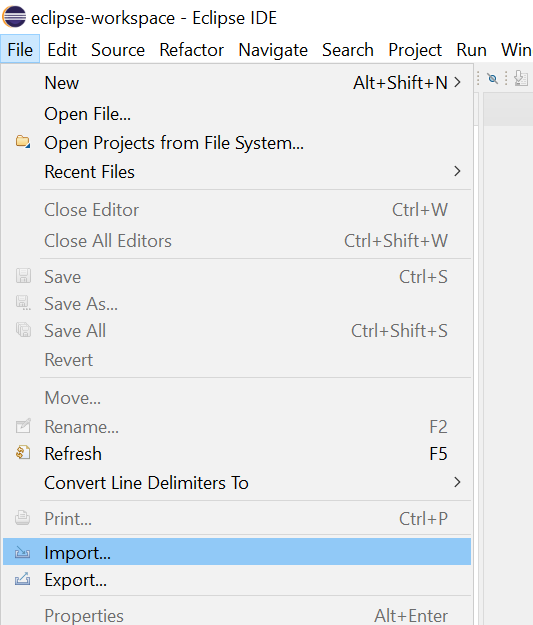
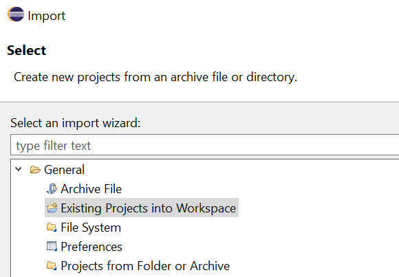
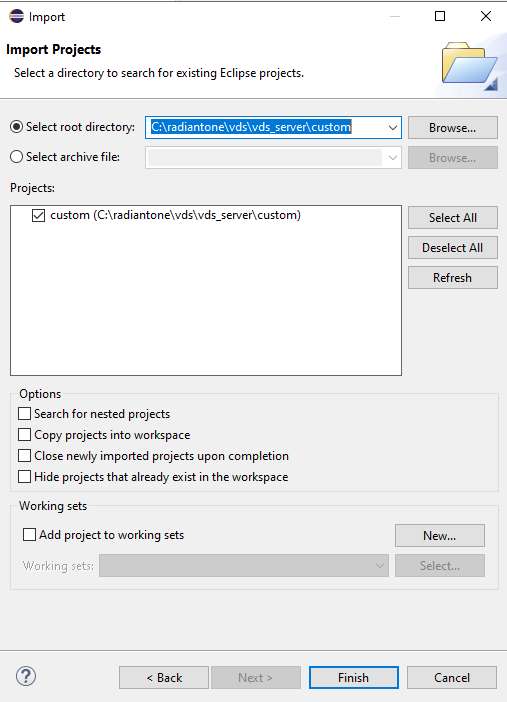
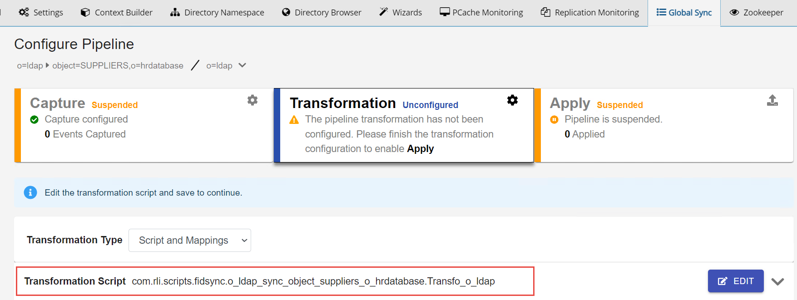

# Script

Using a script for transformation allows for complex logic to be applied before sending changes to the destination. If you choose to use a script only, without attribute mappings, the transformation gets all change events sent by the capture connector. The script logic must filter out events that you do not want to process. If you use attribute mappings in conjunction with a script, a [source event filter](transformation/attribute-mappings.md#source-event-filter) can be configured in the mappings to dictate which captured events to process.

>[!note]
>If you use both script and attribute mappings, the attribute mappings are applied first.

1. On the Main Control Panel > Global Sync tab, select the topology on the left.
1. Select **Configure** next to the pipeline on the right.
1. Select the **Transformation** component and choose either **Script** or **Script and Mappings** from the **Transformation Type** drop-down list.
1. Expand the **Script** section that appears below the Transformation Type and select **Edit**.
1. You can edit and test the script in the window provided. Basic validation is checked when using the script window. For more advanced script editing, you can [use a Java IDE to customize scripts](#use-a-java-ide-to-customize-scripts).
1. After the script compiles successfully, select **Save**. Scripts are saved at: `{RLI_HOME}\vds_server\custom\src\com\rli\scripts\fidsync\{PIPELINE_NAME}`

## Use a Java IDE to customize scripts

You can use our own Java IDE to customize scripts instead of using the Main Control Panel. Import the RadiantOne Custom project into your Java IDE. An example is described below using Eclipse IDE.

1. Install Eclipse IDE for Java developers.
1. Launch **Eclipse** and select **File** > **Import**.
    
1. Expand the **General** folder, select **Existing Projects into Workspace** and select **Next**.
    
1. Select **Browse** next to **Select Root Directory** and navigate to `{RLI_HOME}/vds_server/custom`.
    
1. Select **Finish**.
1. Navigate below the Custom folder to `src.com.rli.scripts.fidsync.{PIPELINE_NAME}`. The script associated with the pipeline appears below. Double-click on the script to open it in the Eclipse IDE editor.
    
    
1. Edit the script.
1. Save the script.
1. On the RadiantOne machine, rebuild the fidsync.jar with ANT using the following syntax:
`C:\radiantone\vds\vds_server\custom\>c:\radiantone\vds\ant\bin\ant.bat buildjars`
1. Restart the RadiantOne service. If deployed in a cluster, restart it on all nodes.

## Leverage existing Java classes

To leverage existing classes in your transformation scripts, perform the following:

- The jar file must be copied in `{RLI_HOME}/vds_server/custom/lib`.
- The class must be imported in the transformation script.
    - Example of importing the class in your transformation script:
    - `import com.rli.connectors.changeevent.ChangeOperation;`

## Custom logging in the transformation script

The add your own log statements into the script, use the following:

`log(Level.INFO, "Some message");`

>[!note]
>The message is logged into `{RLI_HOME}/vds_server/logs/sync_engine/sync_engine.log`

## Test the script

When your script has been modified, you can test it by emulating changes from the source.

1. On the Main Control Panel > Global Sync tab, select the topology on the left.
1. Select **Configure** next to the pipeline on the right.
1. Select the Transformation component and choose either **Script** or **Script and Mappings** from the **Transformation Type** drop-down list.
1. Expand the **Script** section that appears below the **Transformation Type** and select **Edit**.
1. Select **Test.**
1. Select the source event type (e.g. `INSERT`, `UPDATE`, `DELETE`) to test.
1. Enter an Event ID. This is a DN that matches the location in the RadiantOne namespace for the source entries. (e.g. `uid=Aaron_Medler,ou=Accounting,o=companydirectory` assuming `o=companydirectory` is the source naming context in RadiantOne).
1. Add source attribute names and values. Attribute names are in the left column and corresponding value in the right column. Select in the cell, type the value and select **Enter**. Attribute types can be simple or complex. The definitions for "simple" and "complex" are based on SCIM (<http://www.simplecloud.info/specs/draft-scim-core-schema-01.html>). Use the red X button next to the attribute to remove it from the test.
    
1. Select **Test**
1. The results of the script logic are shown in the Output section.
1. When you are finished testing the mappings, select **CLOSE** to go back to the "Configure Pipeline" screen.
