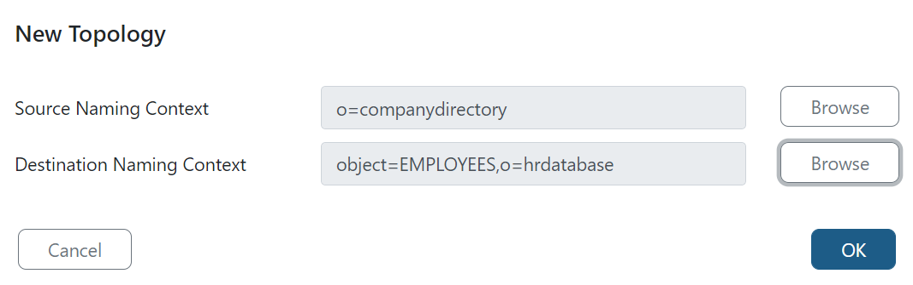

# Synchronization topologies

There are two prerequisite steps for configuring synchronization topologies: mount the objects you want to synchronize in the RadiantOne directory namespace and extend the RadiantOne LDAP schema with any new/custom object definitions. These steps are described below. After these steps are finished, you can create topologies.

## Mount virtual views of objects

All synchronization source and target endpoints must be represented in the RadiantOne namespace, meaning that virtual views containing all source and target objects should be mounted below a root naming context. The virtual views can be created using the Main Control Panel > Directory Namespace tab, or the Context Builder Tab. For details on creating virtual views from the Directory Namespace tab, see the [RadiantOne Namespace Configuration Guide](/documentation/namespace-configuration-guide/01-introduction). For details on creating virtual views using the Context Builder tab, see the [RadiantOne Context Builder Guide](/documentation/context-builder-guide/introduction).

>[!warning]
>Make sure primary keys/unique identifiers are defined for all objects that will play a role in synchronization. You can manage the attributes defined for objects using Main Control Panel > Context Builder tab > Schema Manager sub-tab.

## Extend RadiantOne LDAP schema 

After virtual views have been mounted into the RadiantOne directory namespace, extend the LDAP schema with all needed object definitions that are not currently included. The object definitions are used in attribute mappings for synchronization. The RadiantOne LDAP schema can be extended from Main Control Panel > Settings > Configuration > ORX Schema. Select the schemas associated the objects in your virtual views and select **Generate LDAP Schema**. You can verify the objects defined in the RadiantOne LDAP schema from the Main Control Panel > Settings > Configuration > LDAP Schema.

## Create topologies

After all synchronization source and target objects are represented in the RadiantOne directory namespace and the LDAP Schema contains all object definitions, synchronization topologies can be configured from the Main Control Panel > Global Sync tab.

1. Select **New Topology**.
1. Either manually enter the DN, or select **Browse for the Source Naming Context** and select the location in the RadiantOne namespace that contains the source objects you want to detect change events on. If you cannot locate the container when browsing, manually enter the DN value. 
1. Either manually enter the DN, or select **Browse for the Destination Naming Context** and select the location in the RadiantOne namespace that contains the destination objects that you want to synchronize change events to. If you cannot locate the container when browsing, manually enter the DN value. In the example shown below, the source objects are located in `o=companydirectory` (representing an LDAP directory backend) and the target is `object=EMPLOYEES,o=hrdatabase` (representing a table named `EMPLOYEES` in an HR database).
    
1. Select **OK**. The topology is added to the list on the left and the pipelines associated with the selected topology are shown on the right where the components can be configured.
This section focuses on configuring the connector type. For details on the behavior of and properties for database connectors (Timestamp, Counter, Changelog), LDAP connectors (changelog or persistent search), and Active Directory connectors (usnChanged or DirSync), please see the [RadiantOne Connector Properties Guide](/documentation/connector-properties-guide/overview).
1. A pipeline represents a synchronization flow from a given source object and a target object endpoint. Each pipeline in the selected topology must be configured.
1. Select **CONFIGURE** next to the pipeline. There are two components that need configured per pipeline: Capture Connector and Transformation. Apply Connectors do not require configuration.
