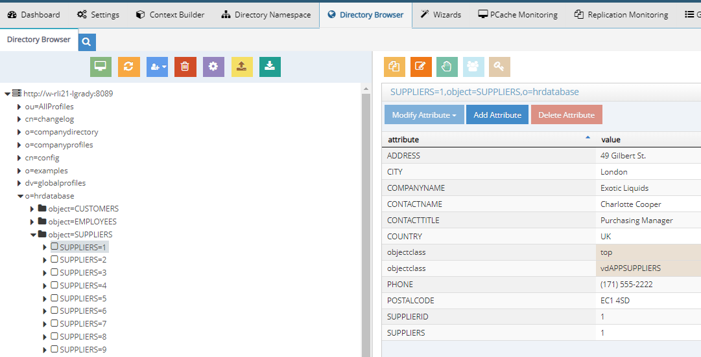
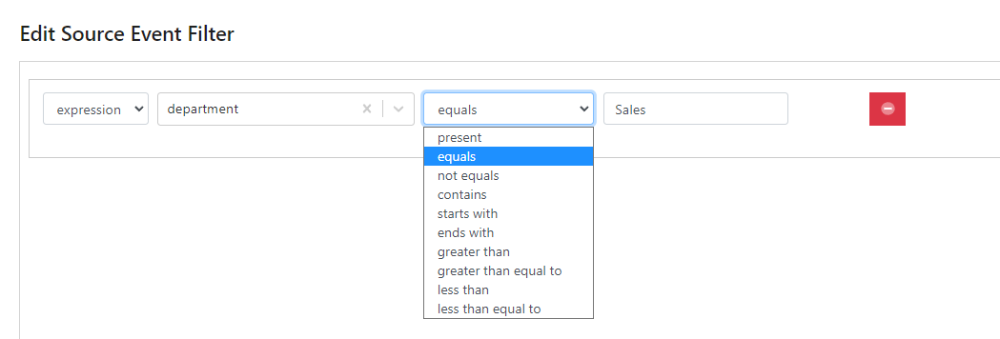
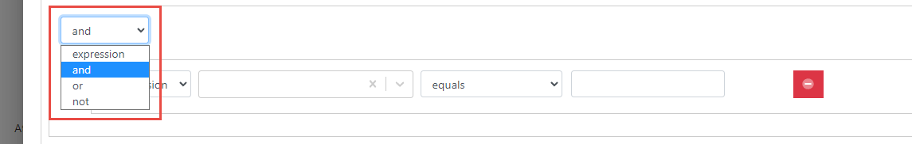
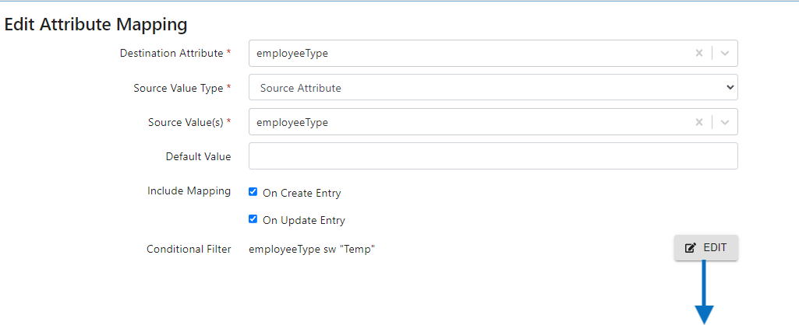
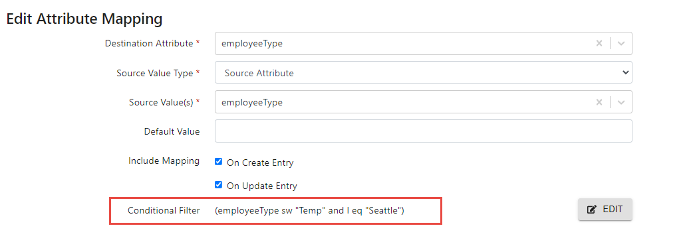
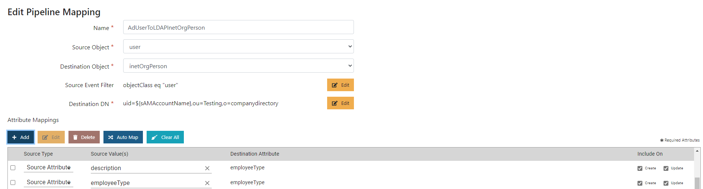
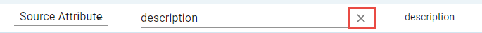
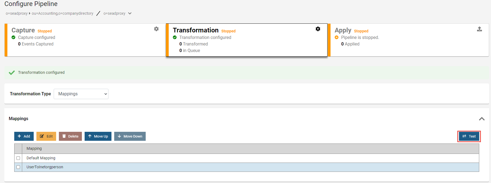
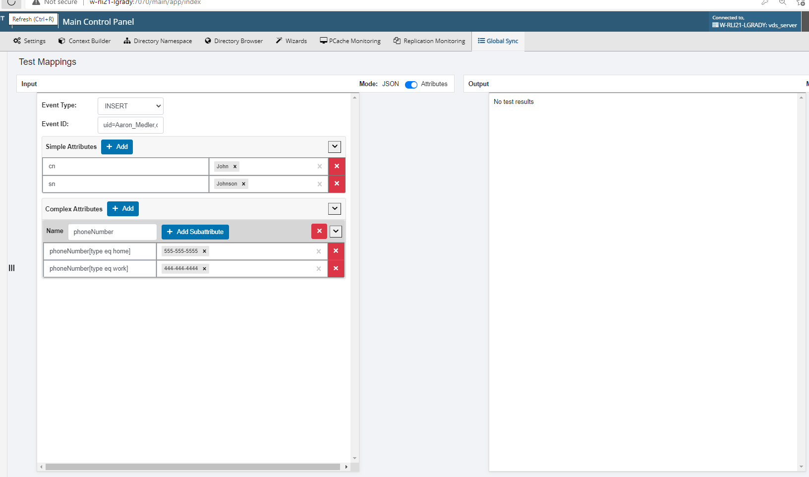
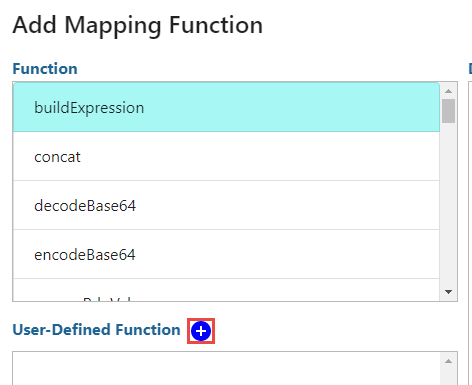

# Attribute mappings

Attribute mappings are the easiest approach to configure transformations without the need for writing scripts. A specific set of mappings can be defined for each type of object you are synchronizing (e.g. users, groups, devices).

Attribute mapping can be accomplished with any combination of the following: mapping a destination attribute from a source attribute, setting a constant value, using a function to compute a value, or setting a default value.

1. Select the **Mappings** and/or **Script and Mappings** option from the **Transformation Type** drop-down list.
1. Expand the **Mappings** section and select **ADD**.
1. Enter a name to describe the mapping. Typically, this is the name of the object type the mapping is to be associated with. A good practice is to have the name indicate the source object and destination object (e.g. ADUsersToAzureADUsers) to make it easily identifiable in the list of mappings. Once you create a pipeline mapping and save it, you are not able to change the name.
1. Select the object class associated with the source entries from the **Source Object** drop-down list. If you don't see the object class in the list, make sure you have [extended the RadiantOne LDAP schema](../../configuration/synchronization-topologies.md#extend-radiantone-ldap-schema) before reaching this step. If you want to listen for changes on all types of objects, you can use the -- All Objects -- option.
1. Select the object class associated with the destination entries from the **Destination Object** drop-down list. If you don't see the object class in the list, make sure you have [extended the RadiantOne LDAP schema](../../configuration/synchronization-topologies.md#extend-radiantone-ldap-schema) before reaching this step. If you want to apply changes on all types of objects, you can use the -- All Objects -- option.
1. Select **EDIT** for [Source Event Filter](#destination-dn) to condition the events you want to process for synchronization. The event can be comprised of one or more expressions based on `AND`, `OR`, `NOT` conditions. Any source event that doesn't match the filter is not processed by the attribute mappings. If no Source Event Filter is configured, every source event is processed by the attribute mappings.
1. Select **EDIT** for [Destination DN](#destination-dn) to create an expression for computing the DN for the entry in the target. Use $ to insert an attribute in the expression. The DN suffix to reach the destination should match the location in the RadiantOne namespace where you mounted the virtual view of the target data source.
1. In the Attribute Mappings section, you can:  
    A. Use the "[AUTO MAP](#auto-map)" option to automatically map source attributes to target attributes with the same nam1. 
    B. Perform the attribute mapping directly in the table that lists all of the target attributes by clicking in the **Source Type** column and selecting one of the following options: **Source Attribute**, **Constant** or **Function**. If **Source Attribute** is selected, click in the **Source Value** column to display a list of source attributes to choose from. If **Constant** is selected, enter the value to set the destination attribute to. If **Function** is selected, click **+Add** in the Source Values column and select the [Function](#standard-functions-available) to us1. 
    C. Define attribute mappings with conditional filters by selecting **Add** below Attribute Mappings (outside of the table) and following the steps below.
1. Select a Destination Attribute from the drop-down list.
1. Select the Source Value Type from the drop-down list.
1. If **Constant** is selected for the Source Value Type, enter the value to set the destination attribute to in the Source Value(s) property. If **Source Attribute** is selected, select the attribute to use from the **Source Value(s)** drop-down list. If **Function** is selected, select **ADD** next to the Source Value(s) property and choose the function to use to compute the value of the attribute. See [Functions Available](#destination-dn) for more details.
1. (Optional) If a default value should be set in cases where the source attribute doesn't have a value for the attribute, enter the value in the Default Value property.
1. If this attribute mapping should be applied when creating new entries in the destination, check the option "On Create Entry". Otherwise, uncheck this option and the mapping does not get applied when creating entries.
1. If this attribute mapping should be applied when updating entries in the destination, check the option "On Update Entry". Otherwise, uncheck this option and the mapping does not get applied when updating entries.
1. (Optional) [Conditional Filter](#conditional-filter) on the attribute mapping levels, describes the conditions that dictate if the attribute mapping gets applied. This attribute mapping only gets applied if the source attribute(s) value(s) matches the conditional filter.
1. Select **Save**.
1. Repeat steps 8-16 for each target attribute you want to define.
1. Repeat steps 1-17 to create all mappings for the synchronization pipeline (e.g. mappings for all object types).

## Destination DN

The Destination DN expression is used generate the DN for the entry in the destination and is based on one or more attributes from the source event. As an example, if the destination in a sync pipeline was the `object=SUPPLIERS,o=hrdatabase` view shown in the screen below, the Destination DN syntax could look like: `SUPPLIERS=${employeeNumber},object=SUPPLIERS,o=hrdatabase` where `${employeeNumber}` indicates the employeeNumber attribute value from the source event is used to comprise the RDN (e.g. `SUPPLIERS=1234,object=SUPPLIERS,o=hrdatabase`). When processing insert and update events with attribute mappings, a lookup is performed in the destination based on the Destination DN expression, to see if the entry exists. If the entry does not exist, it is inserted. If it does exist, the entry is updated.

The corresponding Destination DN Expression to match the example described above is shown below.

As an alternative to using a specific source attribute in the DN expression, you can use the source entry's RDN value to compute the target DN with the following syntax:

`${rdn[1]},{SUFFIX_IN_THE_RADIANTONE_NAMESPACE_CORRESPONDING_TO_THE_DESTINATION}`

As an example, assume a source entry has a DN of `CN=Anna Gold,o=activedirectory` and the target DN expression is `${rdn[1]},o=companydirectory`. The transformation would try to find an entry identified as `CN=Anna Gold,o=companydirectory` in the destination. If the entry didn't exist, it would be inserted. If the entry exists, it would be updated.

DN expressions support a mix of constant (string) characters and attribute substitution, [function](#standard-functions-available) substitution, and RDN substitution. The table below summarizes some examples of DN expressions.

| Type of substitution | Examples |
|---|---|
| Attribute Substitution Use `${attributeName}` in the DN expression. | Source Event:   `{ eventID: uid=jsmith,ou=Sales,o=SuperCompany, firstName: John, lastName: Smith }` DN Expression: `cn=${firstName} ${lastName},ou=People,o=MyOrg` Result: `cn=John Smith,ou=People,o=MyOrg` |
| Function Substitution The result of a function call on the attributes of a source event can be used with the function substitution notation: `${functionName(attributeName1,attributeName2, …}` | Source Event:   `{ eventID: uid=jsmith,ou=Sales,o=SuperCompany, firstName: John, lastName: Smith }` DN Expression: `cn=${uppercase(firstName)},ou=People,o=MyOrg` Result: `cn=JOHN,ou=People,o=MyOrg` |
| RDN Substitution Insert portions (one or more RDN components) of the source event DN using the following formats are supported: `${rdn[index]}` `${rdn[startIndex:endIndex]}` `${rdn[startIndex:]}` `${rdn[:endIndex}]` `${rdn_value[index]}` `${rdn_value[startIndex:endIndex]}` `${rdn_value[startIndex:]}` `${rdn_value[:endIndex]}` | Source Event:   `{ eventID: uid=jsmith,ou=Sales,o=SuperCompany, firstName: John, lastName: Doe }` DN Expression: `${rdn[1]},ou=People,o=MyOrg Result: uid=jsmith,ou=People,o=MyOrg`  Source Event:   `{ eventID: uid=jsmith,ou=Sales,o=SuperCompany, firstName: John, lastName: Doe }` DN Expression: `${rdn[-1]},ou=People,o=MyOrg` Result: `o=SuperCompany,ou=People,o=MyOrg`  Source Event:   `{ eventID: uid=jsmith,ou=Sales,c=USA,o=SuperCompany, firstName: John, lastName: Doe }` DN Expression: `${rdn[2:3]},ou=People,o=MyOrg Result: ou=Sales,c=USA,ou=People,o=MyOrg`  Source Event:   `{ eventID: uid=jsmith,ou=Sales,c=USA,o=SuperCompany, firstName: John, lastName: Doe }` DN Expression: `${rdn[2:]},ou=People,o=MyOrg Result: ou=Sales,c=USA,o=SuperCompany,ou=People,o=MyOrg`  Source Event:   `{ eventID: uid=jsmith,ou=Sales,c=USA,o=SuperCompany, firstName: John, lastName: Doe }` DN Expression: `${rdn[:2]},ou=People,o=MyOrg Result: uid=jsmith,ou=Sales,ou=People,o=MyOrg`  Source Event:   `{ eventID: uid=jsmith,ou=Sales,o=SuperCompany, firstName: John, lastName: Doe }` DN Expression: `displayName=${rdn_value[1]},ou=People,o=MyOr` |

## Source event filter

The source event filter is applied on each change event to determine if the attribute mappings are processed. If an entry passes the filter, the attribute mappings are evaluated.

A source event filter can be comprised of one or more conditions each of which is comprised of one or more expressions.

The filter window is blank by default and assumes a single expression will be used. An expression is based on a source attribute that can be conditioned (e.g. `equals`, `not equals`) on a value. Select a source attribute from the drop-down list, choose the condition and then enter a value. Based on the example below, only entries that have department=Sales are sent to the attribute mapping phase.

To configure a condition with multiple expressions or multiple conditions, start the filter by choosing **and** or **or** from the drop-down list.

After the first expression is configured, select **Add Expression** and a new line is added to the configuration. In the example below, only entries that have department=Sales AND title that starts with "Solution" are sent to the attribute mapping phase.

To remove an expression, select 

To remove the entire filter, select 

To accept the filter, select 

You can also use the Add Condition button to add a nested condition.

## Conditional filter

The conditional filter is applied on each source attribute of the change event to determine if the target attribute mapping gets applied. A conditional filter can be comprised of one or more conditions each of which is comprised of one or more expressions.

The filter window is blank by default. Select **Add Expression** or **Add Condition** to get started.

An expression is based on a source attribute that can be conditioned (e.g. `equals`, `not equals`) on a value. Select a source attribute from the drop-down list, choose the condition and then enter a value. Based on the example below, only entries that have `employeeType` that starts with `Temp` get this target attribute mapping applied.

>[!note]
>The values are not case-sensitive.

The conditional filter can be based on one or more source attributes. To create a filter with one condition containing two expressions, select **Add Condition** and then select **Add Expression**. Define each expression. In the example below, the destination attribute named `employeeType` is populated with the value in the `employeeType` source attribute only if the source `employeeType` attribute starts with `Temp` and the source `l` attribute `equals` `Seattle`. If the source entry does not pass this filter, the `employeeType` target attribute is not populated with this attribute mapping.

A single destination attribute can have more than one mapping configuration, each with a conditional filter. In the example below, the destination attribute named `employeeType` is populated with the value in the description source attribute only if the source `departmentNumber` equals `50`.

Based on the two attribute mappings for the employeeType destination attribute described above, the value can come from either the source `employeeType` or description attributes. The conditional filters determine which mappings are applied, if any.

>[!note]
>When a target attribute has two different mappings, only one mapping is applied, the first one where the conditional filter evaluates `true`.

## Auto Map

The **Auto Map** option is a quick way to auto-generate attribute mappings between the source and destination objects when they share common attribute names. The AUTO MAP option configures attribute mappings for each attribute defined in the source object and maps them to target attributes of the same name. After selecting **AUTO MAP**, delete mappings for attributes that you do not want to synchronize by selecting the **X** next to the Source Value.

## Edit attribute mapping

To edit an attribute mapping:

1. Select the topology on the Global Sync tab.
1. Select **Configure** on the pipeline.
1. Select the Transformation component.
1. Expand below the Mappings section at the bottom.
1. Select the pipeline mapping that contains the attribute mapping you want to edit and select **Edit**.
1. Select the attribute mapping in the list and select **Edit**.
1. When edits are finished, select **Save**.

## Test attribute mapping

Test the attribute mappings by entering values for the source attributes.

1. Select the topology on the Global Sync tab.
1. Select **Configure** on the pipeline.
1. Select the Transformation component.
1. Expand below the Mappings section at the bottom.
1. Select **TEST**.

1. Select the source event type (e.g. **Insert**, **Update**, **Delete**) to test.
1. Enter an Event ID. This is a DN that matches the location in the RadiantOne namespace for the source entries. (e.g. `uid=Aaron_Medler,ou=Accounting,o=companydirectory` assuming `o=companydirectory` is the source naming context in RadiantOne).
1. Add source attribute names and values. Attribute names are in the left column and corresponding value in the right column. Click in the cell, type the value and select **Enter**. Attribute types can be simple or complex. The definitions for "simple" and "complex" are based on SCIM (<http://www.simplecloud.info/specs/draft-scim-core-schema-01.html>). Use the red X button next to the attribute to remove it from the test.

1. Select **TEST**.
1. The results of the Attribute Mappings are shown in the Output section.
1. When you are finished testing the mappings, select **CLOSE** to go back to the "Configure Pipeline" screen.

## Standard functions available 

The default functions available for use are described in the table below.

| Function | Usage & Configuration |
|---|---|
| `buildExpression` | Creates a string containing variables that will be replaced with their value at runtime. This is the function to use if you want to concatenate input values. Example: `buildExpression("%givenName%@radiantlogic.com")` --> `Jack@radiantlogic.com` For every value passed to this function, there is a check to see if the value starts with String {base64binary}, indicating that the value is base64 encoded. If the value(s) are base64 encoded, they are first decoded, then the function is applied to them, and finally the result is re-encoded in base64 and returned. |
| `concat` | Concatenates the specified values into one value. Example: `concat("one", "two", "three")` --> `"one two three"` `concat("Hello ", firstName, lastName)` --> `"Hello John Smith"` |
| `decodeBase64` | Decodes each value of the attribute in base64. |
| `encodeBase64` | Encodes each value of the attribute in base64. |
| `escapeRdnValue` | Escapes the characters in each value according to the rules specified in RFC 2253. Example: `escapeRdnValue("Novato,CA")` --> `"Novato\,CA"` For every value passed to this function, there is a check to see if the value starts with String {base64binary}, indicating that the value is base64 encoded. If the value(s) are base64 encoded, they are first decoded, then the function is applied to them, and finally the result is re-encoded in base64 and returned. |
| `filterMatchingRegex` | Filters a list of value(s) keeping only the value(s) that match the given regular expression. Examples: `filterMatchingRegex("Novato", "N.*")` --> `"Novato"` `filterMatchingRegex("Chicago", "N.*")` --> [no value because Chicago doesn't match regex] |
| `filterNotMatchingRegex` | Filters a list of value(s) keeping only the value(s) that do NOT match the given regular expression. Examples: `filterNotMatchingRegex("Novato", "N.*")` --> [no value because Novato matches the regex] `filterNotMatchingRegex("Chicago", "N.*")` --> `"Chicago"` |
| `filterOutEmpty` | Removes any empty/blank/null value(s) from the list of value(s). |
| `getParentDN` | For each value, extracts the parent DN. This function assumes that each value is a DN. Examples: `getParentDN("uid=Jack, ou=Sales, ou=Company, o=vds", 0)` --> `"ou=Sales, ou=Company, o=vds"` For every value passed to this function, there is a check to see if the value starts with String {base64binary}, indicating that the value is base64 encoded. If the value(s) are base64 encoded, they are first decoded, then the function is applied to them, and finally the result is re-encoded in base64 and returned. |
| `getRDN` | For each value, extracts the RDN at the given index (index 0 is the deepest RDN). This function assumes that each value is a DN. Examples: `getRDN("uid=Jack, ou=Sales, ou=Company, o=vds", 0)` --> `"uid=Jack"` `getRDN("uid=Jack, ou=Sales, ou=Company, o=vds", 2)` --> `"ou=Company"` `getRDN("uid=Jack, ou=Sales, ou=Company, o=vds", 6)` --> `""` For every value passed to this function, there is a check to see if the value starts with String {base64binary}, indicating that the value is base64 encoded. If the value(s) are base64 encoded, they are first decoded, then the function is applied to them, and finally the result is re-encoded in base64 and returned. |
| `getRDNValue` | For each value, extracts the RDN value at the given index (index 0 is the deepest RDN). This function assumes that each value is a DN. Example: `getRDNValue("uid=Jack, ou=Sales, ou=Company, o=vds",0)` --> `"Jack"` For every value passed to this function, there is a check to see if the value starts with String {base64binary}, indicating that the value is base64 encoded. If the value(s) are base64 encoded, they are first decoded, then the function is applied to them, and finally the result is re-encoded in base64 and returned. |
| `Head` | Extracts a substring from each value considering the length of the substring from the beginning of the string. Examples: `head("Hello", 3)` --> `"Hel"` `head("Hello",-3)` --> `""` For every value passed to this function, there is a check to see if the value starts with String {base64binary}, indicating that the value is base64 encoded. If the value(s) are base64 encoded, they are first decoded, then the function is applied to them, and finally the result is re-encoded in base64 and returned. |
| `lookupAttribute` | lookupAttribute(String dataSourceID, String baseDn, String filter, int scope, String attrName, int sizeLimit) Returns the value(s) of a single attribute by performing an LDAP search. Example: `lookupAttribute("VDS", "o=companydirectory", "(uid=me)", 2, "mail", 1)` The lookup performs a sub-tree search against the VDS data source to find the mail attribute for user with uid=me. For every value passed to this function, there is a check to see if the value starts with String {base64binary}, indicating that the value is base64 encoded. If the value(s) are base64 encoded, they are first decoded, then the function is applied to them, and finally the result is re-encoded in base64 and returned. |
| `lowercase` | Converts each value to lowercase. Examples: `lowercase("Jack LogiC")` --> `"jack logic"` For every value passed to this function, there is a check to see if the value starts with String {base64binary}, indicating that the value is base64 encoded. If the value(s) are base64 encoded, they are first decoded, then the function is applied to them, and finally the result is re-encoded in base64 and returned. |
| `remapDN` | There are 3 different ways to use the remap function: `remapDN(originalDNattribute,dnTemplate)` –Re-maps the original DN attribute based on a template. DN template is a representation of pattern to apply and it may contain a placeholder of `%rdn` and/or `%dn`. `%rdn` is the rdn value of the original DN. `%dn` is the value of original DN. Example: `remapDN(memberOf,"cn=%rdn,dc=my_groups")` - `%rdn` is replaced with the rdn value extracted from the `memberof` attribute. Example: `remapDN(uniqueMember,"%dn,dc=my_users")` adds a suffix of `"dc=my_users"` to the original dn. `remapDN(originalDNattribute,oldSuffix,newSuffix)` – Changes the old suffix in the `originalDNattribute` to the newSuffix. Example: `remapDN(uniqueMember,"o=mycompany","dc=mycomp")` If a `uniqueMember` value was `"uid=lcallahan,o=mycompany"`, the computed attribute value would be `"uid=lcallahan,dc=mycorp"`. `remapDN(attr2remap,dataSourceID,externalBaseDN,scope,externalIdAttr)` – Extracts the RDN value from the `attr2remap` attribute and does a lookup in a data source where `externaldAttr`=`attr2remap`. Example: `remapDN("uniqueMember","vds","o=proxy",1,"samAccountName")` If a `uniqueMember` value was `"uid=lcallahan,o=mycompany"`, and the DN resulting from the lookup where `sAMAccountName=lcallahan` (in the vds data source, one level below `o=proxy`), was `cn=lcallahan,dc=addomain1,dc=com`, the computed attribute value would be `"cn=lcallahan,dc=addomain1,dc=com"`. Note: This is not compatible with other functions meaning you can't take the result of this function and pass it as a parameter to another function. For every value passed to this function, there is a check to see if the value starts with String {base64binary}, indicating that the value is base64 encoded. If the value(s) are base64 encoded, they are first decoded, then the function is applied to them, and finally the result is re-encoded in base64 and returned. |
| `replaceAll` | Replaces all matches of the search string with a replacement string for each value. Ignore regex. Examples: `replaceAll("Value to modify. Other value.", "Value", "Variable")` --> `"Variable to modify. Other value."` For every value passed to this function, there is a check to see if the value starts with String {base64binary}, indicating that the value is base64 encoded. If the value(s) are base64 encoded, they are first decoded, then the function is applied to them, and finally the result is re-encoded in base64 and returned. |
| `replaceAllRegex` | Replaces all matches of the search string with a replacement string for each value. Regex sensible. Examples: `replaceAllRegex("Value to modify. Other value from values.", "[vV]alue", "Variable")` --> `"Variable to modify. Other Variable from Variables."` For every value passed to this function, there is a check to see if the value starts with String {base64binary}, indicating that the value is base64 encoded. If the value(s) are base64 encoded, they are first decoded, then the function is applied to them, and finally the result is re-encoded in base64 and returned. |
| `replaceDnSuffix` | For each DN value, replaces the given suffix with the given replacement value. This function expects that each value is a DN. Examples: `replaceDnSuffix("uid=1,ou=test,o=radiant", "o=radiant", "o=rli")` --> `"uid=1,ou=test,o=rli"` `replaceDnSuffix("uid=1,dc=test,dc=com", "dc=test,dc=com", "dc=rli,dc=net")` --> `"uid=1,dc=rli,dc=net"` |
| `replaceFirst` | Replaces the first match of the search string with a replacement string for each value. Ignore Regex. Examples: `replaceFirst("Value to modify. Other value from values.", "value", "variable")` --> `"Value to modify. Other variablefrom values."` For every value passed to this function, there is a check to see if the value starts with String {base64binary}, indicating that the value is base64 encoded. If the value(s) are base64 encoded, they are first decoded, then the function is applied to them, and finally the result is re-encoded in base64 and returned. |
| `replaceFirstRegex` | Replaces the first match of the search string with a replacement string for each value. Regex sensible. Examples: `replaceFirstRegex("Value to modify. Other value from values.", "[vV]alue", "Variable")` --> `"Variable to modify. Other value from values."` For every value passed to this function, there is a check to see if the value starts with String {base64binary}, indicating that the value is base64 encoded. If the value(s) are base64 encoded, they are first decoded, then the function is applied to them, and finally the result is re-encoded in base64 and returned. |
| `replaceFromDictionary` | Replaces the value(s) if a matching key-value pair is found in the given dictionary file. Some sample dictionary files are located here: `{RLI_HOME}/ontology/normalization` Configuration: Select the input value (either a source attribute or local variable) and then select the dictionary file that contains the mapping. You can select from one of the default dictionary files, or select the **New** button to create your own. If you choose an existing dictionary file, you can select the **Edit** button to modify the contents. You can enter a default value to use in cases where there is no matching value found in the dictionary. For every value passed to this function, there is a check to see if the value starts with String {base64binary}, indicating that the value is base64 encoded. If the value(s) are base64 encoded, they are first decoded, then the function is applied to them, and finally the result is re-encoded in base64 and returned. |
| `Substring` | Extracts a substring from each value. Examples: `substring("Hello", 1)` --> `"ello"` `substring("Hello", -2)` --> `"lo"` For every value passed to this function, there is a check to see if the value starts with String {base64binary}, indicating that the value is base64 encoded. If the value(s) are base64 encoded, they are first decoded, then the function is applied to them, and finally the result is re-encoded in base64 and returned. |
| `substringAfter` | Extracts a substring from each value. It retrieves the part after the first occurrence of the separator. Examples: `substringAfter("Jack@radiantlogic.com", "@")` --> `"radiantlogic.com"` `substringAfter("Radiant Logic", "i")` --> `"ant Logic"` For every value passed to this function, there is a check to see if the value starts with String {base64binary}, indicating that the value is base64 encoded. If the value(s) are base64 encoded, they are first decoded, then the function is applied to them, and finally the result is re-encoded in base64 and returned. |
| `substringAfterLast` | Extracts a substring from each value. It retrieves the part after the last occurrence of the separator. Examples: `substringAfterLast("radiantL@radiantlogic.com", "radiant")` --> `"logic.com"` `substringAfterLast("Radiant Logic", "a")` --> `"nt Logic"` For every value passed to this function, there is a check to see if the value starts with String {base64binary}, indicating that the value is base64 encoded. If the value(s) are base64 encoded, they are first decoded, then the function is applied to them, and finally the result is re-encoded in base64 and returned. |
| `substringBefore` | Extracts a substring from each value. It retrieves the part before the first occurrence of the separator. Examples: `substringBefore("Jack@radiantlogic.com", "@")` --> `"Jack"` `substringBefore("Radiant Logic", "i")` --> `"Rad"` For every value passed to this function, there is a check to see if the value starts with String {base64binary}, indicating that the value is base64 encoded. If the value(s) are base64 encoded, they are first decoded, then the function is applied to them, and finally the result is re-encoded in base64 and returned. |
| `substringBeforeLast` | Extracts a substring from each value. It retrieves the part before the last occurrence of the separator. Examples: `substringBeforeLast("radiantL@radiantlogic.com", "radiant")` --> `"radiantL@"` `substringBeforeLast("Radiant Logic", "i")` --> `"Radiant Log"` For every value passed to this function, there is a check to see if the value starts with String {base64binary}, indicating that the value is base64 encoded. If the value(s) are base64 encoded, they are first decoded, then the function is applied to them, and finally the result is re-encoded in base64 and returned. |
| `substringLength` | Extracts a substring from each value considering the start position and the length of the substring. `Examples: substringLength("Hello", 1, 4)` --> `"ello"` `substringLength("Hello",-3, 3)` --> `"llo"` `substringLength("Hello",-3, -2)` --> `"He"` For every value passed to this function, there is a check to see if the value starts with String {base64binary}, indicating that the value is base64 encoded. If the value(s) are base64 encoded, they are first decoded, then the function is applied to them, and finally the result is re-encoded in base64 and returned. |
| `substringStartEnd` | Extracts a substring from each value considering the start and end positions. Examples: `substringStartEnd("Hello", 1, 4)` --> `"ell"` `substringStartEnd("Hello",-3, -1)` --> `"ll"` For every value passed to this function, there is a check to see if the value starts with String {base64binary}, indicating that the value is base64 encoded. If the value(s) are base64 encoded, they are first decoded, then the function is applied to them, and finally the result is re-encoded in base64 and returned. |
| `Tail` | Extracts a substring from each value considering the length of the substring from the end of the string. Examples: `tail("Hello", 3)` --> `"llo"` `tail("Hello",-3)` --> `""` For every value passed to this function, there is a check to see if the value starts with String {base64binary}, indicating that the value is base64 encoded. If the value(s) are base64 encoded, they are first decoded, then the function is applied to them, and finally the result is re-encoded in base64 and returned. |
| `Trim` | Removes any leading and trailing whitespace from each value. Examples: `trim(" value ")` --> `"value"` For every value passed to this function, there is a check to see if the value starts with String {base64binary}, indicating that the value is base64 encoded. If the value(s) are base64 encoded, they are first decoded, then the function is applied to them, and finally the result is re-encoded in base64 and returned. |
| `Uppercase` | Converts each value to uppercase. Examples: `uppercase("Jack Logic")` --> `"JACK LOGIC"` For every value passed to this function, there is a check to see if the value starts with String {base64binary}, indicating that the value is base64 encoded. If the value(s) are base64 encoded, they are first decoded, then the function is applied to them, and finally the result is re-encoded in base64 and returned. |

Available Functions

## User defined functions

User-defined functions can be created and configured from the Add Mapping Function window.

1. Select  next to User-Defined Function.

2. Enter a function name.
3. (Optional) Enter a Description.
4. Select  to add parameters as needed.
5. Select **Add**.
6. To use the function, select it in the User-Defined Function section and select **Next**.
7. Define values for the parameters of the function and select **OK**.
