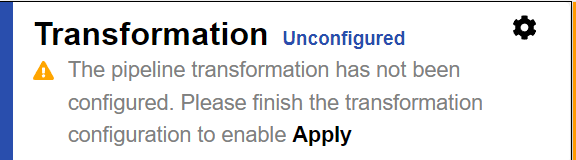

# Transformation configuration

The transformation configuration contains the logic to translate a change in a source to an operation in the destination. The transformation can consist of attribute mappings and/or script logic. When deciding if the transformation configuration should use attribute mappings and/or scripting, keep the following in mind.

- When attribute mappings are used, the default behavior for processing insert and update source events is to translate the event into either an insert or update on the target. The [Destination DN](attribute-mappings.md#destination-dn) expression is used to find the target entry (lookup to see if the entry exists, to determine if an insert or update is needed). If the entry exists in the target and an insert event is detected in the source, the entry in the target is updated. If an update event happens in the source, and the entry does not exist in the target, it is inserted. If you don't want this default behavior, use a transformation script and customize the logic instead of using attribute mappings.
- Delete events are processed as deletes in the destination. If you need to translate a delete event into an update event (e.g. set `isActive=false`), then use a transformation script and customize the logic instead of using attribute mappings.

To configure the transformation:

1. From the Main Control Panel > Global Sync Tab, select the topology on the left.
1. On the right, select **Configure** on the pipeline.
1. Select the Transformation component and choose the Transformation Type; Mappings, Script, or Script and Mappings. Depending on the type selected, new sections are displayed.

