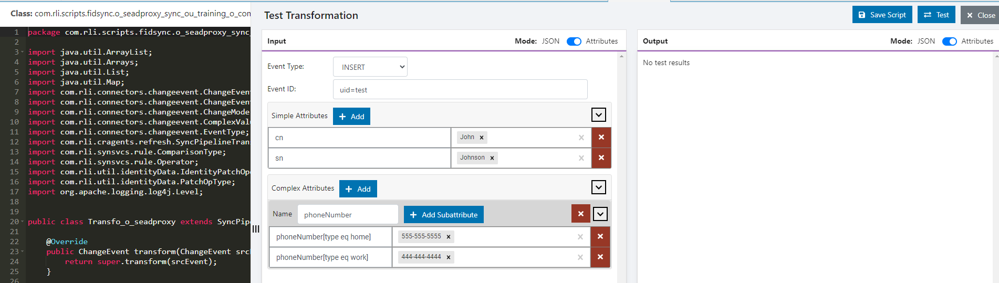

# Test Rules

You can test your rules by emulating changes from the source.

1.  On the Main Control Panel -> Global Sync tab, select the topology on the left.

2.  Select **Configure** next to the pipeline on the right.

3.  Select the **Transformation** component and choose **Rules-based Transformation** from the **Transformation Type** drop-down list.

4.  Expand the **Rules** section that appears below the **Transformation Type** and select .

5.  Select **Test** in the top right corner.

6.  Select the source event type (e.g. **Insert**, **Update**, **Delete**) to test.

7.  Enter an Event ID. This is a DN that matches the location in the RadiantOne namespace for the source entries. (e.g. `uid=Aaron_Medler,ou=Accounting,o=companydirectory` assuming `o=companydirectory` is the source naming context in RadiantOne).

8.  Add source attribute names and values. Attribute names are in the left column and corresponding value in the right column. Select in the cell, type the value and select **Enter**. Attribute types can be simple or complex. The definitions for "simple" and "complex" are based on SCIM (<http://www.simplecloud.info/specs/draft-scim-core-schema-01.html>). Use the red **X** button next to the attribute to remove it from the test.

Example - Entering Attributes for Testing Script
<!-- markdownlint-disable ol-prefix -->
9. Select **Test**.

10.  The results of the script logic are shown in the Output section.

11.  When you are finished testing the mappings, select **CLOSE** to go back to the "Configure Pipeline" screen.
<!-- markdownlint-enable ol-prefix -->
