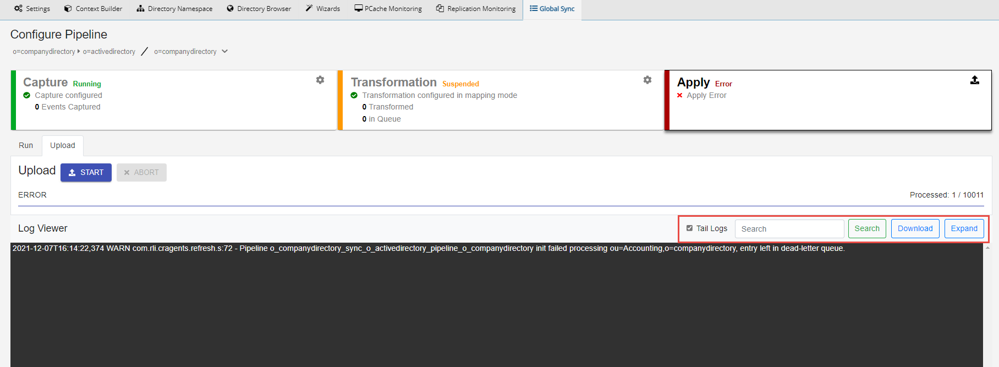
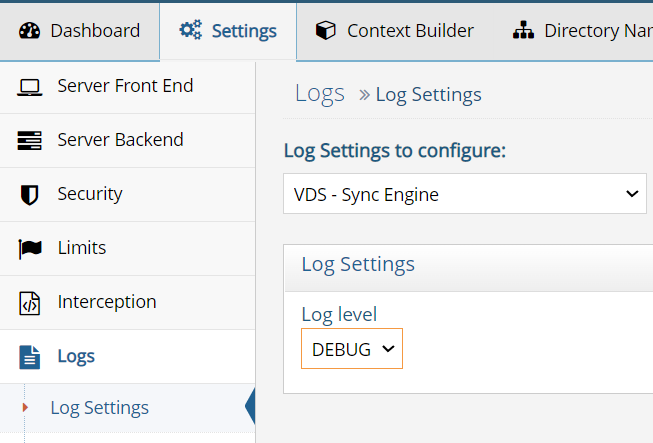
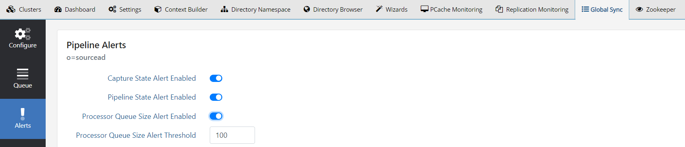
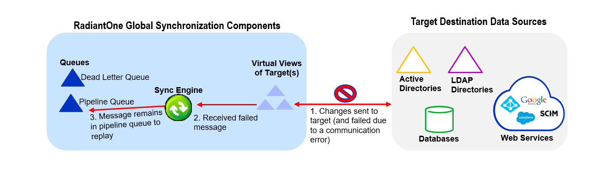
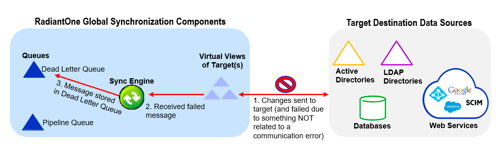
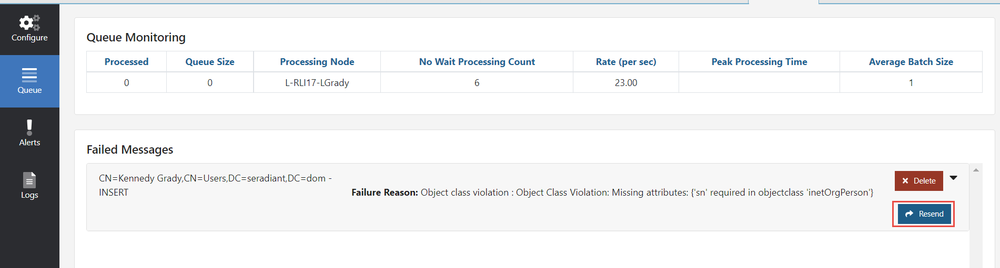

# Deployment

## Fault tolerance and recovery

The components required for synchronization are: Agents, Queues, and Sync Engine/processor. These components ensure guaranteed message delivery and recoverability in case some part of the process is temporarily down/offline. The components and their functionality are introduced in [Architecture](introduction.md#architecture). When RadiantOne is deployed in a cluster, the fault tolerance and recoverability of these components is built into the architecture. This topic is described below.

The queuing system uses RadiantOne Universal Directory stores which are automatically replicated via block replication across all cluster nodes. The Agent and Sync Engine are managed internally by the RadiantOne service. There is always one Agent running in the cluster. There is a sync engine process on each node handling the processing for a set of pipelines which are allocated by the RadiantOne service.

The agent starts automatically once a global sync pipeline is configured. This component manages the change-capture connectors, which includes, deploying, stopping/suspending and starting them as needed. The agent can run on any type of RadiantOne cluster node (follower or leaders) and there is only one agent running at any given time in a RadiantOne cluster. The agent does not consume a lot of memory, and they are not CPU-intensive, so there is no point in running multiple processes to distribute connectors on multiple nodes. One agent is enough per cluster and makes things simpler. To determine the node where the agent is running, run `{RLI_HOME}/bin/monitoring.bat` (`.sh` on Linux) `-d pipeline` to locate your sync process and the value of the `"captureHostname"` propertyId value indicates the machine where the agent is running. Knowing which RadiantOne node the agent is running on is required for certain monitoring and for knowing which node contains the connector log files.

A sync engine/processor starts automatically on all RadiantOne cluster nodes once a global sync pipeline is configured. The distribution of pipeline processing across all sync engines is handled automatically by the RadiantOne service. The sync engines process the transformations associated with their assigned pipelines and send changes to the destination.

If a RadiantOne node fails, the following activities occur:

- The agent is automatically started on another cluster node and this agent starts the capture connectors. The configurations of the capture connectors (e.g. cursor value and properties) are stored locally in a RadiantOne Universal Directory store which is automatically replicated across all cluster nodes. This allows connectors to restart capturing changes from where they left off.
- The queues that store messages waiting to be processed by the sync engine are also automatically replicated across all cluster nodes. All unprocessed messages in the queues will get processed by the new sync engine that is assigned for the pipeline.
- RadiantOne distributes the pipeline processing that was handled by the failed node to a new sync engine running on another node.

A high-level diagram depicting the Global Sync recovery in case a node fails is shown below.

## Secure access to the queues

The Agent and Sync Engine process read and/or write into the queues using the credentials configured in the RadiantOne data source named: vdsha

You can view this data source configuration from Main Control Panel > Settings > Server Backend > LDAP Data Sources.

For security reasons, the user account (Bind DN) you have configured in the vdsha data source should be the only one allowed to access the `cn=queue` and `cn=dlqueue` naming contexts.

Configure access controls for these root naming contexts from Main Control Panel > Settings > Security > Access Control. Access should only be allowed for the account configured in the vdsha data source. For details on configuring access controls, see the RadiantOne System Administration Guide.

## Manage synchronization

### View logs

Transformation and apply components log to `{RLI_HOME}\vds_server\logs\sync_engine\sync_engine.log` on the RadiantOne node where the sync engine processor that is assigned for the pipeline is running. If RadiantOne is deployed in a cluster, a sync engine processor can be running on one or more nodes and the pipeline processing is distributed across them. Check for the `{RLI_HOME}\vds_server\logs\sync_engine\sync_engine.log` on each cluster node to find the correct log file. Or you can use the Global Sync tab to download the corresponding sync_engine.log file by selecting the topology and selecting **Configure** next to the pipeline. Select the **Apply** component and in the Log Viewer section, select the **Download** button.

The upload process logs to the `{RLI_HOME}\vds_server\logs\sync_engine\sync_engine.log` on the RadiantOne node from where the upload was run. If there is an error during upload when using the Global Sync tab, the error is shown in the Log Viewer. You can search, download and expand the log file from here.

Capture connectors log activity to: `{RLI_HOME}\logs\sync_agents\{PIPELINE_ID}\connector.log` on the RadiantOne node where the sync agent is running. Run `{RLI_HOME}/bin/monitoring.bat` (`.sh` on Linux) `-d pipeline` to locate your sync process and the value of the `"captureHostname"` propertyId value indicates the machine where the connector.log is located.

The HDAP Trigger capture process logs to `{RLI_HOME}\vds_server\logs\sync_engine\sync_engine.log` on the RadiantOne node where the sync engine processor that is assigned for the pipeline is running. If RadiantOne is deployed in a cluster, a sync engine processor can be running on one or more nodes and the pipeline processing is distributed across them. Check for the `{RLI_HOME}\vds_server\logs\sync_engine\sync_engine.log` on each cluster node to find the correct log file. Or you can use the Global Sync tab to download the corresponding sync_engine.log file by selecting the topology and selecting **Configure** next to the pipeline. Select the **Apply** component and in the Log Viewer section, select the **Download** button. HDAP trigger events are logged with the keyword `"pipe-sync"` followed by the pipeline id. Make sure the  
VDS – Sync Engine log file level is set to **DEBUG**. You can check the log level from the Main Control Panel > Settings tab > Logs > Log Settings. Select **VDS - Sync Engine** from the drop-down list and make sure **Log Level** is set to **DEBUG**.

### Suspend synchronization components

Once a pipeline is configured, all synchronization components start automatically. For complete details on starting the synchronization components, please see the RadiantOne Deployment and Tuning Guide.

### Monitor the synchronization process

The number of entries processed and the number of entries queued by the Transformation component can be viewed from the Main Control Panel > Global Sync tab. Select the topology on the left. The pipelines displayed on the right indicate the number of entries processed by the transformation and apply connectors.

For complete details on monitoring Global Sync components, please see the RadiantOne Monitoring and Reporting Guide.

### Alerts

Default alerts are configured for all pipelines. The alerts are related to:

- The capture connector state.

- The pipeline state.

- The processor queue size.

Default alerts can be enabled on the Global Sync tab > selected topology. Select **Configure** next to the pipeline. In the options on the left, select **Alerts**.

#### Capture connector

When this alert is enabled, every time the capture connector state changes (e.g. a connector state changes from RUNNING to STOPPED or vice versa), a file alert is triggered in: `{RLI_HOME}/logs/alerts`.log

#### Pipeline state

When this alert is enabled, every time the pipeline state changes (e.g. a pipeline state changes to/from RUNNING, SUSPENDED, UPLOADING, ERROR, DEPLOYING, WAITING_FOR_AGENT), a file alert is triggered in: `{RLI_HOME}/logs/alerts.log`

#### Processor queue

When this alert is enabled, indicate a queue size threshold. The threshold size is the maximum number of entries in the queue awaiting processing. Once this number is reached, a file alert is triggered in `{RLI_HOME}/logs/alerts.log`. This indicates that messages are accumulating in the queue, and an administrator should check the apply process to see if there are issues causing the changes to not get processed and applied fast enough.

### Replay failed messages

Messages that fail to get successfully applied to a destination, are categorized due to either a connection error to the destination, or any other non-communication related error (e.g. object class violation).

### Failure due to communication error

When a change cannot be applied to a destination, and the error is due to a communication failure, the message is put back in the pipeline queue and replayed indefinitely.

>[!warning]
>Pay attention to the [time-to-live](concepts-and-definitions/queues.md#message-time-to-live) associated with messages in the pipeline queues. If messages cannot be applied to the target and continue to remain in the queue until the time-to-live period passes, the messages are deleted from the queue and cannot be recovered.

### Failure due to non-communication error

When a change cannot be applied to a destination, and the error is not due to a communication failure, the message is replayed for a configurable number of attempts. This is 5 attempts by default and is configurable in ZooKeeper at: `/radiantone/{VERSION}/cluster1/config/vds_server.conf`, the `refreshEngineEventErrorRetriesMax` property.

After the number of retries is exhausted, the message is written into the queue associated with the pipeline below `cn=dlqueue`.

#### Replay messages in the dead letter queue

To replay failed messages from the dead letter queue, you can use the vdsconfig command line utility with the following command.

`{RLI_HOME}\bin>vdsconfig dl-replay-sync-pipeline -pipelineid {PIPELINE_ID}`

See [Pipeline ID](concepts-and-definitions/topology.md#pipeline-id) for assistance with finding the pipelineId value to pass in the command.

Failed messages can also be replayed from the Main Control Panel > Global Sync tab. Select the topology and select **Configure** next to the pipeline. Select the **Queue** section on the left and locate the Failed Messages section. Select the **Resend** button next to the failed message that you want to be resent.

