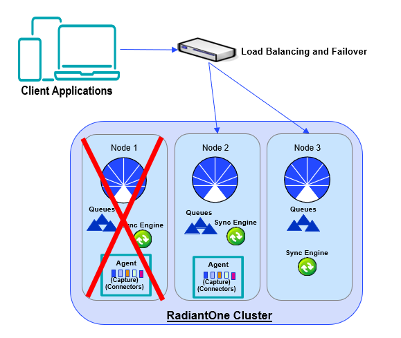

# Fault Tolerance and Recovery

The components required for synchronization are: Agents, Queues, and Sync Engine/processor. These components ensure guaranteed message delivery and recoverability in case some part of the process is temporarily down/offline. The components and their functionality are introduced in [Architecture](../introduction.md#architecture). When RadiantOne is deployed in a cluster, the fault tolerance and recoverability of these components is built into the architecture. This topic is described below.

The queuing system uses RadiantOne Universal Directory stores which are automatically replicated via block replication across all cluster nodes. The Agent and Sync Engine are managed internally by the RadiantOne service. There is always one Agent running in the cluster. There is a sync engine process on each node handling the processing for a set of pipelines which are allocated by the RadiantOne service.

High Availability of Global Sync Components

The agent starts automatically once a global sync pipeline is configured. This component manages the change-capture connectors, which includes, deploying, stopping/suspending and starting them as needed. The agent can run on any type of RadiantOne cluster node (follower or leaders) and there is only one agent running at any given time in a RadiantOne cluster. The agent doesn't consume a lot of memory, and they are not CPU-intensive, so there is no point in running multiple processes to distribute connectors on multiple nodes. One agent is enough per cluster and makes things simpler. To determine the node where the agent is running, run `{RLI_HOME}/bin/monitoring.bat` (`.sh` on Linux) `-d pipeline` to locate your sync process and the value of the `"captureHostname"` propertyId value indicates the machine where the agent is running. Knowing which RadiantOne node the agent is running on is required for certain monitoring and for knowing which node contains the connector log files.

Agent Node/host

A sync engine/processor starts automatically on all RadiantOne cluster nodes once a global sync pipeline is configured. The distribution of pipeline processing across all sync engines is handled automatically by the RadiantOne service. The sync engines process the transformations associated with their assigned pipelines and send changes to the destination.

If a RadiantOne node fails, the following activities occur:

- The agent is automatically started on another cluster node and this agent starts the capture connectors. The configurations of the capture connectors (e.g. cursor value and properties) are stored locally in a RadiantOne Universal Directory store which is automatically replicated across all cluster nodes. This allows connectors to restart capturing changes from where they left off.

- The queues that store messages waiting to be processed by the sync engine are also automatically replicated across all cluster nodes. All unprocessed messages in the queues will get processed by the new sync engine that is assigned for the pipeline.

- RadiantOne distributes the pipeline processing that was handled by the failed node to a new sync engine running on another node.

A high-level diagram depicting the Global Sync recovery in case a node fails is shown below.

Failure of a RadiantOne Node
