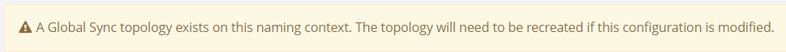

         
# Introduction

The RadiantOne Global Sync module is an advanced set of tools for synchronization and identity management. This module allows you to synchronize objects distributed across disparate data sources (directories, databases or applications): a change in an object in one source, at the attribute level, or for the whole object can be reflected into many other connected objects. Using a publisher/subscriber approach, any object can publish events (creation, deletion or modification for the whole object, or any attributes of this object) and propagate them to subscriber objects. User-defined attribute mappings and transformations can be applied during synchronization.

This guide introduces the Global Sync module and configuration details. For details on deploying the RadiantOne Platform please see the RadiantOne Deployment and Tuning Guide.

## Architecture

The Global Synchronization architecture is comprised of Agents, Queues, Sync Engine, Attribute mappings and transformation scripts.

Agents manage Connectors which are components used to interface with the data sources. Changes flow to and from the Connectors asynchronously in the form of messages. This process leverages queues to temporarily store messages as they flow through the synchronization pipeline. The attribute mappings and/or transformation scripts are processed by the Sync Engine prior to the events being sent to the target endpoints.

>[!important]
>All sources must have views mounted in the RadiantOne namespace to complete the synchronization configuration. To simplify management of the synchronization flows, it is recommended to have a dedicated section of the namespace for all source identity views. Once a view has been configured as a source for synchronization, no further changes should be made to the view (e.g. no object/attribute mapping changes, no adding/removing persistent cache, etc.). The Main Control Panel > Directory Namespace tab displays a warning for all source views that are configured for synchronization to avoid accidental configuration changes.

See the figure below for a high-level architecture of the synchronization process.

## How this Manual is Organized

This guide is broken down into the following chapters:

[Introduction](introduction.md)
This chapter offers a quick introduction to this guide in addition to how the manual is organized and how to contact Radiant Logic technical support.

[Concept and Definitions](concepts-and-definitions/terms-and-processes.md)
This chapter introduces the main concepts that are essential to understand for configuring and administering Global Synchronization.

[Configuration](configuration/overview.md)
This chapter describes how to configure synchronization.

[Uploads](uploads.md)
This chapter describes the upload process for scenarios where source entries must be populated into a destination before starting synchronization.

[Deployment](deployment.md#fault-tolerance-and-recovery)

This chapter describes a typical deployment architecture and how high availability is achieved. Details about managing synchronization, including where to find synchronization logs, how to suspend synchronization pipelines, and monitor synchronization activities can also be found in this chapter.

## Technical Support

Refer to the [Technical Support Guide](common-info/technical-support.md) for more information.

## Expert Mode

Some settings in the Main Control Panel are accessible only in Expert Mode. To switch to Expert Mode, select the **Logged in as**, (username) drop-down menu and select **Expert Mode**.

>[!note]
>The Main Control Panel saves the last mode (Expert or Standard) it was in when you log out and returns to this mode automatically when you log back in. The mode is saved on a per-role basis.
