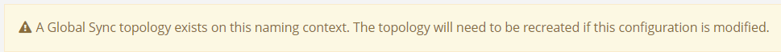
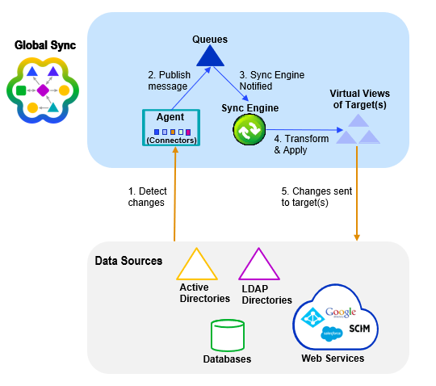
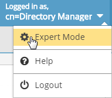

# Synchronization Introduction

At a basic level, the primary purpose of RadiantOne's synchronization engine is synchronizing objects across disparate data sources. It is a general-purpose synchronization tool that is designed for broad data integration use cases—it excels at reliably moving and reconciling data across systems. However, it is not built with the specialized workflow, advanced approval, and policy enforcement features required for end-to-end employee lifecycle management. Those capabilities are fundamental to identity governance platforms, which inherently handle complex role assignments, provisioning workflows, and audit requirements.

While it is technically possible to mimic aspects of that behavior by embedding business logic through custom Java scripting in the RadiantOne Synchronization tool, doing so introduces significant complexity. Each customization would require precise scripting, version control, and ongoing maintenance. This type of configuration becomes difficult to sustain over time and limits how effectively the Radiant Logic Support team can handle future troubleshooting or enhancement efforts.

For these reasons, it is more practical to leverage our synchronization tool for its intended purpose—data movement and attribute alignment—while relying on a dedicated IAM or workflow-based platform to manage the broader lifecycle orchestration. This approach ensures maintainability, audit readiness, and alignment with enterprise governance expectations.

>[!note] 
>If you have a RadiantOne license that entitles you to use synchronization, you will see a Synchronization tab in the Main Control Panel. Otherwise the tab doesn't show. 

## Architecture

The Synchronization architecture is comprised of Agents, Queues, Sync Engine, Attribute mappings and transformation scripts.

Agents manage Connectors which are components used to interface with the data sources. Changes flow to and from the Connectors asynchronously in the form of messages. This process leverages queues to temporarily store messages as they flow through the synchronization pipeline. The attribute mappings and/or transformation scripts are processed by the Sync Engine prior to the events being sent to the target endpoints.

>[!warning]
>All sources must have views mounted in the RadiantOne namespace to complete the synchronization configuration. To simplify management of the synchronization flows, it is recommended to have a dedicated section of the namespace for all source identity views. Once a view has been configured as a source for synchronization, no further changes should be made to the view (e.g. no object/attribute mapping changes, no adding/removing persistent cache, etc.). The Main Control Panel > Directory Namespace tab displays a warning for all source views that are configured for synchronization to avoid accidental configuration changes.

See the figure below for a high-level architecture of the synchronization process.

## How this manual is organized

This guide is broken down into the following chapters:

[Concept and Definitions](concepts-and-definitions/terms-and-processes.md)
This chapter introduces the main concepts that are essential to understand for configuring and administering synchronization.

[Configuration](configuration/overview.md)
This chapter describes how to configure synchronization.

[Uploads](uploads.md)
This chapter describes the upload process for scenarios where source entries must be populated into a destination before starting synchronization.

[Deployment](deployment.md#fault-tolerance-and-recovery)

This chapter describes a typical deployment architecture and how high availability is achieved. Details about managing synchronization, including where to find synchronization logs, how to suspend synchronization pipelines, and monitor synchronization activities can also be found in this chapter.

## Technical support

Refer to the [Technical support guide](../common-info/technical-support.md) for more information.

## Expert mode

Some settings in the Main Control Panel are accessible only in Expert Mode. To switch to Expert Mode, select the **Logged in as**, (username) drop-down menu and select **Expert Mode**.

>[!note]
>The Main Control Panel saves the last mode (Expert or Standard) it was in when you log out and returns to this mode automatically when you log back in. The mode is saved on a per-role basis.
