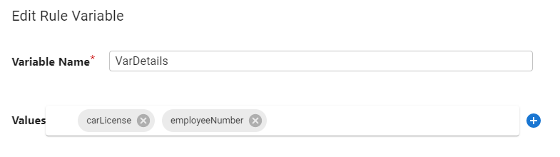

# Configure Rule Variables

Rule variables are configured in the RULE VARIABLES section of the Rule Set.

A variable can be defined to store a temporary value and used in a rule condition to apply a computation or more advanced logic. See [Variables](../concepts-and-definitions/sync-engine-and-transformation.md#variables) for more information.

>[!note]
>If you configure multiple values for a rule variable, it could be returned as a multi valued attribute (if all sources contribute a value). In the example below, the variable named `VarDetails` can be multi-valued with one value coming from the source `carLicense` attribute and one coming from source `employeeNumber`.

1.  In the Rule Variables section, select the button to create a new variable.

2.  Enter a variable name.

3.  (Optional) To add a constant value for the variable, select next to Values, select the **Constant** option from the drop-down list and enter the value. Select **OK** and **OK** again to close the Edit Rule Variable window.

4.  (Optional) A value of a variable can come from another variable. This can be a source attribute value or from another variable that has been defined. Select  next to Values, select the **Attribute** option from the drop-down list and then select the source attribute, or variable name from the drop-down list on the right. Select **OK** and **OK** again to close the Edit Rule Variable window.

5.  (Optional) To apply a function on a source attribute and store the computed value in a variable, select next to Values and select the **Function** option from the drop-down list. Select the **Edit** button, [select a function](../transformation/attribute-mappings.md#standard-functions-available) from the available list and select **Next**. The configuration screen and options vary depending on the function selected. After the function is configured, select **OK** and **OK** again to close the Edit Rule Variable window.

6.  (Optional) To [configure conditions](#configure-rule-variable-conditions) that dictate how and when the rule variable is populated, select **Start Condition**.

7.  Variables can be used when defining rule conditions by selecting the **Rule Variable Condition** from the **Condition Type** drop-down list. After all variables are defined, select the [RULES](../configure-rules/rules-configuration.md) section.

## Configure Rule Variable Conditions

You can configure one or more conditions that dictate the context in which the variable is populated with the configured value(s).

1.  On the Rule Variables tab, select a variable and select **Edit**.

2.  Select **Start Condition**.

3.  If you want multiple conditions, select `AND` Condition, or `OR` Condition. If you only need one condition, select `Condition Node`.

4.  If you selected `Condition Node` in the previous step, choose the **Condition Type** from the drop-down list. For a description of condition types, see [Variables](../concepts-and-definitions/sync-engine-and-transformation.md#variables). Based on the condition type selected, different settings are configurable. Your conditions can be a combination of different condition types. See [Configure Source Attribute Condition](#configure-source-attribute-condition), [Configure Source Event Condition](#configure-source-event-condition), [Configure Attribute Event Condition](#configure-attribute-event-condition), and [Configure Rule Variable Condition](#configure-rule-variable-condition-based-on-an-existing-rule-variable) for details.

>[!note]
>If you need another condition after selecting `Condition Node` (for one condition), select **Add Parent Condition** and choose either `AND` Condition or `OR` Condition. Then select  to add the new condition node (`AND` Condition or `OR` condition can be selected if you need nesting).
<!-- markdownlint-disable ol-prefix -->
5.  If you selected `AND` Condition or `OR` Condition in step three, select  and choose **Condition Node** (`AND` Condition or `OR` Condition can also be selected if you want nested conditions) and choose the **Condition Type** from the drop-down list. For a description of condition types, see [Variables](../concepts-and-definitions/sync-engine-and-transformation.md#variables). Based on the condition type selected, different settings are configurable. Your conditions can be a combination of different condition types. See [Configure Source Attribute Condition](#configure-source-attribute-condition), [Configure Source Event Condition](#configure-source-event-condition), [Configure Attribute Event Condition](#configure-attribute-event-condition), and [Configure Rule Variable Condition](#configure-rule-variable-condition-based-on-an-existing-rule-variable) for details.

6.  Select **OK** to close the Edit Rule Variable window.

7.  After all variables are defined, select the [RULES](../configure-rules/rules-configuration.md#rules-configuration) section.
<!-- markdownlint-enable ol-prefix -->
### Configure Source Attribute Condition

The Source Attribute condition type allows you to populate the rule variable when a source attribute contains a specific value based on a comparison operation and criteria.

1.  In the New Condition window, select **Source Attribute Condition** from the **Condition Type** drop-down list.

2.  Select the source attribute from the **Source Attribute** drop-down list.

3.  Select the operator to compare the source attribute value from the **Operator** drop-down list (e.g. **equals**, **not equals**, **starts with**, etc.).

4.  Depending on the operator chosen, you may have a Compare with: Constant Value setting where you can enter the value to compare with the source attribute.

5.  Depending on the operator chosen, you may have a Comparison Type property where you can choose how to handle the case of the attributes in the value (e.g. ignore case, numeric, regex, etc.).

6.  Select **OK**.

7.  Select **OK** to close the Edit Rule Variable window.

### Configure Source Event Condition

The Source Event condition type allows you to populate the rule variable when a specific type of event has occurred on the source entry.

1.  In the **New Condition** window, select **Source Event Condition** from the **Condition Type** drop-down list

2.  Select either **equals** or **not equals** to compare the event from the **Assert Equality** drop-down list.

3.  Select the type of event from the **Event Type** drop-down list (e.g. **Inserted Entry**, **Updated Entry**, etc.).

4.  Select **OK**.

5.  Select **OK** to close the Edit Rule Variable window.

### Configure Attribute Event Condition

The Attribute Event condition type allows you to populate the rule variable when a specific type of event has occurred on the source attribute.

1.  In the **New Condition** window, select **Attribute Event Condition** from the **Condition Type** drop-down list

2.  Select the type of event from the **Change Event** drop-down list (e.g. **Value(s) was added**, **Value(s) was deleted**, etc.).

3.  Select the attribute that the change event is to be checked for.

4.  Select **OK**.

5.  Select **OK** to close the Edit Rule Variable window.

### Configure Rule Variable Condition Based on an Existing Rule Variable

The Rule Variable condition type allows you to populate the rule variable when an existing rule variable contains a specific value based on a comparison operation and criteria.

1.  In the **New Condition** window, select **Rule Variable Condition** from the **Condition Type** drop-down list.

2.  Select the existing variable from the **Rule Variable** drop-down list.

3.  Select the operator to compare the existing variable value from the **Operator** drop-down list (e.g. **equals**, **not equals**, **starts with**, etc.).

4.  Enter the value to use for comparison in the Compare With: Constant Value property.

5.  Choose the Comparison Type (e.g. ignore case).

6.  Select **OK**.

7.  Select **OK** to close the Edit Rule Variable window.

## Edit Rule Variables

1.  On the Rule Variables tab, select a variable and select **Edit**. Change the variable and select **OK**.

2.  If you want to delete a local variable, select the variable and select **Delete**.

3.  After all variables are defined, select the [RULES](../configure-rules/rules-configuration.md#rules-configuration) section.
