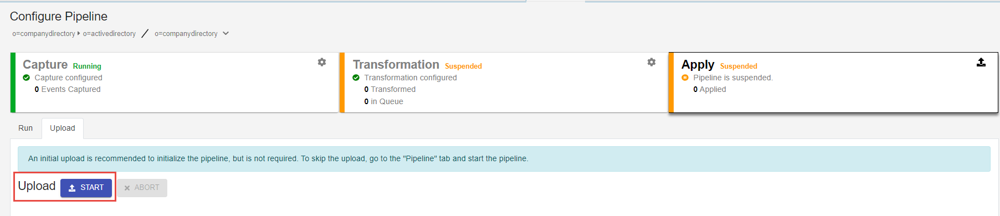
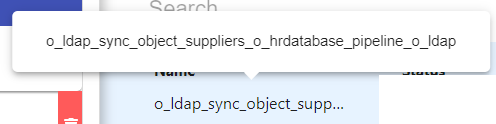

# Uploads

If the target/destination needs populated with entries before starting synchronization, perform an initial upload. Uploads can be performed from the Main Control Panel or from a command line utility.

## Upload from the main control panel

1. Go to the Main Control Panel > Global Sync Tab.
1. Select the desired topology from the list of topologies on the left.
1. Select **Configure** next to the pipeline on the right.
1. Select the **Apply** component.
1. Select **START** next to **Upload**. Once the upload is finished, the synchronization components are automatically started.

## Upload from the command line utility

To run an upload from command line, you can use `{RLI_HOME}/bin/vdsconfig.bat init-sync-pipeline -pipelineid {PIPELINE_ID}`

PipelineId is the name of the pipeline. You can view this from the Main Control Panel > Global Sync tab. Select the topology on the left. On the right, hover over the Pipeline Name:

In the example in the screen above, the `pipelineId` value is: `o_ldap_sync_object_suppliers_o_hrdatabase_pipeline_o_ldap`

>[!note]
>You can use the vdsconfig.bat command line tool with the `list-topologies` command to get a list of topology IDs and pipeline IDs.
