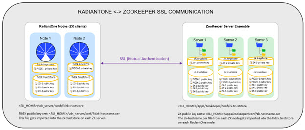

# Chapter 1: Securing RadiantOne Configuration and Administration

The options available for securing the RadiantOne configuration and administration are discussed in this chapter. 

## Protect and Monitor Access to the Directory Manager Account

The directory manager account (e.g. cn=Directory Manager by default, this is defined during RadiantOne installation) is a super user account that is managed locally by RadiantOne without password or lockout policies. To mitigate against online password cracking attacks against this account, use a strong password that is:

- At least 9 characters long
- Does not contain any dictionary words
- Contains a mixture of uppercase, lowercase, numbers and special characters

Provide this password only to trusted administrators with business need for super user access. Other accounts used by RadiantOne are managed by backend data sources and subject to lockout policies associated with those backend data sources.

## Limit Usage of Directory Manager Account

Knowledge and usage of the RadiantOne super user (e.g. cn=Directory Manager) credentials should be limited. It is highly recommended to use the delegated administrator accounts to manage RadiantOne configuration instead of the super user account. Add your users to the
appropriate delegated administrator groups to define the roles they should have for managing the RadiantOne configuration. For details on what activities the delegated administrators can perform, please see the RadiantOne System Admin Guide.

For details on updating the RadiantOne super user (e.g. cn=directory manager) credentials, see the RadiantOne System Administration Guide.

<!--

## Limit Access as Directory Manager to Specific Clients

To help prevent against the unwarranted use of the directory administrator account, you can set specific IP addresses from where the directory administrator account can connect to the RadiantOne service from. This value can be a single IP address or a list of IP addresses separated by a comma. The syntax can also support a range of IP addresses. Both IPv4 and IPv6 addresses are allowed and a mix of both is supported.

This parameter can be changed in the Main Control Panel > Settings Tab > Administration section. On the right side, set the value below the Allowed IPs parameter.

>[!warning] 
>If you use this setting, you must list the IP address of each RadiantOne node in addition to the addresses from all servers you want the directory administrator to connect from. If RadiantOne is deployed in a cluster, you must list all IP addresses for all nodes.

For more details and example syntax, please see the RadiantOne System Administration Guide.

-->

## Update Default Delegated Admin Account Passwords

There are eight groups used for delegated administration are Directory Administrator, Namespace Administrator, Operator, Schema Administrator, ACI Administrator, ICS Administrator, ICS Operator, and one role for Read Only access. Default administrative users are included as members of these groups. They are as follows:

uid=aciadmin,ou=globalusers,cn=config
Member of the ACI Administrator Group.

uid=icsadmin,ou=globalusers,cn=config
Member of the ICS Administrator Group.

uid=icsoperator,ou=globalusers,cn=config
Member of the ICS Operator Group.

uid=namespaceadmin,ou=globalusers,cn=config
Member of the Namespace Administrator Group.

uid=operator,ou=globalusers,cn=config
Member of the Operator Group.

uid=readonly,ou=globalusers,cn=config
Member of the Read Only Group.

uid=schemaadmin,ou=globalusers,cn=config
Member of the Schema Administrator Group.

uid=superadmin,ou=globalusers,cn=config
Member of the Directory Administrator Group.

You can use these default users for delegated administration of RadiantOne activities, or you can add your own users to the various admin roles as described in the Managing Delegation Administration Roles section in the RadiantOne System Administration Guide. To use the default users, you can log in to the Main Control Panel with any of the following (depending on the configuration you want to manage). For details on the privileges and associated activities these users can perform, please see the RadiantOne System Administration Guide.

user: aciadmin
password: <set to the same password you defined for the super user (cn=directory manager)
during the installation>

user: icsadmin
password: <set to the same password you defined for the super user (cn=directory manager)
during the installation>

user: icsoperator
password: <set to the same password you defined for the super user (cn=directory manager)
during the installation>

user: namespaceadmin
password: <set to the same password you defined for the super user (cn=directory manager)
during the installation>

user: operator
password: <set to the same password you defined for the super user (cn=directory manager)
during the installation>

user: readonly
password: <set to the same password you defined for the super user (cn=directory manager)
during the installation>

user: schemaadmin
password: <set to the same password you defined for the super user (cn=directory manager)
during the installation>

user: superadmin
password: <set to the same password you defined for the super user (cn=directory manager)
during the installation>

By default, the password for the delegated admin accounts is set to the same password you defined for the super user (cn=directory manager) during the installation of RadiantOne. It is recommended that you change these passwords to match your company security policy and/or follow the same recommendations as detailed in [Protect and Monitor Access to the Directory Manager Account](#protect-and-monitor-access-to-the-directory-manager-account). You can also define strong [password policies](#configure-strong-password-policies) to ensure further protection of these accounts. Or you can delete the default users and assign your own.

To change the password:

1. Log in to the Main Control Panel as the directory manager and select the Directory Browser tab.
2. Navigate below cn=config > ou=globalusers.

3. Select the entry representing the user whose password you want to change. On the right side, select the userPassword attribute.
4. From the Modify Attribute drop-down menu, select Edit. An editable userpassword field displays above the attribute list.
5. Change the value here in the userpassword field. Click OK.

Below is an example of changing the aciadmin user’s password.


Figure 1.1 : Changing Passwords

### Configure Strong Password Policies

RadiantOne offers advanced password policy settings that can be a combination of the following:

- Allowing users to change their own passwords (require existing password to change).
  
- Password strength (minimum length, required uppercase characters, required special characters, required digits and required lowercase characters, required to pass a dictionary check).
  
- Password history (prevent password re-use).
  
- Forcing passwords changes after reset.
  
- Maximum password age.
  
- Allowing grace logins after password expires.
  
- Multiple password storage schemes are supported (e.g. Salted SHA-1, Salted SHA-256, Salted SHA-384, Salted SHA-512, BCrypt, SCrypt, and PBKDF2)
  
- Account lockout – if a user has not authentication successfully for longer than a specified period of time or if a user has reached the failed login threshold.
  
- Account expiration.

For details on password policy properties, see the RadiantOne System Administration Guide.

## Assign Appropriate Personnel to Delegated Administration Roles

There are eight default delegated administration groups/roles available for managing the RadiantOne configuration. Only members of these groups can login to the Main Control Panel.

The eight groups used for delegated administration are Directory Administrator, Namespace Administrator, Operator, Schema Administrator, ACI Administrator, ICS Administrator, ICS Operator, and one role for Read Only access. To add or remove members, log into the Main Control Panel as the super user and click on the Directory Browser tab. Navigate below ou=globalgroups,cn=config node to locate all of the groups. Select the group you want to manage and click the Manage Group button. From here you can remove users from groups and search for new users (located anywhere in the RadiantOne namespace) to add to groups. For complete configuration steps, see the RadiantOne System Administration Guide.

It is recommended that only users required to configure and administer RadiantOne get assigned to these groups.

### Leverage PIV Cards to Login to the Control Panel

Log into the Control Panel using a PIV Card/Certificate as an alternative to using username and password. For details on this configuration, please see the RadiantOne System Administration Guide.

<!-->
### Configure SSL between RadiantOne and ZooKeeper

By default, communication between RadiantOne (client) to ZooKeeper is over a non-SSL port. The basic configuration and state information that are stored in ZooKeeper pose a generally low security risk. However, if your corporate policies dictate that all internal services must connect to each other via SSL/TLS, you can configure this secure connection between RadiantOne nodes and ZooKeeper. A high-level architecture depicting the certificates involved is shown below.



The configuration of SSL between RadiantOne and ZooKeeper must be configured after installation. When you install RadiantOne, make sure you indicate the ZooKeeper connection using the hostname and not the IP address as it must match the hostname (or SAN) of the ZooKeeper server certificates.

>[!warning] 
>If you use SSL connectivity between RadiantOne and ZooKeeper nodes, take note that the non SSL port 2181 is still open in ZooKeeper. The following link explains the problem:
https://issues.apache.org/jira/browse/ZOOKEEPER-3166. The work-around is to use firewall rules to block traffic on that non-ssl port in ZooKeeper.

As outlined in the diagram above, each node (RadiantOne and ZooKeeper nodes) currently maintains their own certificate truststores. The following steps outline the overall process and use the default certificates included in the installation. For production, you will replace these certificates with your own CA-signed ones, and if you use a known/trusted Certificate Authority then you shouldn’t need to import the public key certificates into all the corresponding truststores (as outlined in the steps below). For test environments, you can follow the steps below to configure mutual authentication.

1. Copy the ZooKeeper public key certificate (<ZooKeeperInstall>/rli-zookeeper-external/zookeeper/conf/zk<hostname>.cer file) from each ZooKeeper server to each RadiantOne node.


2. Copy the ZooKeeper public key certificate (<ZooKeeperInstall>/zookeeper/conf/zk<hostname>.cer file) from each ZooKeeper node to all other ZooKeeper nodes. Each ZooKeeper node should have the corresponding public key certificate for all other nodes in the ensemble.


3. On each RadiantOne node, import the zk<hostname>.cer files into <RLI_HOME>/vds_server/conf/fidzk.truststore. This can be done with keytool. An example is shown below, your install paths and keystore password may vary.

```sh
    <RLI_HOME>\jdk\bin\keytool -import -alias zk:E1WIN1 -keystore
    C:\radiantone\vds\vds_server\conf\fidzk.truststore -file
    C:\radiantone\vdsv7311\certs\zkDOC-E1WIN1.cer -storepass radiantlogic -storetype
    JKS –noprompt
```    


4. Copy the RadiantOne public key certificate (<RLI_HOME>/vds_server/conf/fidzk-<hostname>.cer file) from each RadiantOne node to each ZooKeeper server. An example is shown below, your install paths may vary.


5. On each ZooKeeper server, import the fidzk-<hostname>.cer files into
    <ZooKeeperInstall>/zookeeper/conf/zk.truststore. This can be done with keytool. An example is shown below, your install paths and keystore password may vary.

```sh
<ZooKeeperInstall>/rli-zookeeper-external/jdk/bin/keytool.exe -import -alias fidzk:W-RLI10-LISAPC -keystore 
C:\ZooKeeper\rli-zookeeper-external\zookeeper\conf\zk.truststore -file C:\ZooKeeper\rli-zookeeper-external\fidzk-W-RLI10-LISAPC.cer -storepass radiantlogic -storetype JKS –noprompt
```


6. On each ZooKeeper server, import the zk-<hostname>.cer files (corresponding to all other servers in the ZooKeeper ensemble) into <ZooKeeperInstall>/rli-zookeeper-external/zookeeper/conf/zk.truststore. This can be done with keytool. An example is shown below, your install paths and keystore password may vary.

```sh
<ZooKeeperInstall>/rli-zookeeper-external/jdk/bin/keytool.exe -import -alias zk1:zkDOC-E1WIN1 -keystore C:\ZooKeeper\rli-zookeeper-external\zookeeper\conf\zk.truststore -
file C:\ZooKeeper\rli-zookeeper-external\zkDOC-E1WIN1.cer -storepass radiantlogic -storetype JKS -noprompt
```


7. On each ZooKeeper server, modify <ZooKeeperInstall>/rli-zookeeper-external/zookeeper/conf/zoo.cfg and set the secureClientPort and sslQuorum (they are in the file, so you can uncomment them by removing the # at the beginning of the line).

    An example is shown below.

    ```sh
    <br>secureClientPort=2155
    <br>sslQuorum=true
    ```

8. (Optional) to allow both non-SSL and SSL access to ZooKeeper, uncomment
    portUnification=true and/or client.portUnification=true in the zoo.cfg file on each
    ZooKeeper server.
9. On each RadiantOne node, modify <RLI_HOME>\vds_server\conf\cloud.properties and add zk.client.isSSL=true.
10. Change the zk.client.port and zk.servers properties in the cloud.properties file to match the secureClientPort you set in the ZooKeeper zoo.cfg file. An example is shown below.


11. Stop the RadiantOne service on all nodes.
12. Stop all ZooKeeper services in the ensemble.
13. Restart the ZooKeeper services one at a time until all servers are back online.
14. Restart the RadiantOne service on all nodes. <!--Once the RadiantOne service is back online, you should see the Main Control Panel > Dashboard tab indicate the ZK SSL port.

#### Using Your Own Certificates

Environment variables can be used to indicate your own keystores (the type will be inferred from the filename .pem, .p12 or .jks. If there is no extension, then JKS is the default type used):

For ZooKeeper Servers:

"ZK_KS_PASS" = ZK Keystore pass

"ZK_KS_PATH" = ZK Keystore path

"ZK_TS_PASS" = ZK Truststore pass

"ZK_TS_PATH" = ZK Truststore path


For RadiantOne Servers:

"ZK_CLIENT_KS_PASS" = RadiantOne Keystore pass for ZK

"ZK_CLIENT_KS_PATH" = RadiantOne Keystore path for ZK

"ZK_CLIENT_TS_PASS" = RadiantOne Truststore pass for ZK

"ZK_CLIENT_TS_PATH" = RadiantOne Truststore path for ZK

### ZooKeeper ACLs

Best practice is to tighten the ZooKeeper ACLs when deploying RadiantOne in production.

ZooKeeper Usage:

- /zookeeper - Node stores metadata of ZooKeeper itself.
- /zookeeper/quota - Stores quota information.
- /zookeeper/config - Stores the current dynamic configuration.

Default ACLs:

- /zookeeper - world:anyone:cdrwa
- /zookeeper/quota - world:anyone:cdrwa
- /zookeeper/config - world:anyone:r

To limit client access to ZooKeeper to only RadiantOne (the user/creds in cloud.properties), you can use the following command:

```sh
<RLI_HOME>/bin/advanced/cluster.bat enforce-zk-system-acl
```