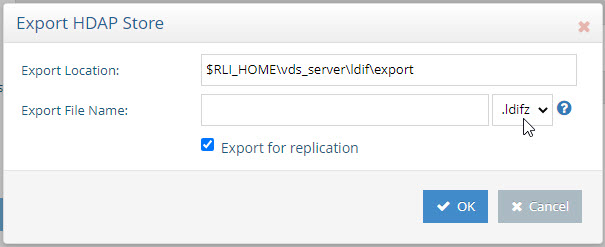

# Chapter 3: Recommendations for Securing Data at Rest

## Delete Global Read Access and Assign Finer-Grained Access Controls

When the RadiantOne service receives a request, it uses the user in the bind operation, and the
access control instructions (ACIs) defined to allow or deny access to directory information. The
service can allow or deny permissions such as read, write, search, or compare.

With ACI, you can control access to targets such as:

- the entire RadiantOne namespace
- a specific subtree
- specific entries in the RadiantOne namespace
- a specific set of entry attributes
- specific entry attribute values.

You can define access to the following subjects:

- a particular user
- all users who belong to a specific group
- all users in the directory
- a specific client identified by its IP address (or range of addresses)
Access controls are set from the Main Control Panel > Settings Tab > Security section >
Access Control sub-section.

By default, all users have read access to all naming contexts in RadiantOne for search,
compare, and read operations. This includes read access to the RadiantOne directory RootDSE
(accessible by requested an empty base DN).

This default access control can be removed from the Main Control Panel ->
Settings Tab > Security section > Access Control. Click root on the right and select the
configured access control described as “grant read access to anyone”. Then click on the Delete button.

>**IMPORTANT NOTE – If you delete the default read access, this does not delete read access to the RootDSE for RadiantOne. If you want to remove public access to the RootDSE, check the Enable RootDSE ACI option after you delete the default global read access. This denies access to the RootDSE to everyone except cn=directory manager. You can also add a new ACI that
dictates RootDSE access. Below is an example of allowing public access to the RootDSE:**

>**(target="ldap:///")(targetscope="base")(targetattr="*")(version 3.0; acl
"RootDSE accessible to public"; allow (read,search,compare)
userdn="ldap:///anyone";)**

Although there is not an absolute requirement, it is generally recommended to define all your
access controls at the root level so you can come back to this single level and see all configured
access controls across the entire RadiantOne namespace. When you define the actual ACI at
the root level, you can set the Target DN to only the applicable branch in the namespace you
want to protect.

For details on defining access controls, please see the RadiantOne System Administration
Guide.

## Turn off Anonymous Access

Depending on the needs of the applications that are consuming the RadiantOne service,
anonymous access may be disabled. Remember this is access (authorization) NOT binding
(authentication)

Anonymous access can be disabled from Main Control Panel > Settings tab > Security section > Access Control. Uncheck the Allow Anonymous Access option.

## Turn on Bind Requires Password Setting

If the Bind Requires Password setting is enabled, and no password is specified in the bind request, the RadiantOne service tries to bind the specified user and returns an invalid credential error to the client.

If Bind Requires Password is not enabled, and a bind request comes in with a valid user DN and no password, it is considered an anonymous bind.

This setting can be enabled from Main Control Panel > Settings tab > Security section >
Access Control. Check the Bind requires a password option.

## Define a Global Authentication Strength

Global Authentication Strength is used to specify that a client must bind to the RadiantOne service by using a specific authentication method. The values supported are: None, Simple (e.g. bindDN+password), SSL (require SSL/TLS or StartTLS), or SASL. The SASL mechanisms supported are DIGEST-MD5, GSSAPI, GSS-SPNEGO, or EXTERNAL (e.g. certificate-based authentication).

This setting can be enabled from Main Control Panel > Settings tab > Security > Authentication Methods. On the right, navigate to the Global Authentication Strength section and select an option from the drop-down list. For more details, see the RadiantOne System Administration Guide.

## Define Strong Password Policies

RadiantOne offers advanced password policy settings to control everything from password strength, account locking and expiration, and grace logins. For more details, see [Configure Strong Password Policies](02-client-access-limits-and-regulations.md#configure-strong-password-policies).

## Use Multi-Factor Authentication

RadiantOne includes a framework for calling custom authentication services like RSA SecurID
and Yubicloud. This allows standard LDAP applications to benefit from stronger, multi-factor
security without requiring any changes to their authentication logic. Users of the application can
login with their existing ID and password + tokencode/One Time Password (OTP). RadiantOne
translates the standard LDAP authentication (bind) request into a validation of the user’s
password to the authoritative source (whether that is local in a RadiantOne Universal Directory
stored, or some other authoritative backend) and a call to your specialized authentication
service like RSA SecurID (or others) to validate the rest of the credentials. The custom
authentication service may provide validation for the entire credentials (e.g. user’s password
plus additional tokencode/pin/OTP) or just a portion of the credentials (e.g. just validate the
tokencode/pin). For details on using RSA SecurID or Yubikey, see the Custom Authentication
Providers Guide. For details on configuring your own custom authentication provider, see the
System Administration Guide.

## Use Least Privilege Accounts for Backend Connections

RadiantOne connects to backends using the credentials defined in the data sources. When
defining data sources, use credentials associated with an account that has the needed
permissions required by RadiantOne. For example, if the backend information exposed in the
RadiantOne namespace is to be read-only, use credentials for a read-only account in the data
source. If certain attributes exposed in the RadiantOne namespace must be updateable by
clients, use an account with permissions to update this information in the backend when
defining the data source. It is always recommended to use least privilege accounts in the
RadiantOne data source configurations.

## Encrypt Attributes in RadiantOne Universal Directory Stores

Attribute encryption protects sensitive data while it is stored in RadiantOne Universal Directory
stores. You can specify that certain attributes of an entry are stored in an encrypted format. This
prevents data from being readable while stored in the RadiantOne Universal Directory stores,
backup files, and exported LDIF files. Attribute values are encrypted before they are stored, and
decrypted before being returned to the client, as long as the client is authorized to read the
attribute (based on ACLs defined in RadiantOne), is connected to RadiantOne via SSL and not
a member of the special group containing members not allowed to get these attributes (e.g.
cn=ClearAttributesOnly,cn=globalgroups,cn=config). For details on this special group, please
see the RadiantOne System Administration Guide.

You can use your own security key (Customer Master Key) for attribute encryption via AWS
KMS. For details on using AWS KMS, see the RadiantOne System Administration Guide.

For details on configuring attribute encryption, see the RadiantOne Namespace Configuration
Guide.

For details on deploying RadiantOne in FIPS-mode, to ensure all cryptographic operations are
performed using a FIPS 140-2 certified module, see the RadiantOneFIPS_Mode Guide.

## Use Zipped and Encrypted LDIF Files

When exporting (or initializing) RadiantOne Universal Directory stores or persistent cache
stores, choose to use LDIFZ file types (which are zipped and encrypted) instead of classic LDIF
files. LDIFZ files are encrypted using the security key defined in RadiantOne. For details on
creating a security key, see the RadiantOne System Administration Guide.

You can use your own security key (Customer Master Key) for attribute encryption via AWS
KMS. For details on using AWS KMS, see the RadiantOne System Administration Guide.

For details on exporting Universal Directory stores using LDIFZ, see the RadiantOne
Namespace Configuration Guide. For details on exporting persistent cache stores using LDIFZ,
see the RadiantOne Deployment and Tuning Guide.

## Avoid Displaying Sensitive Attributes in Log Files

Configure sensitive attributes in the Main Control Panel > Settings > Server Front End >
Attribute Handling -> Attributes Not Displayed in Logs setting. This property allows you to
control which attribute values are not printed in clear in the RadiantOne logs. If you do not want
certain attribute values printed in clear in the logs, you can indicate them here. Each attribute
name should be separated with a single space. Any attribute indicated here has a value of *****
printed in the logs instead of the value in clear.

>**IMPORTANT NOTE – If Interception Scripting is used, remove or comment out
the following line from each method to avoid cleartext passwords being written
to log files: prop.list(System.out)**

## Avoid Displaying Sensitive Changelog Attributes

When entries change, the change log reports the attributes under its "changes" attribute. This
may pose a security risk if sensitive attributes have been changed and the change log is
searchable by outside applications such as sync connectors. To eliminate this risk, the Excluded
Change Log Attributes option allows you to exclude selected attributes from members of the
“ChangelogAllowedAttributesOnly” group. Though these attributes are logged in the change log,
they are not returned for these group members when performing a search on the change log.
For more information, refer to the RadiantOne System Administration Guide.

## Secure Access to the Global Sync Queues

For Global Sync deployments, the Agent and Sync Engine process read and/or write into the
queues using the credentials configured in the RadiantOne data source named: vdsha

You can view this data source configuration from Main Control Panel > Settings > Server Backend > LDAP Data Sources.

For security reasons, the user account (Bind DN) you have configured in the vdsha data source
should be the only one allowed to access the cn=queue and cn=dlqueue naming contexts.

Configure access controls for these root naming contexts from Main Control Panel > Settings > Security > Access Control. Access should only be allowed for the account configured in the
vdsha data source. For details on configuring access controls, see the RadiantOne System
Administration Guide.

## Enable FIPS Mode

For details on deploying RadiantOne in FIPS-mode, to ensure all cryptographic operations are
performed using a FIPS 140-2 certified module, see the RadiantOneFIPS_Mode Guide.

Once FIPS-mode is enabled, go to the Main Control Panel -> Settings tab -> Security ->
Attribute Encryption and define the security keys for attribute encryption and LDIFZ attribute
encryption.

### RadiantOne Universal Directory (HDAP) Stores Attribute Encryption

Attribute encryption protects sensitive data while it is stored in RadiantOne. Attribute encryption
allows you to specify that certain attributes of an entry are stored in an encrypted format. This
prevents data from being readable while stored in RadiantOne Universal Directory stores,
persistent cache, backup files, and exported LDIF files.

There are two items to configure. One is the criteria for the key generation used to
encrypt/decrypt the attributes. Two is the list of attributes you want to encrypt.

#### Key Generation

To define the criteria used to generate an encryption key:

1. Navigate to Main Control Panel > Settings Tab > Security section > Attribute Encryption sub-section.
2. On the right, click Define Key Generation.
3. Select the desired cipher from the drop-down list.
4. Enter a security key. This value is used to auto-generate an encryption key. If you plan on deploying multiple clusters that will participate in inter-cluster replication for encrypted attributes, take note of the value you enter here as you must use it when configuring the security key in the other clusters.

An encryption key is auto-generated based on the cipher and security key value provided. This
key is used across nodes in a cluster to encrypt/decrypt the attributes configured for encryption.
If inter-cluster replication is deployed, all clusters must be configured with the same cipher and
security key.

#### Attributes to Encrypt

No attributes are encrypted by default. To configure a list of attributes to encrypt:

1. Navigate to the RadiantOne Universal Directory (HDAP) store (or configured persistent  cache branch) on the Main Control Panel > Directory Namespace tab.
2. Enter a comma-separated list of attribute names in the Encrypted Attributes property.
3. Click Save.
4. Click the Re-build Index button (if your configuration is an RadiantOne Universal Directory Store) or the Initialize button to reinitialize the cache (if your configuration is a Persistent Cache).

Attributes listed in the Encrypted Attributes property are added to the Non-indexed attribute list
by default. This means these attributes are not searchable by clients. Indexing encrypted
attributes is generally not advised as the index itself is less secure than the attribute stored in
Universal Directory stores/persistent cache. However, if you must be able to search on the
encrypted attribute value, it needs indexed. Only “exact match/equality” index is supported for
encrypted attributes. To make an encrypted attribute searchable, remove the attribute from the
list of nonindexed attributes and click the Re-build Index button or the Initialize button (to
reinitialize) if the branch is a persistent cache.

For more information about accessing encrypted attributes and changing the encryption key,
see the RadiantOne System Administration Guide.

### LDIF File Encryption

Using the LDIFZ format when exporting RadiantOne Universal Directory (HDAP) stores
produces a zipped and encrypted LDIF file. This prevents data from being readable while stored
in exported LDIF files.

#### Key Generation

To define the criteria used to generate an encryption key:

1. Navigate to Main Control Panel > Settings Tab > Security section > Attribute Encryption sub-section.
2. On the right, for LDIFZ Encryption Key, click Define Key Generation.
3. Select the desired cipher from the drop-down list.
4. Enter a security key. This value is used to auto-generate an encryption key. If you plan on deploying multiple clusters that will participate in inter-cluster replication and you are    going to initialize stores from an exported LDIFZ file, take note of the value you enter here as you must use it when configuring the LDIFZ cipher and security key in the other    clusters.

#### Using LDIFZ

In FIPS-mode, LDIFZ files should be used for persistent cache initialization (for the file that gets
generated as the first step of the initialization process). Make sure the option to “Use .ldifz...” is
selected during the initialization process.

In FIPS-mode, LDIFZ files should be used when exporting RadiantOne Universal Directory
(HDAP) or persistent cache. Select .ldifz from the drop-down list next to the Export File Name
property.

