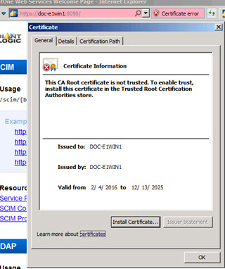
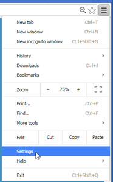
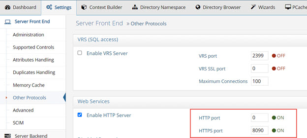
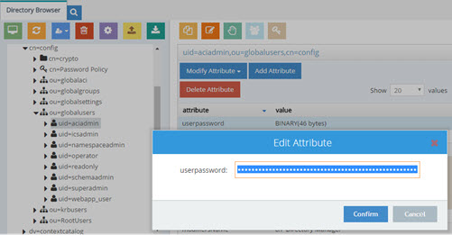
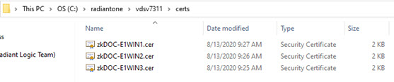
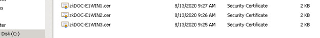
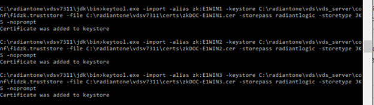
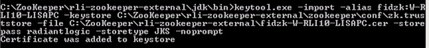
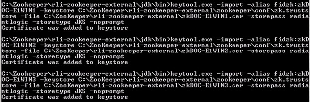
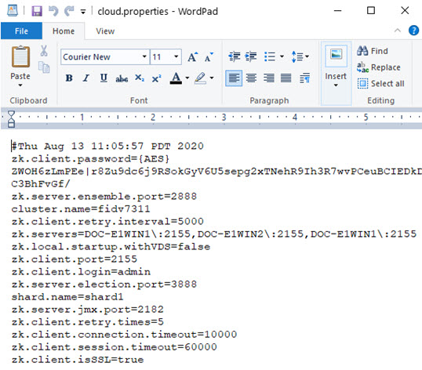

# Recommendations for Securing Data in Transit - SSL/TLS Settings

RadiantOne supports SSL/TLS and StartTLS to encrypt communication with clients and for communication to backend services.

## Configure SSL/TLS for Accessing RadiantOne

During the RadiantOne installation, a self-signed certificate is generated for SSL/TLS access to RadiantOne. This certificate is also used for HTTPS access to the Control Panels. It is recommended to replace the default self-signed certificate with a CA-signed certificate that complies with your corporate security policy. Please see the RadiantOne System Administration Guide for more information.

Below is a high-level architecture diagram depicting the communication between the different layers (clients to RadiantOne and RadiantOne to backend data sources). This provides a glimpse of the different certificates, keystores and truststores involved. All components at the RadiantOne layer are installed on the same server.

## Forbid Access to RadiantOne on the Non-SSL Port

If SSL has been enabled for RadiantOne and you want to forbid access on the non-SSL port, follow the steps below.

>[!warning]
>If you have not enabled SSL for RadiantOne and set a value of 0 for the standard port, the RadiantOne service does not start at all. Therefore, be sure to enable the SSL port before setting the standard port to 0.

1. Stop the RadiantOne service (from the Dashboard tab in the Main Control Panel or as a service if it is installed as a service). If running in a cluster, shutdown the RadiantOne  service on all nodes starting with the follower/follower-only nodes and stopping the leader node last. View the leader/follower status of each node from the Main Control Panel dashboard tab. Take note of the current leader node (noted with the yellow-colored triangle).
2. Go to the Settings tab > Server Front End > Administration section.
3. On the right side, enter a value of 0 (zero) in the LDAP Port field.
4. Click **Save**.
5. On the Settings tab, navigate to Security > SSL.
6. In the Inter Nodes Communication section, check the option to Always use SSL.
7. Click **Save**.
8. Go to the Settings tab > Server Front End > Administration and set the Admin HTTP port to 0.
9. Click **Save**.
10. Go to the Settings tab > Server Front End > Other Protocols section.
11. On the right side, enter a value of 0 (zero) in the HTTP port field.
12. Click **Save**.
13. On the Settings Tab, navigate to Server Backend > Internal Connections (requires [Expert Mode](00-preface.md#expert-mode)).
14. Check the Use SSL checkbox and click Save.
15. Start the RadiantOne service from the Dashboard tab (or start the service if you have configured it to run as a service). Start the RadiantOne service on all nodes if running in a cluster, starting with the previous leader node first (you took note of this in step 1 above).
16. On the Settings tab, navigate to Server Backend -> LDAP Data Sources.
17. On the right, select the vdsha data source and click EDIT.
18. Change the port to the SSL port and check the SSL checkbox.
19. If RadiantOne is deployed in a cluster, the failover servers associated with the vdsha data source must have the port updated also. In the Failover LDAP Servers section, select a failover server and click Edit. Check the SSL checkbox, enter the SSL port and click OK.
20. Click **Save**.
21. Select the replicationjournal data source and click EDIT.
22. Change the port to the SSL port and check the SSL checkbox.
23. If RadiantOne is deployed in a cluster, the failover servers associated with the replicationjournal data source must have the port updated also. In the Failover LDAP Servers section, select a failover server and click Edit. Check the SSL checkbox, enter the SSL port and click **OK**.
24. If the replicationjournal data source points to a remote cluster, to support SSL access, the remote RadiantOne node’s public key certificate must be signed by a known/trusted CA or imported into the Main Control Panel > Settings > Security > Client Certificate Truststore.
25. Click Save.

If you use the Main Control Panel, Directory Browser tab to manage entries, you can have connection problems if you turn off the non-SSL port and your browser (client) doesn’t trust the RadiantOne server certificate. The Directory Browser tab accesses the RadiantOne service via the REST web service ports. If the non-SSL port is off, it must use the HTTPS port.

If you are using a self-signed server certificate, you must install/trust the RadiantOne server certificate into your Internet browser. This can be done with the steps below.

>[!note]
>This is also applicable if you are simply accessing the Control Panel via the HTTPS port (e.g. 7171) even if the non-SSL is still available. This is because when you access the Main Control Panel via HTTPS, it connects to the RadiantOne service on the HTTPS web service port (https://rliserver:8090) and this requires the browser to trust the RadiantOne node’s server certificate. The [diagram](04-recommendations-for-securing-data-in-transit-ssl-tls-settings.md) shown at the beginning of this chapter depicts the different certificates, keystores and truststores in the architecture and is helpful to understand where certificates need to be imported.

1. Open your Internet Browser (as an administrator, in order to install the RadiantOne server certificate when prompted) and navigate to RadiantOne on the HTTPS port (e.g. https://radiantoneserver:8090)
2. The browser should warn you about the certificate. Select to continue/proceed.
3. Click on the "Certificate Error" red area in the address bar, to show information about the certificate.

    

4. You should have the option to install it, which you should do, in Trusted Root Certificates.

    

5. Restart your browser after installing the certificate.

6. If your browser does not have the option to install it, you can export the certificate and then import it directly in your browser settings. Below is an example for Google Chrome.
7. Click the Certificate Information link.

    

8. On the Details tab, click Copy to File.
9. Click Next in the Certificate Export Wizard.
10. Choose DER encoded binary and click Next. Enter a file name (e.g. jetty.cer) and click Next.
11. Click Finish and then click OK.
12. Go to your Internet browser settings. The example below shows the Google Chrome browser settings.

    

13. Under settings, click Show Advanced Settings.
14. Click Manage Certificates in the HTTPS/SSL section.

    

15. On the Trusted Root Certification Authorities tab, click **Import**.
16. Click **Next** in the Certificate Import Wizard.
17. Click **Browse** to navigate to the certificate file you exported above.
18. Click **Next**.
19. Click **Next**.
20. Click **Finish**.
21. Click **OK** to exit the confirmation.
22. Click **Close** to close the certificate window.

Restart your browser and then go to the Main Control Panel again on the HTTPS port. You
should not see the certificate warning anymore.

## Configure SSL Protocols Allowed for RadiantOne

You can limit the SSL protocols supported in RadiantOne from the Main Control Panel > Settings Tab > Security section > SSL sub-section. Click **Change** next to Enabled SSL Protocols. Select the protocols to support and click OK. Restart the RadiantOne service on all nodes.

>[!note]
>Only enable the SSL protocols that comply with your company’s security policy.

## Use Strong Cipher Suites and Disable Weak Ones

If you are running Java v1.8.0_151 or above, you can use strong cipher suites with the following steps. To check your version of Java, open a command prompt, navigate to <RLI_HOME>/jdk/jre/bin and run java -version. An example is shown below.

1. Add crypto.policy=unlimited in <RLI_HOME>/jdk/jre/lib/security/java.security file. The value might already be in the file. If it is, just uncomment it.
2. Restart Control Panel (Jetty server) and the RadiantOne service. If deployed in a cluster, restart it on all nodes.
3. Open the Main Control Panel.
4. On the Settings Tab > Security section > SSL sub-section, click on the CHANGE button next to Supported Ciphers Suites. Enable only the desired cipher suites.
5. Click SAVE.
6. Restart the RadiantOne service. If deployed in a cluster, restart it on all nodes.

If you are running a Java version prior to Java v1.8.0_151, you can install stronger cipher suites with the following steps.

1. Download the Java Cryptography Extension (JCE) Unlimited Strength Jurisdiction Policy files from Oracle, applicable to the Java version used in RadiantOne. To determine the version of Java used in your RadiantOne build, navigate from command line to <RLI_HOME>/jdk/jre/bin and execute: java -version.
2. Extract jce\local_policy.jar and jce\US_export_policy.jar from the archive to the folder <RLI_JAVA_HOME>\lib\security, overwriting the files already present in the directory.
3. Restart Control Panel (Jetty server) and the RadiantOne service. If deployed in a cluster, restart it on all nodes.
4. Open the Main Control Panel.
5. On the Settings Tab -> Security section -> SSL sub-section, click on the CHANGE button next to Supported Ciphers Suites. Enable only the desired cipher suites.
6. Click SAVE.
7. Restart the RadiantOne service. If deployed in a cluster, restart it on all nodes.

## Turn Off Non-SSL (HTTP) Port for Web Service Requests

To only support HTTPS access to the RadiantOne web services (ADAP, SCIMv1/v2...etc.), set the HTTP port to zero and restart FID.

## Turn Off Non-SSL (HTTP) Port for Control Panel

To only support HTTPS access to the Control Panels, edit
<RLI_HOME>\vds_server\conf\jetty\config.properties and set: jetty.ssl.force=true

Restart Jetty (which hosts the Control Panel applications). You can force Jetty to stop by running %RLI_HOME%\bin\StopWebAppServer.bat (StopWebAppServer.sh on Linux). Jetty restarts when you launch the Main Control Panel. Or, if you’ve configured it to run as a service
at the level of the operating system, restart it from there.

>[!note]
>If RadiantOne is installed on Windows platforms, edit the Control Panel shortcuts (typically on the desktop and from the Start menu > All Programs > RadiantOne > Control Panel). Change the default target from:
C:\radiantone\vds\bin\openControlPanel.bat vds_server http
>  To the following target:
C:\radiantone\vds\bin\openControlPanel.bat vds_server https

By default, Jetty leverages the same SSL settings as the RadiantOne service.

>[!note]
>To force Jetty to use its own SSL configurations instead of the same as
used by the RadiantOne service, edit
<RLI_HOME>\vds_server\conf\jetty\config.properties and set:
useVDSSSLConfig=false

Since Jetty uses the same server keystore as the RadiantOne sevice (jetty.ssl.keystore.location=<RLI_HOME>/vds_server/conf/rli.keystore), this server certificate must be trusted by your Internet Browser if you need to access the Control Panel via HTTPS. If you have replaced the default self-signed certificate with one signed by a Certificate Authority that is trusted by your client browser, you should be able to access the Control Panels via the SSL port without problems (e.g. https://radiantoneserver:7171). If you are using a self-signed certificate, you must install/trust the server certificate into your Internet browser. This can be done with the steps below.

1. Open your Internet Browser (as an administrator, in order to install the RadiantOne server certificate when prompted) and navigate to the Main Control Panel on the HTTPS port (e.g. https://radiantoneserver:7171)
2. The browser should warn you about the certificate. Select to continue/proceed.
3. Click on the "Certificate Error" red area in the address bar, to show information about the certificate. You should have the option to install it, which you should do, in Trusted Root  Certificates.
4. If your browser does not have the option to install it, you can export the certificate and then import it directly in your browser settings. Below is an example for Google Chrome.
5. Click the Certificate Information link.

    

6. On the Details tab, click Copy to File.
7. Click Next in the Certificate Export Wizard.
8. Choose DER encoded binary and click Next. Enter a file name (e.g. jetty.cer) and click Next.
9. Click Finish and then click OK.
10. Go to your Internet browser settings. The example below shows the Google Chrome browser settings.

    

11. Under settings, click Show Advanced Settings.
12. Click Manage Certificates in the HTTPS/SSL section.
13. On the Trusted Root Certification Authorities tab, click Import.
14. Click Next in the Certificate Import Wizard.
15. Click Browse to navigate to the certificate file you exported above.
16. Click Next.
17. Click Next.
18. Click Finish.
19. Click OK to exit the confirmation.
20. Click Close to close the certificate window.
21. Restart your browser and then go to the Main Control Panel again on the HTTPS port. You should not see the certificate warning anymore.

## Configure SSL Protocols Allowed for Control Panels

To configure the SSL protocols to allow in your environment for the Jetty web server that hosts the Main and Server Control Panels, edit: <RLI_HOME>/vds_server/conf/jetty/config.properties.

Set the value for jetty.ssl.protocols to the ones you want to support. The default server socket protocols allowed in Java 8 are: SSLv2Hello, TLSv1, TLSv1.1, and TLSv1.2

For example, if jetty.ssl.protocols=TLSv1.2 is set, the following cipher suites are enabled:

`Enabled protocol: TLSv1.2`
  `Enabled cipher suite: TLS_RSA_WITH_AES_128_CBC_SHA256`
  `Enabled cipher suite: SSL_RSA_WITH_3DES_EDE_CBC_SHA`

Restart Jetty after making changes to config.properties.

## Advise Application Owners to use the Latest Java Patches

Java patches are currently released quarterly by OpenJDK:
https://wiki.openjdk.java.net/display/jdk8u/Main

Radiant Logic releases patches for RadiantOne approximately one week after OpenJDK releases to ensure support for the latest Java patch is included.

It is highly advised that all client applications connecting to RadiantOne via LDAPS or HTTPS have the latest Java patch in order to reduce the risk of security breaches. This is to ensure the latest bugs and security vulnerabilities have been addressed, and that clients don’t attempt to negotiate obsolete, unsafe or disabled ciphers.

Although you can configure the SSL ciphers and protocols enabled in RadiantOne, it is not advised to enable less secure settings solely to accommodate client applications running older versions of Java.

## Enable SSL Communication Between Cluster Nodes

If you are deploying RadiantOne in a cluster, all nodes must be able to communicate with each other. This is required for block replication (replicating data in RadiantOne Universal Directory stores and Persistent Cache) which uses HTTP/HTTPS and redirecting write operations to the leader node which uses LDAP/LDAPS. To force the usage of SSL communication between cluster nodes, choose the Always use SSL option from the Main Control Panel > Settings Tab > Security section > SSL sub-section.

>[!note]
>Forcing the use of SSL slows down the communication speed between nodes.**

## Configure SSL/TLS for Backend Connections

If RadiantOne is connecting to backends over a network connection that is considered unsecure, it is recommended that you configure the connection to use SSL/TLS.

If the backend server uses a certificate issued by a trusted Certificate Authority, then all you need to do is enter the SSL port and check the SSL checkbox when you define the data source.
For database backends, just enter the SSL port in the URL as there is no SSL checkbox.

If the server you are connecting to uses a self-signed certificate, or signed by a Certificate Authority not known by RadiantOne, then this certificate must be imported into the client truststore. Import client certificates into the RadiantOne truststore from the Main Control Panel > Settings Tab > Security section > Client Certificate Truststore. RadiantOne dynamically loads client certificates from here meaning certificates can be added at any time without requiring a restart.

For more information on SSL/TLS support, please see the RadiantOne System Administration Guide.

## Enable FIPS Mode

In FIPS mode, RadiantOne performs all cryptographic operations using the Radiant Logic Cryptographic Module for Java. This includes key generation and key derivation, message digests and message authentication codes, random number generation, symmetric and asymmetric encryption, signature generation and verification, etc. RadiantOne supports FIPS mode on Windows Server 2016, RHEL, and CentOS.

After installing RadiantOne, it is recommended that you harden the server for security threats. See the RadiantOne Hardening Guide for advice. After the server is hardened, you can enable FIPS mode.

During the RadiantOne installation, a self-signed server certificate of type JKS is installed in <RLI_HOME>/vds_server/conf/rli.keystore. When you enable FIPS mode, the keystore containing the self-signed certificate is converted to type BCFKS and a new keystore is created. Therefore, when you (later) replace the default self-signed certificate, ensure it is updated properly in the corresponding FIPS certificate keystore.

If RadiantOne is deployed in a cluster, follow these steps to enable FIPS mode on each node. To ensure all nodes are at the same level of security at the same time, all RadiantOne processes except ZooKeeper should be stopped to enable FIPS mode. ZooKeeper must remain running. 

>[!warning]
>Since enabling FIPS mode requires cluster downtime, only perform the change during a maintenance window.

>[!warning]
>If you have deployed RadiantOne in Kubernetes, modify the file <RLI_HOME>/jdk/jre/lib/security/java.security and replace this line:   securerandom.source=file:/dev/random   With this line:   securerandom.source=file:/dev/urandom

To enable FIPS mode on each node, use the following command:

`C:\radiantone\vds\bin>vdsconfig.bat fips-mode-enable`

Restart Jetty and the RadiantOne service. If deployed in a cluster, restart these services on each node.

When RadiantOne is enabled for FIPS mode, the keystore type is automatically converted to BCFKS. This can be seen in the Server Control Panel -> Settings tab: Server Certificate Key Store and Server Certificate Key Type should indicate the path to the keystore and BCFKS respectively.

 
### Converting a Server Certificate to BCFKS

When RadiantOne is enabled for FIPS mode, the keystore type is automatically converted to BCFKS. Therefore, the example provided in this section is solely informational.

For a given keystore of type JKS or PKCS12, you can convert it into the RadiantOne FIPS mode format by using the command line keytool -importkeystore.

Below is an example that converts JKS type of keystore into BCFKS type:

`C:\radiantone\vds\vds_server\conf>"C:\radiantone\vds7.3\jdk\bin\keytool" -importkeystore  -srckeystore rli.keystore -srcstoretype JKS -srcstorepass radiantlogic -destkeystore rli_fips.keystore -deststoretype BCFKS -deststorepass radiantlogic -provider com.safelogic.cryptocomply.jcajce.provider.CryptoComplyFipsProvider -providerpath C:\radiantone\vds7.3\lib\ccj-3.0.1.jar"`

Output of the command:

`Importing keystore rli.keystore to rli_fips.keystore...
Entry for alias rli successfully imported.
Import command completed:  1 entries successfully imported, 0 entries failed or cancelled`

### Allowed SSL/TLS Protocols

The configurations to check and update if needed are the SSL/TLS protocols allowed, the vdsha LDAP data source is configured to use the SSL port, and all internal connections are configured to use SSL.

1.	When FIPS mode is enabled, RadiantOne only supports TLS v1.2. The supported protocols can be seen from Main Control Panel > Settings tab > Security > SSL. Click the Change button next to Enabled SSL Protocols.
 
 
2.	One of the elements of hardening the RadiantOne service, is to set the vdsha LDAP data source to use SSL. From the Main Control Panel > Settings tab > Server backend > LDAP Data Sources. Select the vdsha data source and click Edit. Enable the SSL checkbox on the right and set the SSL port. Click Save.
 
    

3.	One of the elements of hardening the RadiantOne service is to ensure that all Internal Connections are configured to use SSL. From the Main Control Panel -> Settings tab -> Server Backend -> Internal Connections, ensure the Use SSL option is enabled. Click Save.

 
### Allowed Cipher Suites

The cipher suites allowed in FIPS mode can be seen from Main Control Panel > Settings tab > Security > SSL. Click the Change button next to Supported Cipher Suites.

- TLS_DHE_DSS_WITH_AES_128_CBC_SHA
- TLS_DHE_DSS_WITH_AES_128_CBC_SHA256
- TLS_DHE_DSS_WITH_AES_128_GCM_SHA256
- TLS_DHE_DSS_WITH_AES_256_CBC_SHA
- TLS_DHE_DSS_WITH_AES_256_CBC_SHA256
- TLS_DHE_DSS_WITH_AES_256_GCM_SHA384
- TLS_DHE_RSA_WITH_AES_128_CBC_SHA
- TLS_DHE_RSA_WITH_AES_128_CBC_SHA256
- TLS_DHE_RSA_WITH_AES_128_GCM_SHA256
- TLS_DHE_RSA_WITH_AES_256_CBC_SHA
- TLS_DHE_RSA_WITH_AES_256_CBC_SHA256
- TLS_DHE_RSA_WITH_AES_256_GCM_SHA384
- TLS_ECDH_ECDSA_WITH_AES_128_CBC_SHA
- TLS_ECDH_ECDSA_WITH_AES_128_CBC_SHA256
- TLS_ECDH_ECDSA_WITH_AES_128_GCM_SHA256
- TLS_ECDH_ECDSA_WITH_AES_256_CBC_SHA
- TLS_ECDH_ECDSA_WITH_AES_256_CBC_SHA384
- TLS_ECDH_ECDSA_WITH_AES_256_GCM_SHA384
- TLS_ECDH_RSA_WITH_AES_128_CBC_SHA
- TLS_ECDH_RSA_WITH_AES_128_CBC_SHA256
- TLS_ECDH_RSA_WITH_AES_128_GCM_SHA256
- TLS_ECDH_RSA_WITH_AES_256_CBC_SHA
- TLS_ECDH_RSA_WITH_AES_256_CBC_SHA384
- TLS_ECDH_RSA_WITH_AES_256_GCM_SHA384
- TLS_ECDHE_ECDSA_WITH_AES_128_CBC_SHA
- TLS_ECDHE_ECDSA_WITH_AES_128_CBC_SHA256
- TLS_ECDHE_ECDSA_WITH_AES_128_GCM_SHA256
- TLS_ECDHE_ECDSA_WITH_AES_256_CBC_SHA
- TLS_ECDHE_ECDSA_WITH_AES_256_CBC_SHA384
- TLS_ECDHE_RSA_WITH_AES_128_CBC_SHA
- TLS_ECDHE_RSA_WITH_AES_128_CBC_SHA256
- TLS_ECDHE_ECDSA_WITH_AES_256_GCM_SHA384
- TLS_ECDHE_RSA_WITH_AES_256_CBC_SHA
- TLS_ECDHE_RSA_WITH_AES_256_CBC_SHA384
- TLS_ECDHE_RSA_WITH_AES_256_GCM_SHA384
- TLS_RSA_WITH_AES_128_CBC_SHA
- TLS_RSA_WITH_AES_128_CBC_SHA256
- TLS_RSA_WITH_AES_128_GCM_SHA256
- TLS_RSA_WITH_AES_256_CBC_SHA
- TLS_RSA_WITH_AES_256_CBC_SHA256
- TLS_RSA_WITH_AES_256_GCM_SHA384

### Allowed Password Hash/Encryption

When RadiantOne is in FIPS mode, the password hash/encryption options allowed for password policies are reduced to: PBKDF2AD, Salted SHA-256, Salted SHA-384 and Salted SHA-512

Password policies can be seen from the Main Control Panel > Settings tab > Security > Password Policies.

 
If existing entries contain passwords that use a non-compliant FIPS hash, or if user entries are imported entries into a RadiantOne Universal Directory (HDAP) store via an LDIF file and contain hashed passwords using a non-compliant FIPS hash, these passwords remain stored with the existing hash until they are updated. Once FIPS mode is enabled, updated passwords are stored in the selected FIPS-compliant hash. Authentication of users is not impacted. 

### Allowed Universal Directory (HDAP) Attribute Encryption and LDIF File Encryption Ciphers

When RadiantOne is in FIPS mode, the cipher available for attribute encryption and/or LDIF file encryption is limited to AES256. The supported ciphers can be seen from Main Control Panel -> Settings tab -> Security -> Attribute Encryption.
 

You must define an attribute encryption key and LDIFZ encryption key to properly secure data-at-rest.

#### RadiantOne Universal Directory (HDAP) Attribute Encryption

Attribute encryption protects sensitive data while it is stored in RadiantOne. Attribute encryption allows you to specify that certain attributes of an entry are stored in an encrypted format. This prevents data from being readable while stored in Universal Directory (HDAP) stores, persistent cache, backup files, and exported LDIF files.

There are two items to configure. One is the criteria for the key generation used to encrypt/decrypt the attributes. Two is the list of attributes you want to encrypt.

**Key Generation**

To define the criteria used to generate an encryption key:

1.	Navigate to Main Control Panel > Settings Tab > Security section > Attribute Encryption sub-section.

2.	On the right, click on Define Key Generation.

3.	Select the desired cipher from the drop-down list. 

4.	Enter a security key. This value is used to auto-generate an encryption key. If you plan on deploying multiple clusters that will participate in inter cluster replication for encrypted attributes, take note of the value you enter here as you must use it when configuring the security key in the other clusters.

An encryption key is auto-generated based on the cipher and security key value provided. This key is used across nodes in a cluster to encrypt/decrypt the attributes configured for encryption. If inter-cluster replication is deployed, all clusters must be configured with the same cipher and security key.

**Attributes to Encrypt**

No attributes are encrypted by default. To configure a list of attributes to encrypt:

1.	Navigate to the RadiantOne Universal Directory (HDAP) store (or configured persistent cache branch) on the Main Control Panel > Directory Namespace tab.

2.	Enter a comma-separated list of attribute names in the Encrypted Attributes property.

3.	Click Save.

4.	Click the Re-build Index button (if your configuration is a Universal Directory store) or the Initialize button to reinitialize the cache (if your configuration is a Persistent Cache).

Attributes listed in the Encrypted Attributes property are added to the Non-indexed attribute list by default. This means these attributes are not searchable by default. Indexing encrypted attributes is generally not advised as the index itself is less secure than the attribute stored in Universal Directory store/persistent cache. However, if you must be able to search on the encrypted attribute value, it must be indexed. Only “exact match/equality” index is supported for encrypted attributes. To make an encrypted attribute searchable, remove the attribute from the list of nonindexed attributes and then click the Re-build Index button or the Initialize button (to reinitialize) if the branch is a persistent cache.

For more information about accessing encrypted attributes and changing the encryption key, see the RadiantOne System Administration Guide.

#### LDIF File Encryption

Use the LDIFZ format when exporting RadiantOne Universal Directory stores (HDAP) stores to produce a zipped and encrypted LDIF file. This prevents data from being readable while stored in exported LDIF files.

**Key Generation**

To define the criteria used to generate an encryption key:

1.	Navigate to Main Control Panel > Settings Tab > Security section > Attribute Encryption sub-section.

2.	On the right, for LDIFZ Encryption Key, click Define Key Generation.

3.	Select the desired cipher from the drop-down list. 

4.	Enter a security key. This value is used to auto-generate an encryption key. If you plan on deploying multiple clusters that will participate in inter cluster replication and you are going to initialize RadiantOne Universal Directory (HDAP) stores from an exported LDIFZ file, take note of the value you enter here as you must use it when configuring the LDIFZ cipher and security key in the other clusters.

**Using LDIFZ**

In FIPS-mode, LDIFZ files should be used for persistent cache initialization (for the file that gets generated as the first step of the initialization process). Make sure the option to “Use .ldifz…” is selected during the initialization process.

 
In FIPS-mode, LDIFZ files should be used when exporting RadiantOne Universal Directory (HDAP) or persistent cache. Select .ldifz from the drop-down list next to the Export File Name property.
 

## Disabling FIPS-Mode

Although generally not needed, FIPS-mode can be disabled. If RadiantOne is deployed in a cluster, follow these steps to disable FIPS mode on each node. To ensure all nodes are at the same level of security at the same time, all RadiantOne processes except ZooKeeper should be stopped to disable FIPS mode. 

>[!warning]
>Since disabling FIPS mode requires cluster downtime, only perform the change during a maintenance window.

To disable FIPS mode on each node:

1.	Stop all RadiantOne processes except ZooKeeper.

2.	Update the RadiantOne keystore path (Server Certificate Key Store) and type (Server Certificate Key Type) settings. This can be done from the RadiantOne Server Control Panel. 

3.	(Optional) If you have configured Jetty or the RadiantOne SAML attribute service to use unique/individual server certificates (instead of the same server certificate than the RadiantOne LDAP service), manually update the keystore path and/or type in the <RLI_HOME>/vds_server/conf/jetty/config.properties and <RLI_HOME>/vds_server/conf/saml/server/AttributeService.properties files respectively.

4.	To disable FIPS mode on each node, use the following command:

    `C:\radiantone\vds\bin>vdsconfig.bat set-property -name fipsMode -value false `

5.	Restart RadiantOne processes. If deployed in a cluster, restart them on each node.
