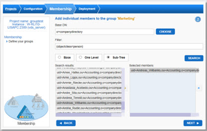
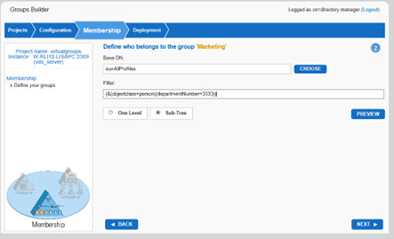
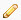
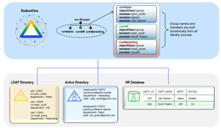
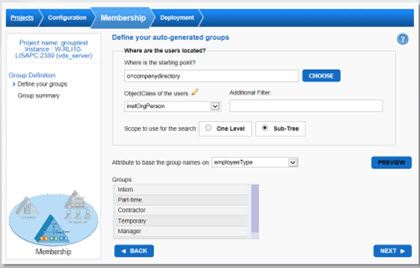

# Chapter 3: Groups Builder Wizard

The Groups Builder Wizard creates virtual views for defining groups and members. With this wizard, you can define rules for dynamically creating groups from multiple heterogeneous data sources. Administrators can utilize this wizard to either create user-defined or auto-generated groups. 

For user-defined groups, you specify a group name and who you want the members of this group to be. The members can either be statically defined by looking for specific user accounts to add, or dynamically defined based on an LDAP filter where any user matching the LDAP filter will populate the group.

For auto-generated groups, the group name is generated based on a specified attribute available in user entries. An administrator selects which attribute contains the possible group names. For example, if all user entries contained a location attribute, possible group names could be determined by creating a unique list of all possible locations. The list is then the basis for creating the group names. The group members are then dynamically defined based on who contains this attribute value.

For more information on groups supported in RadiantOne please see the System Administration Guide.

The Groups Builder wizard should be used in situations where applications will be accessing the RadiantOne service to retrieve groups/membership for enforcing authorization and a list of applicable groups either does not currently exist in any backend data source or the existing groups are insufficient because they lack all of the required members. This wizard should be used if there is the need to add new members into existing groups or if there is the need to build entirely new global groups containing members from multiple different data sources.

The wizard guides you through the steps needed to create a project to build virtual groups that can either be user-defined (a set group name with specific members or dynamic members based on an LDAP filter) or auto-generated (group names and members can be auto-generated based on an LDAP filter). The wizard also guides you through mounting the view in the virtual namespace and configuring the caching option that best suits your needs.

The detailed steps are as follows:

1.	Log in to the Main Control Panel.

2.	Click on the Wizards tab.

3.	Click on the Groups Builder button.

4.	Click Next on the Welcome screen.

5.	Enter a name for the project and a description (optional). Click Next.

>**Note - Each view designed with the Groups Builder wizard is created as a project. This way, it is easy to make any needed changes to the configuration by re-opening the project.**

6.	In the drop-down list, select the object class to associate with your virtual group entries.

7.	Select the type of group you want to create. The options are either User-Defined Groups or Auto-Generated Groups. For details on these different options, please see the Concepts section in the System Administration Guide. Configuration steps for each option are detailed below.

## User-Defined Groups

1.	Choose the User-Defined Groups option and click Next.

2.	If this is a new project, there are no groups defined yet. Click on the NEW GROUP button. Enter a group name and click Next.

3.	Repeat step 2 for each group name you want to add.

4.	Once all group names have been added, you can start to define members. Select the radio button for the group you want to define members for. A column for the group membership appears with two buttons. To statically define members, click the Manage Individual Members button. To dynamically define members, click the Define Dynamic Members button.

5.	To add individual members, either enter a base DN from where you want to start searching for members or click on the CHOOSE button to navigate to a location in the RadiantOne namespace. Enter a filter if you would like to narrow down the possible candidates.  Don’t forget to choose the scope of the search that should be used to find potential members (Base, One Level or Sub-Tree). Click on Search.

6.	A list of potential members is shown in the Search Results column. Select the identities that you would like to add as a member of the group and click the Right-arrow  button. Multiple identities can be selected at once.
 

Figure 3.1: Manage Individual Group Members

7.	After all members are defined, click Next.

8.	To define additional members (either explicitly or dynamically), select the radio button next to the group name and then click on the relevant button.

9.	To define dynamic group members, click the Define Dynamic Members button.

10.	The query that qualifies a person as a member of the group should be defined. This includes entering a location (base DN) in the RadiantOne namespace where the potential group members are located (including indicating if it is a One Level or Sub-Tree search that should be issued to find the members). Also, enter the filter that all members should match.  In the example shown in the screen shot below, all person entries below ou=AllProfiles that have departmentNumber = 3333 will be members of the Marketing group.
 

Figure 3.2: Defining Dynamic Group Membership Criteria

11.	After the LDAP query has been defined, click Next where you are returned to your list of groups where you can add more members if needed.

12.	If all group members are defined, click Next.

13.	The last section to configure for the groups view is where you want to mount the view and what level of caching you would like to deploy. The choices for mounting the view are to either mount it below a new naming context (you provide the name) or to mount it under an existing naming context (at which point you can create a new container node to mount below). After you have defined the mounting location, click Next.

14.	If you do not want a persistent cache, choose the No option. If you want a persistent cache, choose the Yes option. If you choose the persistent cache refresh option, the Finalization page of the wizard displays the following message. “Your virtual view has been mounted under <naming context> and you can browse the virtual groups from the Control Panel -> Directory Namespace Tab. A persistent cache has been defined for your naming context. The cache needs to be configured with the applicable refresh settings and initialized. This can be done from Main Control Panel -> Directory Namespace tab.” 

Note – the real-time persistent cache option is not available for user-defined dynamic groups. 

15.	Click Finish to close the wizard.

Auto-Generated Groups

1.	Choose the Auto-Generated Groups option and click Next.

2.	Select the starting point in the RadiantOne namespace (search base dn) to locate the entries that contain the attribute you want to base group names on. Click CHOOSE to navigate the RadiantOne namespace and select a location.

3.	Select the object class the entries are associated with from the Objectclass drop-down list. If your backend data source object is not mapped to an LDAP object class that is a part of the RadiantOne LDAP schema, it does not appear in the drop-down list. Therefore, you can click the  button and enter the name of your object class.

4.	To further condition the entries that the group names are derived from, you can enter any valid LDAP filter in the Additional Filter parameter. Keep in mind that the filter you enter here may not only affect the possible group names but also affects the group members (this filter is also a part of the condition to determine the group members for these dynamic group names).

For example, the image below depicts building group names based on the department attribute of the user entries assuming there is an extra filter value indicating entries with l=Novato or Office=Novato are to be excluded. Based on the sample data shown below, Dev will not be a group name (because the user entry containing this value for department has an office=Novato), and the users Sue Stone (from the database) and Lori Green (from Active Directory) are not members of any dynamically generated group (because Sue Stone has office=Novato and Lori Green has l=Novato).
 

Figure 3.3: Auto-generated Group Example

5.	Choose the appropriate search scope (One Level or Sub-Tree).

6.	Decide which attribute of these entries contains the possible group names and select it from the “Attribute to base the group names on” drop-down list. If you manually specified the object class in step 3 above, you must enter the name of the attribute since the drop-down list will be empty. The attribute containing the values you want to use for the group names should be indexed in the underlying source. Multi-valued attributes are supported and each value can contribute to a group name.

7.	Click the Preview button to get a glimpse of some of the group names.

>**IMPORTANT NOTES – the Look Through Limit used for the preview is set to 5000 and Time Limit is set to 3 seconds. These are important because they could affect how many possible group names are found for the preview. In addition, the preview is limited to the first 50 group names.**

>**For the Look Through Limit, this means that the first 5000 entries (based on the search criteria entered above) are searched to find group name values for the preview. In addition, the time limit parameter is the maximum amount of time the search to the data source should take. If all the entries containing possible group name values cannot be searched during this timeframe, you cannot find all of the group names you expect in the preview.**

An example is shown in the screen shot below. The group names are based on values of the employeetype attribute for inetorgperson entries located below o=companydirectory.
 

Figure 3.4: Sample of Auto-Generated Group Names

8.	Click Next.

9.	A summary screen shows the first 50 group names. Click the **Magnifying Glass** button for the group to get a quick glimpse of the first 50 members.

10.	Select where you want to mount the view. The choices for mounting the view are to either mount it below a new naming context (you provide the name) or to mount it under an existing naming context (at which point you can create a new container node to mount below). After you have defined the mounting location, click Next.

11.	If you do not want a persistent cache, choose the No option. If you want a persistent cache, choose the Yes option. If you choose the persistent cache refresh option, the Finalization page of the wizard displays the following message. “Your virtual view has been mounted under `<naming context>` and you can browse the virtual groups from the Control Panel -> Directory Namespace Tab. A persistent cache has been defined for your naming context. The cache needs to be configured with the applicable refresh settings and initialized. This can be done from Main Control Panel > Directory Namespace tab.” 

12.	Click Finish to close the wizard.
 
