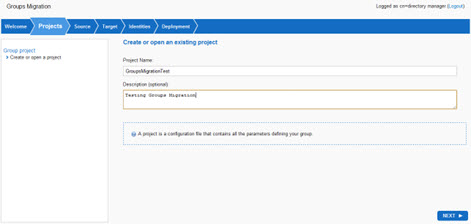
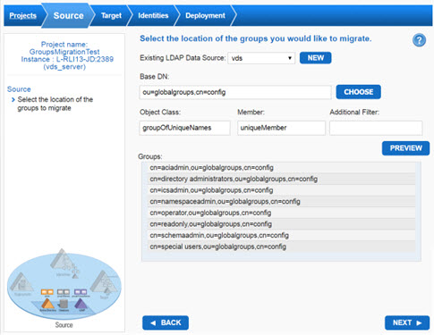
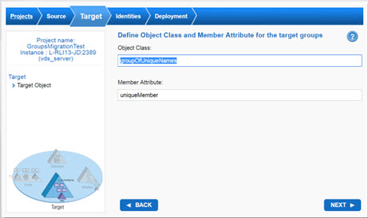
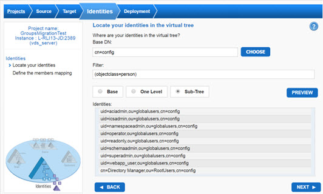
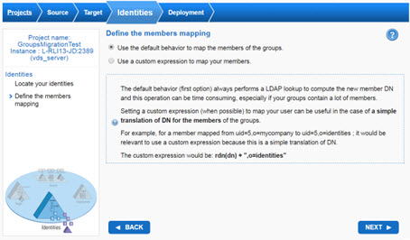

# Chapter 4: Groups Migration Wizard

Existing group membership references user DNs, the naming of which are based on the structure of the LDAP directory. When you model a new directory namespace with virtualization, the user DNs will change. The four steps in the Group Migration Wizard assist with the effort of translating the existing group membership to match the new namespace.

The detailed steps are as follows:

1.	Log in to the Main Control Panel.

2.	Click on the Wizards tab.

3.	Click on the Groups Migration button.

4.	Click Next on the Welcome screen.

5.	Enter a project name and description (optional) and click Next.
 

Figure 1: Groups Migration Project

6.	Select a data source that contains the connection information to your directory containing the groups you want to virtualize. If you do not have a data source defined for your backend directory, click the NEW button to define one.

7.	Click CHOOSE to select the BaseDN (location in the RadiantOne namespace) to reach the groups you want to virtualize.

8.	The object class and member attributes are automatically populated according to the type of data source you chose. If your groups are associated with a different object class, update the object class field accordingly. If your membership attribute is different than the default, update the member field accordingly. 

9.	If you would like to further condition which groups to migrate, you can enter a valid LDAP filter into the Additional Filter field.

10.	You can click on the PREVIEW button to get a glimpse of the groups that will be virtualized (the preview is limited to the first 50 groups returned).

    
 
    Figure 2: Source of Groups to Migrate

11.	Click Next.

12.	Define the object class that is used as a template to represent your virtual group and select the member attribute for the group.

    

    Figure 3: Target Object Class

13.	Click Next.

14.	Locate where your identities (that are members of the groups indicated in step 2) are in the RadiantOne namespace. 

    

    Figure 4: Location of Identities

15.	Click Next.

16.	Group membership references user DNs, the naming of which are based on the structure of the hierarchy. When you model a new namespace with virtualization, the user DNs will change. To virtualize groups containing those users, you need to define the member mapping so that the member attribute will point to the new, virtualized DN. You can choose to use the default behavior to map the members of the group. This option always performs a LDAP lookup to compute the new member DN and this operation can be time consuming, especially if your groups contain a lot of members. You could also use a custom expression to map your members. To do this you would create a filter that would automatically translate the DNs of everyone who meets the filters qualification.  This is useful for when you are performing a simple translation of the DN for group members.

    

    Figure 5: Define the Members Mapping

17.	Click Next.

18.	Select where you want to mount the view and what level of caching you would like to deploy. The choices for mounting the view are to either mount it below a new naming context (you provide the name) or to mount under an existing naming context (at which point you can create a new container node to mount below). After you have defined the mounting location, click Next.

19.	If you do not want a persistent cache, choose the No option. If you want a persistent cache, choose the Yes option. If you choose the persistent cache refresh option, the Finalization page of the wizard displays the following message. “Your virtual view has been mounted under `<naming context>` and you can browse the virtual groups from the Control Panel > Directory Namespace Tab. A persistent cache has been defined for your naming context. The cache needs to be configured with the applicable refresh settings and initialized. This can be done from Main Control Panel > Directory Namespace tab.”
