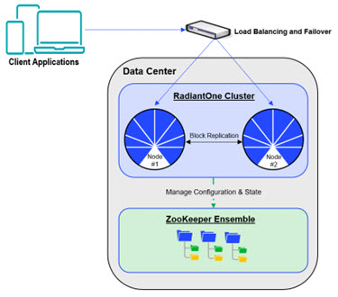
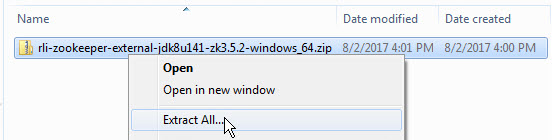

# Configuring External ZooKeeper Ensemble

For HA a minimum of three Zookeeper nodes is required.

Figure 1: RadiantOne Cluster with External Zookeeper Ensemble

## Configuring the First ZooKeeper Server

To configure the first ZooKeeper server:

1. On the first node in the Zookeeper ensemble, extract the compressed Zookeeper installer.

   >[!note]
    >The screen shot below is a general reference and the file name indicated is not the latest zip file name. For Windows deployments, use the rli-zookeeper-external-`<version>`-windows_64.zip file. For Linux deployments, use the rli-zookeeper-external-`<version>`-linux_64.tar.gz file.

Figure 2: Extracting the Compressed Zookeeper File

1. Open the extracted folder.
2. Open the folder rli-zookeeper-external.
3. Open the file setup.properties in a text editor. In this example, the file is opened using Notepad++.

    

    Figure 3: Opening setup.properties

5. To attempt auto-resolution of the hostname, leave the zk.host-name value empty. In this example, this value is empty.
6. To configure the ports used by Zookeeper, edit the values under # ZK ports. In this example, the default port values (2181, 2888, and 3888) remain unchanged.
7. Under the “# Current ZK node ID (assign each node a unique incremental integer: 1,2,3,...)” line, append the zk.id line. As this is the first node in the cluster, enter a 1 so the line reads as follows.

`    zk.id=1`

>[!warning]
>This value must be a unique incremental value for all nodes in the cluster. The first node’s zk.id value should be 1, the second node’s zk.id value should be 2, and so on.

8. Enter values for the zk.peer parameters. The syntax for this parameter is as follows.

`zk.peer.1=hostname:<zk.client.port>:<zk.ensemble.port>:<zk.leaderelection.port>`
  `zk.peer.2= hostname:<zk.client.port>:<zk.ensemble.port>:<zk.leaderelection.port>`
  `zk.peer.3= hostname:<zk.client.port>:<zk.ensemble.port>:<zk.leaderelection.port>`

In this example, these values are as follows:
`zk.peer.1=10.11.10.31:2181:2888:3888`
  `zk.peer.2=10.11.10.39:2181:2888:3888`
  `zk.peer.3=10.11.10.40:2181:2888:3888`

9. Save setup.properties. In this example, the file is configured as follows for the first node in the cluster:

    

    Figure 4: The setup.properties File On the First Zookeeper Node

10. In a Command Processor window, navigate to C:\rli-zookeeper-external.
11. Run configure.bat. The configuration detects the additional nodes.

    

    Figure 5: Configuring Zookeeper

12. In the command processor, navigate to C:\rli-zookeeper-external\bin.
13. Run start_zookeeper.bat. Text similar to the following displays.

    

    Figure 6: Starting ZooKeeper

>[!warning]
>Any change to the setup.properties file requires re-configuring (configure.bat) and then restarting (start_zookeeper.bat) ZooKeeper.

## Configuring Additional ZooKeeper Nodes

Once the first Zookeeper node is configured, you are ready to configure additional nodes.

1. On the second node in the cluster, perform the instructions in [Configuring the First Zookeeper Server](#configuring-the-first-zookeeper-server). The configured setup.properties file on Zookeeper node #2 should resemble the following image.
 
    >[!warning]
    >Note that the zk.id value for this node is set to 2.

    

    Figure 7: The setup.properties File on the Second Zookeeper Node

2. On the third node in the cluster, perform the instructions in [Configuring the First Zookeeper Server](#configuring-the-first-zookeeper-server). The configured setup.properties file on Zookeeper node #3 should resemble the following image.

    >[!warning]
    > Note that the zk.id value for this node is set to 3.

Figure 2. 8 : The setup.properties File on the Third Zookeeper Node

>[!warning]
>Any change to the setup.properties file requires re-configuring (configure.bat) and then restarting (start_zookeeper.bat) Zookeeper.
