# Installation

Apache ZooKeeper is a centralized service for maintaining configuration information across a RadiantOne cluster. Although RadiantOne comes bundled with ZooKeeper to simplify installation in Dev/QA environments, it is discouraged to use this architecture in production. Shutting down a redundant RadiantOne node (e.g. for upgrading) also shuts down ZooKeeper on this server. Because a ZooKeeper ensemble must have a quorum of more than half its servers running at any given time, this can be a problem for cluster integrity and stability. The solution is to deploy ZooKeeper in a separate, external ensemble. Other advantages of deploying an external ZooKeeper ensemble are outlined in the RadiantOne External ZooKeeper Install guide.

For details on installing RadiantOne in a Dev/QA environment, where ZooKeeper is installed and configured on the RadiantOne node, follow the steps outlined in this installation guide.

For details on installing RadiantOne in a production environment, start with the steps in the [RadiantOne External Zookeeper Installation Guide](/zk-introduction.md) to setup the external ZooKeeper ensemble. Then, refer to the steps in this guide to install RadiantOne.

## Installer Files

The installer files are available on the Radiant Logic support site. Contact support@radiantlogic.com for access information.

RadiantOne can be installed via a web-based GUI wizard, or through a silent (non-GUI) installer. The installer files are described below in the table below.

>[!warning]
>RadiantOne generates a random master key by default to use for encrypting information in configuration files. If you prefer to use Password-based encryption (PBE) to generate the key, you must use a silent install and indicate vds.security.pbe.enabled=true in the \vds\install\install.properties file before using [Instance Manager](#silent-mode-installs) to install RadiantOne.

| Installer File | Description
|------------|------------|
| `radiantone_<version>_full_linux_64.tar.gz` | This is used for a [silent install](#silent-mode-installs) or [GUI-based install](#gui-based-install) for Linux platforms that includes RadiantOne documentation. Untar the file to the location you want the product installed and then use setup.sh to install the RadiantOne platform with a GUI, or use install-sample.properties with Instance Manager to install in a silent mode.   radiantone_<version>_full_linux_64.tar.gz.512 is the corresponding checksum (SHA512 hashing algorithm) associated with the installer file. 
| `radiantone_<version>_full_windows_64.zip` | This is used for a [silent install](#silent-mode-installs) or [GUI-based install](#gui-based-install) for Windows platforms that includes RadiantOne documentation. Extract the contents of the compressed file to the location you want the product installed, and then use setup.bat to install the RadiantOne platform with a GUI, or use install-sample.properties with Instance Manager to install in a silent mode.   radiantone_<version>_full_windows_64.zip.sha512 is the corresponding checksum (SHA512 hashing algorithm) associated with the installer file.

Installer files for each platform are described below.

>[!warning] The full installers described below install the RadiantOne Federated Identity engine, Control Panels, LDAP Browser client application, a sample Apache Derby database, global synchronization, local RadiantOne Universal Directory (HDAP) storage, and ZooKeeper. If you are deploying in production, it is recommended to use an external ZooKeeper ensemble. Configure the ensemble prior to installing RadiantOne. For steps, see the RadiantOne External ZooKeeper Install Guide.

## GUI-based Installation

RadiantOne can be installed using a web-based installation as described in this section, or a silent/command line mode.

### Launching the Installer on Windows

To verify the checksum for the downloaded installer file, download the
radiantone_<version>_full_windows_64.zip.sha512 file. From the Windows command line,
navigate to the folder that contains the installer file and run the following commmand (the
example shown uses RadiantOne v7.4.2):

`certutil -hashfile radiantone_7.4.2_full_windows_64.zip SHA`

The result of the command displays the SHA512 hash for the installer file. Open the corresponding `radiantone_<version>_full_windows_64.zip.sha512` in a text editor. The value in the radiantone_<version>_full_windows_64.zip.sha512 file should match the output of the certutil command. This helps ensure the installation file is not corrupt.

RadiantOne must be installed by an administrator user. Even after installing, a standard user without the proper permissions cannot run the RadiantOne Windows service. This behavior is noticed on the following platforms Windows 2012 and Windows 2012 R2.

If a standard user must be able to manage/use the RadiantOne components, then the user must be assigned Full Control.

To launch the RadiantOne GUI installer:

1. Unzip `radiantone_<version>_full_windows_64.zip` to the location where you want to install RadiantOne.
2. Launch a command prompt as a Windows administrator.
3. In the command line interface, navigate to the location you extract in step 1.
4. Navigate to the bin folder (e.g. c:\radiantone\vds\bin).
5. Run Setup.bat. The RadiantOne web installer launches in a new internet browser tab. Follow the steps in [Installing a Single Node](#installing-a-single-node).

### Launching the Installer on Linux

To verify the checksum for the downloaded installer file, download the radiantone_<version>_full_linux_64.tar.gz.512 file. Navigate to the directory that contains the installer file and run the following commmand (the example shown uses RadiantOne v7.4.2):

`sha512sum radiantone_7.4.2_full_linux_64.tar.gz`

The result of the command displays the SHA512 hash for the installer file. Open the corresponding `radiantone_<version>_full_linux_64.tar.gz.512` in a text editor. The value in the `radiantone_<version>_full_linux_64.tar.gz.512` file should match the output of the sha512sum command. This helps ensure the installation file is not corrupt.

To launch the RadiantOne GUI installer:

1. Verify that X11 forwarding is enabled.
2. Untar the `radiantone_<version>_full_linux_64.tar.gz` file to the location where you want to install RadiantOne.
3. Launch a command prompt as an administrator.
4. In the command line interface, navigate in the location in step 1.
5. Navigate to the bin folder (e.g. /app/radiantone/vds/bin)
6. Run Setup.sh. The RadiantOne web installer launches in a new internet browser tab. Follow the steps in [Installing a Single Node](#installing-a-single-node).

### Installing a Single Node

The basic installation involves setting up one RadiantOne node and is sufficient for most development/test/proof of concept environments. It is recommended you start with the basic installation as described in this section and then configure this server to meet the needs of the expected clients/applications. After testing and confirming this configuration meets expectations, you can configure the architecture required for high availability and desired throughput. This may involve deploying another RadiantOne node at a failover/disaster recovery site (which would involve going through the exact steps described in this section on a machine at the failover/disaster recovery site), or deploying RadiantOne in a cluster to achieve throughput needs and/or high availability requirements at a single site/data center. For possible deployment architectures, please see the RadiantOne Deployment and Tuning Guide. Deploying RadiantOne in a cluster is described in the [Adding Nodes](#adding-nodes) section of this document.

Several aspects of RadiantOne are configured during installation. The basic installation steps are described below.

>[!warning] Even if you only deploy one RadiantOne node, the basic cluster configuration is defined during the install. Take note of the cluster settings defined here as they can be used later to add nodes to the cluster.

1. At the System Check step, verify that the system passed all checks and click Next.

    >[!warning] Hardware sizing is a critical component of directory service planning and deployment. The system check report verifies that important RadiantOne system requirements are met. If a test fails, an X is shown, like in the screenshot below. The failure should be addressed before continuing with the installation. Refer to the [RadiantOne Hardware Sizing Guide](/hardware-sizing-guide/01-introduction) for more information.

    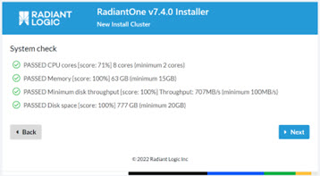

2. At the Select a type of installation step, select the Create A New Cluster option.

    >[!warning]
    >Shard subclusters are for very advanced use cases involving the storage of millions of identities. If you have a use case of this scale, contact your Radiant Logic Account Representative to discuss sizing.     Instance subcluster installation is described in Installing an Instance Subcluster.

    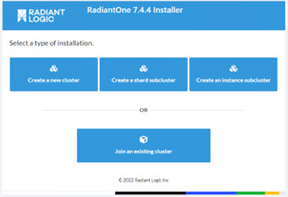

3. On the Setup Zookeeper Connection page, you are prompted to provide details about the ZooKeeper ensemble, including the ZooKeeper login, password, and ports. If you are installing in a Dev/QA environment and configuring a new ZooKeeper ensemble which will run on the same machine as RadiantOne, click **Skip and use local ZK**.

    Production environments typically require a connection to an existing, external ZooKeeper ensemble. If you use a load balancer in front of your ZooKeeper ensemble, enter the hostname of the load balancer in the ZooKeeper Hostname/IP field. If you do not use a load balancer, enter the hostname (or IP address) and port number of one of the machines in the Zookeeper ensemble in the ZooKeeper Hostname/IP field. In the following example, a load balancer is not used, so the hostname value would be 10.11.10.31, and the Zookeeper port number would be 2181. After entering the ZooKeeper ensemble connection string, click Next.

    >[!warning]
    >Do not use underscores in the Hostname.

    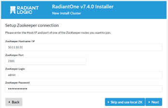

4. If you clicked **Skip and use local ZK** on the previous page, in the Zookeeper Configuration section of the Node Settings page, enter the ZooKeeper login, password, and ports.

    >[!note]
    >If you are connecting to an existing ZooKeeper ensemble, click Back and enter the ZooKeeper login and password that authorizes you to add a cluster node.

    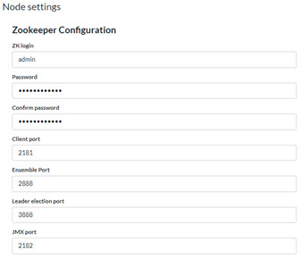

5. Next, in the RadiantOne Configuration section of the Node Settings page, enter the RadiantOne cluster name, administrator user, and password. To remove sample data from the installation of RadiantOne, uncheck the Install Samples box.

    >[!warning]
    >The value of the “Administrator Name” property should** be in the syntax: `cn=<user value>`.   Don’t use underscores in the Cluster Name.

    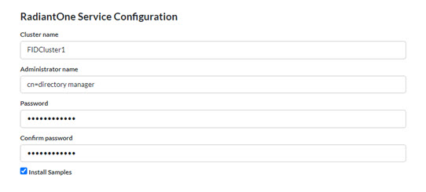

    >[!warning]
    >When installing multiple clusters (either on the same site/data center or different sites/data centers), use different cluster names if you intend to use inter-cluster replication. Inter-cluster replication relies on the names to identify replication events.

6. In the Ports section of the Node Settings page, enter the LDAP port, SSL port (for LDAPS communication between clients and the RadiantOne service, and support for StartTLS between clients and RadiantOne), scheduler port used by the process that schedules tasks). SSL is enabled by default and a self-signed certificate is generated for the RadiantOne service. Details on changing the admin user, LDAP port, SSL settings and replacing the default self-signed certificate can be found in the RadiantOne System Administration Guide.

    The RadiantOne web services (HTTP/HTTPS and admin HTTP/HTTPS) ports are enabled by default and you can define the ports during the install.

    

7. Next, you are prompted to enter your license key. If you have your license key, you may paste it into license key field. If you would like an evaluation key, leave the license field blank. The evaluation license is valid for 14 days. If you have a license key, and want to copy the license.lic file into the proper location after the install (<RLI_HOME>/vds_server), you can leave the license key field blank. A default key is generated and can be replaced with your license.lic file after install.

    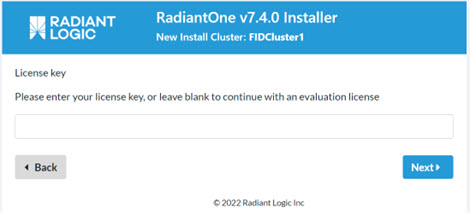

8. Finally, you are shown a pre-installation summary where you can review your settings and then click the Start Installation button.

    >[!note]
    >The following image shows a summary page for installing RadiantOne using a local Zookeeper. For installations using an existing Zookeeper ensemble, the Zookeeper Configuration of the summary page would contain only the ZK Login and Client Port fields.

    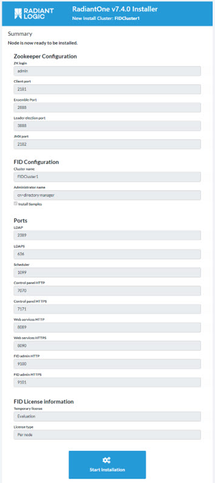

9. If you are not going to use the temporary license key, copy your license.lic file into the <RLI_HOME>/vds_server directory before using RadiantOne.

10. Start the Main Control Panel (<RLI_HOME>/bin/openControl.bat/.sh) and then start the RadiantOne service (Main Control Panel ->Dashboard Tab).

### Adding Nodes

Once you have tested and validated a [basic installation](#installing-a-single-node) of RadiantOne, and have determined your throughput and high availability needs require a cluster deployment, you can start to put in place the number of nodes required for high availability and needed throughput. This section describes steps to add nodes to a cluster.

Please see the System Requirements document and the [RadiantOne Hardware Sizing Guide](/hardware-sizing-guide/01-introduction) for proper sizing of the machines.

>[!warning]
>When deploying a cluster, nodes must be running on hardware that is configured for optimal redundancy and highly reliable connectivity between the cluster nodes/machines.

If you received a cluster-based license key, the same key value can be used for all nodes you install in a given cluster. If you received a server-based/single node license key, each RadiantOne server you deploy requires its own Radiant Logic license key.

#### Adding a Core Cluster Node

If you are not using a separate ZooKeeper ensemble, before attempting to add nodes to an existing cluster, please make sure the ZooKeeper process on the first cluster node (installed following the steps in the [Installing a Single Node](#installing-a-single-node) is running).

>[!warning]
>Do NOT attempt to install multiple new nodes at the same time. Wait until each new node is successfully added and ZooKeeper is running properly on the node (if you are using local ZooKeeper) before installing additional nodes to the cluster.

If you are using a separate ZooKeeper ensemble, before attempting to add RadiantOne nodes to an existing cluster, please make sure that at least two ZooKeepers servers are up and running.

1. At the “System Check Report” step, verify that the system passed all checks and click Next.

    >[!warning]
    >Hardware sizing is a critical component of directory service planning and deployment. The system check report verifies that important RadiantOne system requirements are met. If a test fails, an X is shown, like in the screenshot below. The failure should be addressed before continuing with the installation. Refer to the [RadiantOne Hardware Sizing Guide](/hardware-sizing-guide/01-introduction) for more information.

    

2. When adding a new RadiantOne node to an existing cluster, select the Join An Existing
    Cluster option.

    

3. Enter the server name or IP address for the machine where the ZooKeeper is currently running and the ZooKeeper client port. Enter the existing ZooKeeper login and password. Click Next.

    >[!warning]
    >Do not use underscores in the Hostname.

    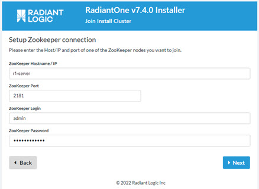

4. Select the RadiantOne cluster that this node is joining and click Next. Leave the follower-only box unchecked. Click Next.

5. At the Network Check step, verify that the system passed all checks and click Next.

    

    >[!warning]
    >RadiantOne is a network-intensive application. The network check verifies that the network connections between RadiantOne nodes are fast, with plenty of bandwidth and low latency. Refer to the [RadiantOne Hardware Sizing Guide](/hardware-sizing-guide/01-introduction) for more information.

6. Next, you are prompted to enter your license key. If you have your license key, paste it into the window. If you would like a temporary key, leave the license key field blank. The evaluation license is valid for 14 days. If you would like a longer temporary license, contact Radiant Logic, Inc at support@radiantlogic.com.

    >[!warning]
    >If you received a cluster-based license key, the same key value can be used for all nodes you install in a given cluster. If you received a server-based/single node license key, each RadiantOne server you deploy requires its own Radiant Logic license key.
 
    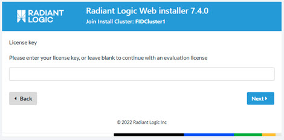

7. Finally, you are shown a pre-installation summary where you can review your settings and then click Start Installation.
    
   >[!note]
   >All settings (ports, user passwords, etc.) are the same as used for the first node in the cluster, so you will not see this step during the install. The only configuration that varies from the first node in the cluster is the server SSL certificate (for LDAPS communication between clients and the RadiantOne service). A default, self-signed certificate is generated for each node you add to the cluster. Details on replacing the default self-signed certificate can be found in the [RadiantOne System Administration Guide](/sys-admin-guide/01-introduction).

8. Start the Main Control Panel (<RLI_HOME>/bin/openControl.bat/.sh) and then start the RadiantOne service (Main Control Panel > Dashboard Tab).

9. Repeat the steps in this section for each node you want to add in your cluster. Once all nodes are installed and the services on each are running, the Main Control Panel, > Dashboard tab > Overview section displays the cluster details. The following image shows two cluster nodes.

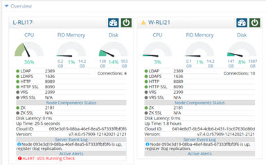

#### Adding a Follower-Only Node

Within a cluster, follower-only nodes are special nodes that can never become a leader. These nodes are installed on the same network/data center as the core cluster nodes to provide additional throughput.

These are a lightweight node that do not require the additional functions/features of a leader or follower node. Follower-only nodes do not process write requests. If the follower-only node receives a write request, they forward the request to the designated leader node and then it becomes the responsibility of this node to replicate the change out to all follower and follower- only nodes.

The steps to install a follower-only node are the same as for adding a node to an existing cluster except for when you choose the node type, select the option to be a follower only.

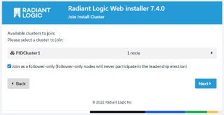

For details on the different types of nodes in a cluster, please see the [RadiantOne Architect Guide](/architect-guide/high-availability-and-performance/#leader-node).

### Installing an Instance Subcluster

To address a very small set of use cases where RadiantOne is virtualizing (by proxy) two different directory backends that contain the exact same root naming context, multiple RadiantOne instances (running on the same physical box as the main instance/cluster) can be deployed. With a proxy virtualization approach, a single root naming context in the RadiantOne namespace can only connect to one backend directory (mounted at the root), and you can’t have the same root naming context represent two different virtual views. Therefore, you can install a new RadiantOne instance cluster (listening on different ports of course) for this. There are also some use cases where you must enforce different RadiantOne global properties (e.g. require mutual authentication) per client application in which multiple instance clusters can be used as well. The additional RadiantOne instances are configured as separate clusters following the steps below.

To install an instance cluster, on the Installation Type stage, select the Create a subcluster instance option.

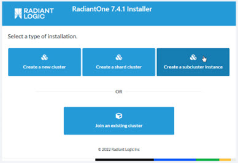

Instance clusters are managed independently and do not share configuration with the main cluster. From the Main Control Panel > Clusters tab, you can see all instances defined. For more details on configuring and managing instances of RadiantOne, please refer to the [RadiantOne Deployment and Tuning Guide](/deployment-and-tuning-guide/07-deployment-architecture/#managing-radiantone-instances).

## Silent Mode Installs

RadiantOne offers a silent install that leverages a manually configured properties file with the RadiantOne Instance Manager utility. This properties file is included in a compressed file, and it indicates the property values needed to install and initially configure the product. This section describes how to use the silent install and properties file to install the first node in a cluster and a follower node.

### Using a Manually Edited Properties File to Install the First Cluster Node

This section describes how to use the silent install option to install the first node in a cluster and how to configure the properties file accordingly.

To install the first node:

1. Extract the RadiantOne compressed file in a location that you identify as <RLI_HOME>. The naming convention for the file is radiantone_<version>_full_windows_64.zip (or radiantone_<version>_full_linux_64.tar.gz for Linux platforms). In the following example, the compressed file is extracted under C:/, creating the following <RLI_HOME> file path.

    `C:\radiantone_7.4.3 _windows_64\vds`

2. Copy your license.lic file into the proper location (<RLI_HOME>/vds_server). If you skip this step, the silent install prompts you for the license during installation.

3. Navigate within <RLI_HOME> to the install folder.

4. The silent install uses the values stored in this file to install RadiantOne. Edit install-sample.properties as follows.
    - Set cluster.firstnode to true
    - Set node.follower.only to false
    - Node.use.local.zk should be set to false if you are installing a new cluster that will re-use an existing ZooKeeper either on the same machine, or an external one.

      >[!warning]
      >If you are using an external ZooKeeper ensemble, also enter the comma-separated list of nodes in the zk.connstring property. E.g. zk1:2181,zk2:2181,zk3:2181

    The following image depicts the install-sample.properties file for the first node in a cluster. For details about properties files for follower nodes, see the Using a Manually Edited Properties File on Follower Nodes section.

    >[!warning] Do not use underscores in the Hostname or Cluster Name.     It is recommended that you edit the properties file in a text editor such as Notepad or Notepad++. Adding carriage returns in other text editors may result in properties being misread during the installation process.

    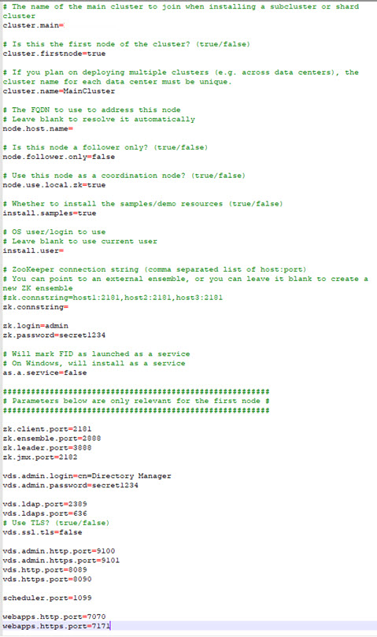

    >[!warning] The silent installer does not validate property values in the properties file. Invalid values may cause the installation to fail. Verify your property values prior to executing the silent install command.

    >[!warning] Instancemanager must be executable. To set instancemanager.sh to executable, run chmod a+x instanceManager.sh (cd /opt/radiantone/vds/bin/).      The keytool must be executable. To set the keytool as executable, run chmod a+x keytool (cd opt/radiantone/vds/jdk/bin/).

5. From a command prompt, navigate to <RLI_HOME>/bin folder and use the following syntax to install RadiantOne using the properties file that was customized in step 4 above.

`c:\radiantone\vds\bin>instancemanager.exe --setup-install
c:/radiantone/vds/install/install-sample.properties`

When installation is complete, the command prompt displays the message “Installation has been initialized successfully”.

>[!warning] Values in the properties file, including passwords, are stored in clear. After installation, install-sample.properties should be deleted.

This silent install mode does not create shortcuts or menu items. To open the RadiantOne Main Control Panel, navigate to <RLI_HOME>/bin and run openControlPanel.

### Using a Manually Edited Properties File to Installer Follower Nodes

This section describes how to use the silent install option to install a follower node and how to configure the properties file accordingly.

To install a follower node:

1. Extract the RadiantOne compressed file in a location that you identify as <RLI_HOME>. The naming convention for the file is `radiantone_<version>_full_windows_64.zip` (or `radiantone_<version>_full_linux_64.tar.gz` for Linux platforms). In the following example, the compressed file is extracted under C:/, creating the following <RLI_HOME> file path.

    `C:\radiantone_7.4.3 _windows_64\vds`

2. Copy your license.lic file into the proper location (<RLI_HOME>/vds_server). If you skip this step, the silent install prompts you for the license during installation.

3. Navigate within <RLI_HOME> to the install folder.

4. Edit install-sample.properties. The silent install uses the values stored in this file to install RadiantOne. Follower nodes require the following property values.

| Property Name | Property Value
|------------|------------|
| Cluster.firstnode | Must be set to false.
| Cluster.name | Must match value of the first node’s properties file.
| Node.follower.only | If the node is a follower only, this value must be set to true. Otherwise, set to false.
| Node.use.local.zk | If the node’s local Zookeeper is going to be a part of the ensemble, set this to true. Otherwise, set this to false, indicating that an external Zookeeper ensemble is used.
Zk.connstring | If local Zookeeper is used, only enter the Zookeeper server and port for one node (e.g. zk1:2181) running in the existing cluster. Do not list all Zookeeper servers.    If external Zookeeper is used, include the hostnames of the machines in the external Zookeeper ensemble in a comma-separated list: (e.g.zk1:2181,zk2:2181,zk3:2181)

>[!note]
>In follower nodes’ properties file, properties that follow “Parameters below are only relevant for the first node” may safely be deleted.

In the following image, the properties file is edited for configuring a follower node (not a follower-only node).

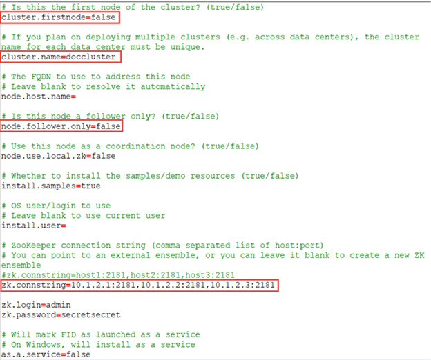

>[!warning]
>The silent installer does not validate property values in the properties file. Invalid values may cause the installation to fail. Verify your property values prior to executing the silent install command.

5. From a command prompt, navigate to <RLI_HOME>/bin folder and use the following syntax to install RadiantOne using the properties file that was customized in step 4 above.

`c:\radiantone\vds\bin>instancemanager.exe --setup-install
c:/radiantone/vds/install/install-sample.properties`

When installation is complete, the command prompt displays the message “Installation has been initialized successfully”.

>[!warning]
>Values in the properties file, including passwords, are stored in clear. After installation, install-sample.properties should be deleted.

This silent install mode does not create shortcuts or menu items. To open the RadiantOne Main Control Panel, navigate to <RLI_HOME>/bin and run openControlPanel.

### Using a Manually Edited Properties File to Install a Sub-cluster

This section describes how to use the silent install option to install a sub-cluster and how to configure the properties file accordingly.

To install a sub-cluster:

1. Extract the RadiantOne compressed file in a location that you identify as <RLI_HOME>. This is where the sub-cluster is installed. The naming convention for the file is `radiantone_<version>_full_windows_64.zip` (or `radiantone_<version>_full_linux_64.tar.gz` for Linux platforms). In the following example, the compressed file is extracted under C:/, creating the following <RLI_HOME> file path.

    `C:\radiantone_7.4.3 _windows_64\vds.`

2. Copy your license.lic file into the proper location (<RLI_HOME>/vds_server). If you choose the skip this step, the silent install prompts you for the license during installation.

3. Navigate within <RLI_HOME> to the install folder.

4. Edit install-sample.properties. The silent install uses the values stored in this file to install RadiantOne.

| Property Name | Property Value
|------------|------------|
Cluster.main |Must match value of the main cluster node’s cluster.name property.
Cluster.firstnode |For the first subcluster node, this value must be set to true. For subsequent subcluster nodes (run the install again to install subsequent nodes), this value must be set to false.
Cluster.name |The cluster name must be unique and not contain underscores.
Node.follower.only |If the node is a follower only, this value must be set to true. Note: if this value is set to true, cluster.firstnode must be set to false.
Node.use.local.zk |In a subcluster, this value must be false.
Zk.connstring |Must include the hostnames of the machines in the Zookeeper ensemble in a comma-separated list (e.g. zk1:2181,zk2:2181,zk3:2181)

In the following image, the properties file is edited for configuring the first subcluster node.

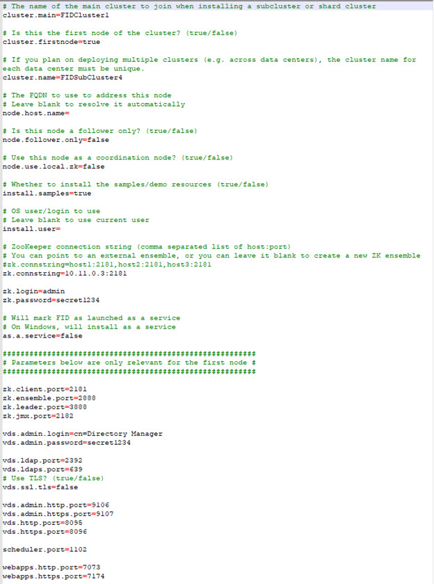

>[!warning]
>The silent installer does not validate property values in the properties file. Invalid values may cause the installation to fail. Verify your property values prior to executing the silent install command.

5. From a command prompt, navigate to <RLI_HOME>/bin folder and use the following syntax to install RadiantOne using the properties file that was customized in step 4 above.

`c:\radiantone\vds\bin>instancemanager.exe --setup-install
c:/radiantone/vds/install/install-sample.properties`

When installation is complete, the command prompt displays the message “Installation has been initialized successfully”.

>[!warning]
>values in the properties file, including passwords, are stored in clear. After installation, install-sample.properties should be deleted.
