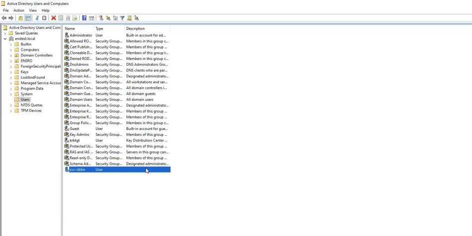
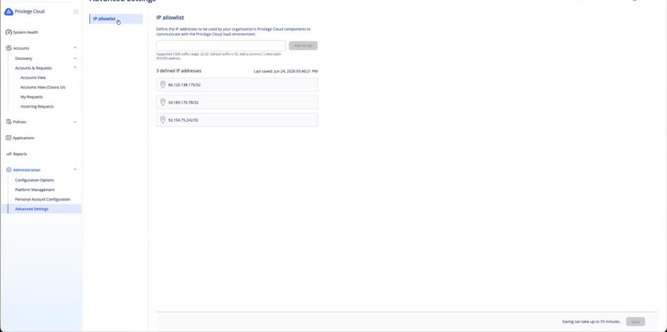
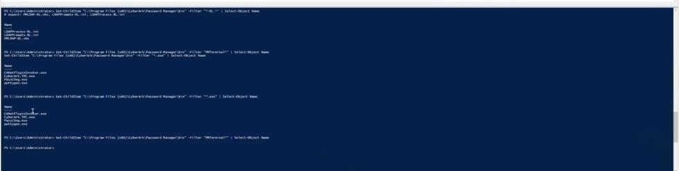
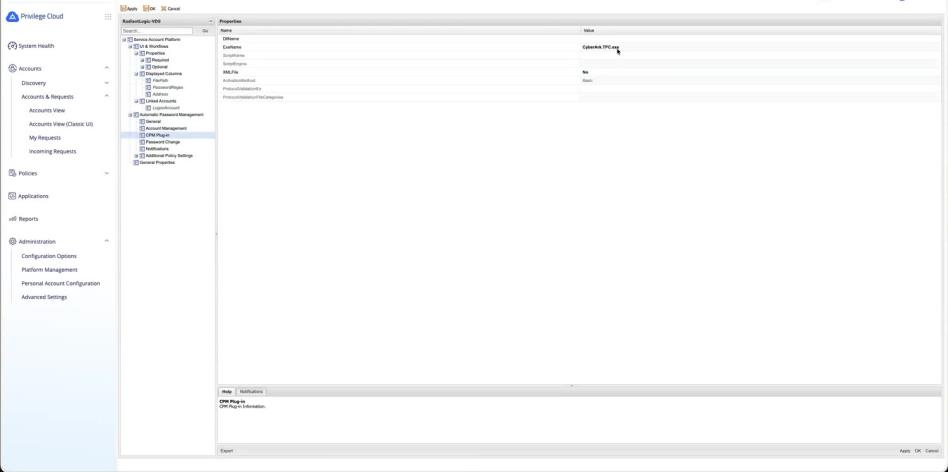
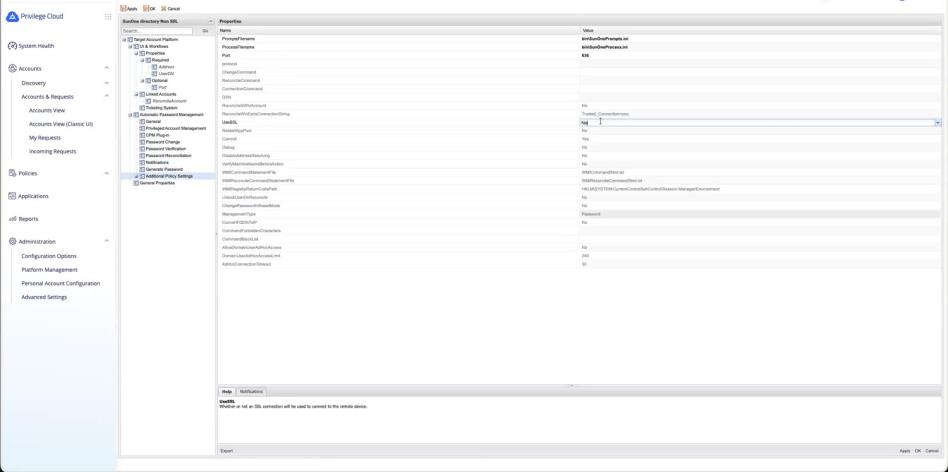
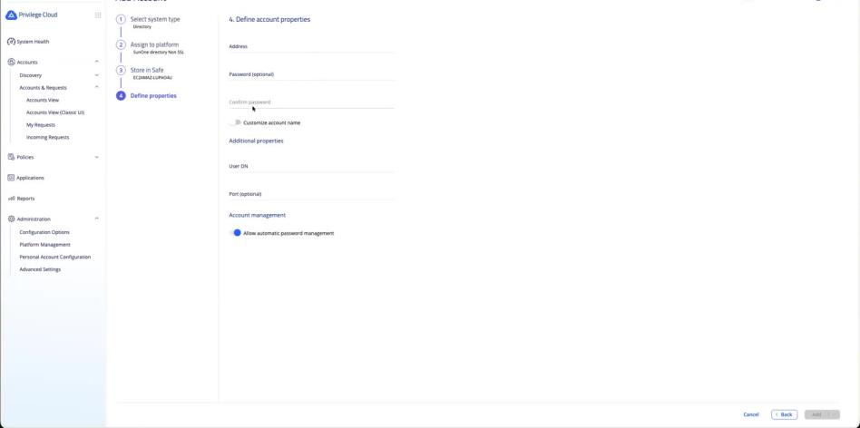
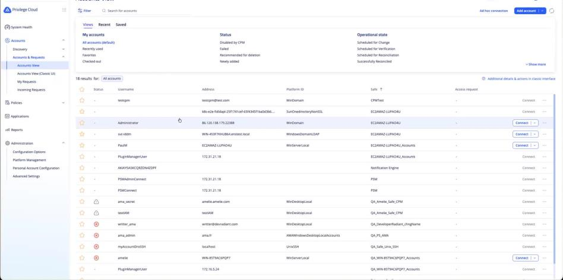
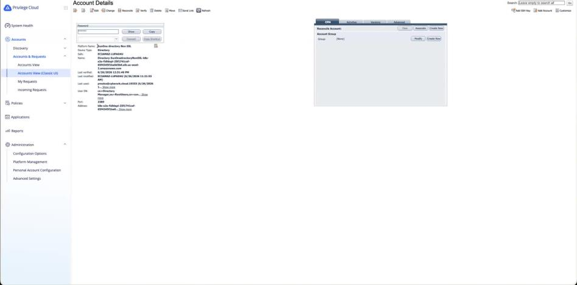

# Credential Management with Idira

This guide shows how you can connect **Idira Privilege Cloud (formerly known as CyberArk Privilege Cloud)**, to a self-managed Identity Data Management deployment so that Idira can manage the credential in Identity Data Management data sources. An example data source for Active Directory is used to illustrate the configuration in the steps below.

Once configured, a single Change action in Idira triggers the following:

1. It changes the service account's real password in Active Directory.
2. It pushes that same new password into the matching Identity Data Management data-source configuration.

Identity Data Management then continues to bind to Active Directory with the new password automatically, with no manual edits. In short: rotate the credential in Idira, and both Active Directory and Identity Data Management stay in sync.

An optional final section (Scenario 3) covers using the same mechanism to rotate Identity Data Management's own administrator password.

**Scope:** This guide covers the **integration between Identity Data Management and Idira** only. The Active Directory foundational steps, such as creating the service account, enabling LDAPS, setting the domain password policy, and establishing certificate trust on the Idira connector host, are treated as a prerequisite and are covered in detail in Appendix C. Building the AD domain and domain controller themselves is out of scope for this document.

## How it works

Idira can connect to a Radiant Logic Identity Data Management environment in multiple ways. It is important not to confuse them, because only the push plugin is currently supported.

| Mechanism | Direction | Where it runs | Covered here? |
|---|---|---|---|
| Push plugin (RadiantLogic-VDS) | Idira writes the rotated password into Identity Data Management | Idira CPM | Yes |
| Pull plugin (cyberark-schedule.sh) — using Idira Secrets Manager | Identity Data Management pulls the password from Idira leveraging Idira Secrets Manager (previously CyberArk Application Access Manager) | Identity Data Management | **Deprecated since v8.0** |

This guide focuses on the push mechanism. In this flow, the Idira Central Policy Manager (CPM), which is the CyberArk Password Manager service running on a Windows host, rotates the password and pushes the updated credential to Identity Data Management.

```
                                        Idira
                                           |
                                           | Triggers "Change" on the data source account
                                           v
                        +----------------------------------+
                        |          CPM Connector           |
                        |          (Windows host)          |
                        +----------------------------------+
                              |                         |
                       (1)    |                         |   (2)
          WindowsDomainLDAP Platform            RadiantLogic Usage
                              |                         |
                            LDAPS                LDAPS or LDAP
                              |                         |
                              v                         v
                 +----------------------+     +-----------------------------+
                 | AD Domain Controller |     | Identity Data Management    |
                 |                      |     |                             |
                 | Changes the actual   |     | Writes the new password to   |
                 | password for         |     | id=<datasource>,cn=metads    |
                 | svc-iddm             |     |                             |
                 +----------------------+     | Bind DN:                    |
                                              | cn=Directory Manager        |
                                              +-----------------------------+
                                                             |
                                                             |
                                                             v
                                     Identity Data Management data source
                                     authenticates to Active Directory
                                     using the new password
                                                             |
                                                             v
                                                    Connection succeeds
```

Idira performs a single password change in Active Directory and then propagates the updated credential to Identity Data Management through its usage model, keeping both systems synchronized.

### Two connections, two different requirements

The flow above uses two independent connections, and they do **not** have the same transport requirement. Keeping them straight avoids most of the confusion in this integration:

| Leg | Transport | Requirement |
|---|---|---|
| CPM → Active Directory domain controller (leg 1) | LDAPS only | **Mandatory.** Active Directory will not change a password over an unsecured channel. |
| CPM → Identity Data Management (leg 2, the push and the reconcile bind) | **LDAPS or plain LDAP** | Not restricted to plain LDAP. **LDAPS is preferred** for production, provided the SSL certificate is in place. |

> **This leg is not restricted to plain LDAP.** The port and `UseSSL` values are configuration on the Idira side, not a constraint of the integration, so the reconcile bind and the password write can go to either the Identity Data Management LDAPS port (2636 in the reference environment) or its plain LDAP port (2389). Choose LDAPS for production: the value being written is a credential, and on this leg the transport is the only thing protecting it in transit.
>
> Wherever a step below sets a port and a `UseSSL` value, the LDAPS equivalent is that port with `UseSSL = Yes`. The prerequisite is certificate availability — the Identity Data Management LDAPS listener must be enabled, the CPM host must trust the certificate it presents, and the address configured in Idira must match that certificate's name.
>
> **Status of each path.** Plain LDAP is the path exercised end to end in the reference environment and is what the steps below walk through. LDAPS is expected to work on the same basis, given the certificate above, but has not been validated end to end — so treat the LDAPS notes in this guide as the intended configuration rather than a tested procedure, and confirm it in a test tenant before depending on it.

## Before you begin

Confirm the following are already in place.

### Idira prerequisite

- An Idira tenant with a working CPM connector (the CyberArk Password Manager service on a Windows host) and PVWA administrator rights.
- The connector host's egress IP address, which you will use to lock down network access to Identity Data Management.

### Active Directory prerequisite

- A domain controller reachable from the CPM over LDAPS.
- A service account that Identity Data Management uses to bind to Active Directory (e.g. `CN=svc-iddm,CN=Users,DC=enstest,DC=local`). It needs no special rights beyond those of a standard user.
- The CPM host trusts the AD LDAPS certificate (imported into `LocalMachine\Root`).
- The AD domain password policy permits an immediate password change (minimum password age set to 0). See Troubleshooting, error 8004.

> **Why LDAPS is mandatory on the Active Directory leg** — Active Directory will not change a password over an unsecured channel. Idira therefore requires an LDAPS connection to the domain controller to perform the rotation. This requirement applies to leg 1 only; the Identity Data Management leg supports both LDAPS and plain LDAP, as described above.



*Figure 1. The svc-iddm service account in Active Directory. It is a standard user and needs no rights beyond the defaults.*

### Identity Data Management

- A self-managed Identity Data Management (RadiantOne) v8.4.x deployment on Kubernetes. The reference environment used in the configuration below runs on Amazon EKS, namespace `e2e`, pods `fid-0/1/2`, with `RLI_HOME=/opt/radiantone/vds`.
- The directory-manager DN: `cn=Directory Manager,ou=RootUsers,cn=config`.
- The LDAP and/or LDAPS listener you intend to use is enabled. If you plan to use LDAPS, the certificate its listener presents must be available so it can be trusted on the CPM host — LDAPS support on this leg is conditional on that certificate being in place.

### Plugin files

- The three push-plugin files: `PMLDAP-RL.vbs`, `LDAPPrompts-RL.ini`, and `LDAPProcess-RL.ini`.

> **Where to find the plugin files:** For a self-managed v8 deployment, these files ship inside the Identity Data Management package and can be copied from one of the pods in the Kubernetes cluster from `/opt/radiantone/vds/config/cyberark/push_plugin`

Environment-specific values (the load balancer DNS name, IP addresses, and the `ad_enstest` data-source name) appear throughout this guide. Substitute your own; a full reference table appears in the appendix.

## Part 1: Expose Identity Data Management's LDAPS and LDAP ports to the CPM

The CPM must be able to reach Identity Data Management over LDAPS or LDAP. On Kubernetes, Identity Data Management's LDAP endpoint is a NodePort service (`fid-app`) running on private worker nodes, while the CPM typically sits in a different network. A security-group rule alone cannot bridge this, because private node IP addresses are not routable across networks. The clean solution is a dedicated Network Load Balancer (NLB) on the LDAP ports.

The service definition below publishes **both** ports — 2636 for LDAPS and 2389 for plain LDAP — so either transport is available to the CPM once the NLB is in place. Publish both if you want the option, or trim the manifest to just the port you intend to use.

### 1.1 Inspect the existing service

Make a note of the existing service and copy its selector, as you will reuse it verbatim. Examples based on the reference environment are used below.

```
kubectl get svc fid-app -n e2e -o wide
kubectl get svc fid-app -n e2e -o jsonpath='{.spec.selector}'; echo
```

### 1.2 Create an internet-facing NLB, locked to the CPM's egress IP

Save the following as `fid-ldap-lb.yaml`, paste in the exact selector from the previous step, and set `loadBalancerSourceRanges` to your CPM's egress IP address.

```
apiVersion: v1
kind: Service
metadata:
 name: fid-ldap-lb
 namespace: e2e
 annotations:
  service.beta.kubernetes.io/aws-load-balancer-type: "nlb"
  service.beta.kubernetes.io/aws-load-balancer-scheme: "internet-facing"
spec:
 type: LoadBalancer
 loadBalancerSourceRanges:
  - 54.189.170.78/32       # the CPM's public egress IP ONLY (pin an EIP so it can't change)
 selector:            # paste fid-app's EXACT selector here
  app: iddm
  app.kubernetes.io/core-name: iddm
  app.kubernetes.io/instance: ido
  app.kubernetes.io/name: iddm
  radiantlogic.io/app: identity-observability
  radiantlogic.io/environment: e2e
 ports:
  - {name: ldap, port: 2389, targetPort: 2389, protocol: TCP}
  - {name: ldaps, port: 2636, targetPort: 2636, protocol: TCP}
```

Apply it:

```
kubectl apply -f fid-ldap-lb.yaml
```

> **Security note.** `loadBalancerSourceRanges` restricts the public load balancer to the CPM's IP only. This is acceptable for a QA or test environment. For production, prefer network peering with an internal NLB (`aws-load-balancer-scheme: internal`), or at minimum forward the ports only to the specific IP addresses you know you use. For this configuration, this endpoint was intentionally left broadly reachable for testing only. Do not carry that choice into production. Preferring LDAPS on this leg is part of the same hardening: it protects the credential in transit even where the network path itself is trusted.

### 1.3 Get the NLB DNS name and verify from the CPM

```
kubectl get svc fid-ldap-lb -n e2e -o jsonpath='{.status.loadBalancer.ingress[0].hostname}'; echo
```

From the CPM, run the following PowerShell command to verify connectivity. The connection should succeed only from the CPM, as the source-range restriction allows access exclusively from that host:

```
Test-NetConnection <nlb-dns> -Port 2389                 # expect TcpTestSucceeded : True
```

If you are going to use LDAPS, run the same reachability check against the LDAPS port (2636 in the reference environment) instead of, or in addition to, 2389.

Optionally, confirm a real LDAP bind through the NLB as the reconcile identity:

```
Add-Type -AssemblyName System.DirectoryServices.Protocols
$c = New-Object System.DirectoryServices.Protocols.LdapConnection "<nlb-dns>:2389"
$c.AuthType = [System.DirectoryServices.Protocols.AuthType]::Basic
$c.SessionOptions.ProtocolVersion = 3
$c.Bind((New-Object System.Net.NetworkCredential("cn=Directory Manager,ou=RootUsers,cn=config","<DIRMGR_PW>")))
"BIND OK"
```

The bind check above is written for the plain LDAP port. The equivalent check over LDAPS uses the LDAPS port and turns on SSL for the connection; it will only succeed once the CPM host trusts the certificate that the Identity Data Management LDAPS listener presents.

### Idira IP allow list

If your tenant enforces an IP allow list, add the IP addresses of both the Active Directory machine and the connector so Idira can reach them. As with the network prerequisites, this is often already configured; verify it rather than assume.



*Figure 2. The IP allowlist under Administration → Advanced Settings. Here it includes the connector's egress IP and the Active Directory host's public IP.*

## Part 2: Configure the Identity Data Management data source

The data source is the object whose credential Idira will manage. Configure it to bind to Active Directory as the service account.

1. In Identity Data Management, go to **Data Catalog → Data Sources**. Clone an existing AD data source if one exists (this inherits the working host, port, TLS, and certificate configuration), or add a new one. Name it `ad_enstest`.
2. Set the bind identity — Bind DN / user: `CN=svc-iddm,CN=Users,DC=enstest,DC=local`; Password: the current AD password for `svc-iddm`.
3. Click **Test Connection**. It must pass before you continue.

The push target now exists at `id=ad_enstest,cn=metads`, with a writable password attribute that is AES-encrypted at rest. You can confirm it from the CPM:

```
# reuse the LdapConnection bind from Part 1.3, then:
$scope = [System.DirectoryServices.Protocols.SearchScope]::Base
$req = New-Object
System.DirectoryServices.Protocols.SearchRequest("id=ad_enstest,cn=metads","(objectclass=*)",$scope,@("username","password"))
$c.SendRequest($req).Entries[0].Attributes["username"].GetValues([string])[0]
```

Expect `username = CN=svc-iddm,CN=Users,DC=enstest,DC=local`.

## Part 3: Install the push plugin on the CPM

Copy the three push-plugin files to the CPM's `bin` folder. They are plain text, so any transfer method works, and no CPM restart is needed as they are read on each change.

```
C:\Program Files (x86)\CyberArk\Password Manager\bin\
    |- PMLDAP-RL.vbs
    |- LDAPPrompts-RL.ini
    \- LDAPProcess-RL.ini
```

Verify the files are in place (run on the CPM host, reached via Remote Desktop):

```
Get-ChildItem "C:\Program Files (x86)\CyberArk\Password Manager\bin" -Filter "*-RL.*" |
Select-Object Name
```



*Figure 3. Verifying on the CPM host that the three -RL plugin files are in place, and that CyberArk.TPC.exe (needed in Part 4) exists in the same bin folder.*

## Part 4: Create the RadiantLogic-VDS platform in PVWA

1. Go to **Administration → Platform Management → Service Account Platforms** (the Dependencies category). Duplicate "Text Config File" and name the copy `RadiantLogic-VDS`.

2. Edit the new platform and go to **UI & Workflows → Properties**, which controls which fields appear on the Add Account screen and whether each is Required or Optional. Update the inherited "Text Config File" fields as follows:

   - Add `UserDN` and `Port` as new Required properties (neither exists on the base platform).
   - Add `Address` as Required if not already present.
   - Move `FilePath` and `ConnectionType` to Optional.
   - Keep `PasswordRegex` as is or edit it if you don't need to enforce a password format.
   - Add `UseSSL` as a new Optional property, for use in Part 5. This is the field that selects the transport for the Identity Data Management leg — `Yes` for LDAPS, `No` for plain LDAP — so add it even if you start on plain LDAP and intend to move to LDAPS later.

3. Under **Automatic Password Management → Additional Policy Settings**, set the following values:

   - `PromptsFilename`: `bin\LDAPPrompts-RL.ini`
   - `ProcessFilename`: `bin\LDAPProcess-RL.ini`

4. Configure the **CPM plug-in engine**. This is the most important step. In version 14.x, a platform duplicated from **Text Config File** is configured by default to use the .NET PasswordFile plug-in, which does **not** execute VBScript-based process files. To use the legacy .ini **Prompts** and **Process** files, configure the platform to use the **Terminal Plugin Controller** instead:

| Field | Set to |
|---|---|
| ExeName | `CyberArk.TPC.exe` |
| DllName | (clear — leave empty) |
| XMLFile | No |
| ScriptName / ScriptEngine | (empty) |
| ActivationMethod | Basic |

> **Note:** `PMTerminal.exe` no longer ships; `CyberArk.TPC.exe` is its drop-in replacement and is backward-compatible with the .ini Prompts and Process files.



*Figure 4. The RadiantLogic platform's CPM Plug-in page. ExeName is CyberArk.TPC.exe, DllName is empty, XMLFile is No, and ActivationMethod is Basic.*

5. Click **Apply → OK**.

> If the RadiantLogic-VDS platform was already created for your tenant during an earlier setup, you can skip this part and simply confirm the CPM plug-in fields above.

## Part 5: Onboard the two accounts in PVWA

You will need to onboard two accounts: the **data-source account** (`svc-iddm`, whose password Idira rotates) and the **reconcile account** (`cn=Directory Manager`, which Idira binds to Identity Data Management as when pushing the new password).

### 5.1 Data-source account svc-iddm → Windows Domain Accounts via LDAP

> **Use the LDAP-based platform, not the RPC one.** Do not use the Windows Domain Account (Operating System) platform — it changes passwords over Windows RPC/SMB, which the CPM cannot reach and which fails with `winRc=64`. Use **Windows Domain Accounts via LDAP** so the change goes over LDAPS.

Go to **Accounts → Add Account**:

| Field | Value |
|---|---|
| Platform | **Windows Domain Accounts via LDAP** (activate under Platform Management → Targets → Directory if needed) |
| Address | `WIN-453F7KHUB64.enstest.local` |
| Username | `svc-iddm` |
| User DN | `CN=svc-iddm,CN=Users,DC=enstest,DC=local` |
| Port | `22388` |
| Use SSL | Yes |
| Password | the current AD password |
| Allow automatic password management | On |

This account is the Active Directory leg, where LDAPS is mandatory — `Use SSL = Yes` is not optional here.

Click **Verify** (it must show green). If you see "invalid credentials," confirm **Use SSL = Yes** and that you entered the full **User DN** (a bare username will not bind to AD).

### 5.2 Reconcile account cn=Directory Manager → SunOne Directory

The push binds to Identity Data Management as the reconcile account, and it can do so over **either LDAPS or plain LDAP**. Pick the transport before you create this account, because the platform you use differs:

- **LDAPS (preferred).** Duplicate the stock **SunOneDirectorySSL** platform, leave `UseSSL = Yes`, and set `Port` to the Identity Data Management LDAPS port (2636 in the reference environment). The stock platform ships with `Port = 636`, so the port still has to be changed; duplicating rather than editing the stock platform keeps anything else that uses it unaffected. The CPM host must also trust the certificate the Identity Data Management LDAPS listener presents, and the Address you enter must match that certificate's name — otherwise the bind fails with a certificate or host mismatch (see Troubleshooting, error 2104). This path has not been exercised end to end in the reference environment; validate it in a test tenant before relying on it.
- **Plain LDAP.** The same duplicate-and-adjust approach, setting `UseSSL = No` and `Port = 2389`. This is the path the steps below and the rest of this walkthrough follow, and the one verified in the reference environment.

To create the non-SSL variant for the plain LDAP path (Idira ships only the SSL platform out of the box):

1. In **Platform Management**, duplicate `SunOneDirectorySSL` and name it, for example, `SunOne directory Non SSL`.
2. Edit it → **Additional Policy Settings**: set `UseSSL = No` and `Port = 2389`. Click **Apply → OK**. (The CPM plug-in on this platform is already correct — it uses Idira's built-in `SunOnePrompts.ini` / `SunOneProcess.ini`. Only the SSL setting and port need to change.)



*Figure 5. On the duplicated SunOne directory Non SSL platform, set UseSSL to No (and Port to 2389). This is the only change the demo made to the stock SSL platform.*

Then go to **Accounts → Add Account**:

| Field | Value |
|---|---|
| Platform | `SunOne directory Non SSL` |
| Address | `<nlb-dns>` |
| Port | `2389` · Use SSL: No |
| User DN | `cn=Directory Manager,ou=RootUsers,cn=config` |
| Password | the directory-manager password |
| Allow automatic password management | Off (turn on only for Scenario 3) |

For the LDAPS path, the same three identity fields apply — Address, User DN, and Password are unchanged — with the SSL-enabled platform, the LDAPS port, and Use SSL set to Yes in place of the Port and Use SSL values above.



*Figure 6. Adding the reconcile account. The wizard is assigned to SunOne directory Non SSL; fill in the NLB address, the directory-manager password, the User DN, and port 2389.*

Click **Verify**. If it shows green, this confirms the bind to Identity Data Management through the NLB on the transport you chose.

## Part 6: Wire up the RadiantLogic usage

> These steps must be done in the **classic Account View**. The modern Privilege Cloud Accounts View does not expose usages or account linking as there is no way to add the usage or associate the reconcile account from it. On the `svc-iddm` account, click "Additional details & actions in classic interface" to switch. This is expected; the button you need only appears in the classic view.



*Figure 7. The onboarded accounts in the modern Accounts View — svc-iddm (platform WindowsDomainLDAP) and the SunOne non-SSL reconcile account. Use the Additional details & actions in classic interface link (upper right) to reach the usage and linking controls.*

### 6.1 Enable the usage on the AD platform

1. Go to **Platform Management**, open **Windows Domain Accounts via LDAP**, and click **Edit**.
2. Go to **UI & Workflows → Usages**, right-click, and choose **Add Usage**.
3. Set `Name = RadiantLogic-VDS`. This must match the platform name exactly — there is no dropdown.
4. Confirm that **Linked Accounts → ReconcileAccount** exists at **PropertyIndex 3** (the Windows default).
5. Click **Apply → OK**.

### 6.2 Add the usage instance on the svc-iddm account

1. Open the `svc-iddm` account, switch to the classic interface, and open the `RadiantLogic-VDS` tab (use the `>` arrow if it is hidden). Click **Add**:

| Field | Value |
|---|---|
| Address | `<nlb-dns>` |
| User DN | `id=ad_enstest,cn=metads` |
| Port | `2389` |
| UseSSL | (unchecked = plain) |
| Password Regex | `.*` (a leftover Required field; `.*` matches any password) |

The Port and UseSSL values in this table are the plain LDAP configuration. This is the field pair that selects the transport for the push itself: to push over LDAPS instead, check **UseSSL** and set **Port** to the Identity Data Management LDAPS port (2636 in the reference environment). Address, User DN, and Password Regex are the same either way, and the usage must agree with the transport the reconcile account in Part 5.2 was configured for.

2. **Associate the reconcile account.** On the account's **CPM** tab, go to **Reconcile Account → Associate** and select `cn=Directory Manager` (the SunOne non-SSL account). This is the PropertyIndex-3 identity the plugin binds to Identity Data Management with.



*Figure 8. In the classic Account Details view, the CPM tab exposes Reconcile Account → Associate — the control that is missing from the modern interface.*

## Part 7: Test and verify (Scenario 1)

1. On the `svc-iddm` account, click **Change** and choose "Specify the password for the next CPM change." Enter a **long passphrase** — for example `ThisIsAGreatPassword01!`. Short values are rejected by policy. Click **OK**. A CPM "immediate" change runs within roughly five minutes.

2. Confirm success against three independent pieces of evidence:

| # | Where | Pass criteria |
|---|---|---|
| 1 | Idira → account → Activities | Change password = Success, and a RadiantLogic-VDS step = Success |
| 2 | CPM PowerShell — re-read password on `id=ad_enstest,cn=metads` | the `{AES}…` blob has changed (new value pushed) |
| 3 | Identity Data Management → data source `ad_enstest` → Test Connection | passes (Identity Data Management binds to AD with the new password) |

When all three are green, the credential has been rotated in Active Directory, pushed into Identity Data Management (for the data source), and it is still able to successfully connect to Active Directory.

> The stored password is AES-encrypted (`{AES}…`). The proof of correctness is that Test Connection binds Identity Data Management to AD successfully with the decrypted value. To see the literal value, use **Show** on the Idira account.

## Optional Scenario 3: rotate Identity Data Management's own administrator password

This uses the same model, retargeted at `cn=Directory Manager` (already onboarded in Part 5.2, on the SunOne SSL or non-SSL platform, depending on the transport you chose). Idira binds as the directory manager and modifies `userPassword` in Identity Data Management; RadiantOne updates the root user.

1. Enable **automatic password management** on the `cn=Directory Manager` account.
2. Click **Change**, specify a new passphrase, and click **OK**.
3. Verify the new admin password works:

```
curl.exe -s -o NUL -w "%{http_code}`n" -k -u "cn=Directory Manager:<NEW_PASS>" "<Identity Data Management_URL>/api/authentication-service/login"   # 200 = OK
```

4. Re-run a Scenario 1 push to confirm it still works.

> **Sequencing.** `cn=Directory Manager` is also the Scenario 1 reconcile account. Because Idira performs the rotation, its stored copy updates automatically, and Scenario 1 keeps working. It only breaks if the directory-manager password is changed outside Idira. Run Scenario 3 only after Scenario 1 is signed off.

## Troubleshooting

| Symptom | Cause | Fix |
|---|---|---|
| CPM cannot reach Identity Data Management LDAP; opening the node security group to 0.0.0.0/0 does not help | Identity Data Management nodes are private (NodePort, no public IP); a security group cannot make a private IP routable across networks | Create an NLB (Part 1), not a security-group rule |
| Platform runs .NET PasswordFile; the VBScript is never invoked | Version 14.x "Text Config File" uses the .NET plugin by default | CPM plug-in → `ExeName=CyberArk.TPC.exe`, clear `DllName`, `XMLFile=No` (Part 4) |
| AD account Verify fails `CACPM344E … winRc=64` "network name no longer available" | Used the Windows Domain Account (RPC) platform; the CPM has no RPC path to the DC | Use the Windows Domain Accounts via LDAP platform (Part 5.1) |
| AD account Verify 8013 / Invalid credentials | SSL is off and/or a bare username was used | Set Use SSL = Yes and the full User DN (Part 5.1) |
| Reconcile Verify 2104 Cannot contact the LDAP server | Transport mismatch on the Identity Data Management leg: the SunOne SSL platform forced TLS against plain :2389, or an LDAPS :2636 certificate/host mismatch | Make the platform and the port agree. For plain LDAP, duplicate the platform with `UseSSL = No`, Port 2389 (Part 5.2). For LDAPS, keep `UseSSL = Yes` on the LDAPS port and make sure the CPM trusts the listener's certificate and the Address matches its name |
| Usage form: Missing value in field [Password Regex] | Required field inherited from "Text Config File" | Set Password Regex = `.*` (or move it to Optional on the platform) |
| Change fails error 8004 — Failed to perform ChangePassword | AD `MinimumPasswordAge` blocks changing a freshly-set password | On the DC: `Set-ADDefaultDomainPasswordPolicy -Identity enstest.local -MinPasswordAge 0`, then retry |
| `EPVWF061E` … does not adhere to password policy | New password too short or too simple for the platform policy | Use a longer passphrase |
| Password change rejected on reuse | Identity Data Management-side (Keycloak) password history policy | Choose a genuinely new passphrase, or adjust the Identity Data Management password policy |
| LDAPS will not start on the DC / the certificate is ignored | Certificate imported only into `LocalMachine\My` | Import into the NTDS service store (`certutil -importpfx NTDS …`), then `Restart-Service NTDS -Force` (Appendix C) |
| Idira bind rejected `NotTimeValid` | Clock skew between the DC and the CPM host | Recreate the certificate with `-NotBefore (Get-Date).AddDays(-2)` (Appendix C) |

## Appendix A: Environment reference

Replace these reference values with your own.

| Item | Value (reference environment) |
|---|---|
| Idira PVWA / identity tenant | radiantlogic.cyberark.cloud / abg4760 |
| CPM connector host | Windows host EC2AMAZ-LUPAO4U, egress 54.189.170.78 |
| CPM bin folder | `C:\Program Files (x86)\CyberArk\Password Manager\bin` |
| Identity Data Management cluster | EKS, namespace `e2e`, pods `fid-0/1/2`, `RLI_HOME=/opt/radiantone/vds` |
| Identity Data Management LDAP service | `fid-app` (NodePort) → exposed via NLB `fid-ldap-lb` |
| NLB DNS | `k8s-e2e-fidldapl-25f1741cef-65f4345f1ba0d3b6.elb.us-west-2.amazonaws.com` |
| NLB ports | 2636 (LDAPS — supported and preferred; not exercised in this reference walkthrough), 2389 (plain LDAP — used by the push and reconcile in this walkthrough) |
| Identity Data Management data source | `ad_enstest` → hook `id=ad_enstest,cn=metads` (attribute `password`) |
| Identity Data Management directory-manager DN | `cn=Directory Manager,ou=RootUsers,cn=config` |
| AD DC / service account | `WIN-453F7KHUB64.enstest.local` / `CN=svc-iddm,CN=Users,DC=enstest,DC=local` |
| AD ports from CPM | 22388 (LDAPS → 636), 22387 (plain → 389) |
| Idira platforms | RadiantLogic-VDS (usage), Windows Domain Accounts via LDAP (svc-iddm), SunOne directory Non SSL (reconcile) |

## Appendix B: How the push works (mechanism)

`LDAPProcess-RL.ini` spawns `CyberArk.TPC.exe`, which runs:

```
cscript PMLDAP-RL.vbs /action:reconcilepass /address:<address> /userDN:<userDN>
/RecUserDN:<extrapass3\userdn> /port:<port> /useSSL:<useSSL>
```

In reconcile (reset) mode, the script binds to `LDAP://<address>:<port>/<userDN>` as the reconcile user (`cn=Directory Manager`) and performs `objDomain.put "password", <newpass>; SetInfo` — an LDAP MODIFY REPLACE of the password attribute on `id=ad_enstest,cn=metads`. RadiantOne re-encrypts the value (`{AES}…`) and updates the live data source. `<extrapass3>` (PropertyIndex 3) is the associated reconcile account; `PASS_PROPERTY = "password"`.

The `/port` and `/useSSL` arguments are populated from the usage instance you configured in Part 6.2, so the transport is selected by configuration rather than by editing the plugin — the same three plugin files serve both paths. Note that the bind target above is written as an `LDAP://` moniker; if a push over LDAPS fails while the reconcile account's own Verify succeeds, `PMLDAP-RL.vbs`'s handling of `/useSSL` is the first thing to check.

## Appendix C: Active Directory prerequisite steps

These steps establish the Active Directory foundation the connector configuration depends on. In a customer environment this is normally the customer's responsibility, and much of it will already exist — but the service account, LDAPS, the password policy, and the certificate trust must all be in place before the connector will work. Building the AD domain and domain controller themselves is out of scope.

Run these on the **domain controller** (`WIN-453F7KHUB64.enstest.local` in the reference environment) as a domain administrator, unless a step says otherwise.

### C.1 Create the service account

```
New-ADUser -Name "svc-iddm" -SamAccountName "svc-iddm" `
  -UserPrincipalName "svc-iddm@enstest.local" `
  -AccountPassword (Read-Host -AsSecureString "Initial password") `
  -PasswordNeverExpires $true -Enabled $true

Get-ADUser svc-iddm -Properties Enabled,PasswordNeverExpires |
  Format-List Name,DistinguishedName,Enabled,PasswordNeverExpires
```

The resulting DN, `CN=svc-iddm,CN=Users,DC=enstest,DC=local`, is used both as the Identity Data Management data-source bind user and as the Idira account's **User DN**. The account needs no rights beyond those of a standard user.

### C.2 Enable LDAPS on the domain controller

Active Directory only changes passwords over a secure (LDAPS) channel, so Idira requires it on this leg. The reliable method is importing a server certificate into the **NTDS (AD DS) service store** — importing into `LocalMachine\My` and rebooting did not work in testing.

```
# Self-signed LDAPS cert. Backdate NotBefore to avoid a clock-skew "NotTimeValid"
# error if the DC and the CPM host clocks differ.
$cert = New-SelfSignedCertificate -DnsName "WIN-453F7KHUB64.enstest.local" `
  -CertStoreLocation Cert:\LocalMachine\My `
  -NotBefore (Get-Date).AddDays(-2) -NotAfter (Get-Date).AddYears(5) `
  -KeyExportPolicy Exportable

# Import into the NTDS service store, then restart AD DS (brief AD interruption).
$pfxPw = ConvertTo-SecureString "ChangeMe-Pfx!" -AsPlainText -Force
Export-PfxCertificate -Cert $cert -FilePath C:\ldaps.pfx -Password $pfxPw
certutil -f -p "ChangeMe-Pfx!" -importpfx NTDS C:\ldaps.pfx NoExport
Restart-Service NTDS -Force

# Export the PUBLIC certificate to hand to the CPM (step C.4).
Export-Certificate -Cert $cert -FilePath C:\AD_LDAPS.cer
```

LDAPS is now served on port **636**.

### C.3 Allow an immediate password change

Active Directory's default **minimum password age is 1 day**, which blocks Idira from rotating a freshly-set password (the CPM fails with **error 8004**). For a QA environment, set it to 0:

```
Set-ADDefaultDomainPasswordPolicy -Identity enstest.local -MinPasswordAge 0
```

### C.4 Make the DC reachable from the CPM and trust the certificate

**a) Network (on-prem edge or router — device-specific)**

Configure port forwarding to the domain controller as follows:

- `<public-ip>:22388` → **DC:636 (LDAPS)** — Used by Idira to perform password changes.
- `<public-ip>:22387` → **DC:389 (LDAP)** — Used by the Identity Data Management data source to read Active Directory data.

**b) On the CPM host:** trust the AD certificate and add a hosts entry so the FQDN matches the certificate's name:

```
Import-Certificate -FilePath C:\AD_LDAPS.cer -CertStoreLocation Cert:\LocalMachine\Root
Add-Content C:\Windows\System32\drivers\etc\hosts "86.120.138.175 WIN-453F7KHUB64.enstest.local"

# Confirm LDAPS reachability from the CPM:
Test-NetConnection WIN-453F7KHUB64.enstest.local -Port 22388          # expect TcpTestSucceeded : True
```

The same certificate-trust pattern applies if you run the Identity Data Management leg over LDAPS: import the certificate that the Identity Data Management LDAPS listener presents into the CPM host's trusted root store, and make sure the Address you configure in Idira matches the name on that certificate.

When all four steps are complete, continue with the connector configuration from Part 1. The `svc-iddm` account and LDAPS reachability on `:22388` are what Parts 5 and later assume.

### C.5 Active Directory reference values

| Item | Value (reference environment) |
|---|---|
| Domain / DC | enstest.local / WIN-453F7KHUB64.enstest.local |
| Service account | `CN=svc-iddm,CN=Users,DC=enstest,DC=local` |
| On-prem public IP | 86.120.138.175 |
| Port-forwards | 22388 → 636 (LDAPS), 22387 → 389 (plain) |
| CPM host | EC2AMAZ-LUPAO4U |

