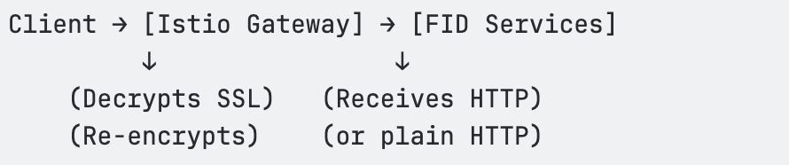
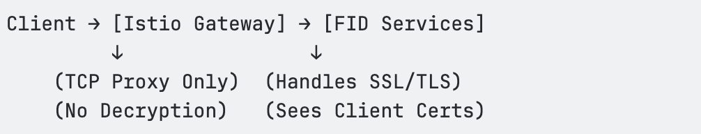

# Deploying with Istio Service Mesh

This guide shows developers how to deploy a self‑managed Identity Data Management cluster on Kubernetes with Istio for ingress, egress, and service‑to‑service traffic management. 

The document assumes familiarity with Kubernetes, Helm, and enterprise networking concepts.


## Architecture Overview

Istio introduces a programmable data plane (Envoy sidecars) and a centralized control plane. Within a self-managed Identity Data Management deployment, it becomes the enforcement layer for inbound traffic, service communication, and outbound connectivity to external systems.

At a high level, the architecture flow looks like this:


This architecture enables consistent policy enforcement, mutual TLS (mTLS), traffic shaping, resilience controls, and deep observability.


## Prerequisites

* A functioning Kubernetes cluster
* `kubectl` and `helm` configured with appropriate access
* DNS records and TLS certificates prepared for production hostnames (if using TLS)
* `holdApplicationUntilProxyStarts` must be enabled for init containers to work
* Traffic Exclusions: ZooKeeper and internal Identity Data Management fid ports must be excluded from interception

Pod Annotations: Must be applied at the StatefulSet level for FID pods


## Deployment Workflow

## Files you need to prepare

Make sure these files exist and are accessible from your deployment environment. 
- `values.yaml` – Identity Data Management Helm values with Istio‑specific annotations. 
- `fid-ingress-config.yaml` – Ingress Gateway & VirtualService configuration. 
- `fid-egress-config.yaml` – Egress Gateway & ServiceEntries configuration.
- `patch-microservices.sh` – Shell script to patch microservice deployments. 


## Install Istio

1. Install Istio base components, control plane, ingress gateway, and egress gateway. 

```
# Add Istio Helm repository
helm repo add istio https://istio-release.storage.googleapis.com/charts
helm repo update

# Create namespace
kubectl create namespace istio-system

# Install Istio base components (CRDs)
helm install istio-base istio/base \
  -n istio-system \
  --set defaultRevision=default \
  --wait

# Install Istio control plane (istiod)
helm install istiod istio/istiod \
  -n istio-system \
  --wait

# Install Ingress Gateway (in istio-system)
helm install istio-ingressgateway istio/gateway \
  -n istio-system \
  --set service.type=LoadBalancer \
  --wait

# Install Egress Gateway (in istio-system)  
helm install istio-egressgateway istio/gateway \
  -n istio-system \
  --set service.type=ClusterIP \
  --set labels.app=istio-egressgateway \
  --set labels.istio=egressgateway \
  --wait

# Verify installation
helm ls -n istio-system
kubectl get deployments -n istio-system
kubectl get svc -n istio-system
```


## Create a namespace and enable sidecar injection

1. Create a dedicated namespace for Identity Data Management and turn on automatic sidecar injection. 

```
kubectl create namespace fid-production

kubectl label namespace fid-production istio-injection=enabled
```

2. Create the image pull secret in the same namespace: 

```
kubectl create secret docker-registry regcred \
  --docker-server=docker.io \
  --docker-username=<username> \
  --docker-password=<password> \
  -n fid-production
```

## Configure Helm values (`values.yaml`)

The `values.yaml` file defines Identity Data Management configuration and the Istio‑critical annotations. Create a values.yaml file or modify the existing one to include the following:

```
# Standard Identity Data Management configuration
fid:
  license: "your-license-key"
  rootPassword: "secure-password"

persistence:
  enabled: true
  storageClass: "gp3"  # Or your storage class

# CRITICAL: Pod annotations must be at ROOT LEVEL for Identity Data Management pods, NOT under "fid" section
podAnnotations:
  # Enable holdApplicationUntilProxyStarts for init containers to work
  proxy.istio.io/config: |
    holdApplicationUntilProxyStarts: true
  # Exclude internal FID and ZooKeeper ports from interception
  # traffic.sidecar.istio.io/excludeInboundPorts: "7070,7171,8089,8090"
  # traffic.sidecar.istio.io/excludeOutboundPorts: "7070,7171,8089,8090,2181,2888,3888"

# ZooKeeper configuration - DISABLE sidecars completely
zookeeper:
  replicaCount: 3
  persistence:
    enabled: true
    storageClass: "gp2"
    size: 20Gi
  # Disable Istio sidecar injection for ZooKeeper
  podAnnotations:
    sidecar.istio.io/inject: "false"

# Let Istio handle ingress and (optionally) egress; turn off ingress and gateway inside the chart. 
ingress:
  enabled: false

gateway:
  enabled: false

# Image pull secrets
imagePullSecrets:
  - name: regcred
```


## Deploy self-managed Identity Data Management with Helm

Deploy the self-managed Identity Data Management chart using your `values.yaml` file. 

```
# Install FID with the prepared values
helm install fid-production oci://registry.radiantlogic.io/radiantone/helm/iddm-helm \
  --version 1.1.5 \
  -n fid-production \
  --values values.yaml
```


## Configure Istio Configuration 

Create a directory structure similar to the following:

```
fid-istio-config/
├── templates/
│   ├── ingress-gateway.yaml
│   ├── ingress-virtualservice.yaml
│   ├── egress-gateway.yaml
│   ├── egress-serviceentry.yaml
│   ├── egress-virtualservice.yaml
│   └── egress-destinationrule.yaml
└── values.yaml
```


### Ingress Configuration

Istio ingress controls how external traffic reaches your Identity Data Management services. It provides:
* Single entry point for all traffic
* SSL/TLS termination or passthrough
* Load balancing across Identity Data Management pods
* Edge-level security enforcement


Istio supports two primary TLS handling strategies (Termination vs. Passthrough). The correct choice depends on certificate ownership, inspection requirements, and authentication needs.

#### TLS Termination at Istio (SIMPLE / MUTUAL)

In this model, the Istio Gateway decrypts inbound TLS traffic and forwards HTTP traffic to backend services.

Traffic flow:



Use this when:

* You want Istio to manage certificates
* HTTP inspection or header manipulation is required
* Layer 7 policy enforcement is needed
* Identity Data Management does not require direct access to client certificates

Advantages:

* Centralized certificate lifecycle management
* Better oservability and metrics
* Support for rate limiting and authentication policies

Trade-offs:

* Client certificates are not preserved 
* Additional latency
* Identity Data Management does not see the original TLS session


#### TLS Passthrough

In passthrough mode, Istio forwards encrypted traffic without decrypting it. Identity Data Management terminates TLS directly.

Traffic flow:

Traffic flow:



Use passthrough when:

* Identity Data Management must access client certificates
* LDAP certificate authentication is required
* You have enterprise PKI requirements
* You have end-to-end encryption requirements

Advantages:

* Preserves client certificates
* Maintains end-to-end encryption
* Lower latency (no decrypt/encrypt reprocessing)
* Your Identity Data Management retains its own certificates

Trade-offs:

* No HTTP-layer inspection/modification
* Limited to TCP-level policies
* Certificates must be managed in Identity Data Management


**Example Production-ready Ingress Configuration**

Create a  `/tmp/fid-ingress-config.yaml` file with the following content:

```yaml
# Ingress Gateway Configuration with TLS Passthrough
---
apiVersion: networking.istio.io/v1beta1
kind: Gateway
metadata:
  name: fid-ingress-gateway
  namespace: fid-ralo
spec:
  selector:
    app: istio-ingressgateway
    istio: ingressgateway
  servers:
  # HTTPS with Passthrough (FID handles SSL)
  - port:
      number: 443
      name: https-passthrough
      protocol: HTTPS
    tls:
      mode: PASSTHROUGH
    hosts:
    - "*"
  # LDAPS with Passthrough  
  - port:
      number: 636
      name: ldaps-passthrough
      protocol: TLS
    tls:
      mode: PASSTHROUGH
    hosts:
    - "*"
  # Plain LDAP
  - port:
      number: 389
      name: ldap
      protocol: TCP
    hosts:
    - "*"
  # HTTP (will redirect to HTTPS)
  - port:
      number: 80
      name: http
      protocol: HTTP
    hosts:
    - "*"
---
apiVersion: networking.istio.io/v1beta1
kind: VirtualService
metadata:
  name: fid-ingress-routes
  namespace: fid-ralo
spec:
  hosts:
  - "*"
  gateways:
  - fid-ingress-gateway
  http:
  - match:
    - port: 80
    redirect:
      scheme: https
      port: 443
  tls:
  - match:
    - port: 443
      sniHosts:
      - "*"
    route:
    - destination:
        host: iddm-proxy-service
        port:
          number: 443
  tcp:
  - match:
    - port: 636
    route:
    - destination:
        host: fid-ext
        port:
          number: 2636
  - match:
    - port: 389
    route:
    - destination:
        host: fid-ext
        port:
          number: 2389
```

**Configuration Patterns**

Option A: For TLS Termination (Istio-Managed Certificates)

i. Update your values.yaml file to include the following properties: 

  ```
  # values.yaml for TLS termination
  istioAdvanced:
    enabled: true
    ingress:
      hosts:
        - "fid.example.com"
      tls:
        strategy: "termination"
        mode: "SIMPLE"           # or "MUTUAL"
        credentialName: "istio-fid-cert"
      ldaps:
        strategy: "termination"
        mode: "SIMPLE"
        credentialName: "istio-ldaps-cert"
  ```

ii. Create required secrets:

  ```
  kubectl create secret tls istio-fid-cert \
    --cert=path/to/fid.crt \
    --key=path/to/fid.key \
    -n istio-system
  
  kubectl create secret tls istio-ldaps-cert \
    --cert=path/to/ldaps.crt \
    --key=path/to/ldaps.key \
    -n istio-system
  ```

Option B: For TLS Passthrough (Certificates managed by Identity Data Management)

i. Update your values.yaml file to include the following properties:
  
  ```
  # values.yaml for TLS passthrough
  istioAdvanced:
    enabled: true
    ingress:
      hosts:
        - "fid.example.com"
      tls:
        strategy: "passthrough"
      ldaps:
        strategy: "passthrough"
  ```

ii. Update your values.yaml file to specify certificate configuration:

  ```
  fid:
    tls:
      enabled: true
      certificatePath: "/certs/fid.crt"
      privateKeyPath: "/certs/fid.key"
      clientCAPath: "/certs/client-ca.crt"
  ```


Option C: Mixed Mode (Common in Production)

HTTPS termination with LDAPS passthrough:

```yaml
istioAdvanced:
  enabled: true
  ingress:
    hosts:
      - "fid.example.com"
      - "ldap.example.com"
    tls:
      strategy: "termination"
      mode: "SIMPLE"
      credentialName: "web-tls-cert"
    ldaps:
      strategy: "passthrough"
    ports:
      https: 443
      ldaps: 636
      ldap: 389
```

This approach allows HTTP-layer features for the web UI while preserving certificate-based authentication for LDAP.

Correct protocol selection in the Gateway is critical. Ensure that you are using the following:

```yaml
# LDAPS
- port:
    number: 636
    protocol: TLS

# HTTPS
- port:
    number: 443
    protocol: HTTPS

# Plain LDAP
- port:
    number: 389
    protocol: TCP
```

Unlike HTTP/HTTPS, LDAPS can work with both termination and passthrough, but each has trade-offs.

Use passthrough if:
* You require client certificate authentication.
* You use SASL EXTERNAL.
* You want the safest and simplest configuration.

Use termination only if:
* You do not use client certificates.
* You want centralized certificate management in Istio.

Depending on your choice, modify your LDAP configuration:

```
# Complete LDAP/LDAPS Configuration
istioAdvanced:
  ingress:
    ports:
      ldap: 389   # Plain LDAP
      ldaps: 636  # Secure LDAPS
    
    # LDAPS strategy (choose one)
    ldaps:
      # For enterprise with client certs
      strategy: "passthrough"
      
      # OR for simple LDAPS without client certs use the following option instead. 
      # strategy: "termination"
      # mode: "SIMPLE"
      # credentialName: "ldaps-istio-cert"

```

For production LDAP deployments, it is recommended to use PASSTHROUGH mode to ensure all LDAP features are preserved. Additionally, consider bypassing Istio for LDAP ports by using pod annotations to avoid potential protocol issues.

**Example Production-ready VirtualService Template**

Create a `ingress-virtualservice.yaml` file to control routing rules with the following content:

```
{{- if .Values.istioAdvanced.enabled }}
apiVersion: networking.istio.io/v1beta1
kind: VirtualService
metadata:
  name: fid-ingress-routes
  namespace: {{ .Release.Namespace }}
spec:
  hosts:
  {{- range .Values.istioAdvanced.ingress.hosts }}
  - {{ . | quote }}
  {{- end }}
  gateways:
  - fid-ingress-gateway
  http:
  - match:
    - uri:
        prefix: "/classic"
    route:
    - destination:
        host: iddm-proxy-service
        port:
          number: 8080
  - match:
    - uri:
        prefix: "/main"
    route:
    - destination:
        host: iddm-proxy-service
        port:
          number: 8080
  - match:
    - uri:
        prefix: "/api"
    route:
    - destination:
        host: api-gateway
        port:
          number: 8081
  - route:
    - destination:
        host: iddm-proxy-service
        port:
          number: 8080
  {{- if or .Values.istioAdvanced.ingress.ports.ldap .Values.istioAdvanced.ingress.ports.ldaps }}
  tcp:
  {{- if .Values.istioAdvanced.ingress.ports.ldaps }}
  - match:
    - port: 636
    route:
    - destination:
        host: fid-ext
        port:
          number: 2636
  {{- end }}
  {{- if .Values.istioAdvanced.ingress.ports.ldap }}
  - match:
    - port: 389
    route:
    - destination:
        host: fid-ext
        port:
          number: 2389
  {{- end }}
  {{- end }}
{{- end }}
```

HTTP routes handle HTTP/HTTPS traffic and can match on URL paths, headers, etc., while TCP routes handle non-HTTP protocols such as LDAP or databases and match only on the port. LDAP must always be configured under the "tcp:" section, not the "http:" section. Note that route order is important, so more specific routes must appear before more general ones.

### Egress Configuration 

Egress controls how your FID pods connect to external services. Proper configuration ensures security, compliance, reliability, and cost control. 

1. Add the following content to your `egress-gateway.yaml` file. Here, the Gateway component contains the egress gateway that manages outbound traffic. The selector points to istio-egressgateway pods, and servers specify ports and protocols to handle.

```
apiVersion: networking.istio.io/v1beta1
kind: Gateway
metadata:
  name: fid-egress-gateway
  namespace: fid-ralo
spec:
  selector:
    app: istio-egressgateway
    istio: egressgateway
  servers:
  # HTTP/HTTPS external services
  - port:
      number: 80
      name: http
      protocol: HTTP
    hosts:
    - "*.docker.io"
    - "*.github.com"
  - port:
      number: 443
      name: https
      protocol: HTTPS
    hosts:
    - "*.docker.io"
    - "*.github.com"

---
# ServiceEntry for Docker Hub
apiVersion: networking.istio.io/v1beta1
kind: ServiceEntry
metadata:
  name: docker-hub
  namespace: fid-ralo
spec:
  hosts:
  - docker.io
  - registry-1.docker.io
  - auth.docker.io
  - production.cloudflare.docker.com
  ports:
  - number: 443
    name: https
    protocol: HTTPS
  - number: 80
    name: http
    protocol: HTTP
  location: MESH_EXTERNAL
  resolution: DNS

---
# ServiceEntry for GitHub
apiVersion: networking.istio.io/v1beta1
kind: ServiceEntry
metadata:
  name: github
  namespace: fid-ralo
spec:
  hosts:
  - github.com
  - api.github.com
  - raw.githubusercontent.com
  ports:
  - number: 443
    name: https
    protocol: HTTPS
  location: MESH_EXTERNAL
  resolution: DNS

---
# VirtualService to route through egress gateway
apiVersion: networking.istio.io/v1beta1
kind: VirtualService
metadata:
  name: docker-hub-routing
  namespace: fid-ralo
spec:
  hosts:
  - docker.io
  - registry-1.docker.io
  - auth.docker.io
  - production.cloudflare.docker.com
  gateways:
  - fid-egress-gateway
  - mesh
  http:
  - match:
    - gateways:
      - mesh
    route:
    - destination:
        host: istio-egressgateway.istio-system.svc.cluster.local
        port:
          number: 443
  - match:
    - gateways:
      - fid-egress-gateway
    route:
    - destination:
        host: docker.io
        port:
          number: 443

---
# DestinationRule for cross-namespace routing
apiVersion: networking.istio.io/v1beta1
kind: DestinationRule
metadata:
  name: egressgateway-for-docker
  namespace: fid-ralo
spec:
  host: istio-egressgateway.istio-system.svc.cluster.local
  trafficPolicy:
    tls:
      mode: ISTIO_MUTUAL
```

#### Advanced Egress Features

You may also include any of these advanced egress features as needed. 

1. Restricting All External Access

Using this blocks all traffic except explicitly allowed services:

```
istioAdvanced:
  egress:
    restrictMode: true
```

Applied via Sidecar:

```
apiVersion: networking.istio.io/v1beta1
kind: Sidecar
metadata:
  name: default
  namespace: fid-production
spec:
  egress:
  - hosts:
    - "./*"  # All local services
    {{- range .Values.istioAdvanced.egress.externalServices }}
    - "{{ .host }}"  # Explicitly allowed external
    {{- end }}
```

2. IP-Based Restrictions

Using this blocks specific IP ranges for external traffic:

```
apiVersion: networking.istio.io/v1beta1
kind: ServiceEntry
metadata:
  name: block-private-ips
spec:
  hosts:
  - "blocked.internal"
  addresses:
  - 10.0.0.0/8
  - 172.16.0.0/12
  - 192.168.0.0/16
  ports:
  - number: 443
    name: https
    protocol: HTTPS
  location: MESH_EXTERNAL
  resolution: STATIC
```

**3. Rate Limiting Egress**

This limits outbound requests via EnvoyFilter:

```
apiVersion: networking.istio.io/v1beta1
kind: EnvoyFilter
metadata:
  name: egress-ratelimit
spec:
  configPatches:
  - applyTo: HTTP_FILTER
    match:
      context: GATEWAY
      listener:
        filterChain:
          filter:
            name: "envoy.filters.network.http_connection_manager"
    patch:
      operation: INSERT_BEFORE
      value:
        name: envoy.filters.http.local_ratelimit
        typed_config:
          "@type": type.googleapis.com/udpa.type.v1.TypedStruct
          type_url: type.googleapis.com/envoy.extensions.filters.http.local_ratelimit.v3.LocalRateLimit
          value:
            stat_prefix: http_local_rate_limiter
            token_bucket:
              max_tokens: 100
              tokens_per_fill: 100
              fill_interval: 60s
```

4. Egress with Authentication

You can use this for services that require authentication with client certificates:

```
apiVersion: networking.istio.io/v1beta1
kind: DestinationRule
metadata:
  name: external-with-auth
spec:
  host: secure-api.example.com
  trafficPolicy:
    tls:
      mode: MUTUAL
      clientCertificate: /etc/certs/client-cert.pem
      privateKey: /etc/certs/client-key.pem
      caCertificates: /etc/certs/ca-cert.pem
```

### Apply Istio configurations

Once you have finalized all your Istio configurations, apply them by running the following commands:

```
kubectl apply -f /tmp/fid-ingress-config.yaml
kubectl apply -f /tmp/fid-egress-config.yaml
```

## Add Additional Annotations for Microservices

The Identity Data Management StatefulSet receives its annotations from values.yaml. However, microservice deployments must be patched separately (This step is optional. Use it only when you need to exclude specific ports as part of network policies):

```
# Patch all microservices to exclude LDAP and FID REST ports
for deployment in authentication api-gateway directory-browser \
                  directory-namespace directory-schema settings \
                  system-administration data-catalog zipkin \
                  iddm-ui iddm-proxy; do
  kubectl patch deployment $deployment -n fid-production --type='json' -p='[
    {
      "op": "add",
      "path": "/spec/template/metadata/annotations",
      "value": {
        # "traffic.sidecar.istio.io/excludeOutboundPorts": "2389,2636,8089,8090"
      }
    }
  ]' && echo "Patched: $deployment"
done
```

## Verify and run tests for the deployment

1. Check that pods are ready and sidecars are injected: 

```
kubectl get pods -n fid-production
```

2. Get the ingress gateway address and test web access: 

```
export INGRESS_HOST=$(kubectl get svc -n istio-system istio-ingressgateway \
  -o jsonpath='{.status.loadBalancer.ingress[0].hostname}')
# Or:
export INGRESS_HOST=$(kubectl get svc -n istio-system istio-ingressgateway \
  -o jsonpath='{.status.loadBalancer.ingress[0].ip}')

curl -k https://$INGRESS_HOST/classic -H "Host: fid.example.com"
```

3. Test LDAP and LDAPS: 

```
ldapsearch -x -H ldap://$INGRESS_HOST:389 \
  -D "cn=Directory Manager" \
  -w "password" \
  -b "dc=example,dc=com" \
  "(objectClass=*)"

ldapsearch -H ldaps://$INGRESS_HOST:636 \
  -Y EXTERNAL \
  --cert /path/to/client.crt \
  --key /path/to/client.key \
  -b "dc=example,dc=com"
```

4. Test egress from inside a pod: 

```
kubectl exec -n fid-production deployment/api-gateway -c api-gateway -- \
  curl -s https://api.github.com/rate_limit
```

## Troubleshooting common issues 

### 1. Init Containers Failing (Connection Refused)

Issue: FID init containers fail with "connection refused" to ZooKeeper.

Check:

```bash
kubectl describe pod fid-0 -n fid-production
# Look for init container failures

kubectl logs fid-0 -n fid-production -c check-zk
# Shows: "Connection refused" errors
```

**Root Cause:** Istio’s iptables redirect all traffic before the proxy is ready. Init containers run after `istio-init` but before `istio-proxy`, so no network connectivity is available during the init phase.

Fix:

```yaml
# Add to values.yaml at TOP LEVEL (not under fid:)
podAnnotations:
  proxy.istio.io/config: |
    holdApplicationUntilProxyStarts: true
  traffic.sidecar.istio.io/excludeOutboundPorts: "2181,2888,3888"
```

If Helm annotations don’t apply:

```bash
kubectl patch statefulset fid -n fid-production --type='json' -p='[
  {
    "op": "add",
    "path": "/spec/template/metadata/annotations/proxy.istio.io~1config",
    "value": "holdApplicationUntilProxyStarts: true"
  }
]'
```


### 2. Authentication Service Returns 503

Issue: Authentication fails with "503 Service Unavailable" when calling `fid-app`.

Check:

```bash
kubectl logs deployment/authentication -n fid-production -c authentication
# Shows: Error connecting to fid-app:2389 or fid-app:8089
```

**Root Cause:** Istio intercepts LDAP (2389) and FID REST (8089/8090) ports. Envoy proxy cannot parse binary LDAP protocol, resulting in connection failures.

Fix:

```bash
# Patch all microservices to exclude these ports
bash /tmp/patch-microservices.sh fid-production
```

### 3. Directory Manager User Not Found

Issue: Authentication fails with "user not found" despite FID running.

Check:

```bash
kubectl logs fid-0 -n fid-production -c fid | grep -i "directory manager"
# Should show: Username: cn=Directory Manager
```

**Root Cause:** Pods restarted before initialization, often due to ZooKeeper connectivity issues or missing port exclusions.

Fix: Ensure all port exclusions are in place, then delete and recreate FID pods:

```bash
kubectl delete pod fid-0 -n fid-production
kubectl wait --for=condition=ready pod fid-0 -n fid-production --timeout=300s
```


### 4. Pods Not Getting Sidecars

Issue: Pods show 1/1 containers instead of 2/2.

Check:

```bash
kubectl get namespace fid-production -o yaml | grep istio-injection
```

Fix:

```bash
kubectl label namespace fid-production istio-injection=enabled
kubectl rollout restart deployment -n fid-production
kubectl rollout restart statefulset fid -n fid-production
```


### 5. 503 Service Unavailable – Investigation

Issue: Frequent 503 errors, often from `api-gateway` to backend.

**Investigation Steps:**

Check Envoy configuration:

```bash
kubectl exec -n fid-ralo deployment/api-gateway -c istio-proxy -- \
  curl -s localhost:15000/clusters | grep authentication
```

Test direct connectivity:

```bash
kubectl exec -n fid-ralo deployment/api-gateway -c api-gateway -- \
  wget -O- http://authentication-service:80/actuator/health
```

Check for IP mismatch:

```bash
kubectl get svc authentication-service -n fid-ralo -o wide
kubectl get endpoints authentication-service -n fid-ralo
```

**Root Causes:**

* STRICT mTLS policies
* Missing service endpoints
* Protocol mismatch

**Fix Priority:**

1. Check and override STRICT PeerAuthentication → PERMISSIVE
2. Verify endpoints exist → Fix service selectors
3. Create ServiceEntry/DestinationRule → Force protocol settings
4. Exclude ports for binary protocols → Use pod annotations


### 6. FID-0 Continuously Restarting

Issue: FID-0 restarts with "Connection reset by peer" to ZooKeeper.

Check:

```bash
kubectl logs fid-0 -n fid-production -c fid | grep -i zookeeper
```

**Root Cause:** Outbound ZooKeeper traffic intercepted by Istio; sidecar cannot handle ZooKeeper protocol.

Fix:

```yaml
podAnnotations:
  traffic.sidecar.istio.io/excludeInboundPorts: "7070,7171,8089,8090"
  traffic.sidecar.istio.io/excludeOutboundPorts: "7070,7171,8089,8090,2181,2888,3888"
```

> Note: Port 2181 must be excluded for FID pods.


### 7. LDAP Connection Refused

Issue: LDAP connections fail through Istio.

Check:

```bash
kubectl get deployment fid -n fid-production -o yaml | grep -A5 excludeInboundPorts
```

Fix:

```yaml
podAnnotations:
  traffic.sidecar.istio.io/excludeInboundPorts: "2389,2636"
```


### 8. External Services Blocked

Issue: Cannot reach external services.

Check:

```bash
kubectl get serviceentry -n fid-production
kubectl logs -n istio-system deployment/istio-egressgateway
```

Fix: Add ServiceEntry for the external service, ensure egress gateway is running, and verify firewall rules.


### 9. High Latency

Issue: Requests are slower than expected.

Check:

```bash
kubectl exec -n fid-production deployment/api-gateway -c istio-proxy -- \
  curl -s localhost:15000/stats | grep upstream_rq_time
```

Fix: Reduce circuit breaker sensitivity, increase connection pool size, and consider excluding internal ports from the mesh.


### 10. Certificate Issues

Issue: TLS handshake failures.

Check:

```bash
kubectl get secret fid-tls-cert -n fid-production
openssl s_client -connect $INGRESS_HOST:443 -servername fid.example.com
```

Fix:

```bash
kubectl create secret tls fid-tls-cert \
  --cert=path/to/cert.pem \
  --key=path/to/key.pem \
  -n fid-production
```

