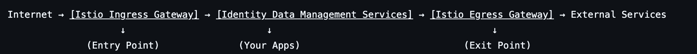

# Deploying with Istio Service Mesh

This guide shows developers how to deploy a self‑managed Identity Data Management cluster on Kubernetes with Istio for ingress, egress, and service‑to‑service traffic management. 

The document assumes familiarity with Kubernetes, Helm, and enterprise networking concepts.


## Architecture Overview

Istio introduces a programmable data plane (Envoy sidecars) and a centralized control plane. Within a self-managed Identity Data Management deployment, it becomes the enforcement layer for inbound traffic, east–west service communication, and outbound connectivity to external systems.

At a high level, the architecture flow looks like this:



This architecture enables consistent policy enforcement, mutual TLS (mTLS), traffic shaping, resilience controls, and deep observability.


## Prerequisites

Ensure the following before beginning:

* A functioning Kubernetes cluster
* `kubectl` and `helm` configured with appropriate access
* Access to the Identity Data Management/IDDM Helm registry and license
* DNS records and TLS certificates prepared for production hostnames (if using TLS)


## Deployment Workflow

A production-aligned deployment follows this sequence:

1. Install Istio (CRDs, control plane, ingress, egress gateways).
2. Create the Identity Data Management namespace and enable sidecar injection.
3. Prepare Helm values with required Istio annotations.
4. Deploy Identity Data Management.
5. Apply ingress configuration.
6. Apply egress configuration.
7. Validate sidecars, init containers, and connectivity.


## Files you need to prepare

Make sure these files exist and are accessible from your deployment environment. 
- `values.yaml` – IDDM/FID Helm values with Istio‑specific annotations (namespace‑scoped deployment config). 
- `fid-ingress-config.yaml` – Istio `Gateway` and `VirtualService` for external ingress (HTTPS, LDAP, LDAPS, HTTP redirect). 
- `fid-egress-config.yaml` – Istio `Gateway`, `ServiceEntry`, `VirtualService`, and `DestinationRule` for outbound traffic control (for example Docker Hub, GitHub). 
- `patch-microservices.sh` – Optional shell script to patch IDDM microservice `Deployment` objects with extra Istio annotations (port exclusions, etc.). 


## Install Istio

1. Install the Istio control plane, ingress gateway, and (optionally) egress gateway. 

```
helm repo add istio https://istio-release.storage.googleapis.com/charts
helm repo update

kubectl create namespace istio-system

helm install istio-base istio/base \
  -n istio-system \
  --set defaultRevision=default \
  --wait

helm install istiod istio/istiod \
  -n istio-system \
  --wait

# Ingress Gateway (external entry point)
helm install istio-ingressgateway istio/gateway \
  -n istio-system \
  --set service.type=LoadBalancer \
  --wait

# Egress Gateway (recommended for controlled outbound)
helm install istio-egressgateway istio/gateway \
  -n istio-system \
  --set service.type=ClusterIP \
  --set labels.app=istio-egressgateway \
  --set labels.istio=egressgateway \
  --wait
```

2. Verify that Istio components and services are running: 

```
helm ls -n istio-system
kubectl get deployments -n istio-system
kubectl get svc -n istio-system
```


## Create a namespace and enable sidecar injection

1. Create a dedicated namespace for Identity Data Management and turn on automatic sidecar injection. 

```
kubectl create namespace fid-production

kubectl label namespace fid-production istio-injection=enabled
```

2. If you need a Docker registry credential, create it in the same namespace: 

```
kubectl create secret docker-registry regcred \
  --docker-server=docker.io \
  --docker-username=<username> \
  --docker-password=<password> \
  -n fid-production
```

## Configure Helm values (`values.yaml`)

The `values.yaml` file defines IDDM configuration and the Istio‑critical annotations. At minimum, include the following:

### 1. Core IDDM configuration

```yaml
fid:
  license: "your-license-key"
  rootPassword: "secure-password"

persistence:
  enabled: true
  storageClass: "gp3"   # Use your storage class
```

### 2. Critical Istio pod annotations

Annotations that affect Istio must be at the **top level** of the values file, not nested under `fid:`. 
```yaml
podAnnotations:
  proxy.istio.io/config: |
    holdApplicationUntilProxyStarts: true
  # Optional port exclusions if needed:
  # traffic.sidecar.istio.io/excludeInboundPorts: "7070,7171,8089,8090"
  # traffic.sidecar.istio.io/excludeOutboundPorts: "7070,7171,8089,8090,2181,2888,3888"
```

`holdApplicationUntilProxyStarts` ensures the Istio sidecar comes up before the FID init containers that must connect to ZooKeeper or other services, preventing “connection refused” at startup. 

### 3. ZooKeeper configuration

Choose whether ZooKeeper runs without a sidecar (simpler) or with a sidecar plus port exclusions (more advanced). 
Disable injection for ZooKeeper: 

```
zookeeper:
  replicaCount: 3
  persistence:
    enabled: true
    storageClass: "gp2"
    size: 20Gi
  podAnnotations:
    sidecar.istio.io/inject: "false"
```

Or run ZooKeeper with a sidecar and explicit exclusions: 

```
zookeeper:
  replicaCount: 3
  persistence:
    enabled: true
    storageClass: "gp2"
    size: 20Gi
  podAnnotations:
    proxy.istio.io/config: |
      holdApplicationUntilProxyStarts: true
    traffic.sidecar.istio.io/excludeInboundPorts: "2181,2888,3888"
    traffic.sidecar.istio.io/excludeOutboundPorts: "2181,2888,3888"
```

### Disable built‑in ingress/gateway

Let Istio handle ingress and (optionally) egress; turn off ingress and gateway inside the chart. 

```
ingress:
  enabled: false

gateway:
  enabled: false
```

### Image pull secrets

```
imagePullSecrets:
  - name: regcred
```


## Deploy self-managed Identity Data Management with Helm

1. Deploy the self-managed Identity Data Management chart using your `values.yaml` file. 

```
helm install fid-production \
  oci://registry.radiantlogic.io/radiantone/helm/iddm-helm \
  --version 1.1.5 \
  -n fid-production \
  --values values.yaml
```

2. Check the pods and verify that most of them have the Istio sidecar (for example `2/2` containers for the FID StatefulSet and microservices, `1/1` if you disabled ZooKeeper injection). 

```
kubectl get pods -n fid-production
```


## Configure Istio ingress (`fid-ingress-config.yaml`)

Istio ingress exposes the Identity Data Management web UI and LDAP/LDAPS endpoints through a single entry point. 

### Example: TLS passthrough ( where Identity Data Management manages certificates)

`fid-ingress-config.yaml` (adjusted for `fid-production` namespace): 
```yaml
---
apiVersion: networking.istio.io/v1beta1
kind: Gateway
metadata:
  name: fid-ingress-gateway
  namespace: fid-production
spec:
  selector:
    app: istio-ingressgateway
    istio: ingressgateway
  servers:
  - port:
      number: 443
      name: https-passthrough
      protocol: HTTPS
    tls:
      mode: PASSTHROUGH
    hosts:
    - "*"

  - port:
      number: 636
      name: ldaps-passthrough
      protocol: TLS
    tls:
      mode: PASSTHROUGH
    hosts:
    - "*"

  - port:
      number: 389
      name: ldap
      protocol: TCP
    hosts:
    - "*"

  - port:
      number: 80
      name: http
      protocol: HTTP
    hosts:
    - "*"

---
apiVersion: networking.istio.io/v1beta1
kind: VirtualService
metadata:
  name: fid-ingress-routes
  namespace: fid-production
spec:
  hosts:
  - "*"
  gateways:
  - fid-ingress-gateway

  http:
  - match:
    - port: 80
    redirect:
      scheme: https
      port: 443

  tls:
  - match:
    - port: 443
      sniHosts:
      - "*"
    route:
    - destination:
        host: iddm-proxy-service
        port:
          number: 443

  tcp:
  - match:
    - port: 636
    route:
    - destination:
        host: fid-ext
        port:
          number: 2636

  - match:
    - port: 389
    route:
    - destination:
        host: fid-ext
        port:
          number: 2389
```

Apply it: 

```
kubectl apply -f fid-ingress-config.yaml
```

Note that LDAPS must use `protocol: TLS` and plain LDAP must use `protocol: TCP`; using `HTTPS` for LDAPS makes Istio expect HTTP headers and will break LDAP clients. 


## Configure Istio egress (`fid-egress-config.yaml`)

Istio egress centralizes and restricts outbound traffic from IDDM to external services such as Docker Hub and GitHub. 
Example `fid-egress-config.yaml`: 

```
---
apiVersion: networking.istio.io/v1beta1
kind: Gateway
metadata:
  name: fid-egress-gateway
  namespace: fid-production
spec:
  selector:
    app: istio-egressgateway
    istio: egressgateway
  servers:
  - port:
      number: 80
      name: http
      protocol: HTTP
    hosts:
    - "*.docker.io"
    - "*.github.com"
  - port:
      number: 443
      name: https
      protocol: HTTPS
    hosts:
    - "*.docker.io"
    - "*.github.com"

---
apiVersion: networking.istio.io/v1beta1
kind: ServiceEntry
metadata:
  name: docker-hub
  namespace: fid-production
spec:
  hosts:
  - docker.io
  - registry-1.docker.io
  - auth.docker.io
  - production.cloudflare.docker.com
  ports:
  - number: 443
    name: https
    protocol: HTTPS
  - number: 80
    name: http
    protocol: HTTP
  location: MESH_EXTERNAL
  resolution: DNS

---
apiVersion: networking.istio.io/v1beta1
kind: ServiceEntry
metadata:
  name: github
  namespace: fid-production
spec:
  hosts:
  - github.com
  - api.github.com
  - raw.githubusercontent.com
  ports:
  - number: 443
    name: https
    protocol: HTTPS
  location: MESH_EXTERNAL
  resolution: DNS

---
apiVersion: networking.istio.io/v1beta1
kind: VirtualService
metadata:
  name: docker-hub-routing
  namespace: fid-production
spec:
  hosts:
  - docker.io
  - registry-1.docker.io
  - auth.docker.io
  - production.cloudflare.docker.com
  gateways:
  - fid-egress-gateway
  - mesh
  http:
  - match:
    - gateways:
      - mesh
    route:
    - destination:
        host: istio-egressgateway.istio-system.svc.cluster.local
        port:
          number: 443
  - match:
    - gateways:
      - fid-egress-gateway
    route:
    - destination:
        host: docker.io
        port:
          number: 443

---
apiVersion: networking.istio.io/v1beta1
kind: DestinationRule
metadata:
  name: egressgateway-for-docker
  namespace: fid-production
spec:
  host: istio-egressgateway.istio-system.svc.cluster.local
  trafficPolicy:
    tls:
      mode: ISTIO_MUTUAL
```

Apply it: 

```
kubectl apply -f fid-egress-config.yaml
```

## Optional: patch microservices (`patch-microservices.sh`)

If the Helm chart does not propagate Istio annotations (for example port exclusions) to all microservice deployments, use a helper script like `patch-microservices.sh` to add them consistently. 

Example content for `patch-microservices.sh`: 

```
#!/usr/bin/env bash
set -e

NAMESPACE=${1:-fid-production}

for deployment in authentication api-gateway directory-browser \
                  directory-namespace directory-schema settings \
                  system-administration data-catalog zipkin \
                  iddm-ui iddm-proxy; do
  kubectl patch deployment "$deployment" -n "$NAMESPACE" --type='json' -p='[
    {
      "op": "add",
      "path": "/spec/template/metadata/annotations",
      "value": {
        # Example:
        # "traffic.sidecar.istio.io/excludeOutboundPorts": "2389,2636,8089,8090"
      }
    }
  ]' && echo "Patched: $deployment"
done
```

Run it after the Helm install: 
```
bash patch-microservices.sh fid-production
```

If pod annotations on the Identity Data Management StatefulSet still do not look correct, patch the StatefulSet directly as shown earlier. 


## Verify the deployment

1. Check that pods are ready and sidecars are injected: 

```
kubectl get pods -n fid-production
```

2. Get the ingress gateway address and test web access: 

```
export INGRESS_HOST=$(kubectl get svc -n istio-system istio-ingressgateway \
  -o jsonpath='{.status.loadBalancer.ingress[0].hostname}')
# Or:
export INGRESS_HOST=$(kubectl get svc -n istio-system istio-ingressgateway \
  -o jsonpath='{.status.loadBalancer.ingress[0].ip}')

curl -k https://$INGRESS_HOST/classic -H "Host: fid.example.com"
```

3. Test LDAP and LDAPS: 

```
ldapsearch -x -H ldap://$INGRESS_HOST:389 \
  -D "cn=Directory Manager" \
  -w "password" \
  -b "dc=example,dc=com" \
  "(objectClass=*)"

ldapsearch -H ldaps://$INGRESS_HOST:636 \
  -Y EXTERNAL \
  --cert /path/to/client.crt \
  --key /path/to/client.key \
  -b "dc=example,dc=com"
```

4. Test egress from inside a pod: 

```
kubectl exec -n fid-production deployment/api-gateway -c api-gateway -- \
  curl -s https://api.github.com/rate_limit
```

## Troubleshooting common issues

| Symptom                                   | Likely cause                                             | Quick fix                                                                 |
|-------------------------------------------|----------------------------------------------------------|---------------------------------------------------------------------------|
| Init containers fail with connection errors | Istio sidecar not ready when init containers run        | Add `proxy.istio.io/config: holdApplicationUntilProxyStarts: true` to FID pod annotations.  |
| 503 responses between services            | STRICT mesh‑wide mTLS or incompatible config            | Use a namespace‑level `PeerAuthentication` with `PERMISSIVE` for `fid-production`.  |
| FID cannot reach ZooKeeper                | ZooKeeper ports intercepted by Envoy                    | Exclude ports `2181,2888,3888` on FID and/or ZooKeeper pods.       |
| LDAP/LDAPS traffic fails via Istio        | Wrong `protocol` or missing port exclusions             | Use `TLS` for LDAPS and `TCP` for LDAP; add port exclusions as needed.  |
| No sidecars in IDDM pods                  | Namespace not labeled for injection or pods not restarted | Ensure `istio-injection=enabled` on namespace and restart the deployments.  |

