# Overview

Secure data connectors allow data to flow from your on premises or private cloud environments to your RadiantOne SaaS environment. This guide provides an overview of the *Secure Data Connectors* home screen in Environment Operations Center and its features. 

To navigate to the *Secure Data Connectors* home screen, select **Secure Data Connectors** () from the left navigation bar.

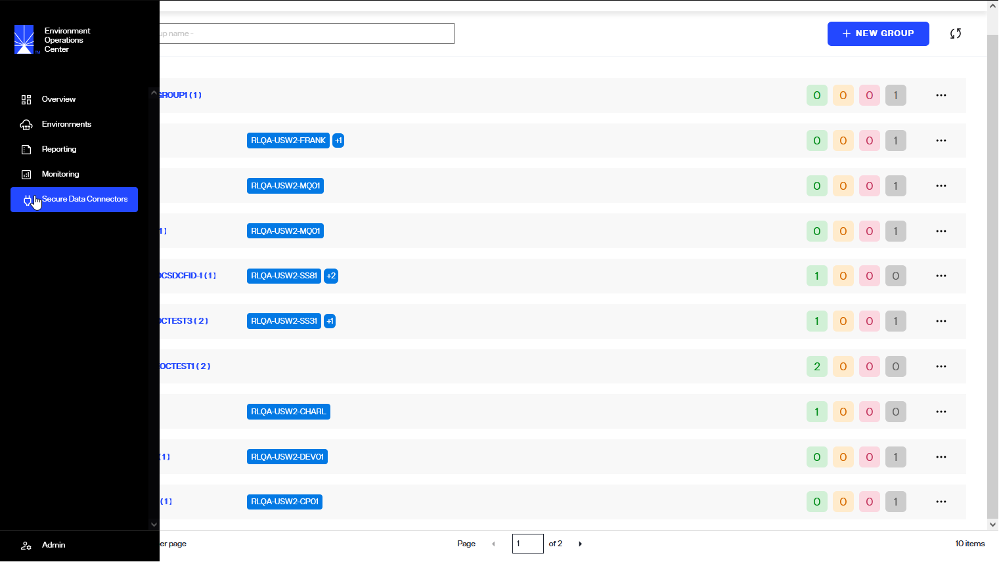

## Concepts

This section describes secure data connectors and groups.

### Secure Data Connector

A secure data connector (SDC) provides a secure channel for all TCP-based communication (LDAP, SQL, etc.) between your cloud-based RadiantOne environments and your on-premise or private cloud data sources. One or more secure data connectors can be deployed in your on-premises network.The SDC has been designed and architected with security as its first concern. Here are a few key points concerning security:
- All communications between the SDC and the RadiantOne cloud environments occur over a TLS-only secured WebSocket tunnel. The data exchanged over this channel is encrypted and protected from unauthorized access.
- The initial connection between the SDC and the RadiantOne cloud environments must be initiated from the SDC (on-premise client). The RadiantOne cloud environment cannot initiate this connection.
- The connection between the SDC and the RadiantOne cloud environment requires authentication based on a token generated from the EOC. Attempts at establishing unauthenticated connections from unrecognized SDCs or other clients are rejected. 

### Group

Secure data connectors are organized in **groups**. A group is a logical grouping of one or more secure data connectors that connect to the same set of data sources. By adding more than one secure data connector to a group, you can ensure high availability. Traffic is load-balanced equally to all data connectors that belong to the same group. If one or more secure data connectors within a group fail or become unresponsive, the remaining secure data connectors will automatically ensure connectivity is not interrupted. 

## Secure Data Connector Home Screen

The *Secure Data Connector* home screen provides an overview of all your organization's configured data connectors and allows you to manage them.

The list of data connectors is organized by group. Each group has a set of RadiantOne environments that are allowed to use the data connectors belonging to that group.
Each group contains a list of data connectors and their associated information (name, description, status). You can expand/collapse each group to show or hide the associated data connectors.

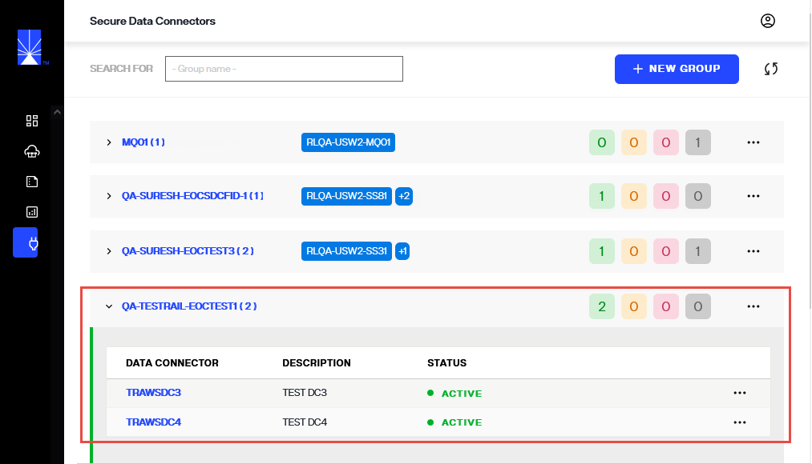

### Adding a New Data Connector

The process to create a new secure data connector and establish a connection with a data source requires the following high-level steps.

- The data connector group must be created in Environment Operations Center.
- At least a data connector must be added to the group.
- The secure data connector client must be deployed on the local machine.
- The data source must be defined in the FID Control Panel. 

This guide outlines the steps to add a new secure data connector in Environment Operations Center. For details on deploying the secure data connector client, see the [configure a secure data connector client](configure-sdc-client.md) guide. For details on connecting to an on-premise backend from the control panel, see the RadiantOne System Administration Guide.

To establish a connection between Env Ops Center and an on-premises network, a data connector must first be created in Env Ops Center.

To add a new group, select **New Group** from the *Secure Data Connectors* home screen.

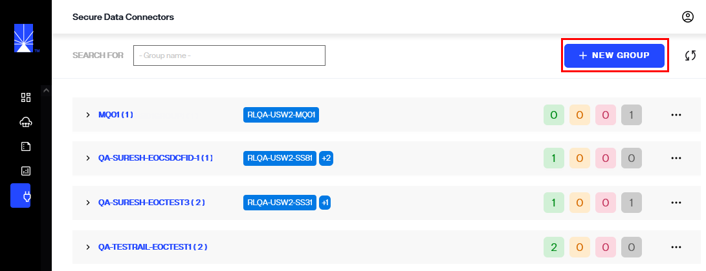

#### Add Group info

Before you can add new data connectors, you must first add a **group**. This can be done by clicking **New Group**.

In a **new row**, enter the group name and select one or multiple environments from the list of available environments in the provided group and environment fields.

>[!note] Group and Environment are required fields and must be entered to create the group.

| Group Info | Description |
| ------------------- | ----------- |
| Group Name | Provide a group name that is relevant to how secure data connectors will be grouped under this group. Groups provide failover and load balancing for the network. |
| Environment | A minimum of one environment must be associated to a group.  Select environment(s) from the **Environment** list, a group can be associated to multiple environments.

Once you have entered these fields, select :white_check_mark: to add the new group.

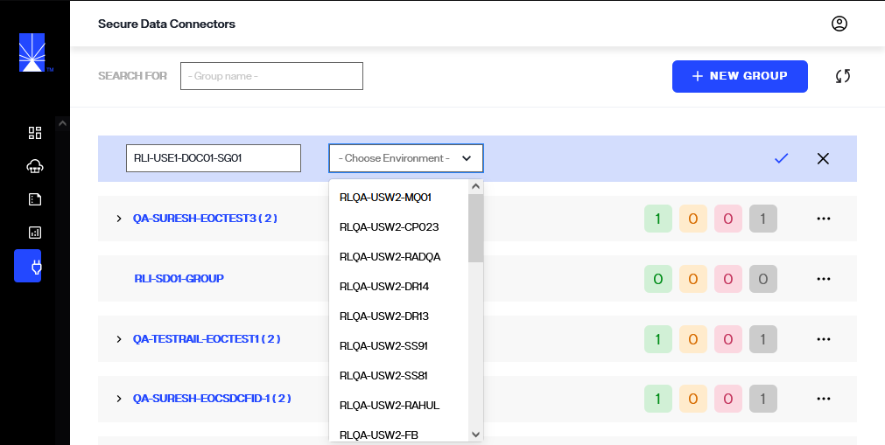

Once the group is successfully created, it is displayed in the list of available groups on the *Secure Data Connectors* home screen.

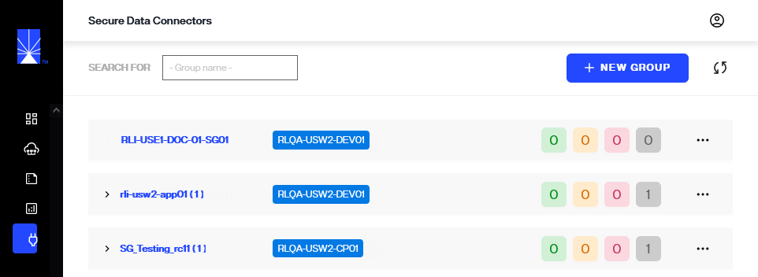

#### Add data connector info

Now that **group** being created, the next step is to add a new data connector. Select **...** from last column of selected group to get list of options, from these options select ***Add Data Connector***.

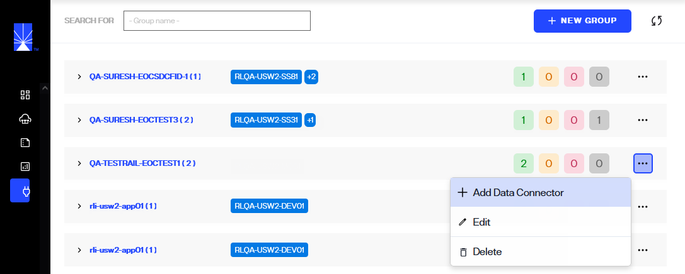

In the *New Data Connector* row, enter the data connector information in the provided name and description fields.

>[!note] Name is a required field and must be entered to create the connector.

| Data Connector Info | Description |
| ------------------- | ----------- |
| Name | Provide a name that is relevant to the network being connected to. |
| Description | The description field is optional but is recommended to provide any details that are relevant about the network. This helps with maintaining data connectors. |

Once you have completed entering the required fields for new data connector, select :white_check_mark: to add the new connector.

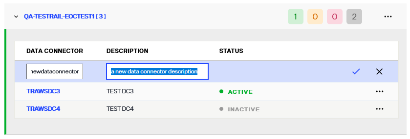

If the data connector is successfully created, it appears in the list of available data connectors under the *Group*.

The *Status* of the new data connector displays as "UNREGISTERED". A connection needs to be established between a new data connector and the on-prem or cloud network for the connector to become "Active". For details on deploying the secure data connector client, see the [configure a secure data connector client](configure-sdc-client.md) guide.

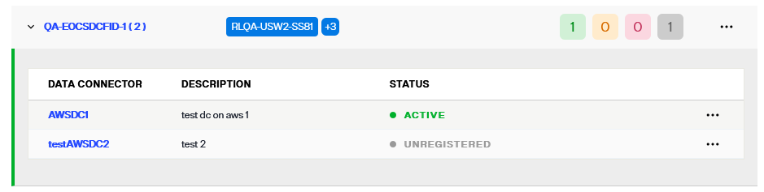

### Manage Data Connectors

Each data connector has an **Options** (**"..."**) menu that allows you to manage the connector. For more details on managing data connectors, please refer to the [Manage Data Connectors](configure-sdc.md) guide.

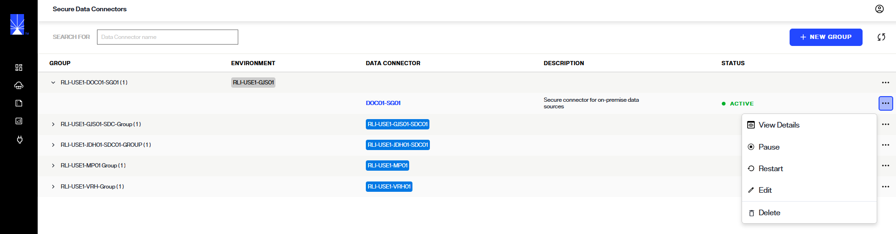

## View data connector details

A detailed view is available for each data connector and provides additional data connector information, registration status, and connection statuses.

Data connector details can be accessed in two ways. One way is to select the data connector name from the list shown on the Secure Data Connectors screen.

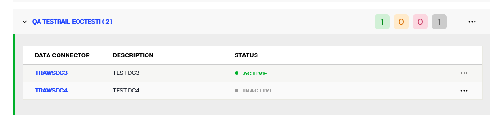

Another way to access data connector details is to select **View Details** from the **Options** (**...**) menu of the corresponding data connector.

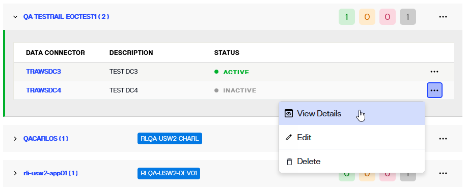

### Data connector info

The *Data Connector Info* section in the data connector detailed view outlines the following information about the connector:

| Data Connector Info | Description |
| ------------------- | ----------- |
| Name | The unique name provided for the connector during setup. |
| Group Name | The group the connector was assigned to during set up. There are a minimum of two connectors per network environment to enable load balancing.|
| Description | Additional details about the data connector provided during setup. |
| Connections | The number of on-prem or cloud backend connections made to the data connector. |
| Status | Indicates if the data connector is "Active", "Paused", "Inactive" or "Unregistered". |

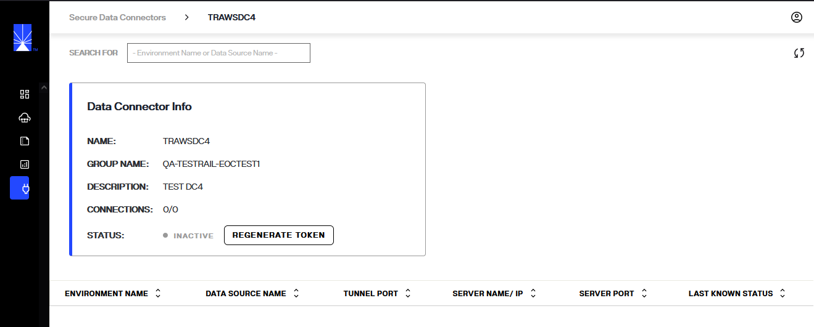

### Connection details

All of the on-premise or cloud connections made to the data connector are listed on the data connector details tab. The information listed for each connection includes:

| Connection details | Description |
| ------------------ | ----------- |
| Environment Name | The name of the Env Ops Center environment the connector is associated with. |
| Data Source Name | The given name of the on-premise or cloud data source connected to the data connector. |
| Tunnel Port | The high port where the connection is initiated. |
| Server Name/IP | The IP of the on-prem or cloud data source that has been connected. |
| Server Port | The port of the on-prem or cloud data source where the connection was made. |
| Status | Indicates if the connection is "Connected" or "Disconnected". |

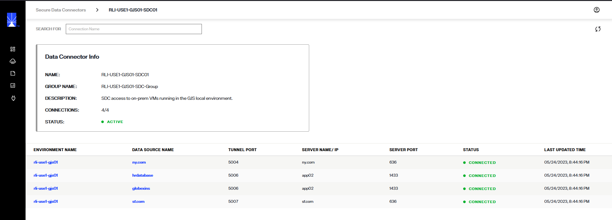

