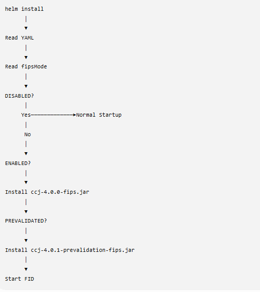
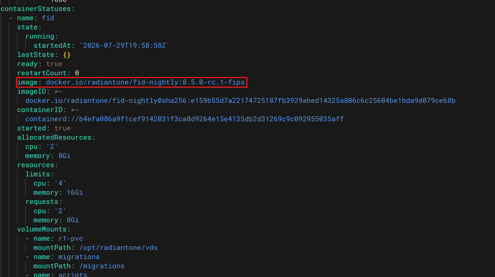

## Overview

The Federal Information Processing Standards (FIPS) are a set of security standards published by the National Institute of Standards and Technology (NIST). FIPS 140-3 defines the security requirements for cryptographic modules used to protect sensitive information. Compliance is validated through the Cryptographic Module Validation Program (CMVP), which certifies cryptographic modules against FIPS 140-3 and related standards.

Many government agencies and regulated industries require applications that process sensitive data, including Personally Identifiable Information (PII), to use FIPS 140-3 validated cryptographic modules.
RadiantOne includes a [FIPS-validated cryptographic module](https://csrc.nist.gov/projects/cryptographic-module-validation-program/certificate/5127) certified through the NIST CMVP.

This guide describes the FIPS implementation introduced in Self-Managed Identity Data Management 8.5.0. FIPS mode is currently supported only for Self-Managed deployments.
Beginning with self-managed Identity Data Management version 8.5.0, FIPS initialization is integrated into the container startup process. By enabling FIPS mode during installation, the appropriate cryptographic module is automatically configured during container initialization.

FIPS behavior is controlled through a single Helm configuration parameter:

```
global:
  fipsMode: DISABLED | ENABLED | PREVALIDATED
```

* **DISABLED** : Starts the application using the standard cryptographic provider.
* **ENABLED** : Loads the validated FIPS provider (`ccj-4.0.0-fips.jar`).
* **PREVALIDATED** : Loads the prevalidation FIPS provider (`ccj-4.0.1-prevalidation-fips.jar`).



The Helm deployment should also reference the FIPS-compatible chart version.

Example installation:

```
helm -n self-managed install fid \
  oci://registry-1.docker.io/radiantone/iddm-helm \
  --version 1.5.0 \
  --values </path/to/your/values.yaml> \
  --debug
```
### Deployment Modes

#### DISABLED

Runs Identity Data Management using the default deployment mode without FIPS.

```
global:
  fipsMode: DISABLED
```


#### ENABLED

Loads the validated FIPS cryptographic provider (`ccj-4.0.0-fips.jar`) during application startup.

```
global:
  fipsMode: ENABLED
```

##### Expected Log

```
2026-07-21T14:05:57,330 WARN  com.rli.slapd.server.VDSServer:900 - ### ---
2026-07-21T14:05:57,331 WARN  com.rli.slapd.server.VDSServer:901 - ### Server started! The server is running in FIPS mode with the security module loaded from: /opt/radiantone/vds/lib/fips/ccj-4.0.0-fips.jar
2026-07-21T14:05:57,331 WARN  com.rli.slapd.server.VDSServer:902 - ### ---
```

This message confirms that the validated FIPS provider was successfully loaded.

#### PREVALIDATED

Loads the prevalidation cryptographic provider (`ccj-4.0.1-prevalidation-fips.jar`) during startup.

```
global:
  fipsMode: PREVALIDATED
```

##### Expected Log

```
2026-07-16T22:59:18,021 WARN  com.rli.slapd.server.VDSServer:901 - ### Server started! The server is running in FIPS mode with the security module loaded from: /opt/radiantone/vds/lib/fips/ccj-4.0.1-prevalidation-fips.jar
2026-07-16T22:59:18,022 WARN  com.rli.slapd.server.VDSServer:902 - ### ---
```

The message identifies the cryptographic provider that was loaded and confirms that the server is operating in FIPS mode.


### Verifying FIPS Deployment

A successful FIPS deployment can be confirmed by verifying all of the following:

* The Helm values file specifies the correct `global.fipsMode`.
* All deployed Identity Data Management container images use the `-fips` image tag.
* The server startup log reports that the expected FIPS provider was loaded.
* The reported provider matches the configured deployment mode:

  * `ccj-4.0.0-fips.jar` for **ENABLED**
  * `ccj-4.0.1-prevalidation-fips.jar` for **PREVALIDATED**

To inspect that every Identity Data Management container image includes the `-fips` suffix, run the following command:

```
kubectl -n <namespace> describe pod <pod-name>
```

or

```
kubectl -n <namespace> get pod <pod-name> -o yaml
```

**Example output:**

```
radiantone/fid:8.5.0-fips
radiantone/iddm-web:8.5.0-fips
radiantone/iddm-settings:8.5.0-fips
```



### Known Limitations

The following limitations apply to FIPS-enabled deployments:

* Internal TLS communication between Identity Data Management and ZooKeeper is not supported.
* After FIPS mode has been enabled, reverting an existing deployment to non-FIPS mode is not supported.
* FIPS-generated keystores are not automatically converted back to standard keystores. If a deployment is migrated away from FIPS, any existing keystores must be recreated manually.
* Configuration Promotion supports Git repositories accessed over HTTPS only. SSH-based Git authentication is not supported when FIPS mode is enabled.
